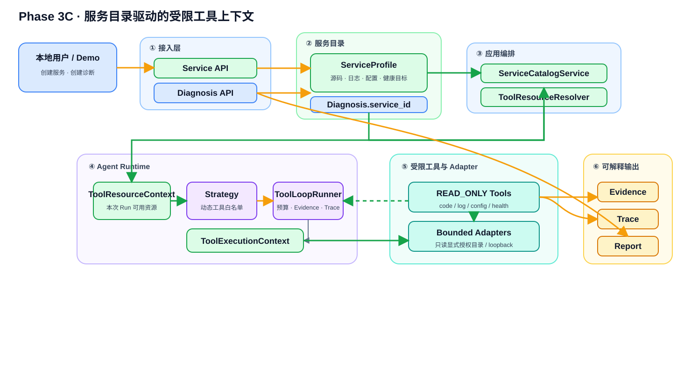

# Application Diagnosis Platform

证据驱动的应用诊断 Agent 平台：让模型结论可引用、可校验、可人工确认、可离线评测。



## 为什么不是普通 Agent Demo

- ToolLoopRunner 受轮次、工具次数、单工具超时和总时间预算约束；
- Strategy 选择工具白名单，Registry 在执行边界强制校验权限与参数；
- 用户输入在持久化和进入模型前脱敏；
- Tool EvidenceDraft 落库后才获得正式 Evidence ID；
- Citation Policy 校验证据归属和结论状态规则；
- 模型结论与人工确认追加记录，不相互覆盖；
- 自动测试、离线演示和默认评测均不调用外部模型。

## 项目演进

| 阶段 | 目标 | 状态 | 文档 |
|---|---|---|---|
| Phase 0A | 独立骨架与最小 Agent Loop | 完成 | [架构与学习总结](./docs/01-architecture/phase0a-framework.md) |
| Phase 0B | Evidence、知识检索与人工闭环 | 完成 | [扩展架构与学习总结](./docs/01-architecture/phase0b-extension.md) |
| Phase 0C | 评测、报告和极简界面 | 完成 | [扩展架构与学习总结](./docs/01-architecture/phase0c-extension.md) |
| Phase 1 | 日志与授权源码联合诊断 | 完成（本地最小闭环） | [扩展架构与学习总结](./docs/01-architecture/phase1-extension.md) · [端到端链路图](./docs/01-architecture/phase1-log-code-flow.md) |
| Phase 2 | 可观测、多策略、现场感知 | 完成 | [扩展架构与学习总结](./docs/01-architecture/phase2-extension.md) · [开发总结](./docs/03-progress/2026-07-18-Phase2开发总结.md) |
| Phase 3 | 可解释诊断、轻量计划与服务目录 | 进行中（3C 服务上下文闭环） | [Phase 3C 架构图](./docs/01-architecture/phase3c-service-context.md) · [能力总结](./docs/03-progress/2026-07-30-Phase3当前能力总结.md) |

## 技术栈

Python 3.12、FastAPI、Pydantic、SQLAlchemy Async、SQLite、Alembic、httpx、pytest、Ruff、Graphviz，以及 OpenAI-compatible LLM Tool Calling。

## 快速启动

前置条件：Python 3.12+、`uv`。

```powershell
Copy-Item .env.example .env
uv sync --extra dev
uv run alembic upgrade head
uv run uvicorn app_diagnosis.api.app:create_app --factory --reload
```

- 极简界面：`http://127.0.0.1:8000/ui`
- OpenAPI：`http://127.0.0.1:8000/docs`
- Liveness：`http://127.0.0.1:8000/health/live`
- Readiness：`http://127.0.0.1:8000/health/ready`

只有显式启动 Diagnosis Run 才会调用 `.env` 配置的真实模型并可能产生费用。

## 一键离线演示

```powershell
uv run python scripts/demo-phase0.py
uv run python scripts/demo-phase1-code.py
uv run python scripts/demo-phase1-log-code.py --keyword NullPointerException
uv run python scripts/diagnose-java-log-real.py --keyword NullPointerException
uv run python scripts/demo-phase2.py
uv run python scripts/demo-phase3-service.py
```

`demo-phase0.py`、两个 Phase 1 demo、`demo-phase2.py` 和 `demo-phase3-service.py` 使用 Fake LLM，不访问外部模型；`diagnose-java-log-real.py` 会调用 `.env` 中配置的真实模型并可能产生费用。演示覆盖脱敏、Evidence ID、引用校验、受限源码与配置读取、Strategy Router、Trace、服务目录和报告。详见[演示指南](./docs/00-overview/演示指南.md)。

## 测试与验收

```powershell
uv run ruff check .
uv run pytest
.\scripts\verify-phase0c.ps1 -SkipSync
.\scripts\verify-phase2.ps1 -SkipSync
```

当前基线：`199 passed`，Phase 0C 固定评测 `2/2 passed`，Phase 0A/0B/0C/2 一键验收通过，Phase 1 Java Lab 三类真实模型案例通过，Phase 3C 服务驱动离线演示通过。

## 主要 API

- `POST /api/v1/diagnoses`
- `POST /api/v1/diagnoses/{id}/runs`
- `GET /api/v1/diagnoses/{id}/evidence`
- `POST /api/v1/diagnoses/{id}/supplements`
- `POST /api/v1/diagnoses/{id}/confirmation`
- `GET /api/v1/diagnoses/{id}/report`
- `GET /api/v1/diagnoses/{id}/report.md`
- `GET /api/v1/diagnoses/{id}/trace`
- `POST /api/v1/services`
- `GET /api/v1/services`
- `GET /api/v1/services/{id}`
- `POST /api/v1/services/{id}/diagnoses`
- `GET/POST /api/v1/knowledge`
- `PATCH /api/v1/knowledge/{id}/status`

## 文档入口

- [项目介绍](./docs/00-overview/项目介绍.md)
- [Phase 0～2 项目掌握与面试准备指南](./docs/00-overview/Phase%200-2%20项目掌握与面试准备指南.md)
- [Phase 0～2 源码学习路线图](./docs/00-overview/Phase%200-2%20源码学习路线图.md)
- [完整文档导航](./docs/README.md)
- [Phase 0C 实现规格](./docs/02-specifications/Phase%200C%20实现规格说明.md)
- [Phase 1 扩展架构与学习总结](./docs/01-architecture/phase1-extension.md)
- [Phase 1 端到端链路图](./docs/01-architecture/phase1-log-code-flow.md)
- [Phase 1 当前能力总结](./docs/03-progress/2026-07-17-Phase1当前能力总结.md)
- [Phase 2 扩展架构与学习总结](./docs/01-architecture/phase2-extension.md)
- [Phase 2 验收记录](./docs/04-validation/phase2-acceptance.md)
- [Phase 3C 架构图](./docs/01-architecture/phase3c-service-context.md)
- [Phase 3 当前能力总结](./docs/03-progress/2026-07-30-Phase3当前能力总结.md)
- [简历与面试描述](./docs/00-overview/简历项目描述.md)

## 当前边界

这是具备生产化设计意识的本地单机工程骨架，不是完整生产平台。目前没有 Worker/队列、企业认证与 RBAC、远程日志采集、高可用、分布式追踪和真实模型质量统计。

`.env`、API Key、SQLite 数据库、验收临时目录和演示输出均被 Git 忽略。
