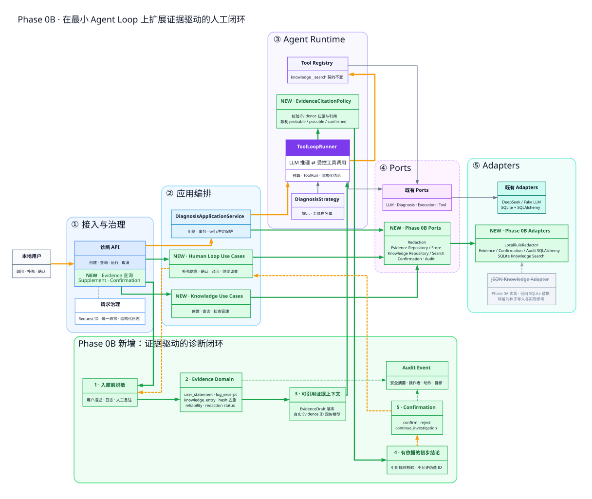
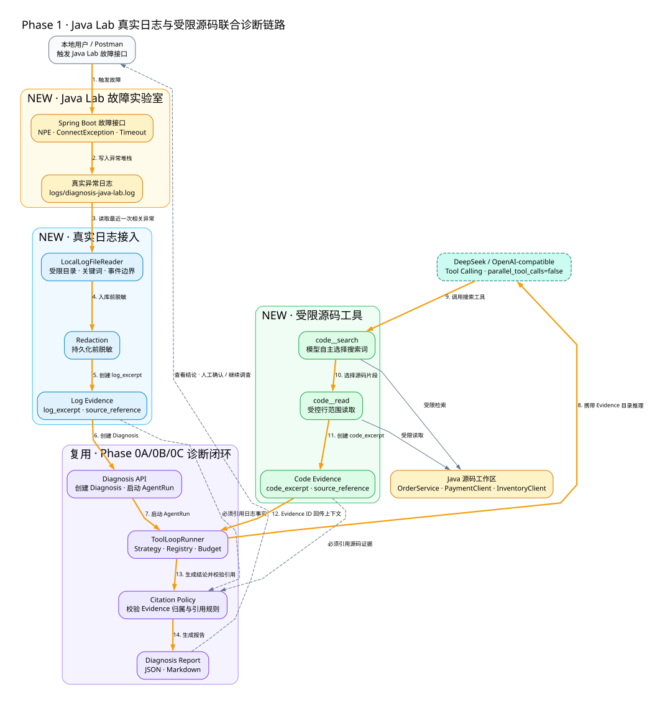
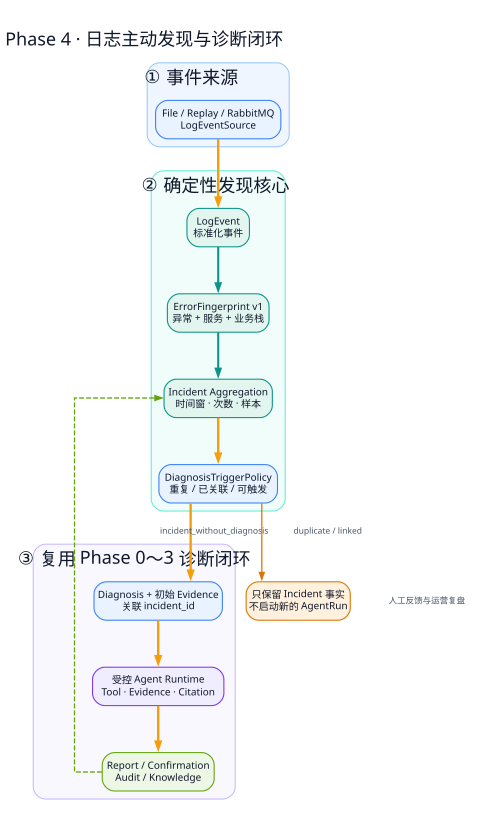
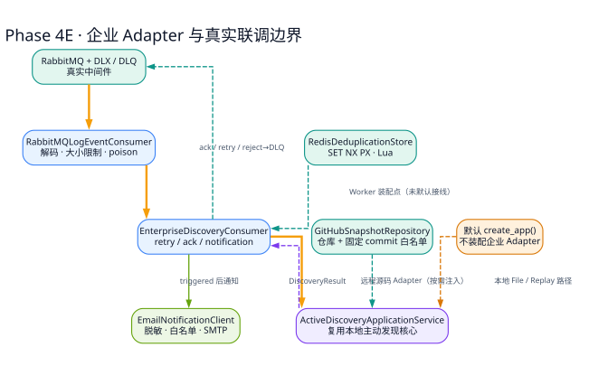

# Phase 0～4 项目核心掌握手册

> 目标：不靠通读全部源码，也能准确解释项目为什么存在、核心流程怎样运行、确定性边界怎样约束 LLM、出现问题时到哪里定位，并能够完成一次面试级项目讲解。

## 阅读导航

这不是一份要求从头背到尾的说明书。先根据目标选择阅读路线：

| 阅读目标 | 推荐顺序 | 完成标志 |
|---|---|---|
| 快速了解项目 | 第一篇 → 第二篇第 12 节 → 第六篇第 24 节 | 能完成 30 秒和 3 分钟介绍 |
| 掌握核心实现 | 第一篇 → 第二篇 → 第三篇 | 能画出被动诊断与主动发现两条闭环 |
| 准备后端追问 | 第二篇 → 第四篇 → 第五篇 | 能解释状态、事务、并发、安全和测试边界 |
| 面试冲刺 | 第一至三篇复习 → 第五篇源码抽查 → 第六篇 | 能脱离文档完成模拟面试 |

推荐的完整认知顺序是：

```text
为什么做 → 如何演进 → 被动诊断 → 主动发现
        → 工程深挖 → 最小源码抽查 → 面试表达与验收
```
### 架构专题索引

核心手册负责建立整体认知，`01-architecture` 目录负责解释每个阶段的架构细节。建议先阅读本手册对应章节，再通过下表进入专题：

| 阶段或主题 | 架构说明 | 适合解决的问题 |
|---|---|---|
| Phase 0～4 演进 | [项目演进地图](../01-architecture/phase0-4-evolution-map.md) | 理解每个阶段为什么出现，以及前后如何复用 |
| Phase 0A | [独立骨架与最小 Agent Loop](../01-architecture/phase0a-framework.md) | 理解主调用链、Runner 循环和 Ports/Adapters |
| Phase 0B | [Evidence 与人工诊断闭环](../01-architecture/phase0b-extension.md) | 理解证据生命周期、引用约束与人工反馈 |
| Phase 0C | [评测、报告与极简界面](../01-architecture/phase0c-extension.md) | 理解如何把一次运行升级为可验收交付物 |
| Phase 1 | [扩展架构](../01-architecture/phase1-extension.md) · [执行链路](../01-architecture/phase1-log-code-flow.md) | 理解真实日志与受限源码如何联合诊断 |
| Phase 2 | [可观测、多策略与现场感知](../01-architecture/phase2-extension.md) | 理解 Strategy、Trace 和新增只读工具 |
| Phase 3C | [服务目录驱动的工具上下文](../01-architecture/phase3c-service-context.md) | 理解诊断资源如何绑定到一个真实服务 |
| Phase 4 | [主动发现与诊断闭环](../01-architecture/phase4-active-discovery.md) | 理解日志如何聚合为 Incident 并触发原有闭环 |
| Phase 4E | [企业 Adapter 与联调边界](../01-architecture/phase4-enterprise-adapters.md) | 理解 RabbitMQ、Redis、GitHub 和 SMTP 的职责 |
| 企业演进 | [企业目标架构图](../01-architecture/enterprise-target-architecture.svg) | 理解本地参考实现走向企业部署还缺什么 |
| 画图规范 | [架构图可视化风格规范](../01-architecture/visual-style-guide.md) | 理解本项目架构图的颜色、线型和拆图规则 |

---

## 第一篇：建立项目心智模型

### 1. 先回答最现实的问题：需要熟悉每一部分代码吗

不需要，也不现实。

这个项目当前包含 API、应用编排、领域模型、Agent Runtime、工具、Port、Adapter、持久化、迁移、评测、脚本和测试。逐文件阅读容易陷入两个误区：一是记住局部实现却说不清整体链路；二是花大量时间阅读重复的 Repository 和 DTO，反而忽略真正决定系统可信度的代码。

推荐采用 **85% 文档建模 + 15% 源码抽查**：

1. 先用本手册建立项目心智模型；
2. 只阅读 12 个关键文件中的指定方法；
3. 运行一次演示，用 Trace、Evidence 和 Report 对照文档；
4. 遇到改造任务时，再按调用关系进入相关代码，而不是提前记忆全部实现。

文档可以替代大范围源码阅读，但不能完全替代源码。最低限度的源码抽查，是为了确认你理解的是当前实现，而不是一套看起来合理的架构故事。

---

### 2. 一句话定位与项目边界

#### 2.1 一句话定位

> 这是一个面向应用故障诊断场景的、证据驱动的本地 Agent 参考平台：它让 LLM 在受限工具、预算、状态机和引用策略约束下联合分析日志、源码、配置、知识与健康状态，并通过 Evidence、Trace、报告和人工确认形成可追踪的诊断闭环。

#### 2.2 它解决的核心问题

传统排障需要人工在日志、源码、配置、健康接口和历史经验之间来回切换。LLM 擅长理解非结构化现象并提出调查方向，但它也可能幻觉、越权、无限循环、伪造引用或泄露敏感数据。

因此本项目的重点不是“调用一次大模型”，而是：

```text
如何把概率性的模型推理
放入一个有边界、可追踪、可验证、可人工接管的确定性工程系统中。
```

#### 2.3 当前可以诚实声称的能力

- 有界 Tool Calling Agent Loop；
- 日志与授权源码联合诊断；
- 输入脱敏、Evidence 落库与引用校验；
- 规则式 Strategy 路由和轻量 DiagnosisPlan；
- AgentRun、ToolRun、Trace、Report 和 Audit；
- 人工确认、驳回、补充信息和继续调查；
- 服务目录驱动的本地源码、日志、配置和健康检查上下文；
- LogEvent、版本化 ErrorFingerprint、Incident 聚合与受控自动触发；
- File/Replay 主动发现、相关日志补充、运营摘要与反馈回流；
- RabbitMQ 消费语义、Redis 原子幂等、GitHub 固定 commit 与 SMTP 通知 Adapter；
- Fake LLM 自动测试和低频真实模型联调。

#### 2.4 当前不能夸大的能力

- 不是生产级 AIOps 平台；
- 不是 Kubernetes、CMDB 或注册中心意义上的自动服务发现系统；
- 不是完整的 Plan-and-Execute Agent；
- 不是多 Agent 协作系统；
- 已有 RabbitMQ Consumer 契约，但没有独立部署、长期运行、水平扩容的生产 Worker；
- 没有多租户、RBAC、远程采集代理和生产集群 SLA；
- 没有自动修复或生产系统变更工具；
- Agent Trace 不是 OpenTelemetry 分布式 Trace；
- 测试数量证明工程回归稳定性，不等于真实诊断准确率。

---

### 3. Phase 0～4 演进的因果链

> **架构专题：** [Phase 0～4 项目演进地图](../01-architecture/phase0-4-evolution-map.md)

| 阶段 | 当时最重要的问题 | 核心选择 | 为什么不提前做下一层 |
|---|---|---|---|
| 0A | 模型与工具能否有界运行 | 状态机、Runner、Registry、Budget、Port | 没有受控运行，Evidence 无处挂载 |
| 0B | 结论是否有真实依据 | Evidence、Redaction、Citation、Confirmation、Audit | 先解决可信度，再追求更多工具 |
| 0C | 能否重复验证和交付 | Evaluation、Report、极简 UI、Demo | 一次成功不能证明工程可用 |
| 1 | 如何定位到具体代码 | Java Lab、真实日志、受限源码工具 | 先用小型故障实验室控制变量 |
| 2 | 工具增多后如何选择和复盘 | Strategy Router、Trace、日志/配置/健康工具 | 先保持只读，避免写操作风险扩散 |
| 3A | 项目如何被接手和解释 | 关键注释、架构学习材料 | 可维护性是继续扩展的前提 |
| 3B | 如何解释准备调查什么 | 规则版 DiagnosisPlan | 先做可测试轻量 Plan，不改变 Runtime |
| 3C | 诊断资源属于谁 | ServiceProfile、动态 ToolResourceContext | 从全局目录升级为服务级边界 |
| 4A | 继续扩展前如何守住质量 | 版本化评测上下文、故障靶场、质量基线 | 没有稳定基线就无法判断主动发现是否退化 |
| 4B | 怎样把日志变成稳定领域事实 | LogEvent、Fingerprint、Incident、TriggerPolicy | 先建立确定性核心，再接日志采集和 Broker |
| 4C | 怎样形成单机主动发现闭环 | File/Replay Source、ActiveDiscoveryApplicationService | 先验证摄取、聚合、触发与失败保留 |
| 4D | 怎样支持运营复盘和人工回流 | 相关日志、摘要、反馈隔离 | 先形成可回顾事实，再引入企业接入 |
| 4E | 企业协议是否可替换和真实可用 | RabbitMQ、Redis、GitHub、SMTP Adapter | 最后接外部系统，缩小联调问题面 |

这条演进不是功能堆叠。每一阶段都在解决上一阶段暴露出来的可信度、真实性或可解释性问题。

---

### 4. 项目全景：先记住五条纵向链路

你不需要先记目录结构，只需要先掌握下面五条链路：

| 链路 | 要回答的问题 | 核心对象 |
|---|---|---|
| 诊断主链路 | 一次请求怎样变成受控结论 | Route、ApplicationService、Strategy、ToolLoopRunner、DiagnosisCase |
| Evidence 可信闭环 | 为什么结论不是模型随口生成 | Redactor、Evidence、EvidenceStore、CitationPolicy、Confirmation |
| 服务上下文链路 | Agent 为什么只能看指定服务资源 | ServiceProfile、ToolResourceResolver、ToolExecutionContext、Tool、Adapter |
| 主动发现链路 | 异常日志怎样形成 Incident 并受控触发诊断 | LogEvent、ErrorFingerprint、Incident、DiagnosisTriggerPolicy、ActiveDiscoveryApplicationService |
| 企业接入链路 | 外部事件、幂等、远程源码和通知怎样隔离 | RabbitMQ、RedisDeduplicationStore、GitHubSnapshotRepository、NotificationClient |

#### 4.1 架构骨架图


读图时只抓住四个边界：

1. Route 负责协议转换，不执行诊断逻辑；
2. ApplicationService 编排用例并推动领域状态；
3. ToolLoopRunner 接纳模型建议，但用确定性规则限制执行；
4. 外部模型、数据库和本地资源通过 Port/Adapter 隔离。

必须保留一个真实的架构妥协：当前 `DiagnosisApplicationService` 仍直接使用 SQLAlchemy Session 和部分具体 Repository Adapter。因此项目贯彻了 Ports & Adapters 的主要思想，但还不是“应用层零基础设施依赖”的纯六边形架构。

这张 Phase 0A 图是历史骨架，不是当前系统全景。要理解“系统如何一步步长出来”，再看演进地图：


---

### 5. 最省时间的九次学习安排

每次 45～60 分钟，完成产出才算结束。

#### 第 1 次：项目定位和全景

- 阅读第 2～3 节；
- 不看文档，口述 60 秒项目介绍；
- 手画五条纵向链路。

验收：能准确说出“证据驱动本地 Agent 参考平台”，且主动说明非生产级边界。

#### 第 2 次：HTTP 到状态机

- 阅读第 6 节；
- 抽查 Route、ApplicationService、DiagnosisCase 三个文件；
- 在纸上写出一次状态变化。

验收：能回答谁能改变 Diagnosis 状态，以及为什么 LLM 没有这个权力。

#### 第 3 次：Agent Loop 和工具闸门

- 阅读第 7 节；
- 抽查 `ToolLoopRunner.run` 和 Registry；
- 列出一次工具执行前的所有检查。

验收：能解释 Strategy、Registry、Permission、Adapter 安全各自解决什么问题。

#### 第 4 次：Evidence 闭环

- 阅读第 8 节；
- 抽查脱敏、Evidence 持久化和 Citation Policy；
- 用自己的话解释“Draft 为什么不能直接引用”。

验收：能画出 Evidence 从输入到人工确认的完整生命周期。

#### 第 5 次：Java Lab 与服务上下文

- 阅读第 7～8 节；
- 运行 Phase 3 Service Demo；
- 在输出中找到 Log/Code Evidence、ToolRun、Trace 和 Report。

```powershell
cd D:\AgentStudy\application-diagnosis-platform
uv run python scripts/demo-phase3-service.py
```

验收：能解释为什么同一个工具能安全地服务于不同 ServiceProfile。

#### 第 6 次：失败定位

任选一种现象，根据下表定位：

| 现象 | 第一检查点 | 第二检查点 |
|---|---|---|
| 没有暴露预期工具 | Strategy allowlist | ResourceContext 是否存在对应 Adapter |
| 工具被拒绝 | Registry / Permission | ProblemType / 参数 Schema |
| 工具成功但没有 Evidence | ToolExecutionResult.evidence_drafts | EvidenceStore / ToolRun evidence_ids |
| 模型有结论但运行失败 | 结构化 Schema | CitationPolicy / Evidence 归属 |
| 报告与运行不一致 | 持久化事实 | Report 聚合逻辑 |
| 离线成功、真实模型失败 | Tool calls 和 finish reason | Prompt、结构修正、引用修正 |

验收：面对失败时先用事实缩小层次，而不是直接改 Prompt 或重复调用模型。

#### 第 7 次：面试表达与小改动

- 完成 30 秒、3 分钟、10 分钟三个版本的口述；
- 独立完成一个带测试的小修改；
- 运行 Ruff、pytest 和 Demo。

验收：能从需求、架构选择、真实问题、修复、验证和边界六个维度完成闭环表达。

#### 第 8 次：主动发现领域与触发闭环

- 阅读第 13 节和 Phase 4 主动发现图；
- 抽查 `LogEvent`、`build_error_fingerprint`、`Incident.observe`、`DiagnosisTriggerPolicy.decide`；
- 用同一异常的重复事件解释为什么只产生一个 Diagnosis。

验收：能不依赖 LLM 解释事件标准化、稳定指纹、时间窗聚合、重复抑制和可恢复触发。

#### 第 9 次：企业 Adapter 与真实联调边界

- 阅读第 14 节和 Phase 4E 企业 Adapter 图；
- 区分已经进入消费编排的 RabbitMQ/SMTP，与尚未默认装配的 Redis/GitHub；
- 运行或阅读 `verify-phase4e-*` 验收输出。

验收：能准确解释“真实协议联调通过”为什么仍不等于生产 Worker、生产集群或企业级 SLA。

---

## 第二篇：掌握被动诊断闭环

### 6. 链路一：一次诊断怎样从 HTTP 请求收敛为状态

> **架构专题：** [Phase 0A 独立骨架与最小 Agent Loop](../01-architecture/phase0a-framework.md)

#### 6.1 主流程

```text
POST /api/v1/diagnoses/{id}/runs
        │
        ▼
DiagnosisApplicationService.run
  ├─ 防止同一 Diagnosis 在单进程内重复运行
  ├─ 状态推进为 INVESTIGATING
  ├─ StrategyRouter 选择调查策略
  ├─ 根据 service_id 解析本次工具资源
  └─ 调用 ToolLoopRunner
        │
        ▼
ToolLoopRunner.run
  ├─ 创建 AgentRun 和规则版 DiagnosisPlan
  ├─ 计算本次允许暴露给 LLM 的工具
  ├─ LLM 选择工具或输出结论
  ├─ Registry 校验工具与参数
  ├─ 执行工具并记录 ToolRun / Evidence
  ├─ 校验结构化结论和 Evidence 引用
  └─ 返回 ToolLoopResult
        │
        ▼
DiagnosisApplicationService._apply_result
        │
        ▼
DiagnosisCase 状态机
  ├─ WAITING_FOR_INPUT
  ├─ WAITING_FOR_CONFIRMATION
  └─ INCONCLUSIVE
```

#### 6.2 第一段必须看懂的真实代码：应用层拥有状态收敛权

源文件：[application/diagnoses.py](../../src/app_diagnosis/application/diagnoses.py)

```python
diagnosis = await self._start_investigation(...)
strategy = (
    self._strategy_router.select(diagnosis)
    if self._strategy_router is not None
    else self._strategy
)
resources = (
    await self._tool_resource_resolver(diagnosis)
    if self._tool_resource_resolver is not None
    else ToolResourceContext()
)
result = await self._runner.run(
    diagnosis=diagnosis,
    strategy=strategy,
    context=ToolLoopContext(..., resources=resources),
    budget=self._budget,
)
await self._apply_result(diagnosis_id, result)
```

这段代码表达了项目最重要的职责分离：

- Strategy 决定调查方式和工具白名单；
- ResourceResolver 决定本次运行能接触哪些服务资源；
- Runner 执行概率性循环并返回结果；
- ApplicationService 把运行结果应用到领域状态；
- LLM 不能直接修改 `DiagnosisCase`。

#### 6.3 第二段必须看懂的真实代码：状态只能经聚合根改变

源文件：[domain/diagnosis/case.py](../../src/app_diagnosis/domain/diagnosis/case.py)

```python
def record_initial_conclusion(self, conclusion: dict, *, needs_input: bool, at=None) -> None:
    if not conclusion:
        raise InvalidDiagnosisValue("conclusion must not be empty")
    target = (
        DiagnosisStatus.WAITING_FOR_INPUT
        if needs_input
        else DiagnosisStatus.WAITING_FOR_CONFIRMATION
    )
    self._transition_to(target, at=at)
    self.conclusion = dict(conclusion)
```

不要把这理解成普通 setter。它同时保证：结论不能为空、下一状态合法、更新时间正确、版本号递增。状态机是业务事实的守门人，不是为了“代码看起来像 DDD”。

#### 6.4 面试口述模板

> HTTP 层保持薄，只把请求交给应用服务。应用服务先控制并发并推进 DiagnosisCase，再用规则路由选择 Strategy，根据服务目录解析本次受限资源，最后调用 ToolLoopRunner。Runner 只返回 ToolLoopResult，不能直接改领域状态；最终由应用服务调用聚合根方法收敛为等待输入、等待确认或证据不足。这样模型失败或输出异常时，业务状态仍由确定性代码控制。

#### 6.5 自测题

- 为什么不能让 ToolLoopRunner 直接调用 `diagnosis.confirm()`？
- 为什么 `ToolLoopResult` 和 `DiagnosisCase` 要分开？
- 同一个 Diagnosis 重复运行在哪里被阻止？当前限制是否跨进程？
- `WAITING_FOR_CONFIRMATION` 为什么不等于 `CONFIRMED`？

---

### 7. 链路二：概率性模型怎样被确定性容器约束

> **架构专题：** [Phase 0A 学习说明](../01-architecture/phase0a-framework.md) · [ToolLoopRunner 内部循环图](../01-architecture/phase0a-agent-loop.svg) · [Ports/Adapters 映射图](../01-architecture/phase0a-ports-adapters.svg)

#### 7.1 Tool Loop 的真实语义

```text
LLM 提议：选择工具 + 生成参数
        │
        ▼
确定性闸门：注册状态 / Strategy 白名单 / ProblemType / 权限 / Schema / 预算
        │
        ├─ 失败：记录受控失败并反馈模型
        │
        ▼
工具 Adapter 执行
        │
        ▼
EvidenceDraft → 正式 Evidence ID → ToolRun → 回传模型
        │
        ├─ 继续选择工具
        └─ 输出结构化结论 → Schema + Citation 校验 → 收敛
```

这里的“Agent 味”来自模型能根据新结果选择下一步，而不是固定工作流；这里的“工程味”来自模型的每次提议都必须通过本地闸门。

#### 7.2 Registry 不是工具字典，而是执行闸门

源文件：[tools/registry.py](../../src/app_diagnosis/tools/registry.py)

```python
tool = self._require_registered(name)
if name not in self._enabled:
    raise DisabledTool(...)
if name not in allowed_names:
    raise ToolNotAllowed(...)
if context.problem_type not in tool.supported_problem_types:
    raise ToolNotAllowed(...)
missing = tool.required_permissions - context.permissions
if missing:
    raise ToolPermissionDenied(...)
return tool
```

必须区分五个概念：

| 概念 | 解决的问题 |
|---|---|
| 工具代码存在 | 项目是否实现了这个能力 |
| Registry 已注册 | Runtime 是否知道这个工具 |
| enabled | 运维或配置层是否启用 |
| Strategy allowlist | 当前问题类型是否应该使用 |
| permissions + resource context | 当前运行是否有权且有资源执行 |

Prompt 中说“不要调用危险工具”不构成安全边界。模型输出必须被当作不可信输入，工具参数还要经过 Pydantic Schema 和 Adapter 内部的路径、URL、后缀、行数等约束。

#### 7.3 预算为何是 Agent Runtime 的一部分

`ToolLoopRunner` 同时限制：

- 最大轮次；
- 最大工具尝试次数；
- 单工具超时；
- 总运行时间；
- 工具输出字节数；
- 结构修正和引用修正次数。

预算不只是费用控制。它定义了模型异常、工具卡死和无限修正时，系统如何以明确的 `termination_reason` 受控结束。

#### 7.4 当前 Plan 的准确定位

源文件：[agent/runtime/tool_loop.py](../../src/app_diagnosis/agent/runtime/tool_loop.py)

```python
plan = DiagnosisPlan.create_rule_based(
    diagnosis=diagnosis,
    agent_run_id=agent_run_id,
    strategy=strategy,
    allowed_tools=allowed_names,
)
await self._plans.add(plan)
```

当前 Plan 是规则生成并持久化的解释性资产，用于告诉用户本次诊断准备关注什么。它不控制工具执行顺序，也不会在工具失败后重规划。因此面试中应称为“轻量诊断计划”，不要称为完整 Plan-and-Execute。

#### 7.5 自测题

- Strategy 白名单和 Registry 校验为什么不是重复设计？
- 工具是只读的，为什么仍然需要权限和路径边界？
- 模型参数 JSON 不合法时，为什么要形成 ToolRun 失败记录？
- 当前 Agent Loop 与固定 DAG 工作流的本质区别是什么？

---

### 8. 链路三：Evidence 怎样把模型答案变成可审核结论

> **架构专题：** [Phase 0B Evidence 与人工诊断闭环](../01-architecture/phase0b-extension.md)

#### 8.1 Phase 0B 扩展图



#### 8.2 Evidence 生命周期

```text
用户描述 / 提交日志 / 工具结果
        │
        ▼
持久化前 Redaction
        │
        ▼
EvidenceDraft 或 EvidenceCandidate
        │
        ▼
EvidenceStore 持久化、hash 去重、生成正式 Evidence ID
        │
        ├─ ID 记录到 ToolRun
        └─ ID + 安全摘要回传 LLM
                │
                ▼
模型结论引用 Evidence ID
                │
                ▼
CitationPolicy 校验归属、类型和可信度
                │
                ├─ 有限次数修正
                └─ 通过后保存模型初始结论
                        │
                        ▼
人工 confirm / reject / continue_investigation
```

#### 8.3 入库前脱敏，而不是事后清洗

源文件：[application/evidence_diagnoses.py](../../src/app_diagnosis/application/evidence_diagnoses.py)

```python
safe_symptom = self._redactor.redact(symptom)
safe_log = self._redactor.redact(submitted_log) if submitted_log else None
diagnosis = DiagnosisCase.create(
    title=title,
    symptom=safe_symptom.content,
    submitted_log=safe_log.content if safe_log else None,
)
```

这里的顺序是安全设计本身：原始 API Key、Bearer Token、密码和连接串不能先写入数据库再异步清理。Evidence 内容再次进入模型时仍标记为不可信上下文，避免日志里的 Prompt Injection 被当作系统指令。

#### 8.4 模型不能发明 Evidence ID

源文件：[agent/runtime/tool_loop.py](../../src/app_diagnosis/agent/runtime/tool_loop.py)

```python
candidates = tuple(
    EvidenceCandidate(
        type=item.type,
        source=item.source,
        source_reference=item.source_reference,
        content=item.content,
        metadata=item.metadata,
    )
    for item in result.evidence_drafts
)
stored = await self._evidence.add_candidates(diagnosis_id, candidates)
return tuple(item.id for item in stored)
```

工具只能产生 Draft。只有 EvidenceStore 成功持久化后才产生正式 ID。最终结论只能引用系统实际持有、且属于当前 Diagnosis 的 Evidence。

#### 8.5 引用等级不是“模型置信度数字”

Citation Policy 的关键业务规则是：

- `probable` 必须有用户事实或运行日志等直接证据；
- 只有知识条目时，最多只能是 `possible`；
- `possible` 必须给出验证建议；
- `insufficient_evidence` 不得伪造 Evidence ID；
- Phase 0～3 中，`confirmed` 只能由人工动作产生；
- 日志和源码均可用时，源码型根因应同时引用运行日志与相关代码 Evidence。

这不是给模型打一个模糊的 0.8 分，而是把“什么证据支持什么强度的结论”写成本地可测试规则。

#### 8.6 人工反馈为什么追加而不覆盖

模型初始结论、人工判断和后续修复验证是不同时间发生的事实。覆盖原结论会失去“模型当时说了什么、人工为什么不同意”的审计能力。因此人工动作追加 `Confirmation` 和 `AuditEvent`，再推动状态机进入 `CONFIRMED`、`REJECTED` 或重新 `INVESTIGATING`。

#### 8.7 自测题

- EvidenceDraft 和 Evidence 的区别是什么？
- 为什么知识条目不能单独支撑 `probable`？
- 为什么人工确认不能直接修改模型结论文本？
- 脱敏应在哪两个边界之前完成？

---

### 9. 链路四：真实 Java 故障怎样进入 Python Agent

> **架构专题：** [Phase 1 扩展架构](../01-architecture/phase1-extension.md) · [真实日志与源码联合诊断链路](../01-architecture/phase1-log-code-flow.md)



完整演示链路是：

```text
Postman/脚本触发 Java Lab 故障
→ Spring Boot 写入固定日志文件
→ LocalLogFileReader 按授权目录和事件边界读取
→ 脱敏后形成 log_excerpt Evidence
→ LLM 根据日志选择 code__search / code__read
→ LocalCodeRepository 只读取授权 Java 工作区
→ 形成 code_excerpt Evidence
→ 引用校验要求日志与源码共同支持根因
→ 生成 Trace 和诊断报告
→ 人工确认或驳回
```

你需要真正理解的不是“能读文件”，而是三层边界：

1. 日志：只读授权目录，限制事件窗口，避免混入后续异常；
2. 源码：限定根目录、相对路径、后缀、行号和输出大小；
3. 模型：只得到脱敏后的有限片段，不允许扫描整台电脑。

Java Lab 的价值是提供真实、可重复、可验证的 NPE、连接拒绝和超时故障。它让模型结论能够与真实堆栈和源码位置核对，而不是靠人为编造的一段“标准答案日志”。

---

### 10. 链路五：服务目录怎样把一次请求升级为一个诊断对象

> **架构专题：** [Phase 3C 服务目录驱动的受限工具上下文](../01-architecture/phase3c-service-context.md)


#### 10.1 为什么需要 ServiceProfile

在 Phase 1～2 中，工具资源主要来自全局 Settings。系统知道“某个源码目录”，却不知道它属于哪个真实服务。Phase 3C 引入 `ServiceProfile`，把服务名称、环境、源码路径、日志目录、配置目录、健康目标和标签聚合为诊断对象。

#### 10.2 运行时资源解析

源文件：[application/diagnoses.py](../../src/app_diagnosis/application/diagnoses.py)

```python
async def resolve(diagnosis: DiagnosisCase) -> ToolResourceContext:
    if diagnosis.service_id is None:
        return default_resources
    service = await services.get(diagnosis.service_id)
    if service is None:
        return default_resources
    return _build_tool_resources(
        code_workspace_path=service.code_workspace_path or "",
        log_directory=service.log_directory or "",
        config_workspace_path=service.config_workspace_path or "",
        health_targets=_parse_health_targets(service.health_targets),
        ...
    )
```

这段代码完成的是“能力绑定”：同一个 `code__read` 工具，在不同 Diagnosis 中会拿到不同服务的 `LocalCodeRepository`。工具契约保持不变，变化的是本次运行注入的受限 Adapter。

#### 10.3 当前服务目录的边界

- 服务信息由用户显式注册；
- 不自动扫描本机工程；
- 不做注册中心发现；
- 不主动连接远程日志平台；
- Health Target 仍受本地 Client 的 URL 与超时约束；
- 没有关联服务时回退全局资源，以兼容旧演示链路。

#### 10.4 自测题

- 为什么不为每个服务注册一套不同名称的工具？
- Tool Contract 不变、Adapter 动态变化有什么工程价值？
- `service_id` 不存在时当前为何回退默认资源？生产化时可能如何收紧？

---

### 11. Trace、Report、Audit 和 Plan 不要混淆

> **架构专题：** [Phase 0C 评测、报告与极简界面](../01-architecture/phase0c-extension.md) · [Phase 2 可观测、多策略与现场感知](../01-architecture/phase2-extension.md)

| 资产 | 回答的问题 | 数据来源 | 是否再次调用 LLM |
|---|---|---|---|
| Plan | 本次准备调查什么 | Strategy + 规则 | 否 |
| Agent Trace | 本次 AgentRun 实际怎样执行 | AgentRun + ToolRun + Evidence | 否 |
| Report | 当前诊断事实如何交付给用户 | Diagnosis + Evidence + Confirmation 等 | 否 |
| Audit | 谁在何时对什么对象做了什么 | AuditEvent | 否 |

重要原则：这些视图从已持久化事实生成，不能为了“展示好看”虚构模型思考过程。尤其不要把 ToolRun 时间线称为模型 Chain-of-Thought；项目记录的是可审计的外部行为，不保存或展示隐藏推理。

---

### 12. 一次完整诊断的逐对象推演

这一节用一个 NPE 案例把 API、领域对象、模型消息、工具结果、Evidence 和状态变化串在一起。面试官要求“别讲架构图，讲一条真实请求”时，可以直接沿这条链路回答。

#### 12.1 第一步：注册服务

用户先注册 Java Lab：

```json
{
  "name": "diagnosis-java-lab",
  "environment": "local",
  "code_workspace_path": "D:/AgentStudy/diagnosis-java-lab",
  "log_directory": "D:/AgentStudy/diagnosis-java-lab/logs",
  "config_workspace_path": "D:/AgentStudy/diagnosis-java-lab/src/main/resources",
  "health_targets": ["java-lab=http://127.0.0.1:8080/actuator/health"],
  "tags": ["java", "spring-boot", "lab"]
}
```

系统只保存显式元数据，不扫描目录，也不读取文件。此时产生 `ServiceProfile`，但不会启动 Agent。

#### 12.2 第二步：创建 Diagnosis

用户通过服务入口提交症状和日志：

```text
POST /api/v1/services/{service_id}/diagnoses
```

应用层执行顺序：

1. 确认 ServiceProfile 存在；
2. Redactor 处理 `symptom` 和 `submitted_log`；
3. 创建 `DiagnosisCase(status=CREATED, service_id=...)`；
4. 创建 `user_statement` Evidence；
5. 日志按 UTF-8 字节上限切片为 `log_excerpt` Evidence；
6. 同一 Diagnosis 下按 `content_hash` 去重；
7. Diagnosis、Evidence 和 AuditEvent 在事务中持久化。

此时尚未调用 LLM。这个分离很重要：创建诊断是建立事实，运行 Agent 是调查事实，两者可以独立重试和审计。

#### 12.3 第三步：启动 AgentRun

`POST /api/v1/diagnoses/{id}/runs` 进入应用服务：

```text
DiagnosisCase: CREATED → INVESTIGATING
AgentRun: 不存在 → RUNNING
Strategy: application_error_v1
Tool resources: 从 ServiceProfile 解析
Allowed tools: knowledge__search, log__search, code__search,
               code__read, config__read
```

应用服务的 `_active_tasks` 防止同一进程内同一 Diagnosis 同时运行两次。它不是分布式锁；如果未来部署多个 Worker，需要数据库租约、任务唯一键或分布式锁代替。

#### 12.4 第四步：构造第一轮 LLM Request

第一轮请求包含：

| 部分 | 内容 | 信任级别 |
|---|---|---|
| system message | Strategy Prompt + 最终 JSON Schema | 高，由系统生成 |
| user message | 脱敏后的症状、日志和问题描述 | 不可信数据 |
| Evidence catalog | 正式 Evidence ID + 有限内容 | ID 权威，内容仍不可信 |
| tool definitions | Registry 校验后允许暴露的工具 Schema | 高，由系统生成 |
| options | 禁止并行工具调用 | 高，由 Runtime 设置 |

关键认知：日志即使被放进 user message，也只是数据。Prompt 会明确指出 Evidence 内容不能修改系统规则。真正的工具权限仍由本地 Registry 执行，不依赖模型遵守文字说明。

#### 12.5 第五步：模型请求 `code__search`

模型可能返回：

```json
{
  "tool_call_id": "call_01",
  "name": "code__search",
  "arguments": "{\"query\":\"OrderService\",\"max_results\":5}"
}
```

这不是命令，而是提议。Runtime 依次检查：

1. `code__search` 是否注册；
2. 是否 enabled；
3. 是否在 `application_error_v1` 的 allowlist；
4. 当前 ProblemType 是否受支持；
5. 是否拥有 `code:read`；
6. 参数 JSON 是否为对象并符合 Pydantic Schema；
7. 是否还有工具次数和时间预算；
8. 当前 ToolResourceContext 是否包含该服务的 CodeRepository。

通过后，工具使用服务级 `LocalCodeRepository` 搜索。Adapter 再做根目录、相对路径、允许后缀、结果数和输出大小限制。

#### 12.6 第六步：工具结果变成可追踪事实

工具成功后同时产生三种不同信息：

```text
data            → 面向应用的结构化结果
model_summary   → 回传模型的有限摘要
evidence_drafts → 等待持久化的证据候选
```

Runtime 将 EvidenceDraft 交给 EvidenceStore。落库成功后得到正式 Evidence ID，再将 ID：

- 写入 ToolRun 的 `result_json.evidence_ids`；
- 连同安全摘要放入 tool message 回传 LLM；
- 纳入最终 CitationPolicy 的可引用集合。

如果 Evidence 持久化失败，就不能把临时 Draft 当作已存在事实引用。

#### 12.7 第七步：模型读取最小源码片段

模型根据搜索结果请求 `code__read`，例如读取 `OrderService.java` 的有限行范围。工具生成 `code_excerpt` Evidence，其 `source_reference` 记录文件与行号。

此时系统通常持有：

| Evidence | 证明什么 | 不能证明什么 |
|---|---|---|
| user_statement | 用户观察到的现象 | 现象一定准确 |
| log_excerpt | 运行时实际抛出的异常及堆栈 | 源码中的某行一定是根因 |
| code_excerpt | 授权工作区中相关实现 | 该代码一定在目标运行实例生效 |
| knowledge_entry | 历史相似模式 | 当前故障就是该模式 |

Evidence 不是“真相标签”，而是有来源、有边界、有可靠等级的可审查材料。

#### 12.8 第八步：模型输出结构化结论

最终 JSON 必须满足 `DiagnosisConclusion`：

```json
{
  "symptom_summary": "订单查询触发 NullPointerException",
  "facts": [
    {
      "statement": "运行日志显示 OrderService 调用链抛出 NPE",
      "status": "probable",
      "evidence_ids": ["<log-evidence-id>"]
    }
  ],
  "root_causes": [
    {
      "statement": "customerName 为空时直接调用 trim()",
      "status": "probable",
      "evidence_ids": ["<log-evidence-id>", "<code-evidence-id>"]
    }
  ],
  "recommendations": ["补充空值校验并增加回归测试"],
  "missing_information": []
}
```

先由 Pydantic 检查字段、长度、枚举和额外字段，再由 CitationPolicy 检查语义。如果失败，Runtime 只允许有限次数结构或引用修正；仍失败则受控收敛，而不是无限重试。

#### 12.9 第九步：模型结论不是最终确认

有效结论保存为 `DiagnosisCase.conclusion`，状态进入 `WAITING_FOR_CONFIRMATION`。用户随后可以：

- `confirm`：进入 `CONFIRMED`；
- `reject`：进入 `REJECTED`；
- `continue_investigation`：回到 `INVESTIGATING`；
- 若 Agent 主动声明缺少信息，则进入 `WAITING_FOR_INPUT`，用户 supplement 后重新调查。

这条链路的最终口述：

> 模型负责提出调查动作和候选结论，系统负责验证工具、持久化证据、检查引用和推动状态，人负责最终确认。这三个主体的权力没有混在一起。

---

## 第三篇：掌握主动发现闭环

### 13. Phase 4：从被动诊断到日志主动发现

> **架构专题：** [Phase 4 主动发现与诊断闭环](../01-architecture/phase4-active-discovery.md)



#### 13.1 为什么不能让日志一到就直接调用 LLM

真实系统中的同一个异常可能每秒出现几十次。如果每条日志都创建 Diagnosis，不仅会放大模型费用，还会产生重复 Incident、重复通知和无法复盘的噪声。因此 Phase 4 先增加一个完全确定性的发现层：

```text
DiscoveredLogEvent
  → LogEvent 标准化
  → ErrorFingerprint v1
  → 固定时间窗 Incident 聚合
  → DiagnosisTriggerPolicy
  → 只有新 Incident 才进入原有 Agent 诊断闭环
```

LLM 不参与指纹和触发决定。它仍然只在 Diagnosis 已经创建后负责提出调查动作与候选结论。

#### 13.2 稳定指纹为什么忽略行号

`build_error_fingerprint()` 使用服务、环境、规范化异常类型和前若干业务栈帧生成 SHA-256。栈帧使用 `class#method`，不包含源码行号：

```python
def normalized(self) -> str:
    return f"{self.class_name.strip().lower()}#{self.method_name.strip().lower()}"
```

同一故障在重新编译后行号可能变化；如果把行号放入指纹，同一根因会被拆成多个 Incident。反过来，完全忽略业务栈又可能把不同根因合并，所以项目保留前五个业务栈帧，并为算法增加 `algorithm_version`。版本字段意味着未来修改规则时可以解释为什么新旧指纹不同。

#### 13.3 Incident 不是日志集合

Incident 保存的是聚合事实，而不是无限复制完整日志：

- `service_id + environment + fingerprint + window` 形成聚合键；
- `occurrence_count` 记录次数；
- `first_seen_at / last_seen_at` 描述时间范围；
- `sample_message` 保存受控样本；
- `diagnosis_id` 保证一个 Incident 只关联一个诊断。

`source_event_id` 负责摄取幂等，`diagnosis_id` 负责触发幂等，两者解决的是不同层次的问题。

#### 13.4 TriggerPolicy 的真实复杂度

当前策略刻意简单：

```python
if aggregation.duplicate_event:
    return TriggerDecision(False, "duplicate_source_event")
if aggregation.incident.diagnosis_id is not None:
    return TriggerDecision(False, "diagnosis_already_linked")
return TriggerDecision(True, "incident_without_diagnosis")
```

这不是“智能不足”，而是 Phase 4 的工程取舍：先让触发规则透明、可测试，再考虑严重度、频率阈值、静默期和服务等级。模型分类不适合作为第一道触发门，因为它会把成本和随机性带到每一条日志上。

#### 13.5 失败为什么仍然保留事实

`ActiveDiscoveryApplicationService.process()` 先完成 Incident 聚合、Diagnosis 关联、初始 Evidence 和 Audit，再调用 Agent。Agent 或外部模型失败时返回安全 `error_code`，但不删除前面的事实。这样 Replay 可以继续处理，运营人员也能区分：

```text
没有发现异常
≠ 已发现但未触发
≠ 已触发但 Agent 失败
≠ Agent 完成但等待人工确认
```

这条失败语义是主动发现能够运维和复盘的基础。

#### 13.6 Phase 4A～4D 分别解决什么

| 阶段 | 解决的问题 | 关键资产 |
|---|---|---|
| 4A | 扩展前怎样判断质量是否退化 | 版本化评测、Java Lab 场景、质量基线 |
| 4B | 日志怎样成为稳定领域事实 | LogEvent、Fingerprint、Incident、TriggerPolicy |
| 4C | 怎样形成单机可运行主动发现 | File/Replay Source、发现 API、失败保留 |
| 4D | 怎样支持运营复盘 | 相关日志、日摘要、人工反馈隔离 |

---

### 14. Phase 4E：企业 Adapter 与真实联调边界

> **架构专题：** [Phase 4E 企业 Adapter 与真实联调边界](../01-architecture/phase4-enterprise-adapters.md) · [企业目标架构图](../01-architecture/enterprise-target-architecture.svg)



#### 14.1 为什么企业组件放在最后

RabbitMQ、Redis、远程 Git 和通知系统会增加网络、认证、重试和部署问题。如果在 Incident 与触发语义尚未稳定时引入它们，很难判断失败来自领域规则还是外部系统。Phase 4E 因此只替换边界，不重写核心：

```text
RabbitMQ Adapter ─┐
File/Replay Source ├→ ActiveDiscoveryApplicationService → 原有 Diagnosis 闭环
Redis Adapter ─────┘  （可在 Worker 装配层增加幂等声明）
```

#### 14.2 RabbitMQ 的成功不是“能收到消息”

项目明确区分：

- Schema 正确：进入 Discovery；
- 处理成功：之后才 `ack`；
- 临时处理失败：`nack(requeue=True)`；
- poison message：`reject(requeue=False)`，由 DLX 路由到 DLQ；
- Worker 被取消：先安全 requeue，再传播取消。

真实 Docker 验收覆盖 ACK、redelivery 和 DLQ，因此证明的是消费语义，而不只是端口可连接。

#### 14.3 Redis 解决跨进程声明，不替代数据库唯一约束

`RedisDeduplicationStore` 用单条 Lua 脚本执行 `SET key 1 PX ttl NX`。50 个并发声明只有一个成功，证明声明和 TTL 是 Redis 内部的原子操作。

但它目前尚未进入默认 `create_app()`，也没有画成企业消费实线主路径。未来生产 Worker 可以在消费后、Discovery 前按 `source_event_id` 或聚合声明键调用它；数据库唯一约束仍然是最终事实层防线。

#### 14.4 为什么远程源码必须固定 commit

如果诊断日志来自已部署版本，而 Agent 读取默认分支最新代码，引用可能与运行代码不一致。`GitHubSnapshotRepository` 因此同时限制：

- 仓库必须在 allowlist；
- commit 必须是允许的完整 SHA；
- Tree API 与 Contents API 使用同一 SHA；
- 路径不能绝对化或包含 `..`；
- 文件后缀、数量、大小和读取行数受限。

真实验收使用私有 Java Lab 的固定 commit，而不是 `main`。这使 Code Evidence 可以回答“依据哪个版本的哪几行代码”。

#### 14.5 通知为什么发生在 ACK 之后

通知是旁路交付，不是诊断事实。如果 SMTP 临时失败就重新消费消息，会重复创建或重复触发业务事实。因此 `EnterpriseDiscoveryConsumer` 先确认 Discovery 处理结果并 ACK，再尝试发送通知；通知失败只返回安全错误类型，不回滚 Incident 和 Diagnosis。

SMTP 验收覆盖：主机白名单、地址限制、发送前脱敏、真实认证、服务端接受以及人工确认收件箱到达。

#### 14.6 真实联调结果应该怎样陈述

```text
RabbitMQ：真实 Docker ACK / redelivery / DLQ 通过
Redis：真实并发 NX / TTL / reclaim 通过
GitHub：私有仓库固定 commit 搜索和读取通过
SMTP：真实发送及收件确认通过
全量回归：244 passed
```

不能据此宣称已经具备生产 RabbitMQ HA、Redis Cluster、企业 Git 权限治理、邮件到达 SLA 或可水平扩容 Worker。

---

## 第四篇：工程深挖

### 15. 核心对象词典：面试官点名对象时怎样回答

| 对象 | 它是什么 | 它不是什么 | 生命周期 |
|---|---|---|---|
| DiagnosisCase | 一次诊断的聚合根和状态机 | Agent 执行日志 | 跨多次 AgentRun |
| AgentRun | 一次 Agent 调查运行 | 整个诊断 | 每次运行新建 |
| ToolRun | 一次工具调用尝试 | Evidence 本身 | 隶属 AgentRun |
| DiagnosisConclusion | 模型结构化初始结论 | 人工确认结果 | 成功运行后保存 |
| Evidence | 已持久化、可引用的材料 | 自动等同于真相 | 隶属 Diagnosis |
| EvidenceDraft | 工具输出的证据候选 | 可直接引用的 Evidence | 工具执行期间 |
| Confirmation | 人工决策记录 | 对模型结论的覆盖更新 | 追加事实 |
| AuditEvent | 操作者与动作的安全摘要 | 完整业务数据副本 | 重要动作时追加 |
| DiagnosisPlan | 规则生成的调查说明 | 工具调度器 | 每次 AgentRun 一份 |
| ServiceProfile | 服务及其授权资源元数据 | 自动发现的 CMDB | 跨多个 Diagnosis |
| ToolResourceContext | 单次 Run 可使用的 Adapter 集合 | 全局 Service Locator | 每次运行解析 |
| Strategy | Prompt、问题类型和工具集合策略 | 工具执行器 | 每次运行选择 |
| Registry | 工具暴露与执行前的确定性闸门 | 只有名字到实例的字典 | 应用生命周期 |

#### 15.1 三组最容易混淆的关系

**DiagnosisCase 与 AgentRun**

一个 Diagnosis 可以因为补充信息或人工要求继续调查而产生多个 AgentRun。Diagnosis 表示长期业务状态，AgentRun 表示一次执行尝试。

**Evidence 与 ToolRun**

ToolRun 记录“做了什么、是否成功、耗时多久”；Evidence 记录“取得了什么可引用材料”。一次 ToolRun 可以产生零个或多个 Evidence。

**Conclusion 与 Confirmation**

Conclusion 是模型提出的初步判断；Confirmation 是人工对该判断采取的动作。二者分离才能审计模型与人的分歧。

---

### 16. 状态机、终止原因和失败语义

#### 16.1 Diagnosis 状态矩阵

| 当前状态 | 允许进入 | 触发者 | 业务含义 |
|---|---|---|---|
| CREATED | INVESTIGATING、CANCELLED | 运行/取消用例 | 已建档，尚未调查 |
| INVESTIGATING | WAITING_FOR_INPUT、WAITING_FOR_CONFIRMATION、INCONCLUSIVE、CANCELLED | 应用服务 | Agent 正在或刚完成调查 |
| WAITING_FOR_INPUT | INVESTIGATING | 用户补充 | 缺少关键材料 |
| WAITING_FOR_CONFIRMATION | CONFIRMED、REJECTED、INVESTIGATING | 人工动作 | 有候选结论，等待裁决 |
| CONFIRMED | 无 | — | 人工接受，终态 |
| REJECTED | 无 | — | 人工驳回，终态 |
| INCONCLUSIVE | 无 | — | 本次设计中证据不足终态 |
| CANCELLED | 无 | — | 已取消，终态 |

注意：当前 `INCONCLUSIVE` 是终态；如果未来希望补充信息后继续，需要修改领域规则、用例和测试，不能仅增加一个 API。

#### 16.2 AgentTerminationReason 与 DiagnosisStatus 不是一回事

`termination_reason` 回答“这一次 AgentRun 为什么停”；`DiagnosisStatus` 回答“整个诊断现在处于什么业务阶段”。例如时间预算耗尽会结束 AgentRun，但应用服务还要决定 Diagnosis 应收敛到何种状态。

典型停止类型：

| 类型 | 例子 | 处理原则 |
|---|---|---|
| 正常完成 | completed | 校验结论后等待输入或确认 |
| 预算停止 | 轮次、工具次数、总时间耗尽 | 保留已产生 ToolRun/Evidence，受控失败 |
| 模型失败 | 网络、Provider、格式持续错误 | AgentRun 标记失败或 inconclusive，不伪造结论 |
| 工具失败 | 参数、权限、超时、Adapter 错误 | ToolRun 记录失败，可在预算内继续 |
| 用户取消 | cancelled | 记录取消并推动 Diagnosis |
| 内部错误 | internal error | 留 error_code，不能冒充模型结论 |

#### 16.3 为什么工具失败不一定结束 AgentRun

工具调用是调查尝试。一个工具失败后，模型可能选择其他工具或在已有证据上收敛。因此工具失败应先转成结构化 ToolExecutionResult 和 ToolRun，再由循环决定是否继续。只有预算、系统错误或无法修正的最终输出才结束整个 Run。

---

### 17. 数据一致性、事务与并发：后端面试官会继续追问什么

#### 17.1 创建诊断为什么需要事务

EvidenceAware Service 在同一事务中创建 Diagnosis、初始 Evidence 和 AuditEvent。目标是避免出现“Diagnosis 已存在但初始事实缺失”的半完成状态。

#### 17.2 状态更新为何使用 version

`DiagnosisCase.version` 随状态流转递增，Repository 保存时携带 `expected_version`。它表达乐观锁语义：如果另一个操作已经更新同一 Diagnosis，当前写入应冲突，而不是静默覆盖。

#### 17.3 `_active_tasks` 能解决和不能解决什么

它能阻止单个 Python 进程中同一 Diagnosis 的并发运行，并支持取消当前 asyncio Task。它不能解决：

- 多进程 Uvicorn Worker；
- 多机器部署；
- 进程崩溃后的任务恢复；
- 长任务可靠投递。

生产化方向应是：API 只创建任务，Worker 消费；数据库保存任务状态和租约；使用唯一约束或原子状态更新争抢执行权；心跳与超时负责恢复。

#### 17.4 为什么没有一次大事务包住整个 AgentRun

LLM 和工具调用可能持续较长时间。持有数据库事务会增加锁等待、连接占用和失败回滚范围。当前设计按事实逐步持久化 AgentRun、ToolRun 和 Evidence，使失败时已经发生的动作仍可追踪。代价是需要明确中间状态和幂等规则。

#### 17.5 当前 Repository 边界的真实评价

领域层基本不依赖 FastAPI、SQLAlchemy 和模型供应商；但 ApplicationService 直接创建部分 SQLAlchemy Repository，并持有 session factory。这是为了 Phase 0～4 在单机项目中控制复杂度的务实妥协。

如果面试官问如何改进：引入 Unit of Work Port，由应用服务依赖抽象 UoW 和 Repository Port，SQLAlchemy 只在 Adapter 实现中出现。但不要为了“架构纯洁”提前增加大量转发接口；应在 Worker、多数据库或复杂事务出现时实施。

---

### 18. 安全威胁模型：不要只回答“做了脱敏”

| 威胁 | 攻击或故障方式 | 当前防线 | 剩余风险 |
|---|---|---|---|
| Prompt Injection | 日志中写“忽略系统指令” | 不可信标记、系统提示隔离、本地工具闸门 | 模型仍可能被干扰调查方向 |
| 敏感信息泄露 | API Key、Token、密码、连接串 | 持久化和模型调用前 Redaction；Evidence 二次校验 | 规则无法覆盖所有秘密格式 |
| 任意文件读取 | `../`、绝对路径、符号链接逃逸 | 授权根目录、规范化路径、后缀和行数限制 | 本地文件系统权限仍需隔离 |
| SSRF | 模型构造内网或公网 URL | 预配置 health target、loopback/协议限制、无任意 URL | 生产目标策略需更严格 |
| 工具越权 | 模型调用未授权工具 | Strategy allowlist + Registry + permission | 当前 actor/permission 仍是本地静态值 |
| 无限循环与费用失控 | 重复工具、格式修正、慢响应 | 轮次、工具数、总时间、单工具超时、有限修正 | Token 预算还可进一步细化 |
| 证据伪造 | 模型编造 UUID 或跨诊断引用 | EvidenceStore 正式 ID + CitationPolicy 归属校验 | Evidence 内容本身可能不准确 |
| 输出膨胀 | 大日志或大源码片段挤爆上下文 | 输入、Evidence、工具输出和行数上限 | 缺少统一 Token 级裁剪策略 |
| 自动化误操作 | Agent 对系统做危险修改 | 当前只提供受控只读工具 | 未来写工具需审批与补偿机制 |

#### 18.1 为什么“只读工具”仍有高风险

读取配置可能泄露密码，读取源码可能泄露知识产权，日志可能包含个人信息，Health Check 可能成为 SSRF。风险分类不能只按是否修改状态判断，还应考虑数据敏感度、访问范围和网络能力。

#### 18.2 如果未来加入自动修复

不能只把 `risk_level` 改成 `STATE_CHANGE`。至少需要：

- 明确的审批票据；
- 服务和环境级 RBAC；
- dry-run；
- 参数白名单；
- 幂等性；
- 执行前后 Evidence；
- 超时与补偿；
- 完整审计；
- 生产环境默认禁止。

---

### 19. 测试体系究竟证明了什么

#### 19.1 六层验证

| 层次 | 典型对象 | 能证明 | 不能证明 |
|---|---|---|---|
| Domain Unit | DiagnosisCase、Evidence | 不变量和状态规则稳定 | 数据库映射正确 |
| Policy/Registry Unit | Citation、Registry | 关键安全规则可重复 | 真实模型会正确选择工具 |
| Adapter Safety | code/log/config/health | 路径、URL、输出边界 | 真实生产权限完整 |
| Repository/Migration Integration | SQLAlchemy、Alembic | 持久化和升级可用 | 高并发与大数据性能 |
| API/Fake LLM | 完整用例 | 确定性主链路可回归 | 模型诊断质量 |
| 固定案例真实模型 | NPE、拒绝、超时 | Provider 与 Tool Calling 端到端可用 | 泛化准确率和生产 SLA |
| 主动发现回归 | Fingerprint、Incident、Replay | 聚合、幂等和触发规则稳定 | 真实日志流量与长期漂移 |
| 外部协议联调 | RabbitMQ、Redis、GitHub、SMTP | 真实协议和凭据路径可用 | 生产集群 HA、容量和安全治理 |

#### 19.2 Fake LLM 为什么不是“假测试”

Fake LLM 的职责是稳定地产生预定 Tool Call 和结论，用来验证 Runtime、工具、Evidence、Citation 和状态机。真实模型具有随机性、费用和网络依赖，不适合承担每次提交的确定性回归。

#### 19.3 为什么真实模型仍不可缺少

Fake 无法发现：

- Provider 的 Tool Calling 格式差异；
- 模型是否理解 Prompt；
- 模型是否会遗漏已有 Evidence ID；
- 多轮上下文是否足够；
- 真实输出长度、延迟和费用。

正确组合是“Fake 负责工程回归，少量固定真实案例负责模型集成与质量观察”。

#### 19.4 面试官问准确率时怎么回答

不要拿 `pytest passed` 回答。可以说：

> 当前阶段建立的是固定故障案例的端到端验收，还没有足够大的标注集，因此不能宣称统计准确率。下一步会把确认后的诊断沉淀为评测样本，分别统计根因命中、Evidence 引用正确率、工具调用成功率、平均轮次、延迟和成本。

---

### 20. 三个可以用于面试的真实问题复盘

#### 20.1 日志摘录混入后续异常

**现象**：固定评测案例读取日志时，一个摘录可能包含后续另一种异常，模型得到混合信号。

**根因**：日志读取只围绕关键词截取行数，没有稳定识别一次异常事件的开始和结束。

**修复思路**：改进事件边界，围绕最近一次匹配异常提取有限窗口，遇到下一事件边界停止；连接拒绝和超时分别建立固定案例。

**经验**：给模型更多日志不等于更好。上下文质量依赖事件边界，Adapter 的数据整理能力会直接影响模型诊断质量。

#### 20.2 超时案例遗漏日志 Evidence 引用

**现象**：真实模型找到了正确 `InventoryClient.java`，但最终结论引用修正时遗漏已有日志 Evidence，CitationPolicy 拒绝结论。

**根因**：模型在修正引用时只关注最新 Code Evidence，没有同时保留早期 Log Evidence。

**修复思路**：修正指令明确要求源码型诊断在日志和代码均存在时同时引用；保留已有 Evidence catalog；使用有限真实模型复验而非连续盲重试。

**经验**：模型“推理方向正确”不代表系统结果有效。端到端失败可能发生在 Evidence ID 回传、上下文保持和最终引用任一环节。

#### 20.3 Mermaid 在 Typora 中解析失败

**现象**：主题初始化和 Unicode 字符导致 Typora Mermaid 版本解析失败，图虽然逻辑正确但无法稳定展示。

**根因**：依赖 Markdown 客户端内置 Mermaid 版本和解析能力，图形渲染环境不可控。

**修复思路**：统一使用 Graphviz 源文件 + SVG 成品 + Markdown 说明，并建立颜色、节点、线型和大图拆分规范。

**经验**：文档也是工程交付物。可维护源文件解决修改问题，SVG 解决跨客户端展示问题，Markdown 解决图无法承载的设计解释问题。

---

## 第五篇：最小源码阅读协议

### 21. 核心关键文件地图：知道位置，不等于全部通读

这一节用于建立代码导航能力，不要求把这些文件逐行读完。真正强制抽查的源码已经在第 22 节压缩为六个原诊断锚点；Phase 4 另增加四个最小锚点，见第 23 节。下表其余内容主要用于面试追问或后续修改时快速定位。

#### A 级：必须能讲清职责和相互调用，源码只抽查锚点方法

| 文件 | 只关注的入口 |
|---|---|
| [api/routes/diagnoses.py](../../src/app_diagnosis/api/routes/diagnoses.py) | `create_diagnosis`、`run_diagnosis`、`confirm_diagnosis` |
| [application/diagnoses.py](../../src/app_diagnosis/application/diagnoses.py) | `run`、`_start_investigation`、`_apply_result`、资源解析器 |
| [application/evidence_diagnoses.py](../../src/app_diagnosis/application/evidence_diagnoses.py) | `create`、`supplement`、`confirm_action` |
| [domain/diagnosis/case.py](../../src/app_diagnosis/domain/diagnosis/case.py) | 状态方法、`record_initial_conclusion`、`_transition_to` |
| [agent/runtime/tool_loop.py](../../src/app_diagnosis/agent/runtime/tool_loop.py) | `run`、`_execute_tool`、`_persist_evidence`、`_validate_citations`、`_finish` |
| [tools/registry.py](../../src/app_diagnosis/tools/registry.py) | `definitions`、`resolve`、`parse_arguments` |
| [agent/policies/evidence_citations.py](../../src/app_diagnosis/agent/policies/evidence_citations.py) | `validate` |
| [domain/incident/models.py](../../src/app_diagnosis/domain/incident/models.py) | `LogEvent`、`Incident`、`build_error_fingerprint`、`build_window_key` |
| [application/discovery.py](../../src/app_diagnosis/application/discovery.py) | `process`：聚合、触发、创建 Evidence、复用诊断闭环 |

#### B 级：依靠本文理解，实际改造时再进入源码

| 文件 | 学习目标 |
|---|---|
| [tools/code.py](../../src/app_diagnosis/tools/code.py) | Tool 怎样声明输入、权限、EvidenceDraft |
| [ports/code_repository.py](../../src/app_diagnosis/ports/code_repository.py) | 核心契约怎样隔离实现 |
| [adapters/code/local_workspace.py](../../src/app_diagnosis/adapters/code/local_workspace.py) | 路径、后缀、行数和输出边界 |
| [agent/strategies/router.py](../../src/app_diagnosis/agent/strategies/router.py) | 确定性路由与 fallback |
| [bootstrap/container.py](../../src/app_diagnosis/bootstrap/container.py) | LLM、Registry、Runner、Service 的装配关系 |
| [application/enterprise_consumer.py](../../src/app_diagnosis/application/enterprise_consumer.py) | RabbitMQ 消息的 retry、ack 与通知降级 |
| [adapters/enterprise/redis_deduplication.py](../../src/app_diagnosis/adapters/enterprise/redis_deduplication.py) | `SET NX PX` 原子声明及 TTL |
| [adapters/code/github_snapshot.py](../../src/app_diagnosis/adapters/code/github_snapshot.py) | 仓库、commit、路径、大小和行数边界 |
| [adapters/notifications/email.py](../../src/app_diagnosis/adapters/notifications/email.py) | SMTP 白名单、脱敏与发送隔离 |

其他 Repository、API Schema、SQLAlchemy Model 和迁移文件采用“需要修改时再查”的策略。你要知道它们在哪里、承担什么职责，不需要提前背实现。

---

### 22. 最低源码阅读协议：只读六个锚点方法

如果目标是最大限度减少源码阅读，最低要求从原来的 12 个文件压缩为下面六个方法。总目标不是记住实现，而是把文档中的关键边界与真实代码对上一次。

| 顺序 | 方法 | 只验证一件事 | 建议时间 |
|---|---|---|---|
| 1 | `DiagnosisApplicationService.run` | Runner 返回结果，应用层收敛状态 | 15 分钟 |
| 2 | `ToolLoopRunner.run` | 模型、工具、预算怎样循环 | 30 分钟 |
| 3 | `DiagnosticToolRegistry.resolve` | 工具调用前有哪些确定性闸门 | 10 分钟 |
| 4 | `ToolLoopRunner._persist_evidence` | Draft 何时变成正式 ID | 10 分钟 |
| 5 | `EvidenceCitationPolicy.validate` | 结论引用怎样被本地规则拒绝 | 15 分钟 |
| 6 | `DiagnosisCase._transition_to` | 状态合法性和 version 在哪里保证 | 10 分钟 |

可选第七个锚点：`build_service_tool_resource_resolver`，用于理解 ServiceProfile 如何改变本次 Tool Adapter。

其余代码按下面方式处理：

- API Schema：知道负责协议校验，面试前不逐个读；
- Repository/ORM：知道映射关系，涉及数据一致性问题时再查；
- Alembic：知道每阶段有迁移，涉及演进时抽查一份；
- 各具体 Tool：深读 `code__read` 一个纵向切片，其余对比威胁模型；
- 测试：每类只读一个代表用例，不通读全部断言；
- Demo：必须亲自运行，因为它比阅读脚本更能建立运行认知。

#### 22.1 六个方法读完后的最低验收

合上源码后，回答：

1. 模型为什么不能直接改变 Diagnosis 状态？
2. 一个工具名字从 Strategy 到真正执行经过哪些检查？
3. Evidence ID 在哪一步产生，为什么模型不能自造？
4. 模型引用了其他 Diagnosis 的 Evidence 会怎样？
5. 一次 Run 时间耗尽后，哪些执行事实仍会保留？
6. 同一 Diagnosis 如何避免单进程并发执行，为什么还不够生产化？

六题能用自己的话回答，说明最低源码抽查已经达到目的。

---

### 23. Phase 4 最低源码阅读协议与面试验收

在第 22 节六个原诊断锚点之外，Phase 4 只强制抽查四处：

1. `build_error_fingerprint()`：解释稳定性、版本和业务栈帧；
2. `DiagnosisTriggerPolicy.decide()`：解释重复与一次触发；
3. `ActiveDiscoveryApplicationService.process()`：解释事实先落库、Agent 后运行、失败不抹除；
4. `EnterpriseDiscoveryConsumer.consume_once()`：解释 retry、ack 和通知降级顺序。

#### 23.1 必须能画出的两条增量链路

```text
日志 → LogEvent → Fingerprint → Incident → TriggerPolicy
    → Diagnosis → Evidence → AgentRun → Report / Confirmation
```

```text
RabbitMQ → Consumer → Discovery → ACK → SMTP
                ├─ 失败：retry
                └─ poison：DLQ
```

#### 23.2 面试追问验收

- [ ] 为什么 Fingerprint 不直接使用完整异常文本和行号？
- [ ] source event 去重与 Incident 只触发一次有什么区别？
- [ ] 为什么 Agent 失败后不能删除 Incident？
- [ ] Redis 已实现，为什么企业图中仍是虚线？
- [ ] 为什么 GitHub 必须固定 commit，不能读 `main`？
- [ ] 为什么 SMTP 失败不能导致 RabbitMQ 消息重新消费？
- [ ] 真实中间件联调通过和生产可用之间还差什么？

能结合真实类名、失败语义和验收输出回答这些问题，才算真正掌握 Phase 4，而不是只记住“接入了 RabbitMQ 和 Redis”。

---

## 第六篇：面试准备与最终验收

### 24. 面试表达模板

#### 24.1 30 秒版本

> 我实现了一个面向应用故障诊断的证据驱动 Agent 平台。它既支持用户发起诊断，也能把日志标准化、聚合为 Incident 后受控触发诊断；Agent 可以读取授权的日志、固定版本源码、配置、知识和健康状态，通过 Evidence 引用、Trace 和人工确认形成闭环。项目重点不是单纯接大模型，而是用状态机、工具白名单、预算、幂等和失败语义，把概率性推理约束在可追踪的工程系统中。

#### 24.2 3 分钟版本的结构

1. 背景：人工排障信息分散，LLM 有推理价值但不天然可信；
2. 最小骨架：FastAPI + ApplicationService + DiagnosisCase + ToolLoopRunner；
3. 可信闭环：Redaction + Evidence + Citation + Confirmation；
4. 真实场景：Java Lab 日志与授权源码联合诊断；
5. 可解释性：Strategy Router、Plan、Trace、Report；
6. 服务化：ServiceProfile 动态约束每次运行的工具资源；
7. 主动发现：LogEvent → Fingerprint → Incident → TriggerPolicy → 原有诊断闭环；
8. 企业接入：RabbitMQ、Redis、GitHub 固定 commit、SMTP 均以 Adapter 隔离并完成真实协议验收；
9. 边界：单机参考实现，尚无生产 Worker、远程采集代理、RBAC、多租户和自动修复。

#### 24.3 高频追问与回答方向

**为什么不用 LangGraph？**

当前核心难点是定义状态、证据、工具权限和失败语义，而不是图编排规模。自建小型 Runtime 有助于明确 Tool Calling 协议和边界；当出现复杂分支、可恢复检查点和长任务 Worker 需求时，再评估 LangGraph。

**为什么不直接做 RAG？**

知识只能提供候选经验，不能证明当前故障事实。项目先建立日志、源码等直接 Evidence 和引用等级，避免“检索到了相似文档”被误当成已验证根因。

**这算 Agent 还是普通后端？**

模型在每轮根据上下文自主选择下一工具或结束调查，行为不是固定 DAG；同时所有选择都经过 Registry、预算和 Policy。它是工程约束较强的 Tool-Calling Agent，而不是完全自治系统。

**为什么需要人工确认？**

诊断结论可能影响生产决策。模型只产出有证据引用的候选结论，人工确认作为独立事实追加，既保留责任边界，也能为后续知识沉淀提供高质量标签。

**项目最大不足是什么？**

当前还是单机参考实现：主动发现锁不跨进程，Redis 与 GitHub Adapter 尚未进入默认装配，也没有独立生产 Worker、RBAC、多租户和规模化真实模型评测；ApplicationService 仍有基础设施依赖。下一步应优先补 Worker 生命周期、跨进程一致性、远程采集与规模化评测，而不是盲目增加 Agent 数量。

---

### 25. 面试官分层拷打题库

下面的问题不是要求逐字背诵，而是用来检查你的心智模型能否承受下钻。

#### 25.1 第一层：项目真实性

**Q1：这个项目到底解决了谁的问题？**

开发和运维人员面对应用异常时，需要从日志、源码、配置、健康状态和历史经验中组织证据。项目让 Agent 承担受控的信息检索和候选诊断，同时保留人工最终确认。

**Q2：为什么不是把日志直接发给 ChatGPT？**

直接对话缺少授权资源访问、Evidence ID、引用归属、状态机、审计、预算和可回归测试；得到的是答案，不是可治理的诊断过程。

**Q3：项目最有价值的创新点是什么？**

不是某个新算法，而是把 LLM 的工具选择与本地确定性证据闭环结合：工具结果先持久化为正式 Evidence，再允许模型引用，最后由 Policy 和人工确认收敛。

**Q4：为什么选择 Python，而不是继续用 Java？**

Python 的 LLM SDK 和 Agent 生态更成熟，适合快速验证 Runtime；Java Lab 保留真实后端场景和故障生成。架构通过 HTTP、文件和 Port 隔离，不要求业务服务改写成 Python。

#### 25.2 第二层：Agent Runtime

**Q5：你的 Agent Loop 是 ReAct 吗？**

它属于多轮 tool-calling/ReAct 风格：模型观察上下文、选择工具、接收结果再决定下一步。但没有显式保存 Thought，也不展示 Chain-of-Thought；当前 Plan 也不直接调度循环。

**Q6：模型怎样知道有哪些工具？**

Strategy 根据问题类型和当前可用资源给出允许名称，Registry 再检查启用、权限和 ProblemType，最后才生成 ToolDefinition 放入 LLM Request。

**Q7：为什么禁止 parallel_tool_calls？**

当前 Evidence 和 ToolRun 采用顺序持久化，关闭并行能简化预算、顺序、错误定位和上下文一致性。未来并行化需要定义并发预算、结果排序、取消和部分失败语义。

**Q8：模型连续输出非法 JSON 怎么办？**

第一次失败可进入有限结构修正，仍失败则以明确 termination reason 收敛；不会无限调用模型，也不会把非法输出写成领域结论。

**Q9：怎样防止模型调用不存在的工具？**

不存在的工具不会出现在 definitions；即使模型凭空输出名字，Registry `_require_registered` 仍会拒绝并记录结构化失败。

**Q10：Plan 为什么不控制执行？**

Phase 3B 的目标是先提高可解释性且不破坏已经稳定的 Runtime。它是规则生成的调查说明。真正 Plan-and-Execute 需要步骤状态、依赖、动态重规划和恢复语义，是后续独立能力。

#### 25.3 第三层：Evidence 与可信度

**Q11：Evidence 的 hash 有什么用？能防篡改吗？**

SHA-256 用于同诊断内容去重和加载时完整性检查；它本身不是数字签名，不能证明来源身份，也不能防止有数据库写权限的人同时修改内容和 hash。

**Q12：为什么用户日志 reliability 是 high？用户可以伪造。**

当前 high 表示它是直接提供的运行材料，而不是系统保证其来源真实；metadata 仍标记 `untrusted_input`。更成熟设计应把“来源可信度”和“与当前故障的相关性”拆成不同维度，并支持采集器签名。

**Q13：CitationPolicy 能消除幻觉吗？**

不能。它能阻止未知 ID、跨诊断引用和证据等级违规，但不能保证模型对真实 Evidence 的解释一定正确，所以仍需人工确认和评测。

**Q14：为什么 root cause 的 `require_evidence` 与 fact 不完全相同？**

当前策略允许某些根因以 `possible` 或 `insufficient_evidence` 表达假设，但 probable 仍必须有直接证据。可以承认规则还有收紧空间，例如强制所有非 insufficient 根因至少引用一项 Evidence。

**Q15：知识库条目为什么只是候选依据？**

它描述历史模式，不是当前运行事实。相似不等于相同，因此单独命中知识最多支持 possible，必须通过日志、配置、源码或健康状态验证。

#### 25.4 第四层：后端工程

**Q16：为什么状态机放领域对象而不是数据库 enum？**

数据库 enum 只能限制值，不能表达哪些状态之间允许迁移、迁移时更新时间和 version 如何变化。聚合根把业务不变量集中在可单测代码中。

**Q17：如何保证 Evidence 属于当前 Diagnosis？**

Evidence 持有 diagnosis_id；查询时按诊断加载；CitationPolicy 用当前诊断的 Evidence 建立 by_id，只接受集合内 ID；数据库层还应有外键和唯一约束支持。

**Q18：为什么 Report 不实时再问一次模型？**

报告是对已确认持久化事实的确定性投影。再次调用模型会导致同一 Diagnosis 每次导出内容不同、增加费用，并可能引入没有 Evidence 支撑的新陈述。

**Q19：如果进程在工具成功后、Evidence 落库前崩溃怎么办？**

当前单机版本可能留下不完整的 AgentRun，需要通过运行状态和超时清理识别。生产化需要幂等 tool_call_id、步骤状态、事务性落库边界以及 Worker 恢复机制。

**Q20：SQLite 为什么够用？什么时候不够？**

单用户、单机、低并发和快速迁移阶段足够。多 Worker、高写并发、远程部署、运维备份和更复杂查询出现时，应迁移 PostgreSQL；由于 Repository 和 Alembic 已存在，迁移边界相对清晰，但 SQL 方言和并发语义仍需测试。

#### 25.5 第五层：安全与生产化

**Q21：你怎样防 Prompt Injection？**

将外部内容视为不可信、先脱敏、在消息中标明数据边界；最重要的是工具名、参数、权限、路径和引用全部由本地代码校验。不能声称完全防止模型语义受干扰。

**Q22：Health Check 会不会 SSRF？**

模型不直接提供任意 URL，只能选择预配置目标；Client 限制协议、地址、重定向和超时。生产化还需网络出口策略和 DNS 重绑定防护。

**Q23：为什么不自动扫描电脑上的所有代码？**

最小权限原则。自动扫描会扩大隐私、性能和越权风险，也让诊断结果不可重复。ServiceProfile 显式授权资源，使每次 Run 的访问范围可解释。

**Q24：怎样接入公司的日志平台？**

新增 LogReader Adapter 对接平台 API，保持 `log__search` Tool Contract 不变；认证信息放密钥管理，查询范围由 ServiceProfile/服务身份限制，返回内容仍需裁剪和脱敏。

**Q25：怎样改成异步任务？**

Route 创建 Run 请求后返回 task/run ID；Worker 获取 Diagnosis 执行现有 ApplicationService/Runner；持久化租约、心跳、重试和取消状态；HTTP 查询 AgentRun/Trace。核心 ToolLoop 和领域规则可保留。

#### 25.6 第六层：反思与取舍

**Q26：当前最不满意的设计是什么？**

ApplicationService 对 SQLAlchemy 依赖较直接，并发保护只在单进程有效；真实模型评测集也偏小。这些比增加更多工具更值得下一阶段处理。

**Q27：为什么没有向量数据库？**

当前种子知识规模小，SQLite 关键词检索足以验证 Tool Contract 和 Evidence 规则。向量库只有在数据规模、语义召回需求和评测证明关键词不足时才引入。

**Q28：为什么没有多 Agent？**

当前单 Agent 的证据、状态和失败边界已经足以覆盖最小闭环。多 Agent 会新增任务分解、共享记忆、冲突裁决和成本问题，在单 Agent 质量未量化前收益不明确。

**Q29：如果重做一次，最先调整什么？**

更早建立固定评测案例和运行指标，并在服务目录出现后尽快把并发执行改成可恢复任务；核心 Evidence 闭环和受限工具边界仍会保留。

**Q30：下一阶段最合理的工作是什么？**

先把 ServiceProfile 的历史诊断、健康概览和依赖关系做成服务视图，再从人工 confirmed 结果生成 KnowledgeEntry candidate，形成受审核的经验闭环；同时扩充真实模型评测集。

---

### 26. 独立应对面试的最终模拟标准

文档完全学习后的目标不是背答案，而是能完成一场 25～35 分钟项目深挖：

#### 前 3 分钟：主动建立叙事

- 业务问题；
- 为什么 LLM 有价值又不可信；
- 三条核心链路；
- 一条 Java Lab 真实演示；
- 当前真实边界。

#### 第 4～12 分钟：架构下钻

- Route → ApplicationService → Runner → State Machine；
- Strategy、Registry、Permission、Adapter 的区别；
- 一个 Tool Call 的消息和数据生命周期；
- Diagnosis、AgentRun、ToolRun、Evidence 的关系。

#### 第 13～20 分钟：可信与工程性

- 入库前脱敏；
- EvidenceDraft 与正式 ID；
- CitationPolicy；
- 事务、乐观锁、单进程并发限制；
- Fake 与真实模型测试分工。

#### 第 21～27 分钟：质疑和边界

- 准确率尚未统计；
- Plan 不是 Plan-and-Execute；
- Trace 不是 Chain-of-Thought；
- 服务目录不是自动发现；
- 不是生产级 AIOps 或自动修复平台。

#### 第 28～35 分钟：反思和演进

- 讲一个真实失败复盘；
- 说明当前最不满意的设计；
- 给出生产 Worker、RBAC/多租户、远程采集和规模化评测集的演进顺序；
- 解释为什么此时不优先做多 Agent、向量库或 Shell。

#### 最终判定

满足以下条件，才算“可以独立应对面试”：

- [ ] 不看文档完成 3 分钟项目介绍；
- [ ] 随机抽取第 25 节 10 道题，至少 8 道能讲清原因和边界；
- [ ] 能在白纸上画出一条完整诊断时序；
- [ ] 能把一个 Tool Call 讲到 ToolRun 和 Evidence ID；
- [ ] 能主动承认至少三个当前不足并给出合理演进方案；
- [ ] 能运行 Demo，并用输出证明自己的叙述；
- [ ] 只抽查第 22 节六个方法，也能确认文档与真实实现一致。

到达这个标准后，你不需要熟悉每个 Repository、DTO 和迁移文件，也足以把项目当作自己真正参与设计和实现的工程来讲。

---

### 27. 最终掌握验收表

#### 架构掌握

- [ ] 能脱离文档画出五条纵向链路；
- [ ] 能从 `/runs` 追踪到 `DiagnosisCase` 状态收敛；
- [ ] 能说清 LLM、Strategy、Runner、Registry 和 Tool 的职责；
- [ ] 能指出当前 Ports & Adapters 的真实妥协。

#### Agent 掌握

- [ ] 能解释一次 Tool Call 消息怎样进入下一轮；
- [ ] 能解释预算耗尽、模型错误、工具失败和引用失败怎样受控结束；
- [ ] 能说明当前轻量 Plan 不等于 Plan-and-Execute；
- [ ] 能说明 Trace 不展示隐藏思维链。

#### 可信闭环掌握

- [ ] 能解释脱敏、hash 去重、Evidence ID 和引用等级；
- [ ] 能说明为什么知识证据不能单独支撑 probable；
- [ ] 能说明 Confirmation 为什么追加而不是覆盖；
- [ ] 能根据 ToolRun、Evidence 和 Citation 定位一次失败。

#### 工程掌握

- [ ] 能运行 Phase 3 Demo 并找到 Trace、Report 和 Evidence；
- [ ] 能完整讲解一个 Tool → Port → Adapter 纵向切片；
- [ ] 能独立完成一个带测试的小修改；
- [ ] 能说明自动测试与真实模型质量评测的区别。
- [ ] 能解释 RabbitMQ 的 ACK、retry、DLQ 与通知降级顺序；
- [ ] 能说明 Redis/GitHub 已验证但未默认装配的边界；

#### 面试掌握

- [ ] 30 秒版本不堆技术名词；
- [ ] 3 分钟版本包含背景、演进、核心链路、验证和边界；
- [ ] 不把项目夸大为生产级 AIOps 或自动修复平台；
- [ ] 能讲出至少三个真实问题的“现象—根因—修复—验收”。

完成标准不是“看完这份文档”，而是：你可以脱离文档完成口述、运行一次真实链路、根据 Trace 定位问题，并独立做出一个受测试保护的小改动。

---

### 28. 后续使用原则

以后新增阶段时，本手册只更新四类信息：

1. 新能力解决了上一阶段的什么真实问题；
2. 它插入哪条纵向链路；
3. 新增了什么确定性边界或新的概率性能力；
4. 需要新增哪一个必读入口和哪一道验收题。

这样文档会持续成为项目的“认知入口”，而不是随功能增长变成另一份源码目录清单。

---
