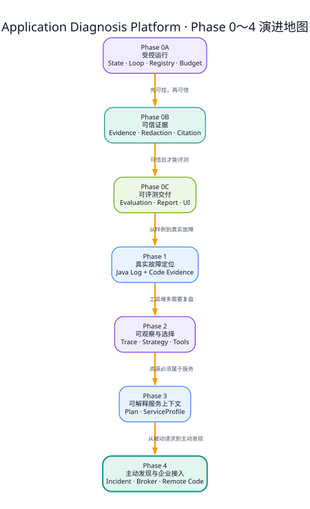

# Phase 0～4 项目演进地图

## 读图方式

这不是功能列表，而是一条因果链：每个阶段优先解决上一阶段暴露出的关键问题，后续阶段复用前面的确定性骨架，而不是重新实现一套系统。

| 阶段 | 首要问题 | 形成的长期资产 |
|---|---|---|
| 0A | LLM 和工具能否受控运行 | 状态机、ToolLoopRunner、Registry、预算、Port |
| 0B | 结论是否有真实依据 | Evidence、脱敏、引用规则、人工确认、审计 |
| 0C | 能否稳定验证和交付 | Evaluation、Report、Demo、极简界面 |
| 1 | 能否定位到真实代码 | Java Lab、真实日志、Code Evidence |
| 2 | 工具增多后怎样选择和复盘 | Strategy Router、Trace、配置/健康工具 |
| 3 | 调查意图和资源归属怎样解释 | 轻量 Plan、ServiceProfile、运行时资源解析 |
| 4 | 怎样从被动诊断升级为主动发现 | LogEvent、Fingerprint、Incident、Replay、企业 Adapter |

## 面试表达

不要说“项目一开始就设计了所有功能”。更可信的表达是：先让 Agent 有界运行，再解决证据可信度，然后逐步引入真实日志、源码、服务上下文和主动发现。RabbitMQ、Redis、远程 GitHub 与 SMTP 最后才接入，因为在核心领域和失败语义稳定之前，提前接中间件只会扩大调试面。
