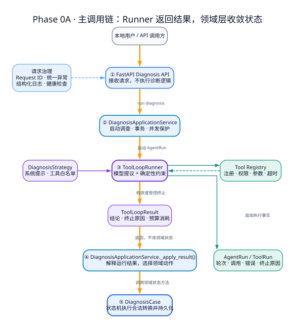
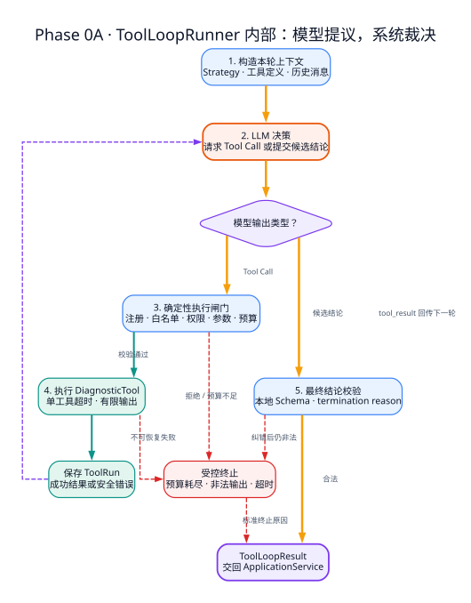
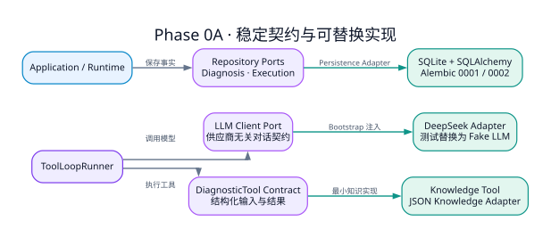

# Phase 0A 框架图：独立骨架与最小 Agent Loop

> [返回文档导航](../README.md)

> 阶段目标：在单机环境中建立一个可运行、可持久化、可替换模型、可受控调用工具的最小应用诊断 Agent。

## 第一张图：先理解端到端骨架



## 如何阅读这张图

第一次阅读只沿橙色粗线看，不要先研究每个 Adapter：

1. 本地用户通过 FastAPI 创建诊断并启动运行；
2. `DiagnosisApplicationService` 先处理事务与运行冲突，再启动 `ToolLoopRunner`；
3. Runner 组织模型和工具，但只能返回 `ToolLoopResult`，不能直接修改领域状态；
4. 同一个 `DiagnosisApplicationService` 通过 `_apply_result()` 解释运行结果；
5. ApplicationService 调用 `DiagnosisCase` 的领域方法，状态机才真正发生转换。

图中把 ApplicationService 画成“启动调查”和“应用结果”两个节点，只是为了展示它在调用前后的两个职责，并不是两个不同的服务。

然后再看三条支撑关系：

- `DiagnosisStrategy` 决定本次允许向模型暴露哪些工具；
- `Tool Registry` 对模型提出的每次 Tool Call 重新进行确定性校验；
- Runtime 将工具执行事实追加为 `AgentRun / ToolRun`，但执行记录不会替代领域状态。

最重要的权力边界是：

> LLM 提出下一步，Runner 和 Registry 裁决能否执行，ApplicationService 与 DiagnosisCase 决定状态怎样收敛。

## 第二张图：再展开最小 Agent Loop



这张图只解释 Runner 内部发生什么：

1. 系统构造上下文、工具定义和历史消息；
2. LLM 概率性地选择 Tool Call 或候选结论；
3. Tool Call 必须通过注册、白名单、权限、参数和预算检查；
4. 工具在超时和输出上限内执行，ToolRun 保存可观察结果；
5. `tool_result` 回传给下一轮模型，或者候选结论进入本地 Schema 校验；
6. 预算耗尽、非法输出和不可恢复错误都转成标准终止原因，而不是无限重试。

图中不记录或展示模型隐藏思维链。项目保留的是 LLM 请求、Tool Call、ToolRun、终止原因等可审计外部行为。

## 第三张图：最后理解 Port 与 Adapter



第三张图不再重复主调用链，只回答“核心代码依赖什么契约，运行时注入什么实现”：

- Runner 依赖 `LLM Client Port`，可以装配 DeepSeek 或 Fake LLM；
- Runner 通过 `DiagnosticTool Contract` 执行知识工具，Phase 0A 最小实现读取 JSON；
- Application 与 Runtime 通过 Repository 边界保存 Diagnosis 和执行记录，基础设施实现是 SQLite + SQLAlchemy；
- “可替换”表示变化集中在 Adapter、配置和 Bootstrap，不表示任何替换都不需要代码与迁移测试。

## Phase 0A 已建立的扩展基础

| 扩展方向 | Phase 0A 的基础 |
|---|---|
| 更换模型供应商 | Runtime 只依赖 LLM Client Port |
| 增加诊断工具 | Tool Contract、Tool Registry 和策略白名单 |
| 更换知识实现 | `knowledge__search` 与 JSON Adapter 分离 |
| 更换持久化实现 | Domain 保持持久化无关；Execution 使用 Repository Port，Diagnosis Application 仍存在直接依赖 SQLAlchemy Adapter 的实现妥协 |
| 后台异步运行 | Application Use Case 不依赖 HTTP Request，具备迁移基础，但仍需 Worker、任务状态、重试和取消机制 |
| 强化运行治理 | Agent Loop 已具有轮次、工具次数和时间预算 |
| 增加可观测能力 | Request ID、结构化日志和统一异常响应已经贯通 |

## 深度学习：这套架构应该如何准确理解

### 1. 架构定位：不是“纯六边形”，而是分层架构吸收 Ports & Adapters

Phase 0A 可以看成：

```text
分层架构
  + 在 LLM、工具、执行记录和知识检索等变化点设置 Port
  + 在 Bootstrap 中选择具体 Adapter
  + 由 Domain 维护诊断状态规则
  + 由 Application 和 Agent Runtime 编排完整用例
```

它明显采用了六边形架构的核心思想：让业务逻辑尽量不直接依赖模型供应商、数据库驱动和知识文件格式。但当前实现不是严格、纯粹的六边形架构。

最重要的判断依据不是目录名称，而是代码依赖方向：

- Diagnosis Domain 不依赖 FastAPI、SQLAlchemy 或模型 SDK；
- ToolLoopRunner 依赖 LLM Client、Execution Repository 等 Port；
- Bootstrap 负责装配 DeepSeek、SQLite 和知识检索实现；
- 但 Diagnosis Application Service 仍直接实例化部分 SQLAlchemy Repository。

因此，准确表述应当是：

> Phase 0A 是一个以分层架构为主体、采用 Ports & Adapters 隔离关键变化点的轻量 Agent 架构。

这并不是缺陷掩饰，而是阶段性取舍：个人项目在 Phase 0A 先完成可运行纵向链路，同时保留继续抽象的空间。只有当替换实现、测试隔离或事务管理真的受到影响时，才值得进一步消除 Application 对具体 Repository 的依赖。

### 2. 各层真正负责什么

| 区域 | 核心职责 | 不应该负责 |
|---|---|---|
| API | HTTP 协议、请求校验、响应 DTO、Request ID 传递 | 决定诊断状态、直接调用模型、直接执行工具 |
| Application | 用例编排、事务边界、运行冲突、把运行结果应用到 Diagnosis | 让模型决定业务状态、包含供应商协议细节 |
| Domain | DiagnosisCase 不变量、合法状态转换、领域值校验 | HTTP、SQL、Prompt 和模型 SDK |
| Agent Runtime | 组织 LLM 与工具的有限循环，累计预算和执行记录 | 绕过领域规则直接确认诊断 |
| Strategy | 为当前问题构造系统提示、允许工具集合和诊断策略 | 实际执行工具权限检查 |
| Registry | 强制执行工具注册、白名单、权限、问题类型和参数校验 | 决定最终诊断结论 |
| Ports | 表达核心所需的稳定能力契约 | 包含某个供应商或数据库专属概念 |
| Adapters | 把 Port 转换为 DeepSeek、SQLite、JSON 等具体技术实现 | 把技术细节反向泄漏到 Domain |

### 3. 一次诊断中，模型决定什么，系统决定什么

理解 Agent 架构时，必须区分“模型建议”和“系统裁决”。

| 决策 | 主要负责人 |
|---|---|
| 本次允许暴露哪些工具 | DiagnosisStrategy |
| 某个工具是否真的可以执行 | Tool Registry |
| 工具参数是否符合 Schema | Tool Registry / Pydantic |
| 模型选择是否调用工具 | LLM |
| 工具实际返回什么 | Tool Adapter |
| 是否达到轮次、工具次数或时间上限 | ToolLoopRunner / AgentBudget |
| 模型输出是否符合结论 Schema | 本地 Pydantic 校验 |
| Diagnosis 应进入哪个状态 | Application Service + DiagnosisCase |
| 是否属于人工确认结论 | 人工流程，而不是 LLM |

最关键的原则是：

> LLM 可以提出候选行动和候选结论，但权限、预算、Schema、状态转换和持久化必须由确定性代码控制。

### 4. 最小 Agent Loop 的真实执行过程

`ToolLoopRunner` 不是“调用一次模型并返回文本”，而是一个有终止边界的状态循环：

```text
准备策略上下文和允许工具
  → 创建 AgentRun
  → 调用 LLM
  → 模型没有请求工具？
      ├─ 是：解析并校验 DiagnosisConclusion
      │      ├─ 合法：完成运行
      │      └─ 非法：最多进行一次结构化纠错
      └─ 否：检查工具预算
             → Registry 校验工具和参数
             → 在单工具超时内执行
             → 保存 ToolRun
             → 把工具结果写回对话
             → 进入下一轮 LLM
  → 达到最大轮次、工具次数、总超时或异常时，以标准 termination reason 结束
```

这里的“Loop”由 LLM 选择下一步，但循环边界并不由 LLM 控制。模型无法自行扩大最大轮次、跳过 Registry 或修改终止原因。

### 5. 工具白名单的完整安全链路

“使用工具白名单”不能简化成“在 Prompt 里告诉模型不要调用其他工具”。真实链路是：

```text
DiagnosisStrategy 选择允许工具名
  → Runtime 只向模型暴露允许的 Tool Definition
  → 模型返回 Tool Call
  → Registry 再次检查工具是否注册、是否在白名单中
  → 检查权限、问题类型、参数 JSON 和 Pydantic Schema
  → 设置超时并执行
```

这套机制的价值是把权限控制放在确定性执行边界，而不是依赖模型自律。

但它不能被描述为“完全防止 Prompt Injection”。白名单可以限制攻击的可执行范围，却不能阻止恶意输入诱导模型错误选择白名单内工具、生成无意义参数或给出错误结论。Prompt Injection 需要输入隔离、最小权限、工具只读、输出校验、Evidence 约束和人工确认共同治理。

### 6. 运行预算的意义

`AgentBudget` 是 ToolLoopRunner 的执行参数，不是一个独立服务。它约束：

- 最大模型轮次；
- 最大工具调用次数；
- 单工具超时；
- 总执行时间。

它主要解决三类问题：

1. 正确性：避免模型在工具调用和自我修正间无限循环；
2. 稳定性：避免单个工具或外部模型长期占用请求；
3. 成本：限制 Token、模型调用次数和外部资源消耗。

预算耗尽不是异常遗漏，而是一种正常、可审计的终止结果。系统应记录明确的 termination reason，并把 Diagnosis 收敛到适当状态，而不是假装得到有效结论。

### 7. 结构化输出不是“模型保证”，而是多层契约

Phase 0A 的结构化结论依赖三个层次：

1. Prompt：明确告诉模型输出结构；
2. Provider 能力：条件允许时使用 `json_schema` 或 `json_object`；
3. 本地校验：最终由 Pydantic Schema 判断结果是否可接受。

其中只有第三层是系统最终能够信任的确定性边界。DeepSeek 能返回 JSON，不代表字段必然符合业务 Schema；模型输出非空，也不代表运行成功。

因此 Application Service 推进状态时，需要同时检查：

```text
termination reason == completed
AND conclusion 通过本地校验
```

不能仅凭“模型给了一个答案”进入 `waiting_for_confirmation`。

### 8. Ports & Adapters 实际解耦到了什么程度

| 变化场景 | Phase 0A 的实际效果 | 不能过度承诺的部分 |
|---|---|---|
| DeepSeek 换为其他 OpenAI-compatible 模型 | 通常只改配置或新增 LLM Adapter，Runtime 不变 | Provider 参数和结构化输出能力仍可能不同 |
| 真实 LLM 换为 Fake LLM | 通过 LLM Client Port 注入，适合离线测试 | Fake 不能代表真实模型质量 |
| JSON 知识换为 SQLite 知识 | 保持 Knowledge Search / Tool 契约时，Runner 和 Strategy 可不变 | 仍需新增 Adapter、导入逻辑和 Bootstrap 装配 |
| SQLite 换为其他数据库 | Domain 基本不受影响 | SQLAlchemy Adapter、连接、迁移、事务和方言测试可能需要修改 |
| HTTP 改为 Worker | Application Use Case 可复用 | 仍需任务队列、幂等、重试、取消、崩溃恢复和监控 |

所以“可替换”应理解为：

> 把变化尽量限制在 Adapter、配置和 Bootstrap 附近，减少核心调用方修改，而不是保证任何替换都零代码成本。

### 9. 图中几个模型的准确定位

| 模型 | 准确定位 |
|---|---|
| DiagnosisCase | 诊断领域聚合根，维护案例生命周期和合法状态转换 |
| DiagnosisStatus | DiagnosisCase 使用的领域状态枚举与转换规则 |
| DiagnosisConclusion | Agent 结构化输出契约；会写回 Diagnosis，但不是与 DiagnosisCase 同级的聚合根 |
| AgentRun | 一次 Agent 执行的状态、预算消耗、Token 和终止原因记录 |
| ToolRun | 某次工具调用的参数、结果、耗时和错误记录 |

AgentRun 和 ToolRun 提供的是“执行可追踪性”。它们能回答系统运行了几轮、调用了什么工具、为何停止，但 Phase 0A 尚未形成完整 Evidence 证据链；后者属于 Phase 0B 的扩展。

### 10. 当前实现中的阶段性妥协

架构图表达的是主要边界和设计方向，不代表代码已经达到理论最纯形态。

当前需要记住的妥协包括：

- Application 层仍直接引用部分 SQLAlchemy Repository；
- 同步 HTTP 请求内运行 Agent Loop，长任务尚未迁移到 Worker；
- SQLite 适合个人单机开发，不代表已经验证高并发或生产容量；
- 没有完整用户认证、角色授权和多租户隔离；
- 没有任务队列、分布式追踪、高可用和崩溃恢复；
- Fake LLM 验证确定性流程，不验证真实模型诊断质量；
- Phase 0A 的 JSON Knowledge 只是最小只读知识工具。

因此不建议把 Phase 0A 称为“生产级 Agent”。更准确的是：

> 一个具备生产化设计意识、但仍处于本地单机阶段的最小 Agent 工程骨架。

### 11. Phase 0B 为什么既是复用，也是修改

Phase 0B 证明了 Phase 0A 的一些边界确实稳定：

- `knowledge__search` Tool 契约保持不变，JSON Adapter 被 SQLite Adapter 替换；
- LLM Client Port、Strategy 和 Registry 继续复用；
- Diagnosis、AgentRun 和 ToolRun 继续作为主干模型。

但 Phase 0B 并不是“只增加六个 Adapter 或 Port，完全不动核心”。为了形成证据闭环，它还扩展了：

- ToolLoopRunner：EvidenceDraft 落库、真实 Evidence ID 回传和引用纠错；
- Application：创建 Evidence、补充信息、人工确认和重新调查；
- Domain：Evidence、Knowledge、Confirmation 和 Audit；
- Policy：EvidenceCitationPolicy；
- API 和持久化迁移。

更准确的经验是：

> 好的边界不会让后续需求完全不改旧代码，而是让修改集中、原因明确，并避免无关模块连锁变化。

## 常见说法校准

| 容易产生误解的说法 | 更准确的说法 |
|---|---|
| 这是严格的六边形架构 | 这是分层架构，并在关键变化点采用 Ports & Adapters |
| HTTP 薄壳可以无缝迁移 Worker | Application 不绑定 HTTP，具备迁移基础，但仍需完整任务基础设施 |
| Strategy 负责工具权限控制 | Strategy 选择白名单，Registry 在执行边界强制校验 |
| 白名单可以防止 Prompt Injection | 白名单限制可执行影响，是多层防护之一 |
| 换模型、知识库、数据库都不改代码 | 变化通常集中在 Adapter、配置和装配，数据库迁移等仍可能修改 |
| 核心域完全不依赖任何具体实现 | Domain 保持框架无关，但 Application 尚有部分具体 Repository 依赖 |
| Phase 0B 只需增加 Adapter 和 Port | Phase 0B 复用主干，同时有控制地扩展 Runtime、Application 和 Domain |
| 这是生产级 Agent | 这是具备生产化意识的本地最小工程骨架 |

## 推荐的代码阅读路径

不要从目录逐个文件阅读。沿一次诊断的执行路径学习更容易建立整体认识：

1. [API Route](../../src/app_diagnosis/api/routes/diagnoses.py)：请求如何进入系统；
2. [Diagnosis Application Service](../../src/app_diagnosis/application/diagnoses.py)：用例、事务和状态收敛；
3. [DiagnosisCase](../../src/app_diagnosis/domain/diagnosis/case.py)：领域状态如何被约束；
4. [DiagnosisStrategy](../../src/app_diagnosis/agent/strategies/generic_application_error.py)：Prompt 和工具白名单如何形成；
5. [ToolLoopRunner](../../src/app_diagnosis/agent/runtime/tool_loop.py)：模型、工具、预算和终止路径；
6. [AgentBudget](../../src/app_diagnosis/agent/runtime/models.py)：执行预算的数据结构；
7. [Tool Registry](../../src/app_diagnosis/tools/registry.py)：白名单、权限和参数如何强制校验；
8. [Knowledge Tool](../../src/app_diagnosis/tools/knowledge_search.py)：工具契约和结果限制；
9. [LLM Client Port](../../src/app_diagnosis/ports/llm/client.py) 与 [OpenAI-compatible Adapter](../../src/app_diagnosis/adapters/llm/openai_compatible.py)：抽象和实现如何对应；
10. [DiagnosisConclusion Schema](../../src/app_diagnosis/agent/schemas/diagnosis.py)：结构化输出的最终本地契约；
11. [AgentRun / ToolRun](../../src/app_diagnosis/domain/execution/models.py)：执行过程如何被记录；
12. [Bootstrap Container](../../src/app_diagnosis/bootstrap/container.py)：所有 Port 和 Adapter 如何装配成可运行系统。

## 回顾时应该能回答的问题

如果未来重新阅读 Phase 0A，至少应该能够回答：

1. 为什么不能让 LLM 直接修改 Diagnosis 状态？
2. Strategy 白名单与 Registry 强制校验有什么区别？
3. AgentBudget 为什么属于正常业务约束，而不只是异常保护？
4. 为什么模型返回 JSON 后仍然需要本地 Schema 校验？
5. AgentRun、ToolRun 与 Evidence 分别解决什么可追踪问题？
6. 哪些依赖已经通过 Port 隔离，哪些地方仍存在具体 Adapter 依赖？
7. 为什么“可替换”不等于“完全不改代码”？
8. 如果迁移到 Worker，还缺少哪些基础设施？
9. Phase 0B 哪些能力直接复用了 Phase 0A，哪些地方修改了 Runtime？
10. 当前系统为什么只能称为“具备生产化意识”，还不能称为“生产级”？

## 后续架构文档统一写法

后续 Phase 0B、Phase 0C 以及更高阶段的架构文档，建议统一包含以下内容：

1. 阶段目标：这一阶段具体解决什么问题；
2. 架构图：模块、主链路、新增和复用关系；
3. 快速读图：第一次阅读能够理解整体流程；
4. 准确架构定位：使用了哪些思想，但不随意贴理论标签；
5. 职责边界：每一层负责什么、不负责什么；
6. 决策归属：模型、确定性代码和人工分别决定什么；
7. 真实执行链路：从入口到状态收敛的具体步骤；
8. 设计收益：当前结构解决了什么真实问题；
9. 实现妥协：哪些地方尚未达到理想结构，以及为什么接受；
10. 安全边界：机制能防什么、不能防什么；
11. 常见误解：把容易过度概括的说法改成准确表达；
12. 代码索引：沿主链路给出推荐阅读顺序；
13. 阶段演进：复用了什么、新增了什么、修改了什么；
14. 回顾问题：未来阅读后应能独立回答什么。

这套结构的目标不是让文档显得复杂，而是把“架构图上的名词”转化为能够验证、解释和继续演进的工程理解。

## 统一视觉规范

| 颜色或线型 | 含义 |
|---|---|
| 浅蓝 | API 接入与应用编排 |
| 浅蓝 | API、Application 与领域状态边界 |
| 紫色 | Agent Runtime、ToolLoopResult 和稳定 Ports |
| 珊瑚色 | 概率性的 LLM 决策 |
| 青绿色 | 可替换的基础设施 Adapters |
| 橙色粗线 | 一次诊断的主执行路径 |
| 灰色线或虚线 | 支撑依赖和治理关系 |
| 浅红 | 预算、输出或执行失败后的受控终止 |

Phase 0B 图将复用本图的方向、模块位置、字号和配色。Phase 0A 已有模块保持原色，新增的 Evidence、Redaction、Knowledge Repository、Citation Policy、Confirmation 和 Audit Event 使用绿色，并标记 `NEW · Phase 0B`。

## 源文件与重新生成

架构图源文件为 `phase0a-framework.dot`、`phase0a-agent-loop.dot` 和 `phase0a-ports-adapters.dot`。安装 Graphviz 后，在本目录执行：

```powershell
dot -Tsvg phase0a-framework.dot -o phase0a-framework.svg
dot -Tsvg phase0a-agent-loop.dot -o phase0a-agent-loop.svg
dot -Tsvg phase0a-ports-adapters.dot -o phase0a-ports-adapters.svg
```
