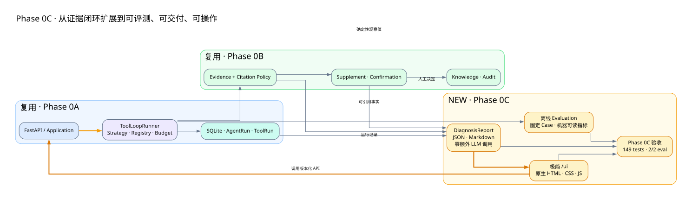

# Phase 0C 扩展图：评测、报告与极简界面

> [返回文档导航](../README.md)



## 与 Phase 0A、0B 的关系

Phase 0C 不改变 Agent Loop 和证据规则，而是在已有闭环外增加三个消费入口：

| 既有基础 | Phase 0C 使用方式 |
|---|---|
| Phase 0A AgentRun / ToolRun / termination reason | 形成可重复评测观察值和运行摘要 |
| Phase 0B Evidence / Citation Policy | 报告再次验证引用归属并展示依据 |
| Phase 0B Confirmation | 报告区分模型结论和人工决定 |
| Phase 0A/0B API | `/ui` 只调用 API，不复制领域规则 |

## 三项新增能力

1. Evaluation：固定 Case 和确定性 Observation 生成机器可读指标，默认不调用真实模型；
2. DiagnosisReport：按需聚合现有数据，输出 JSON/Markdown，不再次调用 LLM；
3. Minimal UI：使用原生 HTML/CSS/JavaScript 完成核心闭环操作，无独立前端构建。

## 边界

- 当前评测是确定性系统回归基线，不等于真实模型质量排行榜；
- 报告是事实投影，不持久化、不签名、不生成新的模型结论；
- UI 是本地学习和联调入口，不包含认证、RBAC 和企业审批体验；
- Phase 0C 没有新增数据库迁移。

## 重新生成

```powershell
dot -Tsvg phase0c-extension.dot -o phase0c-extension.svg
```
