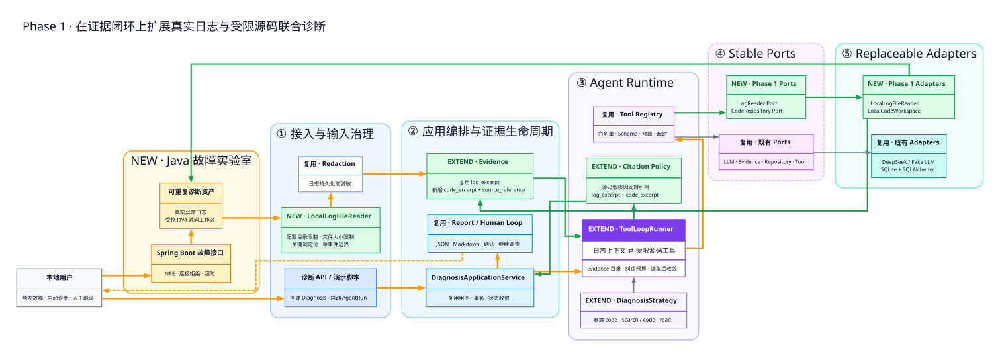

# Phase 1 扩展架构：真实日志与受限源码联合诊断

> [返回文档导航](../README.md)

> 阶段目标：在 Phase 0A/0B/0C 的证据驱动闭环上，引入可重复的 Java 故障现场、受限日志读取和受限源码工具，让模型结论能够同时引用运行事实与实现事实。



## 如何阅读这张图

这是一张“增量架构图”，不是单次调用时序图。它沿用 Phase 0B 的五层结构，并用三种语义区分演进方式：

| 标记 | 含义 | Phase 1 示例 |
|---|---|---|
| 复用 | 契约与主要职责不变 | Application Service、Registry、Report、LLM Adapter |
| EXTEND | 保留原职责，同时增加 Phase 1 规则 | Strategy、ToolLoopRunner、Evidence、Citation Policy |
| NEW | 新增边界或实现 | Java Lab、LogReader Port、CodeRepository Port、本地适配器 |

橙色粗线仍表示主要诊断路径，绿色线表示 Phase 1 新增能力的调用和数据流，灰色线表示既有依赖关系。

如需查看一次诊断从触发故障到生成报告的顺序，请阅读[Phase 1 端到端链路图](./phase1-log-code-flow.md)。

## Phase 1 如何从 Phase 0 生长出来

| 既有阶段 | 直接复用 | Phase 1 实际修改 |
|---|---|---|
| Phase 0A | 有界 Tool Loop、Strategy、Registry、预算、AgentRun/ToolRun、LLM Port | Strategy 增加源码工具白名单；Runner 增加 Evidence 目录、引用纠错与读取后收敛 |
| Phase 0B | Evidence 生命周期、入库前脱敏、Citation Policy、人工反馈、审计 | Evidence 类型增加 `code_excerpt`；源码型结论要求同时引用日志和源码 |
| Phase 0C | JSON/Markdown 报告、离线验收思路、极简消费入口 | 报告自然展示新增 Evidence；增加 Phase 1 固定案例和真实模型验收记录 |

关键经验是：架构复用并不等于旧代码完全不动。Phase 1 保留了稳定边界，但在真正承载新语义的 Runtime、Evidence 和 Policy 内做了集中扩展。

## 深度学习：这条联合诊断链路应该如何准确理解

### 1. Phase 1 解决的不是“让模型看更多文本”

Phase 0 已经能够根据用户描述、日志片段和知识条目形成候选结论，但它缺少一个真实开发场景中的关键闭环：日志指出“哪里失败”，源码解释“为什么会这样实现”。

Phase 1 增加的是两类事实的关联：

```text
运行事实：某次请求实际抛出了什么异常、调用栈经过哪里
  +
实现事实：对应类和方法实际怎样处理数据、连接与超时
  =
可验证的候选根因
```

模型负责在两类事实之间提出关联，系统负责限制它能读取什么、保存它实际读到了什么，并校验最终结论引用了哪些 Evidence。

### 2. Java Lab 是评测夹具，不是被诊断平台的一部分

Java Lab 与 Python 平台是两个独立 Git 工程。它的职责是稳定地产生已知故障和真实日志，相当于诊断系统的“实验样本发生器”。

这种拆分有三个价值：

1. 故障可重复：NPE、连接拒绝、超时可被反复触发；
2. 真值可检查：开发者知道错误代码和预期根因，可以判断模型是否定位正确；
3. 边界真实：诊断平台不能通过内部 Python 对象偷看答案，只能通过日志和授权源码工作区获取信息。

它不是生产日志采集器，也不是远程代码托管平台。未来接入真实系统时，Java Lab 可以被日志平台和代码仓库适配器替换，而 Agent Runtime 不应因此重写。

### 3. 为什么日志读取也需要 Port 与安全边界

让脚本接收任意文件路径虽然简单，但会把“诊断某个日志”扩大成“模型间接读取本机任意文件”。因此 Phase 1 使用 `LogReader Port + LocalLogFileReader Adapter`：

- 只允许配置目录内的文件；
- 规范化并校验路径，防止目录穿越；
- 限制读取大小；
- 通过关键词定位最近一次相关事件；
- 按事件起始和堆栈连续行截取，避免混入后续异常；
- 截取后先脱敏，再持久化为 `log_excerpt`。

这里的事件边界非常重要。固定读取“关键词后 N 行”可能把下一次请求的异常也带进来，模型会在两个故障之间建立不存在的因果关系。

### 4. `code__search` 与 `code__read` 为什么必须拆开

两个工具对应不同权限和成本：

| 工具 | 作用 | 返回内容 | 风险控制 |
|---|---|---|---|
| `code__search` | 从日志线索定位候选文件和行 | 相对路径、行号、短预览 | 限制后缀、结果数和工作区 |
| `code__read` | 读取一个明确范围的源码 | 有界源码片段 | 校验路径、行范围和最大内容 |

如果合并成“搜索并返回大量源码”，模型上下文会快速膨胀，也难以审计它究竟选择了哪个文件。拆分后，ToolRun 可以记录“先搜索什么，再读取哪里”，`code_excerpt` 只保存真正用于推理的片段。

### 5. 受限源码工具不是代码 RAG

当前实现是即时文本搜索与按行读取，没有向量库、语法树索引、符号图或跨仓库依赖分析。因此准确表述应是：

> Phase 1 提供由模型驱动的受限源码检索和读取，不是完整代码 RAG。

这个选择适合当前阶段：Java Lab 规模小、故障真值明确、16GB 本地环境足够运行，并且能先验证“日志线索能否驱动正确的源码调查”。只有当文件规模和语义检索需求成为真实瓶颈时，才值得增加索引或向量检索。

### 6. 模型、工具和确定性代码各自决定什么

| 决策 | 负责者 |
|---|---|
| 哪些日志文件允许读取 | 配置 + LocalLogFileReader |
| 从日志中截取哪个事件 | 调用参数 + 确定性事件边界算法 |
| 日志是否先脱敏 | Application / Redaction Adapter |
| 使用什么关键词搜索源码 | LLM |
| 搜索与读取是否允许执行 | Strategy + Registry + Code Adapter |
| 哪些源码成为 Evidence | 成功执行的 `code__read` 结果 + Evidence Store |
| 是否停止继续调用工具 | ToolLoopRunner 预算与读取后收敛规则 |
| 候选根因如何表述 | LLM |
| 引用 ID 是否真实且属于当前诊断 | Citation Policy |
| 源码型根因是否同时有日志和源码依据 | Citation Policy |
| 是否最终 confirmed | 人工确认流程 |

核心原则没有改变：LLM 选择调查动作和提出候选结论，确定性代码控制资源边界、证据身份、引用规则和状态转换。

### 7. Evidence 目录为什么要反复回传

工具返回文本不等于正式证据。正确链路是：

```text
code__read 返回 EvidenceDraft
  → Evidence Store 持久化
  → 获得当前 Diagnosis 下的正式 Evidence ID
  → 把权威 Evidence 目录回传模型
  → 模型只能引用目录中的 ID
```

真实模型测试暴露了一个工程问题：模型可能正确读取日志与源码，却在最终 JSON 中遗漏或写错 Evidence ID。因此 Phase 1 将结构纠错与引用纠错分开预算，并在最终结论阶段重新提供权威目录。

这并不保证模型一定得出正确根因，但能区分两类失败：

- 推理质量失败：证据真实、引用合法，但根因判断错误；
- 协议收敛失败：模型找到了证据，却未按 Schema 或引用规则输出。

### 8. 为什么源码型结论必须同时引用日志与源码

只引用日志，可以证明异常发生，却未必能证明代码根因；只引用源码，可以说明某段实现存在风险，却不能证明它在本次诊断中实际触发。

因此当前策略要求源码型根因同时引用：

- `log_excerpt`：本次运行的故障事实；
- `code_excerpt`：与该事实相关的实现片段。

这是一种证据充分性规则，不是语义正确性证明。Citation Policy 当前能够验证类型、归属和 ID，却不能证明自然语言中的“因为 A 所以 B”逻辑一定成立。后者仍需要更强评测、规则或人工复核。

### 9. 读取源码后进入收敛阶段的意义

真实模型容易在已经获得足够源码后继续搜索，造成工具调用膨胀、Token 增长和结果漂移。Phase 1 在成功读取关键源码后进入无工具的最终结论阶段。

这是一项阶段性策略：它提高了三个固定案例的可预测性，但对复杂工程可能过早终止调查。未来可演进为“证据充分性判断 + 动态预算”，而不是永远固定为读取一次后结束。

### 10. 真实模型低频验收验证什么

Fake LLM 适合验证确定性契约：工具是否注册、Evidence 是否落库、错误引用是否拒绝、预算是否生效。它不能验证真实模型会不会从异常栈构造有效搜索词，也不能验证模型能否在多轮工具调用后稳定输出结构化结论。

真实模型验收关注：

1. 能否从日志选择合理搜索词；
2. 能否选择正确文件和源码范围；
3. 能否在有限轮次内收敛；
4. 能否引用日志和源码 Evidence；
5. 结论是否与预设故障真值一致。

低频调用的工程节奏是：失败后先检查 ToolRun、Evidence 和报告，修复确定性问题并通过离线测试，再发起下一次真实调用。这样模型调用是验收手段，而不是随机重试器。

### 11. 当前架构的阶段性妥协

- 日志接入是本地文件读取，不是远程采集、流式消费或日志平台查询；
- 源码工作区通过配置给定，没有 Git commit、branch、repository identity 等版本上下文；
- 文本搜索不理解 Java 符号、调用图、依赖注入和运行时代理；
- 同步 HTTP/脚本内运行 Agent，没有 Worker 和断点恢复；
- Citation Policy 校验引用结构，不验证自然语言因果关系；
- 三个固定案例证明链路可行，不代表对未知生产故障的泛化质量；
- 真实模型结果受模型版本和供应商行为影响，必须与确定性回归分开记录。

因此更准确的定位是：

> 一个可重复、可审计、受边界约束的日志与源码联合诊断实验平台，而不是企业级代码智能运维平台。

## 常见说法校准

| 容易产生误解的说法 | 更准确的说法 |
|---|---|
| Phase 1 已经实现代码 RAG | Phase 1 实现了受限文本搜索和按行源码读取 |
| 模型直接分析整个 Java 工程 | 模型只能通过白名单工具访问配置工作区的有限结果 |
| 引用日志和源码就证明根因正确 | 引用证明结论有真实依据，语义因果仍需评测或人工确认 |
| Java Lab 是平台的 Java 后端 | Java Lab 是独立故障实验室和评测夹具 |
| 工具返回内容就是 Evidence | 工具先返回 EvidenceDraft，持久化后才获得正式 Evidence ID |
| Phase 1 只增加两个工具 | 还扩展了日志接入、Evidence 类型、Runtime 收敛和 Citation Policy |
| 三个案例通过说明可投入生产 | 三个案例证明最小链路成立，泛化、权限、规模与可靠性仍未验证 |

## 推荐的代码阅读路径

沿一次真实诊断的因果链阅读：

1. [真实模型演示脚本](../../scripts/diagnose-java-log-real.py)：如何选择案例并启动链路；
2. [LogReader Port](../../src/app_diagnosis/ports/log_reader.py)：核心需要怎样的日志读取契约；
3. [LocalLogFileReader](../../src/app_diagnosis/adapters/logs/local_file.py)：目录限制与事件边界怎样实现；
4. [Redaction Adapter](../../src/app_diagnosis/adapters/redaction/local_rules.py)：日志如何在入库前脱敏；
5. [Evidence Model](../../src/app_diagnosis/domain/evidence/models.py)：`log_excerpt` 与 `code_excerpt` 如何表达；
6. [CodeRepository Port](../../src/app_diagnosis/ports/code_repository.py)：源码能力如何与本地文件系统解耦；
7. [LocalCodeWorkspace](../../src/app_diagnosis/adapters/code/local_workspace.py)：路径、后缀、结果和行范围如何受限；
8. [Code Tools](../../src/app_diagnosis/tools/code.py)：搜索、读取与 EvidenceDraft 如何衔接；
9. [DiagnosisStrategy](../../src/app_diagnosis/agent/strategies/generic_application_error.py)：Phase 1 工具如何进入白名单；
10. [Tool Registry](../../src/app_diagnosis/tools/registry.py)：工具执行边界如何强制校验；
11. [ToolLoopRunner](../../src/app_diagnosis/agent/runtime/tool_loop.py)：Evidence 目录、纠错预算和最终收敛；
12. [Citation Policy](../../src/app_diagnosis/agent/policies/evidence_citations.py)：日志与源码引用规则；
13. [Report Application](../../src/app_diagnosis/application/reports.py)：已验证事实如何投影为报告；
14. [Phase 1 固定案例](../../evals/cases/phase1-java-lab-cases.json)：三个故障的验收真值如何定义。

## 回顾时应该能回答的问题

1. 为什么 Java Lab 必须与 Python 诊断平台保持独立？
2. 为什么不能允许模型读取任意日志路径和源码路径？
3. 日志事件边界错误会怎样影响模型结论？
4. 为什么 `code__search` 和 `code__read` 要拆分？
5. 当前能力为什么不能称为完整代码 RAG？
6. EvidenceDraft 与正式 Evidence 的区别是什么？
7. 为什么最终阶段需要重新提供权威 Evidence 目录？
8. 结构纠错和引用纠错为什么要分开预算？
9. 为什么源码型根因同时需要日志与源码 Evidence？
10. Citation Policy 能验证什么，不能验证什么？
11. 成功读取源码后立刻收敛有什么收益和局限？
12. Fake LLM 测试与真实模型验收分别覆盖什么风险？
13. Phase 1 哪些模块直接复用，哪些模块实际被扩展？
14. 如果未来接入 Git 仓库或日志平台，应该优先替换哪两个 Adapter？

## 图例

| 颜色或线型 | 含义 |
|---|---|
| 蓝色 | Phase 0A 接入、应用与领域基础 |
| 紫色 | Agent Runtime 和稳定 Ports |
| 青绿色 | 可替换 Adapters |
| 绿色 | Phase 1 新增或扩展能力 |
| 橙色 | Java Lab 与主要诊断路径 |
| 灰色 | 既有依赖关系 |
| 虚线边框 | 稳定抽象或可替换边界 |

## 源文件与重新生成

源文件为 `phase1-extension.dot`。在本目录执行：

```powershell
dot -Tsvg phase1-extension.dot -o phase1-extension.svg
```
