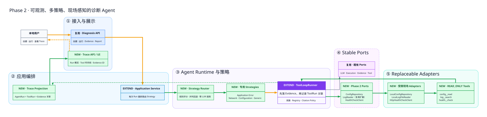

# Phase 2 扩展架构：可观测、多策略、现场感知

> [返回文档导航](../README.md)



## 阶段定位

Phase 2 没有引入通用 Shell、自动修复或 Planner，而是在原证据闭环中增加三个受控变化：

1. Trace：把已有运行记录投影成可阅读时间线；
2. 现场工具：在预授权范围读取配置、日志并检查本地健康目标；
3. Strategy Router：根据问题信号选择差异化提示与工具白名单。

## 与既有阶段的关系

| 来源 | 复用 | Phase 2 扩展 |
|---|---|---|
| Phase 0A | ToolLoopRunner、Registry、预算、AgentRun/ToolRun | ToolRun 关联正式 Evidence ID |
| Phase 0B | Evidence、脱敏、Citation Policy、人工确认 | 增加 config/health Evidence 与本地来源 |
| Phase 0C | 极简 UI、报告、离线验收 | 增加 Trace API 和时间线入口 |
| Phase 1 | LogReader、受限工作区工具设计 | 日志工具化，并把相同边界应用到配置和健康检查 |

## 核心设计判断

### Trace 是事实投影，不是日志猜测

Trace v1 只展示真实持久化的 AgentRun、ToolRun 和 Evidence 关联。现有系统没有逐轮 LLM 时间戳，因此不伪造 Round 事件。未来若需要 Prompt/Response 级 Trace，应设计独立数据模型和敏感内容策略。

### 只读不等于无风险

配置文件可能有密码，日志可能有 Token，健康检查可能形成 SSRF。因此三个工具分别限制目录、后缀、大小、行数或目标别名，并在进入 ToolRun 和 Evidence 前脱敏。

### Router 选择调查方法，不改变领域分类

当前 Diagnosis 仍属于 `generic_application_error`。Router 在每次 Run 前选择 Application、Network、Configuration 或 Generic Strategy。Strategy 决定提示和白名单，Diagnosis 的生命周期仍由领域状态机控制。

### 规则优先是阶段性选择

当前故障类型少且信号明确，确定性路由不增加费用、可测试、可解释。规则并列或没有命中时回退 Generic。只有未来分类歧义成为真实瓶颈时，才考虑增加低成本模型路由。

## 新增工具边界

| 工具 | 模型可提供 | 模型不能提供 | Evidence |
|---|---|---|---|
| `config__read` | 相对路径、有限行范围 | 根目录、绝对路径、任意后缀 | `config_excerpt` |
| `log__search` | 相对路径、关键词 | 根目录、无限 tail | `log_excerpt` |
| `health__check` | 已配置目标别名 | URL、方法、Header、请求体 | `health_check` |

三个工具均为 `READ_ONLY`，继续经过 Strategy、Registry、权限、Schema、预算、超时和输出限制。

## 推荐代码阅读路径

1. [Strategy Router](../../src/app_diagnosis/agent/strategies/router.py)；
2. [专用 Strategies](../../src/app_diagnosis/agent/strategies/specialized.py)；
3. [Application Service](../../src/app_diagnosis/application/diagnoses.py)；
4. [Config Tool](../../src/app_diagnosis/tools/config.py)；
5. [Log Tool](../../src/app_diagnosis/tools/log_search.py)；
6. [Health Tool](../../src/app_diagnosis/tools/health.py)；
7. [Local Config Adapter](../../src/app_diagnosis/adapters/config/local_workspace.py)；
8. [HTTP Health Adapter](../../src/app_diagnosis/adapters/health/http_client.py)；
9. [ToolLoopRunner](../../src/app_diagnosis/agent/runtime/tool_loop.py)；
10. [Trace Projection](../../src/app_diagnosis/application/traces.py)；
11. [Trace API](../../src/app_diagnosis/api/routes/traces.py)；
12. [Phase 2 离线演示](../../scripts/demo-phase2.py)。

## 回顾时应该能回答的问题

1. 为什么 Trace v1 没有展示每轮 LLM Request？
2. 为什么 ToolRun 要在 Evidence 落库之后记录关联 ID？
3. 为什么健康检查只接受别名而不接受 URL？
4. 为什么配置 Evidence 只能是中等可靠度？
5. 为什么网络 Strategy 默认不开放源码工具？
6. Router 与 Model Router 有什么区别？
7. 为什么并列信号回退 Generic？
8. 本阶段为什么仍不增加 Shell 和状态修改工具？

## 当前边界

- Trace 不是 OpenTelemetry，也没有逐轮 Prompt 存储；
- 健康检查仅支持预配置的 loopback HTTP 目标；
- 日志是有界事件搜索，不是实时流；
- Router 使用关键词评分，不是语义分类器；
- 新工具增加调查空间，但不会自动修改系统；
- Plan-then-Execute 与经验自动沉淀仍需由更复杂案例驱动。

## 重新生成

```powershell
dot -Tsvg phase2-extension.dot -o phase2-extension.svg
```
