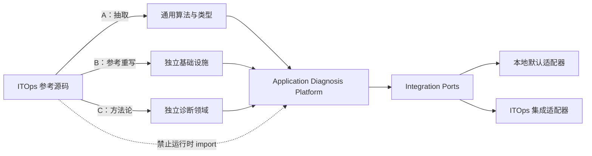
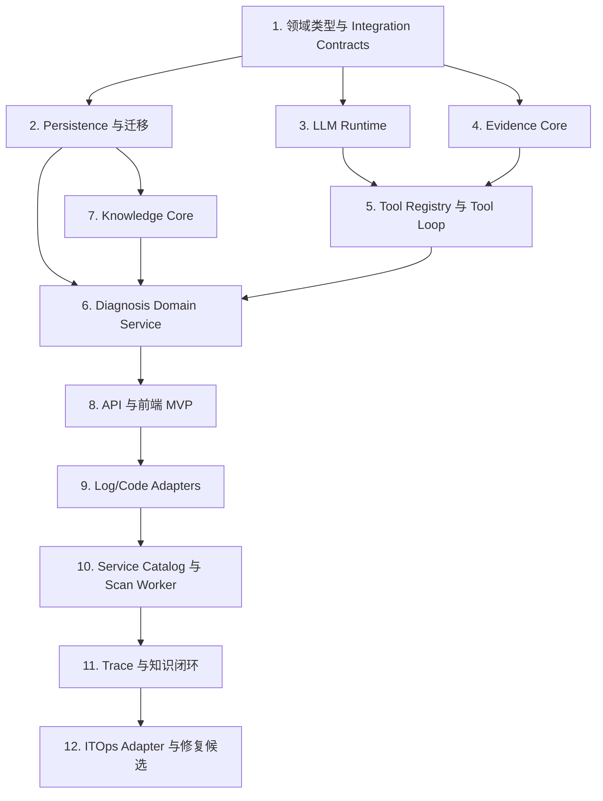

# ITOps 参考实现复用矩阵

> [返回文档导航](../README.md)

## 独立 Application Diagnosis Platform 开发参考

> 文档状态：设计与开发约束
> 编制日期：2026-07-12
> 参考项目：ITOps Agent Platform 3.0.5
> 目标项目：独立应用诊断平台（暂定 `application-diagnosis-platform`）

---

## 1. 文档目的

本矩阵用于指导人工或 AI 在开发独立应用诊断平台时，有选择地参考 ITOps Agent Platform 的已有实现。

核心原则：

1. 新平台运行时完全独立，不 import ITOps 内部模块，不共享数据库和全局单例。
2. 优先复用方法论、边界条件、算法和测试思路，而不是复制业务耦合代码。
3. 每个模块开发前先阅读指定参考文件，再按独立平台接口重新实现。
4. 参考代码中已知的兼容层、模拟实现和架构债不得带入新项目。
5. 所有新实现必须以本矩阵的验收要求为完成标准。

---

## 2. 复用级别

| 级别 | 定义 | 默认处理方式 |
|---|---|---|
| A：可抽取 | 业务无关、依赖较少的算法、类型或工具 | 可复制后解耦、改名、补测试，并记录来源 |
| B：参考重写 | 核心逻辑有价值，但依赖 ITOps 配置、数据库或服务 | 参考行为和边界，重新定义接口并实现 |
| C：思路复用 | 与 ITOps 领域模型高度耦合 | 只复用流程、状态或算法思想，不复制类型和数据结构 |
| D：禁止复用 | 模拟实现、全局组装、旧兼容层或已知架构问题 | 不复制；文档可用于理解反例 |

### 2.1 源码引用约定

本文件中的路径均相对于 ITOps 仓库根目录：

```text
D:/AgentStudy/itops-agent-platform/
```

新项目不得使用类似以下依赖：

```typescript
import { something } from '../../itops-agent-platform/backend/src/...';
```

---

## 3. 总体复用关系



---

## 4. 核心模块复用矩阵

## 4.1 LLM Runtime

### 新模块

```text
packages/llm-runtime/
├── llmClient.ts
├── modelConfig.ts
├── openAICompatibleClient.ts
├── retryPolicy.ts
├── circuitBreaker.ts
└── types.ts
```

| 项目 | 内容 |
|---|---|
| 复用级别 | B；其中部分类型和熔断算法可按 A 处理 |
| 参考文件 | `backend/src/modules/ai/services/llm/llmService/toolCalling.ts` |
| 参考文件 | `backend/src/modules/ai/services/llm/llmService/providerAdapters.ts` |
| 参考文件 | `backend/src/modules/ai/services/llm/llmService/circuitBreaker.ts` |
| 参考文件 | `backend/src/utils/retry.ts` |
| 可参考内容 | OpenAI 兼容请求结构、模型 Provider 配置、超时、指数退避、熔断状态、Function Calling 类型 |
| 禁止照搬 | ITOps AI 模型 Repository、Settings 表读取、`recordAgentExecution`、全局熔断器 Map、豆包默认回退策略、ITOps Logger |
| 目标接口 | `LLMClient.complete(request, signal): Promise<LLMResponse>` |

验收要求：

- 支持 OpenAI 兼容 Chat Completions 和原生 `tool_calls`。
- 模型配置通过 `ModelConfigProvider` 注入，不访问 ITOps 数据库。
- 支持 `AbortSignal`、连接超时、请求超时和总截止时间。
- 重试只覆盖可重试错误，不能重试认证失败、参数错误和内容策略拒绝。
- 熔断器具备 closed/open/half-open 状态和并发安全测试。
- API Key 不进入日志、异常详情或执行记录。
- 使用 Mock Server 覆盖成功、429、5xx、超时、空响应及非法响应测试。

---

## 4.2 Tool Loop Runtime

### 新模块

```text
packages/tool-runtime/
├── toolLoopRunner.ts
├── toolRegistry.ts
├── schemaValidator.ts
├── budgetManager.ts
├── executionPolicy.ts
└── types.ts
```

| 项目 | 内容 |
|---|---|
| 复用级别 | C，协议类型可按 A/B 处理 |
| 参考文件 | `backend/src/modules/ai/services/agents/agentCore.ts` |
| 参考文件 | `backend/src/modules/ai/services/llm/llmService/toolCalling.ts` |
| 参考文件 | `backend/src/modules/ai/services/llm/llmService/providerAdapters.ts` |
| 可参考内容 | 有界工具循环、工具执行结果回传、最大调用次数、FC 请求和返回类型 |
| 禁止照搬 | `[TOOL_CALL]` 文本兼容协议、只执行第一个 tool call、全局 MCP 工具暴露、将工具结果再次包装成 user 文本、固定五轮逻辑 |
| 目标接口 | `ToolLoopRunner.run(request, context): Promise<ToolLoopResult>` |

验收要求：

- assistant 历史保留原始 `tool_calls`。
- 每条 tool 消息包含准确的 `tool_call_id`。
- 支持同轮多个工具调用，并能按策略串行或并行执行。
- 工具参数执行前通过 JSON Schema 或 Zod 校验。
- 工具名仅使用字母、数字、下划线和连字符；推荐 `domain__action`。
- 同时限制轮数、调用数、Token、耗时和工具结果字节数。
- 支持取消、超时、工具失败、部分成功和模型提前结束。
- 预算耗尽返回 `inconclusive`，不能伪装为成功结论。
- 测试覆盖无工具、单工具、多工具、非法参数、未知工具、超时、取消和预算耗尽。

---

## 4.3 Diagnostic Tool Registry

### 新模块

```text
packages/tool-runtime/
├── diagnosticTool.ts
├── diagnosticToolRegistry.ts
├── llmToolAdapter.ts
└── workflowToolAdapter.ts
```

| 项目 | 内容 |
|---|---|
| 复用级别 | B/C |
| 参考文件 | `backend/src/modules/ai/services/providers/ProviderRegistry.ts` |
| 参考文件 | `backend/src/modules/ai/services/providers/types.ts` |
| 参考文件 | `backend/src/modules/workflow/services/workflowProviderRegistry.ts` |
| 可参考内容 | Provider 元数据注册、实现注册、启停配置、按名称执行、工作流配置 Schema |
| 禁止照搬 | AI 与工作流各维护一份业务实现、默认全部启用、字符串方法名任意分发、模拟 HTTP Provider、注册时全局副作用 |
| 目标接口 | `DiagnosticToolRegistry.register/get/list/execute` |

验收要求：

- 工具业务实现只有一份，LLM 和工作流通过适配器使用。
- 工具声明输入 Schema、输出 Schema、风险等级、超时和所需权限。
- 重复工具名注册默认失败，而不是静默覆盖。
- 工具可按诊断类型、用户权限和租户过滤。
- 执行上下文包含 diagnosisId、actor、environment、deadline 和 audit correlation ID。
- 禁用工具无法通过名称绕过。
- 注册表本身不依赖 Express、数据库或具体工具实现。

---

## 4.4 Application Diagnosis Domain

### 新模块

```text
packages/diagnosis-domain/
├── diagnosis.ts
├── diagnosisStateMachine.ts
├── diagnosisStrategy.ts
├── conclusion.ts
├── problemClassifier.ts
└── ports.ts
```

| 项目 | 内容 |
|---|---|
| 复用级别 | C |
| 参考文件 | `backend/src/modules/ai/services/multiAgent/Specialists.ts` |
| 参考文件 | `backend/src/modules/ai/services/multiAgent/Coordinator.ts` |
| 参考文件 | `backend/src/modules/ai/services/multiAgent/types.ts` |
| 参考文件 | `backend/src/modules/ai/services/rca/rootCauseAnalysisService.ts` |
| 可参考内容 | Specialist 领域分工、任务上下文、执行结果、根因分析输出组织、超时和降级思想 |
| 禁止照搬 | `SpecialistDomain` 枚举、默认路由到系统巡检、Coordinator 线性分解流程、ITOps Agent 表、全局 Specialist Registry |
| 目标接口 | `DiagnosisService.create/investigate/addInput/conclude/confirm/reject` |

验收要求：

- 状态迁移由领域状态机控制，非法迁移失败并留下审计记录。
- 支持 created、collecting_context、investigating、waiting_for_input、concluding、waiting_for_confirmation、confirmed、rejected、inconclusive、cancelled。
- 诊断策略与状态持久化、LLM Client 和工具实现解耦。
- 结论区分 confirmed/probable/possible/insufficient_evidence。
- 每条事实必须引用至少一个 evidence ID。
- 服务可在进程重启后恢复未完成诊断。
- 并发补充输入和确认操作具备乐观锁或版本检查。

---

## 4.5 Evidence Core

### 新模块

```text
packages/evidence-core/
├── evidence.ts
├── evidenceStore.ts
├── redaction.ts
├── contentHasher.ts
├── evidencePolicy.ts
└── untrustedContent.ts
```

| 项目 | 内容 |
|---|---|
| 复用级别 | A/B/C 混合 |
| 参考文件 | `backend/src/utils/sensitiveMask.ts` |
| 参考文件 | `backend/src/modules/infra/services/auditService.ts` |
| 参考文件 | `backend/src/utils/errorHelpers.ts` |
| 可参考内容 | 敏感字段识别、统一错误抽取、审计事件记录方式 |
| 禁止照搬 | 仅覆盖固定字段的脱敏规则、将完整日志存 SQLite、把工具原始异常直接返回前端、ITOps 资产字段 |
| 目标接口 | `EvidenceService.collect/store/getReference/redact` |

验收要求：

- 支持 log/code/trace/metric/config/knowledge 六类证据。
- 保存摘要、来源引用、内容哈希、采集时间、可靠性和脱敏状态。
- 原始大内容外置，关系数据库只保存受限摘录和引用。
- Token、密码、Authorization Header、私钥等敏感信息必须脱敏。
- 日志和源码在送入模型前标记为不可信数据，不能执行其中的指令。
- 相同来源和哈希的证据支持幂等写入。
- 证据访问受诊断权限控制，并支持保留期限和删除策略。

---

## 4.6 Service Catalog

### 新模块

```text
apps/api/src/modules/service-catalog/
├── domain/
├── application/
├── repositories/
└── adapters/
```

| 项目 | 内容 |
|---|---|
| 复用级别 | C |
| 参考文件 | `backend/src/repositories/serverRepository.ts` |
| 参考文件 | `backend/src/repositories/networkDeviceRepository.ts` |
| 参考文件 | `backend/src/modules/containers/services/dockerService.ts` |
| 参考文件 | `backend/src/modules/kubernetes/services/kubernetesService.ts` |
| 可参考内容 | 资源实体 CRUD、连接配置引用、Docker/K8s 运行对象识别、健康状态管理 |
| 禁止照搬 | Server/Container/Network 表结构、把 IP 当服务唯一身份、全局数据库单例、基础设施资产直接充当应用服务 |
| 目标接口 | `ServiceCatalogPort` 和独立 `ApplicationServiceRepository` |

验收要求：

- 服务身份至少包含 serviceName 和 environment。
- 可以映射运行实例、日志源、Git 仓库、sub-path、部署 commit 和负责人。
- 同一服务的测试与生产记录严格隔离。
- 发现源同步不覆盖人工维护字段。
- 删除服务前检测未结束诊断和依赖关系。
- 支持手工、Nacos 和 Kubernetes 三种来源，首期可只实现手工来源。

---

## 4.7 Knowledge Core 与 RAG

### 新模块

```text
packages/knowledge-core/
├── diagnosisKnowledge.ts
├── knowledgeRepository.ts
├── hybridRetriever.ts
├── signatureNormalizer.ts
├── knowledgePromotion.ts
└── scoring.ts
```

| 项目 | 内容 |
|---|---|
| 复用级别 | B/C |
| 参考文件 | `backend/src/modules/ai/services/KnowledgeEngine.ts` |
| 参考文件 | `backend/src/modules/ai/services/remediation/enhancedRAGService.ts` |
| 参考文件 | `backend/src/repositories/knowledgeRepository.ts` |
| 参考文件 | `backend/src/modules/alerts/services/alertAutoResponse/adaptive/knowledgeFeedbackLoop.ts` |
| 可参考内容 | 关键词与语义混合检索、时间衰减、使用反馈、知识创建与合并、错误案例沉淀流程 |
| 禁止照搬 | `knowledge_base` 表、title LIKE 去重、`usage_count` 代表正确率、诊断结束后自动成为正式知识、直接替换 content、告警字段 |
| 目标接口 | `KnowledgeService.search/createCandidate/confirm/reject/deprecate` |

验收要求：

- 知识状态支持 candidate、confirmed、rejected、deprecated。
- 只有 confirmed 条目进入诊断快路径。
- 使用结构化唯一键，而不是标题 LIKE 去重。
- 评分综合版本、环境、确认状态、成功/失败反馈和最后验证时间。
- 检索返回分项评分和命中原因，便于解释。
- 自动写回只能创建 candidate，不能绕过审核。
- 测试覆盖跨服务同类异常、动态 requestId、版本失效和并发去重。

---

## 4.8 Log Source Adapter

### 新模块

```text
integrations/log-sources/
├── contracts.ts
├── lokiAdapter.ts
├── elasticsearchAdapter.ts
├── kubernetesLogAdapter.ts
└── controlledSshLogAdapter.ts
```

| 项目 | 内容 |
|---|---|
| 复用级别 | C；SSH 连接池部分可按 B 参考 |
| 参考文件 | `backend/src/modules/servers/services/sshService/sshConnectionPool.ts` |
| 参考文件 | `backend/src/modules/servers/services/sshService/sshCommandExecutor.ts` |
| 参考文件 | `backend/src/modules/servers/services/sshService/sshTypes.ts` |
| 参考文件 | `backend/src/middleware/commandFilter.ts` |
| 可参考内容 | SSH 连接、超时、重试、连接池、命令结果结构、危险命令识别的失败案例 |
| 禁止照搬 | 接收任意 command 字符串、依赖黑名单防护、允许管道/重定向、任意路径读取、将 SSH 密码放入任务上下文 |
| 目标接口 | `LogSourcePort.search(query, context)` |

验收要求：

- AI 只能提交结构化查询，不得提交 Shell 命令。
- 查询只能引用预登记 logSourceId，不能指定任意服务器路径。
- 服务端限制时间范围、关键词长度、上下文行数、最大行数和最大字节数。
- 优先支持集中日志；SSH 文件读取作为兼容适配器。
- 输出必须脱敏和过滤控制字符。
- 测试覆盖命令注入字符、路径穿越、符号链接、特殊文件、超大日志和连接超时。

---

## 4.9 Code Snapshot Adapter

### 新模块

```text
integrations/source-code/
├── sourceCodePort.ts
├── gitRepositoryPolicy.ts
├── repositoryCache.ts
├── worktreeManager.ts
├── codeSearch.ts
└── codeReader.ts
```

| 项目 | 内容 |
|---|---|
| 复用级别 | 新增为主；参考项目目录和安全工具的设计方式 |
| 参考文件 | `backend/src/middleware/commandFilter.ts` |
| 参考文件 | `backend/src/utils/sensitiveMask.ts` |
| 可参考内容 | 输入过滤、敏感内容处理、超时和审计习惯 |
| 禁止照搬 | 使用通用命令执行器拼接 `git clone`、分析默认分支最新代码、允许任意 URL、本地路径或未审核子模块 |
| 目标接口 | `SourceCodePort.prepareSnapshot/search/readRange/release` |

验收要求：

- 仓库 URL 经过协议、域名、IP 和重定向策略校验。
- 禁止 `file://`、UNC、本地路径和环回/内网 SSRF 绕过。
- 诊断使用固定 commit SHA，并记录 repo、commit、sub-path。
- 采用缓存加只读 worktree/snapshot，避免每次完整 clone。
- 限制仓库大小、文件数、单文件大小、文件类型和执行时间。
- 搜索结果只能读取仓库根目录和允许 sub-path 内文件。
- 凭据不会写入 remote URL、日志、报告或模型上下文。
- 测试覆盖符号链接逃逸、子模块、Git LFS、超大仓库和不存在 commit。

---

## 4.10 Trace 与日志关联

### 新模块

```text
integrations/tracing/
├── tracePort.ts
├── otelAdapter.ts
├── jaegerAdapter.ts
├── tempoAdapter.ts
└── logCorrelationService.ts
```

| 项目 | 内容 |
|---|---|
| 复用级别 | C |
| 参考文件 | `backend/src/modules/alerts/services/alertCorrelationService.ts` |
| 可参考内容 | 时间窗口、相似性、关联组、周期任务和过期清理思想 |
| 禁止照搬 | 告警表和告警状态、将时间相近当成因果关系、把 requestId 日志关联称为真实 Trace、自动合并无置信度结果 |
| 目标接口 | `TracePort.getTrace` 与 `LogCorrelationService.correlate` 分离 |

验收要求：

- 真实 Trace 与推测日志关联使用不同类型和 UI 标识。
- 日志关联返回规则、时间偏差、候选链路和置信度。
- 不存在 trace/span 时不能生成确定父子关系。
- 支持时钟偏差配置、异步业务键和重试场景。
- 测试覆盖同 requestId 冲突、跨时区、多次重试、缺失节点和并发相似请求。

---

## 4.11 Scan Service 与 Worker

### 新模块

```text
apps/worker/src/modules/scanning/
├── diagnosisScanService.ts
├── scanScheduler.ts
├── boundedExecutor.ts
├── errorSignature.ts
└── scanDeduplicator.ts
```

| 项目 | 内容 |
|---|---|
| 复用级别 | B/C |
| 参考文件 | `backend/src/modules/workflow/services/schedulerService.ts` |
| 参考文件 | `backend/src/modules/workflow/services/queueService.ts` |
| 参考文件 | `backend/src/utils/retry.ts` |
| 可参考内容 | 定时任务生命周期、任务排队、并发 worker、重试、优雅关闭 |
| 禁止照搬 | 绑定 workflows/scheduled_tasks 表、进程内队列作为唯一可靠队列、无租户/服务限流、扫描任务内直接批量调用 LLM |
| 目标接口 | `ScanService.run(config)` 和 `DiagnosisJobQueue.enqueue(job)` |

验收要求：

- 扫描只发现候选异常并创建诊断任务，不执行长链路推理。
- 支持全局、日志源和服务三级并发限制。
- 错误签名归一化剥离时间、requestId、IP、用户 ID 和堆栈行号。
- 时间窗去重具备数据库唯一性或幂等键。
- worker 崩溃后任务可恢复，至少一次投递不会生成重复诊断。
- 支持暂停、取消、错峰、失败退避和优雅关闭。

---

## 4.12 Workflow 与人工审批

### 新模块

首期使用诊断状态机；只有需要用户自定义流程时才增加独立工作流模块。

| 项目 | 内容 |
|---|---|
| 复用级别 | B/C |
| 参考文件 | `backend/src/modules/workflow/services/workflowExecutor/index.ts` |
| 参考文件 | `backend/src/modules/workflow/services/workflowExecutor/basicNodeHandlers.ts` |
| 参考文件 | `backend/src/modules/workflow/services/workflowExecutor/enhancedNodeHandlers.ts` |
| 参考文件 | `backend/src/modules/workflow/services/workflowExecutor/helpers.ts` |
| 参考文件 | `backend/src/modules/workflow/services/enhancedNodeExecutor.ts` |
| 参考文件 | `backend/src/modules/workflow/services/workflowNodeRegistry.ts` |
| 可参考内容 | 拓扑排序、审批暂停、状态持久化、恢复执行、决策、验证和回滚思想 |
| 禁止照搬 | 同时保留两套工作流、假定图执行器支持 parallel/foreach、固定风险字段、节点默认 continue、与 ITOps task/approval 表耦合 |
| 目标接口 | 首期 `DiagnosisStateMachine`；后续 `WorkflowEnginePort` |

验收要求：

- 审批前持久化完整恢复上下文，服务重启后可继续。
- 重复审批请求幂等；过期、拒绝和取消有确定状态。
- 如果实现图工作流，必须明确串行、并行、fan-out/fan-in 和失败传播语义。
- 图保存前检测未知节点、悬空边和循环依赖。
- 诊断内部 Tool Loop 不被拆成可视化工作流节点。

---

## 4.13 Notification Port

### 新模块

```text
packages/integration-contracts/notificationPort.ts
integrations/notifications/webhookAdapter.ts
integrations/itops/itopsNotificationAdapter.ts
```

| 项目 | 内容 |
|---|---|
| 复用级别 | B |
| 参考文件 | `backend/src/modules/notification/services/notificationService.ts` |
| 参考文件 | `backend/src/modules/alerts/services/alertNotificationService.ts` |
| 可参考内容 | 多渠道分发、统一消息结构、失败处理、渠道配置 |
| 禁止照搬 | ITOps settings 表、告警实体、全局单例、渠道凭据直接进入消息对象、失败吞掉后仍返回成功 |
| 目标接口 | `NotificationPort.send(message): Promise<DeliveryResult>` |

验收要求：

- 独立系统至少提供 Webhook 或本地通知实现。
- ITOps 通知能力仅作为可选适配器。
- 每个渠道返回可追踪 delivery ID 和明确状态。
- 支持幂等键，重试不重复发送。
- 通知模板与领域对象解耦，敏感证据默认不进入通知正文。

---

## 4.14 Report Exporter

### 新模块

```text
packages/reporting/
├── diagnosisReport.ts
├── markdownExporter.ts
├── pdfExporter.ts
└── wordExporter.ts
```

| 项目 | 内容 |
|---|---|
| 复用级别 | B |
| 参考文件 | `backend/src/modules/infra/services/reportService.ts` |
| 可参考内容 | Markdown/PDF/Word 生成、中文字体、格式分发和下载 MIME 类型 |
| 禁止照搬 | ITOps reports 表、模板表、现有报告实体、全局数据库访问、将未脱敏证据原文全部导出 |
| 目标接口 | `ReportExporter.export(report, format): Promise<ExportedFile>` |

验收要求：

- Markdown 为标准中间表示，PDF/Word 从同一报告模型生成。
- 报告包含服务、环境、部署 commit、证据引用、结论状态和限制。
- 导出前再次执行敏感信息检查。
- 中文字体可用，长表格和代码片段不溢出。
- 相同诊断可以生成版本化报告，并保留生成者和时间。

---

## 4.15 Credential Port

### 新模块

```text
packages/integration-contracts/credentialPort.ts
integrations/credentials/localEncryptedCredentialStore.ts
integrations/itops/itopsCredentialAdapter.ts
```

| 项目 | 内容 |
|---|---|
| 复用级别 | B |
| 参考文件 | `backend/src/modules/auth/services/credentialService.ts` |
| 参考文件 | `backend/src/modules/auth/services/encryptionService.ts` |
| 可参考内容 | 凭据引用、AES-GCM、密钥迁移、不同凭据类型和生命周期 |
| 禁止照搬 | ITOps credentials 表、环境变量默认密钥、单一全局主密钥假设、把解密值返回前端或模型 |
| 目标接口 | `CredentialPort.withCredential(ref, callback)`，避免返回长期明文 |

验收要求：

- 核心领域只保存 credential reference。
- 明文凭据只存在于适配器执行作用域，使用后释放。
- 加密包含随机 nonce、认证标签和密钥版本。
- 支持密钥轮换且旧数据可迁移。
- 日志、审计和异常中不得出现凭据值。
- ITOps 凭据适配器与本地凭据存储可以互换。

---

## 4.16 Audit Core

### 新模块

```text
packages/audit-core/
├── auditEvent.ts
├── auditPort.ts
└── auditPolicy.ts
```

| 项目 | 内容 |
|---|---|
| 复用级别 | B/C |
| 参考文件 | `backend/src/modules/infra/services/auditService.ts` |
| 参考文件 | `backend/src/repositories/auditLogRepository.ts` |
| 可参考内容 | 操作者、动作、目标、结果、时间和详情记录 |
| 禁止照搬 | ITOps 操作类型枚举、资产字段、直接存完整请求或工具结果、审计失败阻塞全部读操作 |
| 目标接口 | `AuditPort.append(event)` |

验收要求：

- 覆盖诊断创建、工具调用、证据访问、人工确认、知识晋升和报告导出。
- 参数和结果在写入前脱敏。
- 使用 correlation ID 关联一次诊断的全部事件。
- 审计事件追加写，普通业务接口不能修改历史审计。
- 高风险审计写入失败时采用明确的 fail-open/fail-closed 策略。

---

## 4.17 Persistence 与迁移

### 新模块

```text
apps/api/src/infrastructure/persistence/
├── transaction.ts
├── repositories/
└── migrations/
```

| 项目 | 内容 |
|---|---|
| 复用级别 | A/B |
| 参考文件 | `backend/src/models/migrations/migrationFramework.ts` |
| 参考文件 | `backend/src/models/migrations/index.ts` |
| 参考文件 | `backend/src/models/database/core.ts` |
| 参考文件 | `backend/src/repositories/knowledgeRepository.ts` |
| 可参考内容 | 迁移版本登记、顺序执行、事务、Repository 边界、SQLite WAL 配置经验 |
| 禁止照搬 | 全局 db Proxy、模块直接 SQL、启动时混合迁移与业务数据迁移、固定 SQLite、大量 JSON 塞单表 |
| 目标接口 | 独立 Repository Ports；数据库实现位于 infrastructure |

验收要求：

- 领域层不 import 数据库客户端。
- 迁移是唯一 Schema 变更入口，具备版本和失败回滚策略。
- Repository 支持事务上下文和乐观锁。
- 唯一键保障扫描、证据和知识写入幂等。
- MVP 可使用 SQLite；生产目标优先 PostgreSQL，SQL 差异必须隔离。
- 数据库集成测试在真实数据库实例执行，不只 Mock Repository。

---

## 4.18 Dependency Injection 与生命周期

### 新模块

```text
apps/api/src/bootstrap/
├── container.ts
├── registerServices.ts
└── lifecycle.ts
```

| 项目 | 内容 |
|---|---|
| 复用级别 | B |
| 参考文件 | `backend/src/core/serviceContainer.ts` |
| 参考文件 | `backend/src/serviceRegistry.ts` |
| 参考文件 | `backend/src/app.ts` |
| 可参考内容 | 声明依赖、拓扑初始化、逆序关闭、Composition Root、优雅退出 |
| 禁止照搬 | 字符串到 unknown 的 ServiceMap、跨模块全量 import、服务自启动副作用、重复注册只警告、`process.exit` 深埋业务代码 |
| 目标接口 | 独立 Composition Root；可使用成熟 DI 库或强类型工厂 |

验收要求：

- 只有 bootstrap 层负责组装具体实现。
- 核心模块只依赖接口。
- 循环依赖在启动前失败并指出完整依赖链。
- 重复注册默认失败。
- Worker、HTTP Server、连接池和定时器按逆序优雅关闭。
- 单元测试可替换任意 Port，不启动真实网络和数据库。

---

## 4.19 API、认证与前端壳

### 新模块

```text
apps/api/src/http/
apps/web/src/
packages/integration-contracts/identityPort.ts
```

| 项目 | 内容 |
|---|---|
| 复用级别 | B/C |
| 参考文件 | `backend/src/middleware/auth.ts` |
| 参考文件 | `backend/src/middleware/validation.ts` |
| 参考文件 | `backend/src/middleware/errorHandler.ts` |
| 参考文件 | `backend/src/middleware/rateLimiter.ts` |
| 参考文件 | `frontend/src/lib/api.ts` |
| 参考文件 | `frontend/src/shared/components/ProtectedRoute.tsx` |
| 可参考内容 | JWT 中间件、统一校验和错误结构、API Client、受保护路由 |
| 禁止照搬 | ITOps 用户表、默认 admin/admin、路由注册顺序隐式授权、Token 存储策略不经评审、前端复制全部布局和导航 |
| 目标接口 | 独立 IdentityPort；支持本地认证和 ITOps SSO/API Token 适配 |

验收要求：

- API 使用统一错误码和 request/correlation ID。
- 所有写操作进行 Schema 校验、认证、授权和审计。
- 诊断、证据、知识和服务目录分别定义权限。
- 支持独立用户体系；ITOps 身份集成为可选适配器。
- 前端至少覆盖诊断列表、详情时间线、证据、人工确认和服务目录。
- 关键人工确认流程具备前端集成测试。

---

## 4.20 ITOps Integration Adapter

### 新模块

```text
integrations/itops-agent-platform/
├── itopsClient.ts
├── assetCatalogAdapter.ts
├── credentialAdapter.ts
├── notificationAdapter.ts
├── remediationAdapter.ts
└── identityAdapter.ts
```

| 项目 | 内容 |
|---|---|
| 复用级别 | 新增；以 ITOps API 和领域行为为参考 |
| 参考文件 | `backend/src/modules/_registry.ts` |
| 参考文件 | `backend/src/modules/servers/routes.ts` 及其 `routes/` |
| 参考文件 | `backend/src/modules/notification/routes.ts` 及其 `routes/` |
| 参考文件 | `backend/src/modules/auto/routes.ts` 及其 `routes/` |
| 参考文件 | `backend/src/swagger.ts` |
| 可参考内容 | 可用 API 路由、认证方式、服务器和通知实体、修复工作流入口 |
| 禁止照搬 | 直接连接 ITOps SQLite、import Repository/Service、共享 JWT Secret、依赖内部未公开接口、绕过 ITOps 权限调用 auto 模块 |
| 目标接口 | 实现 ServiceCatalogPort、NotificationPort、RemediationPort、IdentityPort 等 |

验收要求：

- 仅通过版本化 REST API、事件或 MCP 集成，不访问内部数据库。
- ITOps 不可用时独立诊断平台仍能使用本地能力运行。
- 适配器执行超时、熔断和最小权限认证。
- 外部字段映射集中管理，ITOps 版本变化不会污染核心领域。
- 修复候选必须经过 ITOps 自身审批和授权，诊断系统不能直接执行命令。
- 使用契约测试验证双方 API 兼容性。

---

## 5. 明确禁止作为模板的实现

以下代码可以阅读以理解历史背景，但不得作为新系统实现模板：

| 参考内容 | 级别 | 原因 |
|---|---|---|
| `backend/src/serviceRegistry.ts` 整体 | D | 聚合全部 ITOps 单例和领域服务 |
| `backend/src/models/database/core.ts` 的全局 db Proxy | D | 隐式全局状态，难以测试和替换 |
| `agentCore.ts` 的 `[TOOL_CALL]` 文本兼容路径 | D | 非标准 FC 历史协议，且只处理单工具 |
| `workflowProviderRegistry.ts` 的 `http-request` | D | 返回模拟数据，不是真实 HTTP 实现 |
| 两套工作流引擎并存方式 | D | 执行语义不统一，容易错误组合能力 |
| title LIKE 知识去重 | D | 并发不安全，存在误合并和漏合并 |
| 任意 SSH command 执行接口用于日志取证 | D | 黑名单无法构成可靠安全边界 |
| 基础设施告警关联直接作为应用 Trace | D | 时间关联不等于因果链路 |

---

## 6. 模块开发顺序

建议按依赖关系推进：



每个阶段均应保持独立系统可运行，不能等到 ITOps Adapter 完成后才能启动。

---

## 7. AI 开发任务模板

向 AI 分派模块任务时使用以下格式：

```markdown
## 任务
实现独立应用诊断平台的 `<模块名>`。

## 必读参考
- `<ITOps 文件路径 1>`：只参考 `<具体行为>`。
- `<ITOps 文件路径 2>`：只参考 `<具体行为>`。

## 禁止照搬
- `<旧系统耦合或已知问题>`。
- 不得 import ITOps 源码、数据库类型和全局单例。

## 新项目接口
- `<接口定义或目标文件>`。

## 必须实现
1. `<功能要求>`。
2. `<安全要求>`。
3. `<错误和生命周期要求>`。

## 验收
- `<单元测试>`。
- `<集成测试>`。
- `<异常/安全测试>`。

## 交付
- 实现文件。
- 测试文件。
- 设计差异说明。
- 未解决风险。
```

### 示例：Tool Loop Runner

```markdown
实现 `packages/tool-runtime/src/toolLoopRunner.ts`。

参考：
- `agentCore.ts`：只参考有界循环和工具执行流程。
- `providerAdapters.ts`：参考 ChatMessage、ToolCall 类型。
- `toolCalling.ts`：参考 FC 请求入口。

禁止：
- 不使用 `[TOOL_CALL]` 文本协议。
- 不使用 `agentMcpAdapter`。
- 不只执行第一个 tool call。
- 不把 tool result 包装为 user message。

必须：
- assistant 保存 tool_calls；tool 保存 tool_call_id。
- 支持同轮多工具、Schema 校验、AbortSignal 和预算。
- 依赖通过 LLMClient、ToolRegistry、ExecutionStore 接口注入。

验收：
- 覆盖无工具、单工具、多工具、非法参数、超时、取消、部分失败和预算耗尽。
```

---

## 8. Definition of Done

任一模块只有同时满足以下条件才视为完成：

- 已阅读矩阵指定参考文件。
- 在 PR 或设计说明中记录参考了什么、舍弃了什么。
- 未 import ITOps 内部源码。
- 领域接口不暴露 ITOps 数据库实体。
- 包含单元测试和关键失败路径测试。
- 外部适配器包含契约或集成测试。
- 敏感信息、权限、超时、取消和审计已处理。
- 没有模拟成功结果冒充真实能力。
- 新增服务具备初始化和优雅关闭行为。
- 文档与实际接口保持一致。

---

## 9. 许可证与来源记录

ITOps Agent Platform 使用 MPL-2.0。处理参考代码时应遵循：

1. 仅参考思想并独立重写时，在设计文档记录参考来源即可。
2. 复制或修改原源码文件时，保留许可证头、来源和修改说明，并由项目负责人确认许可证义务。
3. 不应通过机械改名把复制代码描述为完全原创实现。
4. 建议在高度参考的文件顶部加入：

```typescript
/**
 * Design reference:
 * - ITOps Agent Platform: <relative source path>
 *
 * Reimplemented for Application Diagnosis Platform.
 * Main differences:
 * - removed ITOps database and service dependencies
 * - introduced ports and dependency injection
 * - added standalone tests and security constraints
 */
```

---

## 10. 最终复用策略摘要

```text
排障方法论             高度复用
通用类型与算法         选择性抽取
LLM/通知/报告等基础能力 参考后重写
工作流与告警关联       只复用关键思想
数据库模型             独立设计
运行时与部署           完全独立
ITOps 业务能力          通过可选适配器集成
```

该矩阵的目的不是减少重新设计，而是让重新设计建立在已有工程经验之上。后续无论由人工还是 AI 开发，都应先定位参考实现、明确禁止照搬内容，再以可测试的独立接口交付。
