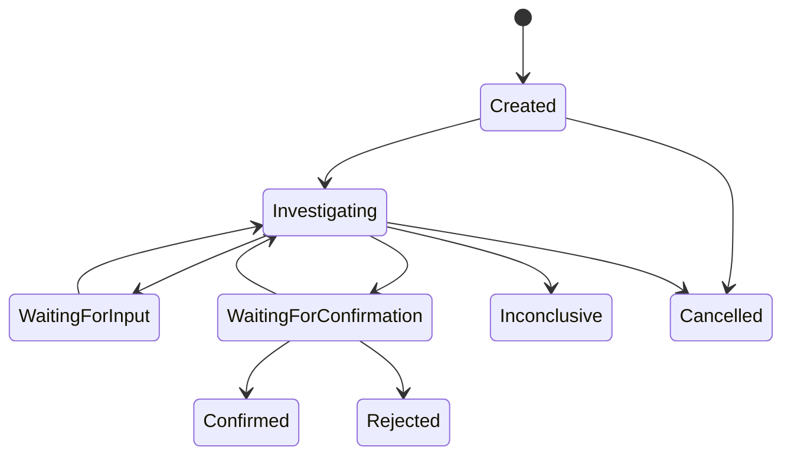

# Phase 0 实现规格说明：独立应用诊断闭环平台

> [返回文档导航](../README.md)

> 文档状态：待评审
> 实施形态：独立 Python 项目
> 阶段拆分：Phase 0A / Phase 0B / Phase 0C
> 设计基线：`独立应用诊断闭环平台设计文档.md`
> 参考约束：`ITOps参考实现复用矩阵.md`

---

## 1. 文档目的

本规格用于指导独立 Application Diagnosis Platform 的 Phase 0 开发。Phase 0 的目标不是接入生产日志、代码仓库或 ITOps，而是以较低的本地资源成本建立一个：

- 可独立启动；
- 具备标准 Tool Calling 循环；
- 以证据约束诊断结论；
- 可人工确认；
- 可自动评测；
- 能继续扩展日志、代码、Trace 和 ITOps Adapter；

的应用诊断最小系统。

本规格替代旧版“在 ITOps 中新增 ApplicationDiagnosisSpecialist”的 Phase 0 方案。旧方案中的 Specialist、Coordinator、ITOps 数据库和 serviceRegistry 均不属于本项目运行时。

---

## 2. 实施背景与约束

### 2.1 开发约束

- 主要由个人在业余时间开发；
- 本地设备为 16 GB 内存笔记本；
- 后端使用 Python；
- 前端推迟到 Phase 0C，0A/0B 使用 OpenAPI 页面和 API 验证；
- 模型通过外部 OpenAI-compatible API 调用，本地不运行大模型；
- Phase 0 使用 SQLite，不要求 Docker；
- 每个子阶段完成后都必须可启动、可测试、可演示。

### 2.2 学习与作品目标

项目重点不是再次验证基础 RAG 或多角色对话，而是展示以下生产型 Agent 工程能力：

- 标准 `tool_calls` / `tool_call_id` 协议；
- 领域状态与模型消息状态分离；
- 工具契约、参数校验、超时、取消和预算；
- 证据来源与结论引用；
- 结构化输出和失败恢复；
- 诊断质量评测与回归；
- Ports and Adapters 与独立运行边界。

---

## 3. Phase 0 总体范围


| 子阶段 | 核心问题 | 可演示结果 |
|---|---|---|
| Phase 0A | 系统和 Tool Loop 是否正确运行 | 提交日志文本，Agent 调用本地知识工具并返回结构化初步诊断 |
| Phase 0B | 结论是否可追溯、可人工校正 | 每条结论引用证据，用户可补充、确认或驳回 |
| Phase 0C | 质量是否可度量、项目是否可展示 | 自动评测、Markdown 报告和极简操作界面 |

### 3.1 Phase 0 明确不做

- 不连接 ITOps；
- 不修改或 import ITOps 源码；
- 不接 Nacos、Kubernetes、Loki、Elasticsearch、SSH；
- 不自动拉取 Git 仓库；
- 不接真实 Trace Backend；
- 不使用 Redis、Kafka 或外部任务队列；
- 不部署向量数据库；
- 不实现多 Agent；
- 不实现自动修复和生产变更；
- 不在本地运行大模型；
- 不把 LangGraph 作为底层 Tool Loop 的必要依赖。

---

## 4. 技术基线

### 4.1 后端技术栈

| 领域 | 选择 | 说明 |
|---|---|---|
| Python | Python 3.12+ | 使用类型标注和异步 I/O；具体补丁版本由项目锁文件固定 |
| 包管理 | `uv` 优先 | 支持锁文件、虚拟环境和快速安装；不可用时可退回标准方案 |
| API | FastAPI | 提供 OpenAPI，Phase 0A/0B 可直接用于交互验证 |
| Schema | Pydantic v2 | API、工具参数、工具结果和 LLM 输出统一校验 |
| ORM | SQLAlchemy 2.x | Repository Adapter 内使用，不泄漏到 Domain |
| Migration | Alembic | 所有 Schema 变化必须迁移化 |
| Database | SQLite | 开启 WAL；MVP 单进程使用 |
| HTTP | `httpx` | 模型 Adapter 的异步 HTTP 客户端 |
| Test | pytest | 单元、集成、契约和评测测试 |
| Lint/Format | Ruff | 保持个人项目工具链精简 |

不得让 FastAPI、SQLAlchemy 或具体模型 SDK 类型进入 Domain 层接口。

### 4.2 模型接入原则

- 第一版只实现一个 OpenAI-compatible Adapter；
- 业务代码只依赖 `LLMClient` Port；
- API Key 只从环境变量或本地 `.env` 获取，禁止入库和提交；
- 保存模型标识、请求耗时、Token 使用和终止原因；
- 不保存模型供应商返回的隐含推理过程；
- 模型不支持标准 Tool Calling 时启动失败或明确降级，不模拟成功。

### 4.3 本地资源目标

- API 与执行器 Phase 0 同进程运行；
- 空闲状态内存目标不超过 500 MB；
- 不启动数据库之外的常驻基础设施；
- 单次诊断默认总时限 120 秒；
- 单次诊断默认最多 6 轮模型调用、8 次工具调用；
- 预算必须可配置，测试中使用更小值。

---

## 5. 项目结构与依赖方向

建议创建独立 Git 仓库：

```text
application-diagnosis-platform/
├── src/
│   └── app_diagnosis/
│       ├── api/                    # FastAPI routes、DTO、异常映射
│       ├── application/            # 用例与事务边界
│       ├── domain/
│       │   ├── diagnosis/          # Case、状态、结论
│       │   ├── evidence/           # Evidence 与引用
│       │   └── knowledge/          # KnowledgeEntry
│       ├── agent/
│       │   ├── runtime/            # Tool Loop、预算、终止原因
│       │   ├── context/            # 上下文构建与裁剪
│       │   ├── strategies/         # DiagnosisStrategy
│       │   └── schemas/            # LLM 输入输出 Schema
│       ├── tools/                  # Tool Registry 与 Phase 0 工具
│       ├── ports/                  # LLM、Repository、时钟、ID 等接口
│       ├── adapters/
│       │   ├── llm/                # OpenAI-compatible Adapter
│       │   ├── persistence/        # SQLite / SQLAlchemy Adapter
│       │   └── knowledge/          # JSON、SQLite 知识实现
│       ├── reporting/              # Markdown 报告
│       ├── observability/          # 结构化日志和运行指标
│       └── bootstrap/              # 配置、装配、生命周期
├── migrations/
├── tests/
│   ├── unit/
│   ├── integration/
│   ├── contract/
│   └── evaluation/
├── evals/
│   ├── cases/
│   └── expected/
├── samples/
│   ├── logs/
│   └── knowledge/
├── docs/
│   └── adr/
├── .env.example
├── pyproject.toml
└── README.md
```

依赖规则：

```text
api/bootstrap/adapters → application → domain + ports
agent/tools            → domain + ports
adapters               → ports

domain ✗ FastAPI
domain ✗ SQLAlchemy
domain ✗ 模型 SDK
domain ✗ ITOps
```

使用架构测试或 import 扫描保证 `domain` 不依赖 `adapters`、`api` 和 ITOps 源码。

---

## 6. 核心契约

以下契约从 Phase 0A 建立，后续阶段优先新增实现而不是修改调用方。

### 6.1 LLM Port

```python
class LLMClient(Protocol):
    async def complete(
        self,
        messages: list[ChatMessage],
        tools: list[ToolDefinition],
        response_schema: type[BaseModel] | None,
        options: LLMCallOptions,
    ) -> LLMResponse:
        ...
```

要求：

- `ChatMessage` 支持 `system/user/assistant/tool`；
- assistant 消息可保存原始 `tool_calls`；
- tool 消息必须保存 `tool_call_id`；
- `LLMResponse` 包含文本、工具调用、模型、Token、finish reason；
- Adapter 负责供应商格式转换，Runtime 不依赖供应商响应类型。

### 6.2 Diagnostic Tool

```python
class DiagnosticTool(Protocol):
    name: str
    description: str
    input_model: type[BaseModel]
    output_model: type[BaseModel]
    risk_level: ToolRiskLevel
    timeout_seconds: float

    async def execute(
        self,
        arguments: BaseModel,
        context: ToolExecutionContext,
    ) -> ToolExecutionResult:
        ...
```

`ToolExecutionResult` 至少包含：

- `status`：success/failed/timeout/cancelled；
- `data`：经过 output schema 校验的结构化数据；
- `model_summary`：传回模型的有限文本；
- `evidence_drafts`：可转为证据的候选；
- `error_code` 与 `retryable`；
- `duration_ms`；
- `truncated`。

工具名采用 `domain__action`，Phase 0 工具命名为 `knowledge__search`。

### 6.3 Tool Registry

Registry 负责：

- 工具名唯一性校验；
- 根据 Strategy 生成允许工具列表；
- 输入输出 Schema 暴露；
- 权限、风险级别和启用状态检查；
- 禁止模型调用未注册或未授权工具。

Registry 不负责执行循环，不依赖 FastAPI 全局对象。

### 6.4 Diagnosis Strategy

```python
class DiagnosisStrategy(Protocol):
    problem_type: ProblemType

    def build_system_prompt(self, context: DiagnosisContext) -> str: ...
    def allowed_tool_names(self, context: DiagnosisContext) -> list[str]: ...
    def output_model(self) -> type[BaseModel]: ...
```

Phase 0 只实现 `GenericApplicationErrorStrategy`。未来增加超时、启动失败、HTTP 错误和性能诊断策略时，不改变 Tool Loop。

### 6.5 Repository Ports

至少定义：

- `DiagnosisRepository`；
- `AgentRunRepository`；
- `ToolRunRepository`；
- Phase 0B 增加 `EvidenceRepository`、`KnowledgeRepository`；
- Phase 0C 增加 `ReportRepository`、`EvaluationRunRepository`。

Repository 接口使用 Domain 类型，不返回 SQLAlchemy Entity。

---

## 7. 诊断领域模型

### 7.1 状态机

Phase 0 使用以下状态子集，并与完整设计保持兼容：



状态只能由 Application Use Case 转换；Tool 与 LLM Adapter 不得直接修改状态。

### 7.2 结构化诊断结果

```python
class DiagnosisFinding(BaseModel):
    statement: str
    status: Literal[
        "confirmed", "probable", "possible", "insufficient_evidence"
    ]
    evidence_ids: list[UUID] = []

class DiagnosisConclusion(BaseModel):
    symptom_summary: str
    facts: list[DiagnosisFinding]
    root_causes: list[DiagnosisFinding]
    recommendations: list[str]
    missing_information: list[str]
```

Phase 0A 中 `evidence_ids` 可以为空，但不得将无证据结论标记为 `confirmed`。Phase 0B 起，`confirmed/probable` 根因必须满足证据引用规则。

### 7.3 终止原因

每次 Agent Run 必须记录以下之一：

- `completed`；
- `waiting_for_input`；
- `inconclusive`；
- `max_rounds_reached`；
- `tool_budget_exhausted`；
- `time_budget_exhausted`；
- `cancelled`；
- `model_error`；
- `internal_error`。

预算耗尽、模型失败和工具全部失败不得记录为 `completed`。

---

## 8. Phase 0A：独立骨架与最小 Agent Loop

### 8.1 目标

建立独立 Python 项目，完成从创建诊断到 Agent 调用工具、生成并保存结构化初步结论的最小纵向链路。

### 8.2 交付范围

1. Python 工程、配置加载、结构化日志和健康检查；
2. SQLite、Alembic 和 Repository Adapter；
3. DiagnosisCase、AgentRun、ToolRun 基础模型；
4. OpenAI-compatible `LLMClient` Adapter；
5. Tool Registry 和标准 Tool Loop Runner；
6. `GenericApplicationErrorStrategy`；
7. 基于本地 JSON fixture 的 `knowledge__search`；
8. 创建、执行和查询诊断 API；
9. 3～5 个 Java 常见异常样例；
10. 单元测试、集成测试和启动文档。

### 8.3 Phase 0A 数据表

#### `diagnoses`

| 字段 | 说明 |
|---|---|
| `id` | UUID 主键 |
| `title` | 诊断标题 |
| `problem_type` | Phase 0 为 `generic_application_error` |
| `status` | 领域状态 |
| `symptom` | 用户描述 |
| `submitted_log` | 已脱敏的用户日志文本 |
| `conclusion_json` | 结构化初步结论，可为空 |
| `version` | 乐观锁版本 |
| `created_at` / `updated_at` | UTC 时间 |

#### `agent_runs`

| 字段 | 说明 |
|---|---|
| `id` / `diagnosis_id` | 主键和关联诊断 |
| `strategy` | 使用的诊断策略 |
| `status` | running/completed/failed/cancelled |
| `termination_reason` | 标准终止原因 |
| `model` | 实际模型标识 |
| `round_count` / `tool_call_count` | 已使用预算 |
| `input_tokens` / `output_tokens` | Token 统计，可为空 |
| `started_at` / `finished_at` | 执行时间 |
| `error_code` | 安全错误码，不保存密钥 |

#### `tool_runs`

| 字段 | 说明 |
|---|---|
| `id` / `agent_run_id` | 主键和关联 Run |
| `tool_call_id` | 模型调用 ID |
| `tool_name` | 工具名 |
| `arguments_json` | 校验后的参数 |
| `status` | success/failed/timeout/cancelled |
| `result_json` | 有大小限制的结构化结果 |
| `duration_ms` | 耗时 |
| `error_code` | 失败类别 |
| `created_at` | UTC 时间 |

Phase 0A 不单独保存完整消息历史；只保存可审计的 Run、ToolRun 和最终结构化结果。是否持久化可恢复消息快照在 Phase 1 再决策。

### 8.4 Phase 0A API

| Method | Path | 作用 |
|---|---|---|
| `GET` | `/health/live` | 进程存活 |
| `GET` | `/health/ready` | 数据库和必要配置就绪 |
| `POST` | `/api/v1/diagnoses` | 创建诊断 |
| `POST` | `/api/v1/diagnoses/{id}/runs` | 同步触发一次诊断 Run |
| `GET` | `/api/v1/diagnoses/{id}` | 查询诊断与最新结论 |
| `GET` | `/api/v1/diagnoses/{id}/runs` | 查询运行和工具调用摘要 |
| `POST` | `/api/v1/diagnoses/{id}/cancel` | 请求取消当前执行 |

Phase 0A 采用同步执行，但应用层接口不得假设一定在 HTTP 请求内完成。Phase 2 可将同一用例放入 Worker。

### 8.5 Tool Loop 算法

```text
读取 DiagnosisCase
  → Strategy 构建系统约束、输出 Schema 和工具白名单
  → 创建 AgentRun 与预算
  → 调用 LLM
  → 无 tool_calls：校验 DiagnosisConclusion
  → 有 tool_calls：保存 assistant tool_calls
  → 逐个校验工具名、权限和参数
  → 执行工具并保存 ToolRun
  → 将 tool_call_id 对应的工具结果加入消息
  → 下一轮
  → 保存终止原因和初步结论
```

强制行为：

- 处理同轮全部工具调用，不只执行第一个；
- 同轮工具 Phase 0A 可顺序执行，接口保留并发扩展能力；
- 单个工具失败不丢弃其他工具结果；
- 非法 JSON、未知工具、Schema 不通过均作为工具失败回传模型；
- 工具输出必须截断并标记，禁止无限进入上下文；
- 取消信号在模型调用前后和每个工具调用前检查；
- 最终输出 Schema 校验失败允许一次修正，仍失败则 `inconclusive`；
- 不根据调用轮数虚构置信度。

### 8.6 `knowledge__search` fixture 工具

输入：

```json
{
  "query": "NullPointerException PaymentService",
  "limit": 5
}
```

输出至少包含：`entry_id`、`title`、`summary`、`matched_terms`、`score`、`source`。

约束：

- 只读取 `samples/knowledge/*.json`；
- `limit` 范围 1～10；
- 每条摘要和总输出有字符上限；
- 不把知识内容当系统指令；
- Phase 0A 的 score 只表示字符串匹配分，不表示根因概率。

### 8.7 Phase 0A 测试

Tool Loop 单元测试至少覆盖：

- 无工具直接输出；
- 单工具调用；
- 同轮多工具调用；
- 未知工具；
- 非法参数 JSON；
- Schema 校验失败；
- 一个工具失败、其他工具成功；
- 工具超时；
- 模型超时；
- 主动取消；
- 最大轮数；
- 工具预算耗尽；
- 结构化结果首次校验失败后修正；
- `assistant.tool_calls` 和 `tool.tool_call_id` 历史正确。

集成测试使用 Fake LLM，不依赖外部网络。真实模型测试单独标记，默认测试命令不执行。

### 8.8 Phase 0A 验收

- 新仓库不安装、不启动 ITOps 即可运行；
- 一条命令启动 API，OpenAPI 可访问；
- Alembic 可从空数据库升级到最新版本；
- 一个样例能触发 `knowledge__search` 并形成结构化结论；
- ToolRun 可查询且包含工具参数、结果、耗时和状态；
- 所有预算和异常路径具有明确终止原因；
- Domain 不 import FastAPI、SQLAlchemy、模型 SDK 和 ITOps；
- 默认自动测试离线通过；
- README 能让新环境完成安装、迁移、启动和样例调用。

### 8.9 Phase 0A 后续扩展

- `LLMClient` 新增模型供应商 Adapter；
- `ToolRegistry` 新增日志、代码、Trace 工具；
- 同步 Run 用例迁移到 Worker，不修改 API Domain DTO；
- `GenericApplicationErrorStrategy` 增加具体问题策略；
- JSON Knowledge Adapter 在 0B 替换为 SQLite 实现。

---

## 9. Phase 0B：Evidence、知识检索与人工确认

### 9.1 目标

将“模型给出答案”升级为“系统基于可追踪证据提出结论，并接受人工校正”。

### 9.2 交付范围

1. Evidence Domain、持久化和查询；
2. 用户陈述、日志片段、知识条目三类证据；
3. SQLite Knowledge Repository 和种子数据；
4. 关键词/全文检索，不引入向量数据库；
5. 结论引用 Evidence ID；
6. 补充信息后重新诊断；
7. 确认、驳回、继续调查；
8. 最小审计事件；
9. 日志脱敏和不可信内容隔离测试。

### 9.3 Evidence 模型

| 字段 | 说明 |
|---|---|
| `id` / `diagnosis_id` | 主键和关联诊断 |
| `type` | user_statement/log_excerpt/knowledge_entry |
| `source` | user_input/local_knowledge |
| `source_reference` | 日志位置或知识 ID |
| `content` | 已脱敏、有限大小的内容 |
| `content_hash` | 去重和完整性校验 |
| `reliability` | low/medium/high，不等于结论置信度 |
| `metadata_json` | 行号、异常类、匹配词等 |
| `redaction_status` | not_required/redacted/rejected |
| `created_at` | UTC 时间 |

Phase 1 增加源码、远程日志和 Trace 时沿用该模型，通过 `type/source_reference/metadata` 扩展，不增加按来源拆分的结论模型。

### 9.4 证据引用规则

- `confirmed`：Phase 0 仅允许人工确认后使用；
- `probable`：至少引用一条与当前输入直接相关的日志或用户事实证据，知识条目不能单独支撑；
- `possible`：允许引用知识条目，但必须列出验证方法；
- `insufficient_evidence`：列出缺失信息，不得伪造 Evidence ID；
- 引用的 Evidence 必须属于当前 Diagnosis；
- 删除或失效证据时，相关结论需重新校验。

### 9.5 Knowledge 模型

知识状态至少包含 `candidate/confirmed/retired`。Phase 0B 的种子知识可以预置为 `confirmed`，但必须标注 `source=manual_seed`。

知识条目至少包含：

- 错误类型和适用范围；
- 现象；
- 常见原因；
- 验证步骤；
- 已知反例；
- 来源和状态；
- 创建、更新时间。

建议首批覆盖：

- `NullPointerException`；
- HTTP 500；
- HTTP/RPC timeout；
- `OutOfMemoryError`；
- `ConnectionRefused`；
- 数据库连接池耗尽；
- 配置缺失导致启动失败；
- 下游服务返回异常。

### 9.6 Phase 0B API 增量

| Method | Path | 作用 |
|---|---|---|
| `POST` | `/api/v1/diagnoses/{id}/supplements` | 补充信息并产生新证据 |
| `GET` | `/api/v1/diagnoses/{id}/evidence` | 查询证据 |
| `POST` | `/api/v1/diagnoses/{id}/confirmation` | 确认、驳回或要求继续调查 |
| `GET` | `/api/v1/knowledge` | 查询本地知识 |
| `POST` | `/api/v1/knowledge` | 本地管理员创建知识条目 |

Phase 0B 不建设完整 RBAC；写知识和确认动作通过本地身份标识并写审计事件。

### 9.7 人工确认

确认请求必须包含：

- 动作：confirm/reject/continue_investigation；
- 目标结论标识；
- 操作者；
- 备注；
- 可选的实际根因和验证方式。

人工确认不覆盖原始模型输出，而是追加 Confirmation 记录并驱动状态转换，保留完整历史。

### 9.8 Phase 0B 验收

- 每条 `probable` 根因均引用有效 Evidence ID；
- 仅命中知识条目时不得输出 `confirmed/probable`；
- 用户补充信息后产生新 Evidence，并可触发新 AgentRun；
- 确认、驳回、继续调查均符合状态机；
- 原始模型结论、人工反馈和最新结论可以区分；
- 日志中的 API Key、Token、密码等样例在进入模型前被脱敏；
- 日志内的“忽略系统提示”等文本被标为不可信数据，不改变系统约束；
- Knowledge Adapter 可以在不修改 Tool 和 Runtime 的情况下由 JSON 切换为 SQLite；
- 审计记录不包含密钥和完整敏感日志。

### 9.9 Phase 0B 后续扩展

- 关键词检索替换为全文、向量或混合检索；
- 增加日志、代码、Trace Evidence Provider；
- 人工确认演进为 HITL Workflow；
- confirmed 结果生成 candidate 知识，Phase 3 再做审核闭环；
- SQLite Repository 增加 PostgreSQL Adapter。

---

## 10. Phase 0C：评测、报告与极简界面

### 10.1 目标

建立可重复的质量基线和可展示的完整体验，判断诊断能力是否值得继续接入真实日志与代码。

### 10.2 交付范围

1. 30～50 个版本化诊断案例；
2. 自动评测 Runner；
3. 确定性指标和必要的人工评分；
4. Markdown 报告生成与下载；
5. 极简界面；
6. 模型调用、工具调用、Token、耗时摘要；
7. 完整演示脚本和项目文档。

### 10.3 评测案例格式

每个案例使用版本化 YAML/JSON 保存：

```yaml
id: java-npe-001
problem_type: generic_application_error
symptom: 支付接口返回 500
log_file: samples/logs/java-npe-001.log
expected:
  root_cause_keys:
    - missing-null-check
  required_evidence_types:
    - log_excerpt
  forbidden_claims:
    - database-corruption
  expected_missing_information: []
tags:
  - java
  - npe
```

评测输入不可包含预期答案正文，避免把答案泄漏给模型。

### 10.4 指标

| 指标 | 计算原则 |
|---|---|
| Root Cause Top-1 | 第一根因是否匹配标准根因 key |
| Root Cause Top-3 | 前三根因是否包含标准根因 key |
| Evidence Citation Precision | 有效证据引用 / 全部证据引用 |
| Unsupported Claim Rate | 无证据支持的事实性结论比例 |
| Missing Information Recall | 证据不足案例中是否正确请求关键信息 |
| Schema Valid Rate | 最终输出通过 Schema 的比例 |
| Tool Success Rate | 有效工具调用 / 全部工具调用 |
| Sensitive Leakage Rate | 输出中未脱敏敏感信息比例，目标为 0 |
| Cost/Latency | 每案例 Token、模型调用次数和耗时 |

不使用模型自评置信度替代上述指标。LLM-as-a-Judge 如后续加入，只作为辅助指标并固定 Judge 配置。

### 10.5 报告内容

Markdown 报告至少包含：

- 诊断基本信息和状态；
- 用户现象与脱敏摘要；
- 事实；
- 根因候选及状态；
- 每条结论的证据引用；
- 建议的下一步验证；
- 缺失信息；
- 工具调用摘要；
- 人工确认记录；
- 模型、运行时间和预算摘要；
- 免责声明：诊断平台不执行修复。

报告模板只读取领域查询模型，不直接查询 SQLAlchemy Entity，未来可以新增 HTML/PDF Exporter。

### 10.6 极简界面

Phase 0C 界面只需要：

1. 创建诊断：标题、现象和日志粘贴框；
2. 查看诊断状态和运行摘要；
3. 查看结论与证据；
4. 补充信息；
5. 确认、驳回、继续调查；
6. 下载 Markdown 报告。

界面可使用轻量方案实现，但必须只通过版本化 API 访问后端，不能直接读取 SQLite。复杂前端框架、登录中心和可视化拓扑推迟。

### 10.7 Phase 0C 验收

- 评测集不少于 30 个案例，并覆盖正常、歧义、证据不足和恶意输入；
- 评测命令可重复运行并生成 JSON/Markdown 汇总；
- 指标按模型和 Prompt 版本保存，支持基线比较；
- 敏感信息泄漏率为 0；
- 每个诊断可生成可阅读的 Markdown 报告；
- 极简界面完成一条端到端流程；
- README 包含架构、启动、评测、演示和限制说明；
- 不依赖 ITOps、外部日志系统或本地大模型即可完成演示。

### 10.8 Phase 0C 后续扩展

- Evaluation Runner 纳入 CI 和 Prompt 回归门禁；
- Markdown Exporter 增加 HTML/PDF Adapter；
- 极简界面演进为独立 Web；
- 运行摘要接入 OpenTelemetry；
- 案例集扩展为真实脱敏故障样本和不同语言/框架分类。

---

## 11. 跨阶段安全要求

### 11.1 输入与上下文

- 用户日志和知识内容均属于不可信数据；
- 进入模型前执行大小限制、控制字符过滤和脱敏；
- 系统提示必须明确区分指令与证据数据；
- 不允许日志内容动态改变工具白名单、预算或权限；
- 原始输入若因敏感信息被拒绝，返回明确错误，不静默丢失。

### 11.2 工具

- Phase 0 只有只读工具；
- 工具只接受结构化参数；
- 禁止 Shell、任意路径和任意 URL；
- 每次执行有超时、输出大小和结果条数限制；
- 错误回传模型前进行脱敏；
- 工具结果不能冒充 system 或 assistant 消息。

### 11.3 配置与凭据

- `.env` 必须加入 `.gitignore`；
- 提供无秘密的 `.env.example`；
- 日志不打印 API Key、Authorization Header 和完整请求；
- 数据库不保存模型 API Key；
- 启动时校验必要配置并快速失败。

---

## 12. 可观测性与审计

结构化日志至少包含：

- `request_id`；
- `diagnosis_id`；
- `agent_run_id`；
- `tool_run_id`；
- 事件名称；
- 持续时间；
- 状态和安全错误码。

不得记录完整 Prompt、完整日志、密钥和未脱敏工具输出。需要排查时使用开发配置显式开启有限内容，并保持脱敏。

Phase 0B 起记录以下审计事件：

- diagnosis.created；
- diagnosis.run_started / run_finished；
- diagnosis.supplemented；
- diagnosis.confirmed / rejected / reopened；
- knowledge.created / status_changed；
- report.generated。

---

## 13. 配置项

建议以环境变量为主，并映射为强类型 Settings：

```text
APP_ENV
APP_DATABASE_URL
APP_LOG_LEVEL
APP_LLM_BASE_URL
APP_LLM_API_KEY
APP_LLM_MODEL
APP_LLM_TIMEOUT_SECONDS
APP_AGENT_MAX_ROUNDS
APP_AGENT_MAX_TOOL_CALLS
APP_AGENT_TOTAL_TIMEOUT_SECONDS
APP_TOOL_OUTPUT_MAX_BYTES
APP_INPUT_LOG_MAX_BYTES
```

测试配置不得依赖开发者本机 `.env`。

---

## 14. 开发顺序与里程碑

### 14.1 Phase 0A 建议顺序

1. 仓库、工具链、配置和健康检查；
2. Domain 类型、状态和 Ports；
3. SQLite Adapter 与迁移；
4. LLM 类型、Fake LLM 与真实 Adapter；
5. Tool Contract、Registry 和 fixture knowledge 工具；
6. Tool Loop Runner 与失败路径测试；
7. Application Use Case 和 API；
8. 真实模型手动验证、README 和样例。

### 14.2 Phase 0B 建议顺序

1. Evidence 与 Knowledge Domain；
2. 数据迁移和 Repository；
3. 输入脱敏、日志片段提取；
4. SQLite Knowledge Adapter；
5. 结论引用校验；
6. 补充和人工确认用例；
7. 安全测试与审计。

### 14.3 Phase 0C 建议顺序

1. 案例 Schema 和首批 10 个案例；
2. Evaluation Runner 与确定性指标；
3. 案例扩展到 30～50 个；
4. Markdown Report Exporter；
5. 极简界面；
6. 完整演示和基线报告。

个人业余开发不设置刚性日期。每个步骤控制为可在若干晚间完成的独立任务，并在主分支持续保持可运行。

---

## 15. Phase 1～5 扩展映射

| 后续能力 | Phase 0 承载接口 | 扩展方式 |
|---|---|---|
| 自动日志取证 | DiagnosticTool、Evidence | 新增 `app_log__search` 和 LogSourcePort/Adapter |
| 固定 commit 代码取证 | DiagnosticTool、Evidence | 新增 CodeSnapshotPort、`code__search/read_range` |
| 后台任务与恢复 | Application Use Case、AgentRun | 增加 QueuePort、Worker 和 checkpoint，不改变 Domain ID |
| 服务目录 | DiagnosisContext | 增加 ApplicationService Repository 和上下文构建器 |
| 主动扫描 | Diagnosis 创建用例 | Scanner 通过同一应用用例创建 Diagnosis |
| Trace | DiagnosticTool、Evidence | 新增 TracePort/Adapter 和 `trace__search` |
| 向量/混合知识检索 | KnowledgeRepository | 新增实现，保持 `knowledge__search` 输出契约 |
| LangGraph 长流程 | DiagnosisStrategy/Application 层 | 用于阶段编排，不替换 Domain 与 Tool Contract |
| ITOps 集成 | Ports | 新增独立 Integration Adapter 和版本化 API 契约 |
| 修复候选 | Confirmed Diagnosis | 新增 RemediationPort；诊断平台仍不执行生产变更 |

任何新能力若要求 Domain 直接依赖外部系统，应先写 ADR 并重新评审，而不是绕过 Port。

---

## 16. ITOps 参考实现使用规则

开发每个模块前必须查阅《ITOps参考实现复用矩阵》对应章节，并在实现说明或 ADR 中记录：

- 参考了哪些文件和行为；
- 哪些部分独立重写；
- 哪些已知问题和耦合明确舍弃；
- 如何验证没有形成 ITOps 运行时依赖。

Phase 0 重点参考模块：

1. LLM Runtime；
2. Tool Loop Runtime；
3. Diagnostic Tool Registry；
4. Application Diagnosis Domain；
5. Evidence Core；
6. Knowledge Core；
7. Persistence 与迁移；
8. DI 与生命周期；
9. API 和前端壳。

禁止：

- 复制 Specialist/Coordinator 作为新平台核心；
- import ITOps TypeScript 源码；
- 连接 ITOps SQLite；
- 沿用全局 DB Proxy 和 serviceRegistry；
- 把模拟 Provider 当真实能力；
- 机械翻译 TypeScript 文件后宣称独立实现。

---

## 17. Definition of Done

任一 Phase 0 模块只有同时满足以下要求才算完成：

- 接口和职责与本规格一致；
- 关键正常路径和失败路径有自动测试；
- 没有 ITOps 运行时依赖；
- 没有秘密、敏感日志和完整 Prompt 泄漏；
- 超时、取消、预算和错误语义明确；
- 数据变更包含可重复 migration；
- 对外 Schema 有版本或兼容策略；
- README 或模块文档同步更新；
- 记录参考实现来源和独立重写差异；
- 当前阶段可单独启动和演示；
- 没有用 Mock 结果冒充真实集成能力。

---

## 18. 最终 Phase 0 验收场景

```text
1. 开发者在一台普通笔记本上安装依赖并执行迁移。
2. 启动 API，不需要启动 ITOps 或其他基础设施。
3. 用户提交 Java 服务故障现象和一段异常日志。
4. 系统脱敏并创建用户事实和日志证据。
5. Agent 根据 Strategy 调用 knowledge__search。
6. ToolRun、知识证据和 AgentRun 被持久化。
7. Agent 输出事实、根因候选、证据引用、建议和缺失信息。
8. 用户补充信息，系统创建新的 Evidence 和 AgentRun。
9. 用户确认或驳回结论，状态机正确变化。
10. 系统生成 Markdown 报告。
11. Evaluation Runner 对 30～50 个案例生成质量、成本和延迟基线。
12. 全流程无 ITOps 依赖，敏感信息泄漏率为零。
```

完成上述场景后，Phase 0 才进入完成状态。之后优先进入 Phase 1 的日志和固定 commit 代码取证，而不是优先增加多 Agent 或复杂界面。
