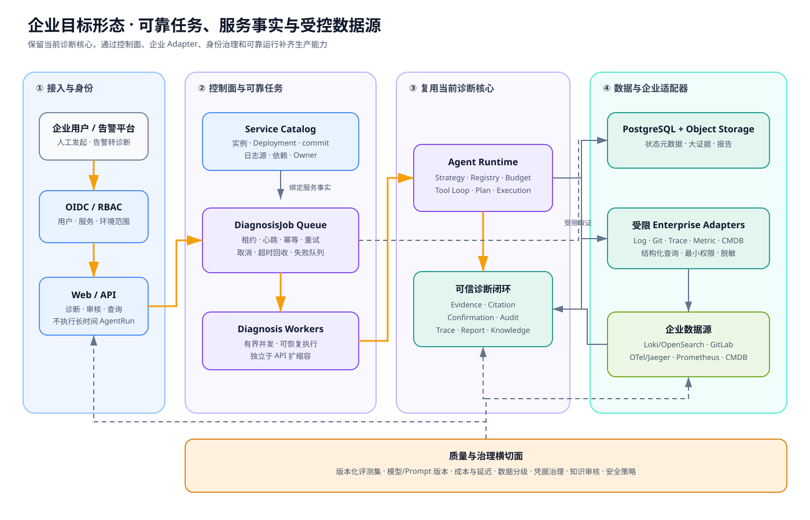

# 从本地诊断 Agent 到企业平台的演进设计

> 文档目标：说明当前个人电脑上的参考实现如何演进为企业生产系统；明确哪些核心代码可以复用、哪些能力需要新增、哪些事项必须依赖企业基础设施验证。本文是演进设计，不把未实现能力包装成已交付功能。

## 1. 当前结论

当前项目已经完成“证据驱动诊断闭环”的增强型 MVP：

```text
ServiceProfile
→ DiagnosisCase
→ 有界 Agent Loop
→ 受限日志/源码/配置/健康工具
→ Evidence 持久化与引用校验
→ Trace / Report
→ 人工确认
→ Knowledge candidate
```

它验证了最关键的产品和技术假设：LLM 可以在确定性工具边界内完成多轮调查，并把候选结论约束为可追踪、可审核的诊断事实。

企业化的主要工作不是重写 Agent，而是补齐四个生产控制面：

1. 服务、环境、实例、Deployment 和 deployed commit 的事实对齐；
2. API 与 Worker 分离后的可靠异步执行；
3. 日志、代码、Trace、Metric、CMDB 等企业数据源 Adapter；
4. 身份权限、质量评测、成本、安全和知识审核治理。

## 2. 设计原则

### 2.1 保留可信诊断核心

以下现有能力应尽量保持稳定：

- `DiagnosisCase` 状态机；
- `ToolLoopRunner` 的预算和失败语义；
- `DiagnosticToolRegistry`；
- Tool Contract；
- Evidence、Redaction 和 CitationPolicy；
- AgentRun、ToolRun、Trace、Audit 和 Report；
- Confirmation 与 candidate 知识审核。

### 2.2 企业能力通过控制面与 Adapter 增量接入

模型不直接接触 Loki DSL、Git 凭据、Kubernetes Token 或任意 URL。企业数据源继续通过结构化 Port/Adapter 接入，服务目录负责确定资源范围。

### 2.3 不在个人电脑上伪装生产基础设施

本地可以实现并测试领域模型、接口契约、Fake Adapter、幂等规则和状态机；PostgreSQL 高可用、OIDC、Vault、对象存储、真实日志平台和多 Worker 故障恢复必须在对应企业环境验证。

### 2.4 默认只读，修复权外置

诊断平台输出修复候选，不持有生产执行权限。所有状态变更交给外部自动化平台，并经过独立审批、权限和审计。

## 3. 当前架构基线


当前优势：

- 单机即可运行和回归；
- 模型、知识、工具和数据库实现可替换；
- 服务显式授权本次工具资源；
- 失败能够保留 AgentRun、ToolRun 和 Evidence；
- 自动测试默认不依赖外部模型。

当前限制：

- SQLite 与同步 API；
- `_active_tasks` 只保护单进程；
- ServiceProfile 缺少运行实例和部署版本；
- 日志、源码、配置来自本地目录；
- 没有真实业务 Trace 和 Metric；
- actor/permission 仍是本地最小实现；
- 缺少统计意义上的诊断质量指标。

## 4. 企业目标架构



图的主链路是：

```text
用户或告警平台
→ OIDC / RBAC
→ Web / API 创建 DiagnosisJob
→ 可靠队列分配 Worker
→ Worker 加载 Service / Deployment 上下文
→ 复用 Agent Runtime 与 Evidence 闭环
→ 受限 Adapter 查询企业数据源
→ PostgreSQL / Object Storage 持久化事实
→ 人工审核、质量评测和知识沉淀
```

Graphviz 可维护源文件：[enterprise-target-architecture.dot](../01-architecture/enterprise-target-architecture.dot)。

## 5. 服务事实模型

企业诊断首先要保证“数据属于正确服务和版本”。建议从当前 `ServiceProfile` 拆出以下对象：

### 5.1 Service

| 字段 | 说明 |
|---|---|
| id/name | 稳定服务身份 |
| owner_team | 负责人团队 |
| repository_ref | 代码仓库引用 |
| criticality | 服务等级 |
| tags | 分类标签 |

### 5.2 ServiceEnvironment

同一服务在 dev、test、staging、production 中是不同诊断范围。环境对象保存日志源、Trace Source、Metric Source、权限策略和数据保留策略。

### 5.3 RuntimeInstance

表示 Pod、容器、虚拟机或进程实例，至少记录 instance_id、启动时间、区域、节点和当前 Deployment。

### 5.4 Deployment

至少记录：

- deployed commit；
- image digest；
- 构建版本；
- 部署开始/完成时间；
- 配置版本；
- 变更单引用。

源码 Evidence 必须关联 Deployment。不能用开发分支解释生产日志。

### 5.5 ServiceDependency

记录上游、下游、协议、环境、来源和置信度。人工/CMDB 关系与 Trace 观察关系不能互相覆盖，应保留来源。

## 6. 可靠异步执行设计

### 6.1 为什么需要 Job

LLM 和外部工具调用耗时长，不应占用 HTTP 请求和数据库长事务。新增：

```text
DiagnosisJob
├─ diagnosis_id
├─ status: pending/running/succeeded/failed/cancelled
├─ attempt
├─ max_attempts
├─ idempotency_key
├─ worker_id
├─ lease_until
├─ heartbeat_at
├─ next_retry_at
└─ last_error_code
```

### 6.2 Worker 领取协议

1. 原子更新 pending Job 为 running；
2. 写入 worker_id 和 lease_until；
3. 周期性更新 heartbeat；
4. 每个外部副作用使用幂等键；
5. 成功后完成 Job；
6. 可重试失败进入 pending + next_retry_at；
7. 不可重试失败进入 failed；
8. lease 过期任务由恢复器重新调度。

### 6.3 取消语义

取消不是删除记录。API 写入 cancellation_requested，Worker 在轮次边界和工具执行前检查；已发生 ToolRun/Evidence 继续保留。

### 6.4 推荐起步实现

先使用 PostgreSQL 数据库队列和 `SELECT ... FOR UPDATE SKIP LOCKED`，验证任务状态和恢复语义；只有吞吐和隔离需求明确后再适配 Redis、RabbitMQ 或 Kafka。

## 7. 数据存储演进

| 数据 | 推荐存储 | 原因 |
|---|---|---|
| Diagnosis/Job/Run/Confirmation | PostgreSQL | 事务、索引和一致性 |
| Evidence 元数据/hash | PostgreSQL | 查询与引用校验 |
| 大日志/代码快照/附件 | Object Storage | 避免关系库膨胀 |
| Markdown/PDF 报告文件 | Object Storage | 版本化交付 |
| Audit 摘要 | PostgreSQL + 企业审计汇聚 | 本地查询和合规 |

Object Storage 引用需要记录 bucket/key、hash、大小、MIME type、加密信息、保留期限和访问级别。

## 8. 企业 Adapter 设计

### 8.1 LogSource Adapter

模型只提交：日志源 ID、时间范围、关键词、上下文行数、实例过滤和最大结果数。Adapter 负责生成后端查询，不接受任意 Loki/OpenSearch/Splunk DSL。

### 8.2 Git/Code Snapshot Adapter

根据 Deployment.deployed_commit 创建只读快照。`code__search` 和 `code__read` 契约保持不变，底层从本地工作区切换到缓存快照。

### 8.3 Trace Adapter

对接 OpenTelemetry、Jaeger 或 SkyWalking，返回真实 span、服务、实例、时间和错误状态。真实 Trace 与 requestId 日志关联必须使用不同 EvidenceType 和 UI 标识。

### 8.4 Metric Adapter

只允许预定义指标和参数化时间窗口，不允许模型提交任意 PromQL。首批指标限定错误率、延迟分位数、CPU、内存、线程池和连接池。

### 8.5 CMDB/Service Discovery Adapter

Nacos/Kubernetes 只能提供实例发现，不能单独回答日志源、仓库和 deployed commit。同步结果先进入 Service Catalog，再由人工或规则补齐映射。

## 9. 身份、安全与合规

### 9.1 身份模型

- OIDC 用户；
- Group/Team；
- Service Account；
- 服务和环境级 Role；
- Tool Permission；
- 数据敏感级别。

### 9.2 授权示例

```text
log:read(service=order-service, environment=test, max_range=2h)
code:read(repository=order-service, commit=deployed_commit)
health:read(target=order-service-test)
knowledge:review(team=order-team)
```

### 9.3 凭据

凭据存入 Vault/KMS/企业 Secret Manager，只把短期令牌交给 Adapter。不得把凭据写入 ServiceProfile、Prompt、Evidence、Trace 或 Audit。

### 9.4 模型数据治理

记录每个模型供应商的数据保留、地域、训练使用政策和最大敏感等级。生产日志进入外部模型前必须经过脱敏、大小限制和策略判定；高敏环境应使用企业托管模型或禁止外发。

## 10. 质量评测与运营指标

### 10.1 版本化评测案例

每个案例保存：输入、服务上下文、可用工具、期望 Evidence、可接受根因、禁止结论和预算。版本需要绑定模型、Prompt、Strategy 和 Tool Schema。

### 10.2 核心指标

- 根因命中率；
- Evidence 引用正确率与召回率；
- unsupported claim 比例；
- 人工确认/驳回率；
- 平均轮次和工具数；
- P50/P95 延迟；
- 单次诊断 Token 与费用；
- Adapter 错误率；
- Job 重试和超时率。

测试通过只证明工程行为稳定，不代表诊断准确率。

## 11. 知识闭环

当前已支持：

```text
confirmed Diagnosis
→ 显式生成 KnowledgeEntry(candidate)
→ 人工 change_status 为 confirmed/retired
```

企业化还需增加：

- 来源 Diagnosis/Evidence 强关联；
- 服务、环境和版本适用范围；
- 故障签名和验证步骤；
- 审核人和审核意见；
- 命中次数、成功/失败反馈；
- 过期策略和 retired 原因；
- 相似候选去重。

自动流程只能创建 candidate，禁止模型直接生成 confirmed 知识。

## 12. 诊断到修复候选

未来流程：

```text
已确认诊断
→ RemediationProposal
→ 风险评估
→ 外部 ITOps/自动化平台
→ 人工审批
→ dry-run / 执行
→ 修复验证 Evidence
→ 结果回写诊断与知识
```

诊断平台不直接持有生产执行凭据。失败补偿和回滚属于外部执行平台职责。

## 13. 分阶段实施路线

### E1：服务事实增强

实现 Service、Environment、Deployment、RuntimeInstance、Dependency，以及服务历史诊断和健康摘要。

验收：任何源码/日志 Evidence 都能解释所属服务、环境、时间、实例和部署版本。

### E2：可靠 Job 与 PostgreSQL

实现 Job Domain、数据库队列、Worker、租约、心跳、取消和重试。

验收：Worker 在 LLM 调用前后随机退出，任务可以恢复且不会产生重复 ToolRun/Evidence。

### E3：首批真实 Adapter

只接一个日志平台和一个代码平台，完成 deployed commit 快照。

验收：固定生产脱敏样本可以从远程日志定位到正确版本源码，模型不能扩大查询范围。

### E4：OIDC、RBAC 与凭据治理

验收：无权限用户无法查询服务、Evidence 或调用工具；审计中不出现凭据和完整敏感内容。

### E5：Trace、Metric 与依赖拓扑

验收：跨服务案例能够区分真实 Trace 和推测日志关联，并展示来源与置信度。

### E6：质量和知识运营

验收：模型或 Prompt 变更前后能运行相同评测集；confirmed 诊断生成 candidate，审核、命中和失效均可追踪。

### E7：ITOps 与修复候选集成

验收：平台只能提交候选，未经外部审批不能执行生产变更；修复结果以 Evidence 回写。

## 14. 个人电脑能验证与不能验证的边界

| 能在本地验证 | 必须在企业环境验证 |
|---|---|
| Job 状态机和 Fake Queue | 多 Worker 长时间稳定性 |
| 幂等键和重复消息测试 | 消息中间件故障与网络分区 |
| PostgreSQL 单实例兼容测试 | 高可用、备份、容灾和性能 |
| Fake Log/Git/Trace Adapter | 企业平台权限、限流和真实数据规模 |
| RBAC 领域规则 | 企业 OIDC、组织结构和审计合规 |
| 脱敏与 Prompt Injection 测试 | 公司真实敏感数据策略 |
| 固定模型评测集 | 生产故障分布和长期质量 |
| ObjectStorage Port/Fake | 企业对象存储生命周期和加密 |

本地目标是证明接口、状态和边界正确；企业环境目标是证明容量、可靠性、权限和合规成立。

## 15. 主要风险与缓解

| 风险 | 后果 | 缓解 |
|---|---|---|
| 日志与代码版本不一致 | 根因错误 | 强制 Deployment/deployed_commit |
| 重复任务执行 | 成本和重复 Evidence | 租约、幂等键、唯一约束 |
| 模型无依据推测 | 误导用户 | CitationPolicy、评测、人工确认 |
| 日志提示注入 | 调查方向被操纵 | 不可信隔离、本地工具闸门、红队案例 |
| 知识自动污染 | 错误长期强化 | candidate 审核和效果反馈 |
| Adapter 越权查询 | 数据泄露 | 结构化查询、资源 Scope、审计 |
| 模型风暴 | 成本和供应商限流 | 队列、有界并发、预算和熔断 |
| 大证据拖垮数据库 | 性能退化 | Object Storage、摘要和保留策略 |

## 16. 对当前代码的影响范围

### 可复用

- Domain：Diagnosis、Evidence、Confirmation、Knowledge；
- Runtime：Strategy、Registry、Budget、Tool Loop；
- Tool Contract 与大部分安全规则；
- Trace、Report 和 Evaluation 的概念模型。

### 需要扩展

- ServiceProfile → 服务事实模型；
- ToolResourceResolver → 企业资源授权解析；
- Repository → PostgreSQL 与分页；
- AgentRun → Job/Worker 关联和恢复信息；
- Audit → 企业身份和外部审计引用。

### 需要新增

- Job Queue Port/Adapter；
- Worker Runtime；
- ObjectStorage Port；
- Identity/Authorization Port；
- Log/Git/Trace/Metric/CMDB Adapter；
- RemediationPort；
- 生产级指标和告警。

## 17. 架构决策建议

真正进入企业实施前，应新增 ADR：

1. API 与 Worker 的任务一致性边界；
2. PostgreSQL 数据库队列还是消息中间件；
3. Evidence 大对象存储策略；
4. Service/Environment/Deployment 标识来源；
5. 外部模型数据分级策略；
6. 企业 Adapter 的认证和资源 Scope；
7. 修复权限为什么外置。

## 18. 最终验收定义

企业版不能以“模型成功返回答案”作为完成标准。至少需要：

- 任务可恢复、可取消、可幂等；
- 数据与服务、环境、实例和部署版本对齐；
- 用户和工具访问有真实权限边界；
- Evidence 来源和引用可审计；
- 真实模型质量、成本和延迟可量化；
- 日志、代码、Trace 和指标查询均受限；
- 知识必须经过审核；
- 修复只能提交外部审批候选；
- 平台自身具备监控、告警、备份和容灾方案。

当前项目的价值，是已经把最应该复用的可信诊断核心做出来。企业化不应推翻这套核心，而应围绕它补齐服务事实、可靠任务、企业 Adapter 和治理控制面。
