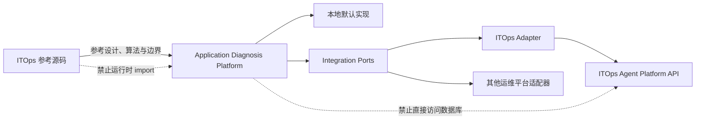
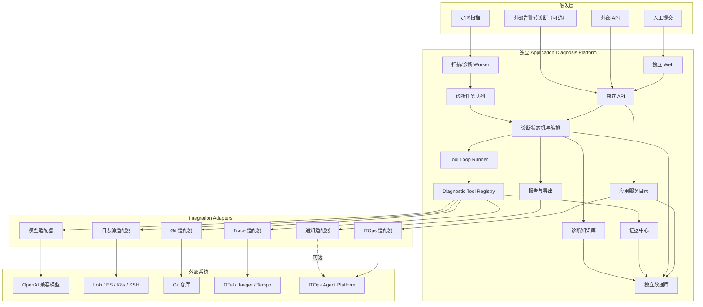
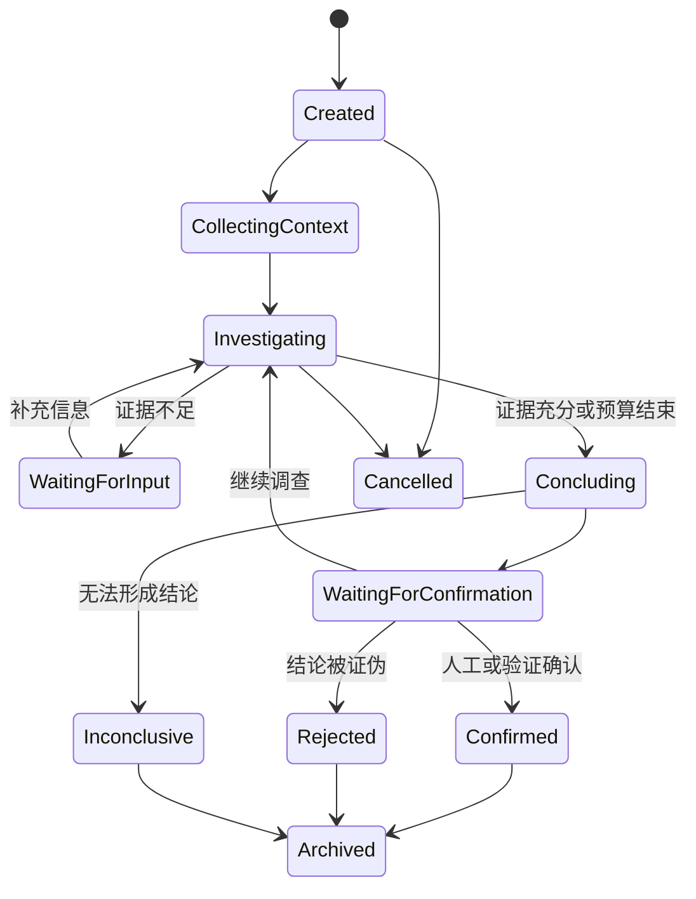
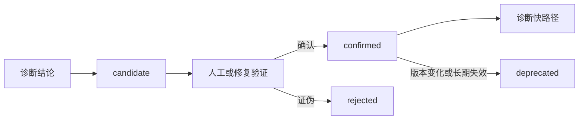
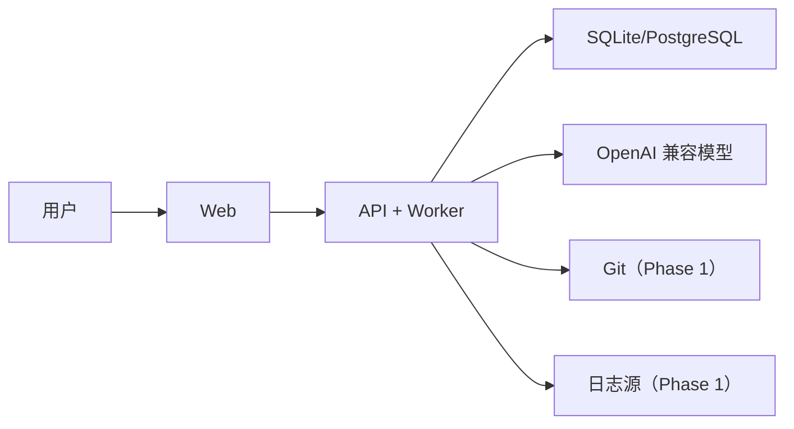
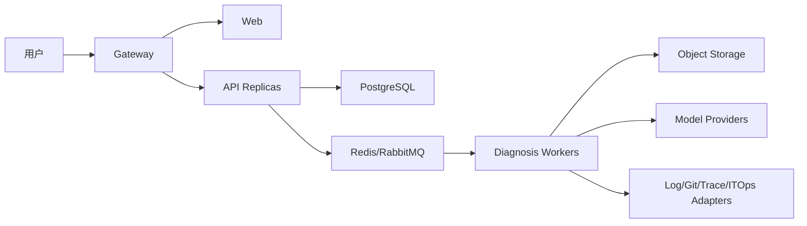

# 独立应用诊断闭环平台设计文档

> [返回文档导航](../README.md)

## 参考 ITOps 实现 · 独立运行 · 可选集成

> 文档状态：设计稿，待评审，暂不开发
> 修订日期：2026-07-12
> 目标系统：Application Diagnosis Platform
> 参考系统：ITOps Agent Platform 3.0.5

---

## 1. 文档定位

本设计描述一个可独立部署、独立存储、独立发布的应用诊断闭环平台。新平台吸收 ITOps Agent Platform 中已经验证的 AI、知识检索、工具调用、工作流审批、报告、通知、安全和审计思路，并以其源码作为开发参考，但不在运行时依赖 ITOps 内部模块。

完整的源码参考路径、可参考内容、禁止照搬内容和模块验收要求，见：[ITOps参考实现复用矩阵.md](./ITOps参考实现复用矩阵.md)。

### 1.1 核心决策

1. 新平台拥有独立 API、Web、Worker 和数据库。
2. 新平台不 import ITOps 源码，不共享 SQLite 数据库和全局单例。
3. ITOps 源码主要用于思路复用和参考重写，少量纯算法可抽取改造。
4. 新平台提供本地默认实现，不接入 ITOps 也可以完整运行。
5. 与 ITOps 的资产、凭据、通知和自动修复能力通过可选 Adapter 集成。
6. 应用诊断默认只读；自动修复属于外部能力，必须经过独立审批。
7. 诊断结论必须基于可追溯证据，明确区分事实、推测和信息不足。

### 1.2 与 ITOps 的关系



---

## 2. 建设目标与非目标

### 2.1 建设目标

- 支持用户提交现象和日志进行交互式辅助诊断。
- 支持从受控日志源、代码快照、Trace、指标和知识库循环取证。
- 支持接口报错、服务异常、数据异常、跨服务和性能问题五类策略。
- 输出可复查的现象、根因、证据链、置信度、建议和待确认信息。
- 支持诊断暂停、补充信息、取消、超时和进程重启后恢复。
- 支持主动扫描、错误签名去重和诊断任务排队。
- 支持诊断结论经人工或修复验证后沉淀为正式知识。
- 通过适配器将修复候选提交给 ITOps 或其他自动化平台。

### 2.2 非目标

- 首期不建设日志、指标或 Trace 存储系统。
- 不把 requestId 日志关联包装成真实分布式追踪。
- 不允许 AI 生成任意 Shell 或 SQL 交给执行层。
- 不要求部署 ITOps 后才能运行本平台。
- 不把当前 ITOps 的两套工作流引擎复制到新平台。
- 不在诊断核心中直接实现重启、修改配置、写库或发布代码。

---

## 3. 复用策略

### 3.1 四级复用方式

| 级别 | 含义 | 示例 |
|---|---|---|
| A：抽取改造 | 通用且低耦合的算法、类型 | 重试、脱敏、熔断、FC 类型 |
| B：参考重写 | 逻辑有价值但绑定 ITOps 基础设施 | LLM Runtime、报告、通知、迁移 |
| C：思路复用 | 与 ITOps 领域高度耦合 | Specialist、工作流、告警关联 |
| D：禁止复用 | 模拟、兼容层或架构债 | 模拟 HTTP Provider、全局 DB Proxy |

### 3.2 复用边界

```text
业务方法论             高度复用
通用算法与协议类型     选择性抽取
LLM、通知、报告         参考后重写
工作流、Agent、告警关联 复用思想
数据库与领域模型       独立设计
运行时与部署           完全独立
ITOps 业务能力          通过 Adapter 接入
```

### 3.3 禁止的依赖方式

新平台核心代码禁止：

- 通过相对路径引用 ITOps 源码；
- 直接连接 ITOps SQLite；
- 共享 ITOps JWT Secret；
- 使用 ITOps Repository 作为本地数据层；
- 依赖 ITOps `serviceRegistry`、全局 DB Proxy 或服务单例；
- 将 ITOps 内部未发布接口视为稳定契约。

---

## 4. 排障方法论

### 4.1 循环取证

```text
理解现象
  → 建立待验证假设
  → 选择最小取证动作
  → 获取并保存证据
  → 支持或排除假设
  → 继续取证、请求信息或形成结论
```

### 4.2 业务流程优先

诊断前先理解入口、业务 Service、数据访问、远程调用、缓存和异步消息路径。代码证据必须与目标环境实际部署 commit 对齐。

### 4.3 事实与推测分离

| 状态 | 含义 |
|---|---|
| `confirmed` | 有直接证据或修复验证 |
| `probable` | 多条证据支持但尚未验证 |
| `possible` | 待验证假设 |
| `insufficient_evidence` | 证据不足，不能判断 |

### 4.4 经验快路径

历史经验只作为调查起点。只有状态为 `confirmed`、版本与环境适用且近期验证有效的知识，才可以触发快路径。

### 4.5 安全只读

- 日志查询使用预登记日志源，不接受任意路径。
- 数据库只允许预定义只读动作。
- Git 只访问允许仓库并固定 commit。
- 工具输出执行大小限制、脱敏和提示注入隔离。
- 修复建议不得在诊断循环内自动执行。

---

## 5. 总体架构



### 5.1 运行单元

| 运行单元 | 职责 |
|---|---|
| Web | 诊断、证据、知识审核和服务目录界面 |
| API | HTTP 接口、认证授权、状态机、查询 |
| Worker | 扫描、异步诊断、工具执行和报告生成 |
| Database | 诊断、证据元数据、知识、配置和审计 |
| Object Storage（可选） | 大日志、原始证据和报告文件 |

MVP 可以将 API 和 Worker 部署在同一进程，但代码边界与队列契约应预先独立。

---

## 6. 建议代码结构

```text
application-diagnosis-platform/
├── apps/
│   ├── api/
│   ├── web/
│   └── worker/
├── packages/
│   ├── diagnosis-domain/
│   ├── llm-runtime/
│   ├── tool-runtime/
│   ├── evidence-core/
│   ├── knowledge-core/
│   ├── reporting/
│   ├── audit-core/
│   ├── integration-contracts/
│   └── shared/
├── integrations/
│   ├── itops-agent-platform/
│   ├── nacos/
│   ├── source-code/
│   ├── log-sources/
│   ├── tracing/
│   ├── notifications/
│   └── credentials/
├── migrations/
├── docker/
└── docs/
```

依赖方向：

```text
apps → domain/application → integration-contracts
integrations → integration-contracts

domain ✗ integrations
domain ✗ ITOps
domain ✗ 具体数据库
```

---

## 7. 应用服务目录

Nacos 只能发现服务实例，无法单独回答日志、运行容器、仓库和生产 commit。因此建立统一的应用服务目录。

### 7.1 `application_services`

| 字段 | 说明 |
|---|---|
| `id` | 主键 |
| `service_name` | 逻辑服务名 |
| `environment` | dev/test/staging/prod |
| `owner` | 负责人或团队 |
| `discovery_source` | manual/nacos/kubernetes/itops |
| `runtime_type` | host/docker/kubernetes |
| `runtime_ref` | 本地或外部资产引用 |
| `log_source_type` | ssh_file/elasticsearch/loki/kubernetes |
| `log_source_ref` | 预登记日志源引用 |
| `repository_url` | Git 仓库 |
| `repository_sub_path` | 单仓库子目录 |
| `deployed_commit` | 当前环境部署 commit |
| `credential_ref` | Credential Port 引用 |

同一服务在不同环境中必须是不同记录，禁止用测试代码解释生产日志。

### 7.2 `service_dependencies`

- `from_service_id`
- `to_service_id`
- `dependency_type`：sync/async/database/cache/paas
- `protocol`
- `source`：manual/trace/code/discovery
- `confidence`
- `valid_from` / `valid_to`

### 7.3 目录来源

- 本地人工维护：独立运行时的默认能力；
- Nacos/Kubernetes：可选同步适配器；
- ITOps：通过版本化 API 同步资产，不读取其数据库。

---

## 8. 诊断领域模型

### 8.1 诊断状态机



### 8.2 `app_diagnoses`

- 服务与环境引用；
- 问题类型和触发来源；
- 状态与乐观锁版本；
- 输入摘要和归一化错误签名；
- 当前假设、根因和置信度；
- 结论状态；
- 模型、提示词版本和预算；
- Token、工具调用和耗时统计；
- 创建者、时间与错误信息。

### 8.3 `app_diagnosis_evidence`

- `evidence_type`：log/code/trace/metric/knowledge/config；
- 来源引用、摘要和受限摘录；
- 内容哈希；
- 发生与采集时间；
- 可靠性和脱敏状态；
- 元数据 JSON。

原始大日志不直接保存到关系数据库；数据库只保存摘要、引用和哈希。

### 8.4 `app_diagnosis_tool_runs`

- 工具名和脱敏参数；
- 开始、结束和状态；
- 结果摘要、错误码和重试次数；
- 关联 evidence ID；
- correlation ID 和执行者。

### 8.5 `app_diagnosis_reports`

报告是诊断完成后的派生产物，保存诊断 ID、版本、格式、内容引用、生成者和生成时间。

---

## 9. LLM 与 Tool Loop Runtime

### 9.1 独立 LLM Runtime

参考 ITOps 的模型适配、重试和熔断思路，重新实现：

```typescript
interface LLMClient {
  complete(request: CompletionRequest, signal?: AbortSignal): Promise<LLMResponse>;
}

interface ModelConfigProvider {
  getModel(id?: string): Promise<ModelConfig>;
}
```

核心层不依赖 ITOps AI Model 表、Settings 或 Agent 执行表。

### 9.2 Diagnostic Tool

```typescript
interface DiagnosticTool<TInput, TOutput> {
  name: string;
  description: string;
  inputSchema: unknown;
  outputSchema: unknown;
  riskLevel: 'read_only' | 'restricted' | 'state_change';
  timeoutMs: number;
  requiredPermissions: string[];
  execute(input: TInput, context: ToolContext): Promise<ToolResult<TOutput>>;
}
```

工具实现只有一份，可通过 `LLMToolAdapter`、未来的 `WorkflowToolAdapter` 或 API 使用。

### 9.3 标准工具循环

```text
准备系统约束、诊断上下文和允许工具
  → 调用 LLM
  → 无 tool_calls：校验结构化结论
  → 有 tool_calls：逐个校验参数与权限
  → 执行工具并持久化 tool run/evidence
  → 回传 assistant tool_calls 和对应 tool_call_id
  → 下一轮
```

强制要求：

1. assistant 历史保留原始 `tool_calls`。
2. tool 消息携带对应 `tool_call_id`。
3. 支持同轮多工具调用和部分失败。
4. 参数经过 JSON Schema/Zod 校验。
5. 工具名使用 `domain__action`，避免点号兼容问题。
6. 限制轮数、调用数、Token、总耗时和输出字节数。
7. 支持 AbortSignal、超时、取消和恢复。
8. 预算耗尽返回 `inconclusive`，不得伪装成功。

### 9.4 Diagnosis Strategy

MVP 不依赖 ITOps Specialist/Coordinator。新平台定义独立策略：

```typescript
interface DiagnosisStrategy {
  problemType: ProblemType;
  getSystemPrompt(context: DiagnosisContext): string;
  getAllowedTools(context: DiagnosisContext): string[];
  getOutputSchema(): unknown;
}
```

如果未来需要多 Agent，可在此接口上扩展，不改变诊断领域模型。

---

## 10. 诊断工具

### 10.1 首批工具

| 工具 | 用途 | 安全边界 |
|---|---|---|
| `knowledge__search` | 检索已确认错误模式 | 只读，返回评分解释 |
| `app_log__search` | 查询受控日志源 | 无任意路径和 Shell |
| `code__search` | 固定 commit 内搜索源码 | 仓库白名单和目录限制 |
| `code__read_range` | 读取有限代码范围 | 文件类型、行数和大小限制 |
| `trace__search` | 查询真实 Trace Backend | 只读 |
| `log_correlation__search` | requestId/时间窗日志关联 | 明确标记推测和置信度 |
| `metric__query` | 查询预定义指标 | 不接受任意表达式 |

Nacos 主要负责同步服务目录，不作为诊断循环中的高频工具。

### 10.2 后续受限工具

- `database__show_metadata`
- `database__explain_saved_query`
- `gateway__inspect_route`

网关 debug 开关、重启、写 SQL 等状态变更不属于诊断工具，应交给外部修复平台。

---

## 11. 日志、代码与链路取证

### 11.1 日志

接入优先级：

1. Elasticsearch/Loki；
2. Kubernetes Logs API；
3. 受控 SSH 文件读取。

AI 只提交结构化查询：日志源 ID、时间范围、关键词、上下文行数和最大结果数。它不能提交 Shell 命令或任意文件路径。

所有日志在进入模型前执行脱敏、控制字符过滤、大小限制，并标记为不可信数据。

### 11.2 代码快照

```text
仓库白名单
  → 镜像缓存
  → 固定 deployed commit
  → 只读 worktree/snapshot
  → 限定 sub-path
  → 搜索和有限读取
  → 定期 GC
```

报告中的代码证据包含 repo、commit SHA、文件、行范围和内容哈希。禁止默认分析主分支最新代码。

### 11.3 链路

- `trace__search`：查询 OTel、Jaeger、Tempo、SkyWalking 等真实 span 数据；
- `log_correlation__search`：按 requestId、业务键和时间窗推测关联。

二者使用不同数据类型和 UI 标识。日志关联结果必须展示规则、时间偏差和置信度。

---

## 12. 五类诊断策略

| 类型 | 默认取证顺序 |
|---|---|
| 接口报错 | 路由上下文 → 错误日志 → requestId 关联 → 代码入口 → 下游依赖 |
| 服务异常 | 实例状态 → 启停日志 → 资源指标 → 配置引用 → 最近变更 |
| 数据异常 | 业务流程 → 代码读写路径 → 只读核验 → 并发/缓存/异步路径 |
| 跨服务 | 真实 Trace 或日志关联 → 首个错误服务 → 上下游日志 → 部署版本代码 |
| 性能问题 | 延迟分布 → Trace/慢节点 → 资源指标 → 执行计划 → 代码热点 |

这些是 `DiagnosisStrategy`，首期不需要实现为可视化工作流。

---

## 13. 主动扫描与任务队列

### 13.1 扫描流程


扫描只发现候选异常，不进行长链路 LLM 推理。诊断任务单独排队，避免一次定时任务触发模型请求风暴。

### 13.2 独立队列

MVP 可以使用数据库任务队列；规模化后可适配 Redis、RabbitMQ 或其他消息系统。核心领域只依赖 `DiagnosisJobQueue` 接口。

---

## 14. 结构化结论与报告

### 14.1 结论 Schema

```json
{
  "phenomenon": "用户可见现象",
  "problemType": "cross_service",
  "conclusionStatus": "probable",
  "rootCause": "可能根因",
  "confidence": 0.78,
  "facts": [
    { "statement": "事实", "evidenceIds": ["ev-1"] }
  ],
  "hypotheses": [
    { "statement": "待验证假设", "supportingEvidenceIds": ["ev-2"] }
  ],
  "suspectedNodes": ["order-service"],
  "recommendations": ["建议方向，不自动执行"],
  "missingInformation": ["需要确认的内容"],
  "limitations": ["本次诊断限制"]
}
```

没有 evidence ID 的内容不得进入 `facts`。置信度由规则校准，不能完全采用模型自报分数。

### 14.2 报告导出

新平台独立定义 `ReportExporter`，默认提供 Markdown；PDF/Word 参考 ITOps 报告实现重写。ITOps 报告能力可以作为可选 Adapter，但不是 MVP 依赖。

---

## 15. 知识闭环

### 15.1 生命周期



自动写回只能创建 candidate，不能直接成为正式知识。

### 15.2 去重键

```text
service_id
+ environment
+ normalized_error_signature
+ applicable_version
```

使用数据库唯一约束，不使用标题 LIKE 去重。

### 15.3 质量评分

评分综合：

- 确认状态；
- 环境和版本匹配；
- 修复验证成功/失败次数；
- 最近验证时间；
- 证据完整度；
- 人工评分。

`usage_count` 只代表被使用次数，不能代表正确性。

---

## 16. Ports 与本地/ITOps 适配器

| Port | 本地默认实现 | ITOps 可选适配器 |
|---|---|---|
| `IdentityPort` | 独立用户/JWT 或 OIDC | ITOps 身份映射或 API Token |
| `CredentialPort` | 本地加密凭据库 | ITOps 凭据 API |
| `ServiceCatalogPort` | 本地服务目录 | ITOps 资产同步 API |
| `NotificationPort` | Webhook/本地通知 | ITOps 通知 API |
| `RemediationPort` | 禁用或人工导出 | ITOps 修复候选 API |
| `KnowledgeSourcePort` | 独立诊断知识库 | ITOps 知识源适配 |
| `AuditPort` | 独立追加式审计表 | 可选向 ITOps 上报摘要 |
| `ReportExporter` | Markdown/PDF/Word | 可选 ITOps 导出服务 |

### 16.1 ITOps 集成约束

- 只通过版本化 REST API、事件或 MCP；
- 不访问 ITOps 内部数据库；
- 不 import ITOps Repository 或 Service；
- ITOps 不可用时本平台仍能完成本地诊断；
- Adapter 具备超时、熔断、字段映射和契约测试；
- 修复候选必须经过 ITOps 自身授权与审批。

### 16.2 推荐 API 边界

诊断平台：

```text
POST /api/v1/diagnoses
GET  /api/v1/diagnoses/:id
POST /api/v1/diagnoses/:id/input
POST /api/v1/diagnoses/:id/confirm
POST /api/v1/diagnoses/:id/reject
GET  /api/v1/diagnoses/:id/evidence
GET  /api/v1/diagnoses/:id/reports
```

ITOps 集成侧未来可提供：

```text
GET  /api/v1/integrations/services
GET  /api/v1/integrations/assets/:id/log-sources
POST /api/v1/integrations/notifications
POST /api/v1/integrations/remediation-candidates
```

---

## 17. 安全与合规

### 17.1 工具风险等级

| 等级 | 示例 | 策略 |
|---|---|---|
| `read_only` | 日志、代码、知识、Trace 查询 | 权限满足后自动执行并审计 |
| `restricted` | 数据库 Explain、敏感配置摘要 | 额外权限或人工确认 |
| `state_change` | 重启、网关 debug、写 SQL | 不进入诊断工具集 |

### 17.2 强制防护

- URL 做协议、域名、IP 和重定向校验，防止 SSRF；
- Git 禁止本地路径、未允许子模块和路径逃逸；
- 凭据仅在 Adapter 执行作用域中解密，不进入模型；
- 工具参数、结果和异常统一脱敏并审计；
- 日志、源码、知识均视为不可信输入；
- 每次诊断设置 Token、工具、时间和数据量预算；
- 证据按角色授权并设置保留和删除策略；
- 高风险操作永远不因 LLM 请求自动提权。

### 17.3 许可证

ITOps Agent Platform 使用 MPL-2.0。参考思想后独立重写，应记录设计来源；复制或修改具体源码文件时，应保留适用的许可证和修改说明，并经过许可证合规确认。

---

## 18. 独立部署拓扑

### 18.1 MVP



### 18.2 生产形态



---

## 19. 分阶段实施计划

### Phase 0：独立骨架与诊断质量验证

产出：

- Monorepo、API、Web 和迁移框架；
- diagnosis-domain、integration-contracts；
- 独立 LLM Runtime；
- 最小 Tool Registry、标准 Tool Calling 协议和有界 Agent Loop；
- 本地 `knowledge__search` 作为 Phase 0 唯一诊断工具；
- 用户提交现象/日志；
- 脱敏、知识检索、结构化分析；
- 证据引用、人工确认和 Markdown 报告；
- 本地身份、审计和凭据最小实现。

本阶段不需要自动日志工具、Nacos、Git、Trace 或 ITOps。最小 Agent Loop 仅用于验证标准 `tool_calls/tool_call_id` 协议、工具契约、预算和失败语义；不在本阶段扩展为多 Agent 或通用工作流引擎。

验收指标：

- 使用至少 30–50 个已知根因案例；
- 根因 Top-1/Top-3 命中率；
- 证据引用准确率；
- 无依据结论率；
- 信息不足识别率；
- 敏感信息泄漏率为零。

### Phase 1：自动日志与代码取证

- 扩展 Phase 0 的 Tool Registry 与 Agent Loop，支持自动取证、恢复和更完整的预算控制；
- 日志源 Adapter；
- 固定 commit 的代码快照、搜索和读取；
- 工具执行与证据持久化；
- 超时、取消、预算和提示注入防护。

### Phase 2：服务目录与主动扫描

- 应用服务目录；
- Nacos/Kubernetes 可选同步；
- 日志源、运行实例、仓库和 commit 映射；
- 扫描配置、有界并发、错误签名和幂等去重；
- 独立 Worker 与可靠任务队列。

### Phase 3：真实 Trace 与知识闭环

- OTel/Jaeger/Tempo/SkyWalking Adapter；
- 服务依赖拓扑；
- 日志关联置信度；
- candidate 知识审核；
- 知识版本、失效和效果反馈。

### Phase 4：ITOps 可选集成

- ITOps 资产目录 Adapter；
- ITOps 凭据 Adapter；
- ITOps 通知 Adapter；
- ITOps Identity Adapter；
- API 契约、版本兼容和故障降级。

### Phase 5：诊断到修复候选

```text
已确认诊断
  → 修复候选
  → RemediationPort
  → ITOps/其他平台风险评估
  → 人工审批
  → 执行与验证
  → 结果反哺诊断知识
```

诊断平台不直接持有生产执行权限。

---

## 20. 开发前技术验证

1. 验证目标模型对标准 `tool_calls/tool_call_id` 消息协议的兼容性。
2. 验证同轮多工具、部分失败、取消和预算耗尽。
3. 确定 SQLite MVP 与 PostgreSQL 生产实现的 Repository 边界。
4. 明确原始证据外置策略和保留周期。
5. 使用真实样本验证服务、运行实例、日志源和 deployed commit 映射。
6. 建立诊断评测案例集和自动回归框架。
7. 完成日志、源码和知识提示注入测试。
8. 确认所有参考/复制代码的 MPL-2.0 合规方式。
9. 在实现每个模块前对照《ITOps 参考实现复用矩阵》的验收条款。

---

## 21. 主要风险

| 风险 | 影响 | 缓解措施 |
|---|---|---|
| 参考代码变成隐性运行时依赖 | 独立性丧失 | Ports、源码依赖扫描和架构测试 |
| 日志与部署代码不一致 | 根因错误 | 固定 deployed commit 并记录 SHA |
| LLM 无依据推测 | 错误结论 | 证据 ID、结论状态和评测集 |
| 自动知识写回污染 | 错误被长期强化 | candidate/confirmed 审核 |
| 批量扫描造成模型风暴 | 成本和稳定性问题 | 扫描/诊断分层、队列和有界并发 |
| SSH 参数注入或路径越权 | 严重安全事故 | 结构化日志接口，禁止任意命令和路径 |
| Git SSRF 或超大仓库 | 安全和资源耗尽 | 白名单、缓存、大小和超时限制 |
| requestId 关联错误 | 错误跨服务结论 | 与真实 Trace 分离并展示置信度 |
| 两套工具适配配置漂移 | 维护成本 | 单一 Tool 实现加 Adapter |
| ITOps API 变化 | 集成中断 | 版本化契约、Adapter 隔离和契约测试 |
| ITOps 不可用拖垮诊断 | 可用性下降 | 超时、熔断、本地实现和降级 |

---

## 22. 最小可验证路径

1. 独立部署 Web、API 和数据库。
2. 用户创建服务及环境，输入现象并粘贴日志。
3. 系统完成脱敏、错误签名提取和本地知识检索。
4. LLM 按 Schema 输出事实、推测、证据引用、建议和缺失信息。
5. 用户确认、驳回或补充信息。
6. 系统保存诊断过程并生成 Markdown 报告。
7. 被确认结果进入 candidate 知识审核。
8. 全流程不安装、不连接 ITOps 也能运行。

验证通过后，再建设日志、代码、Trace 和 ITOps Adapter。这条路径能以最低成本判断诊断能力是否真正提升排障效率。

---

## 23. 最终建议

本方案建议以独立产品方式建设。ITOps Agent Platform 的主要价值是提供成熟的思路、参考源码、边界条件和反例，而不是成为新平台的内部运行时。

新平台应保持以下长期边界：

```text
诊断核心：独立领域、独立数据、独立运行
开发过程：充分参考 ITOps 源码提高效率
外部能力：通过 Ports 与 Adapters 接入
自动修复：提交候选，不直接执行
```

设计文档负责定义产品、领域和系统边界；《ITOps 参考实现复用矩阵》负责指导每个模块参考哪些代码、禁止照搬什么以及如何验收。两份文档共同作为后续人工或 AI 开发的基线。
