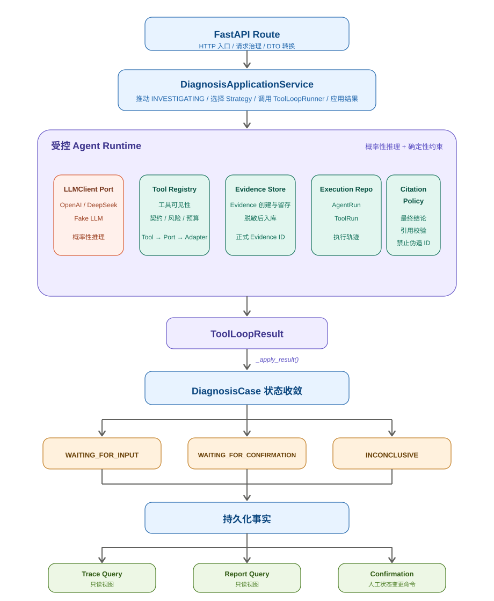
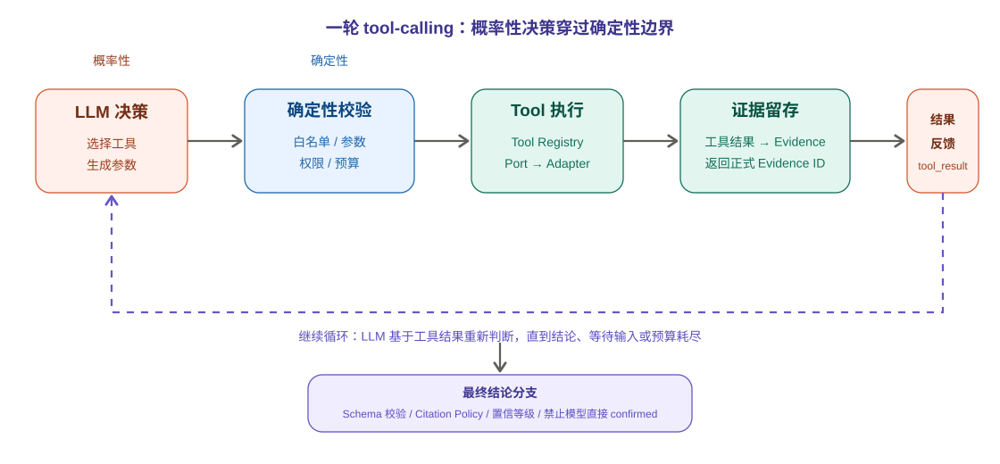
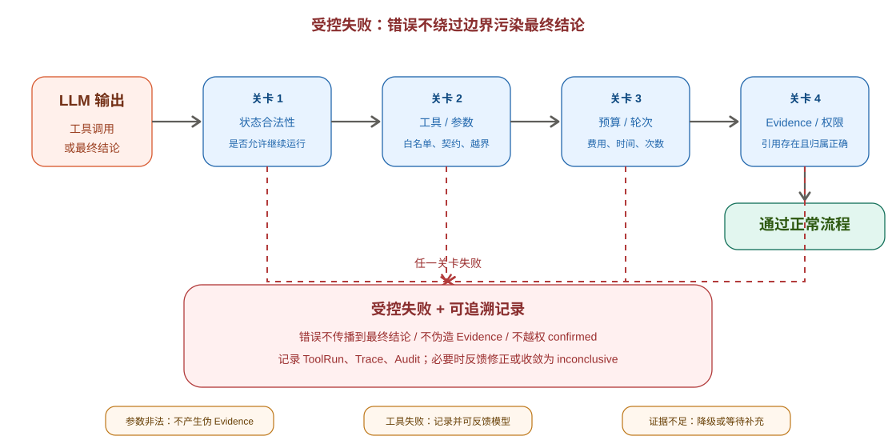

# 一、主调用链路：确定性骨架包裹概率性核心

这组图要表达的核心不是“LLM 很聪明，所以让它直接诊断”，而是：

> 让 LLM 在受控工具、证据留存、引用校验、状态机和人工确认的边界内完成诊断推理；模型负责提出可能性，系统负责验证、记录、约束和收敛。

这是当前项目最重要的架构思想。它把一个本质上具有概率性的模型，放进一套确定性的工程骨架里运行。这样做的目的不是消灭模型的不确定性，而是让不确定性变得可观察、可限制、可回退。

本文用三张图来理解：

- 主调用链路：系统从 API 到 Agent Runtime 再到状态收敛，整体如何组织；
- 循环内部展开：LLM 的一次 tool-calling 决策如何被校验、执行、记录、反馈；
- 受控失败机制：模型输出不合法、工具失败或证据不足时，系统如何避免错误污染最终结论。

## 一、主调用链路：确定性骨架包裹概率性诊断推理

这张图展示的是一次诊断运行的主链路。

从外层看，`FastAPI Route`、`DiagnosisApplicationService`、`DiagnosisStrategyRouter`、`DiagnosisCase` 状态机、Repository、Report、Trace、Confirmation 都是确定性的工程结构。它们负责接收请求、编排用例、选择诊断策略、限制状态变化、持久化数据、生成可追溯结果。

真正具有概率性的部分，是 Agent Runtime 中对 LLM 的调用。LLM 会根据问题描述、日志、知识库结果、代码片段等上下文，提出下一步行动或者候选结论。但 LLM 不能直接修改诊断状态，也不能直接访问文件、数据库或外部系统。

更准确地说：

> LLM 负责提出“下一步可能该做什么”；确定性代码负责决定“这一步是否允许执行、执行结果如何留存、最终结论是否可信”。

这里需要避免一个误解：`ToolLoopRunner` 不是一个完全确定性的普通服务。它内部包含 LLM 多轮推理，所以它本身是“概率性推理 + 确定性约束”的运行容器。可以把它理解为一个受预算、工具契约、证据规则和引用策略约束的 Agent Runtime。

`DiagnosisStrategyRouter` 的作用也要讲清楚：它不是每一轮都参与 Agent Loop，而是在诊断运行开始前，根据问题类型选择合适的 Strategy。Strategy 决定系统提示词、工具白名单和诊断侧重点。然后 `ToolLoopRunner` 按这个 Strategy 执行。

## 二、ToolLoopRunner 内部：一轮 tool-calling 的循环展开

把 Agent Runtime 打开看，核心循环大致是：

1. 构造诊断上下文；
2. 调用 LLM；
3. 解析 LLM 输出；
4. 如果是工具调用，先做确定性校验；
5. 校验通过后执行工具；
6. 工具结果生成 Evidence，并把结果反馈给 LLM；
7. 如果是最终结论，则进入结构化校验和引用校验；
8. 应用服务根据结果推动 `DiagnosisCase` 状态收敛。

这一段最关键的是：模型没有直连工具的捷径。

LLM 可以“建议”调用哪个工具，也可以“给出”参数，但它给出的工具名和参数必须先经过确定性代码校验。校验内容包括：

- 当前 Strategy 是否允许这个工具；
- 工具是否存在于 Tool Registry；
- 参数结构是否符合 Tool Contract；
- 路径、关键词、行号、数量等是否越界；
- 本轮是否超过工具次数、轮次或时间预算；
- 工具风险等级是否符合当前运行策略。

这里还有一个细节：`Tool Registry` 不等于直接调用 Adapter。更贴近真实代码的链路是：

> Registry 找到工具定义和工具实例，工具实现再通过 Port 调用 Adapter。

例如代码搜索并不是让模型直接读本地文件，而是通过受限的源码工具、源码读取 Port 和本地 Adapter 完成。这样可以把“模型想读什么”和“系统允许读什么”分开。

Evidence 的位置也要准确理解。Evidence 不是模型自己生成的“说法”，而是系统对用户输入、日志片段、知识条目、代码片段、工具结果等事实材料的结构化留存。它的价值在于：

- 让诊断结论有来源；
- 让后续报告可以追溯；
- 让人工确认时有依据；
- 让模型不能凭空伪造引用。

## 三、受控失败：模型犯错时的安全防线

这张图回答的是一个生产级 Agent 必须面对的问题：

> 如果模型选错工具、参数不合法、引用了不存在的 Evidence，或者证据不足，系统应该怎么办？

答案不是“相信模型下一轮一定会改对”，也不是“让错误继续往下走”，而是让失败停在边界内。

不过这里要注意，失败并不总是同一种处理方式。更准确的分类是：

| 失败类型 | 系统行为 |
| --- | --- |
| 工具名不存在或不在白名单 | 拒绝执行，记录运行轨迹，必要时反馈给模型修正 |
| 参数结构不合法 | 拒绝执行，保留 ToolRun / Trace 信息，不产生伪 Evidence |
| 工具执行失败 | 记录工具失败结果，可反馈给模型继续判断 |
| 预算耗尽 | 停止循环，通常收敛为 `inconclusive` 或等待人工补充 |
| 最终结论 Schema 不合法 | 进入有限修正，失败后受控降级 |
| 引用不存在或不属于当前 Diagnosis 的 Evidence | 拒绝采信该结论，要求修正或降级 |
| 模型试图直接输出 `confirmed` | 拦截，因为 Phase 0～2 中 `confirmed` 只能来自人工确认 |

所以“受控失败”的准确含义是：

> 失败不会绕过边界进入最终诊断结论；系统会把失败记录到 Trace、ToolRun、Audit 或状态中，并在必要时降级为 `inconclusive`。

这里不应该简单说“任一关卡失败都会留下 Evidence”。因为有些失败发生在工具执行前，例如参数非法、路径越界，这类情况不应该伪造 Evidence。它们更适合记录在 ToolRun、Trace 或 AuditEvent 中。

## 职责分布对照

| 维度 | LLM 负责 | 确定性代码负责 |
| --- | --- | --- |
| 理解问题 | 理解用户描述、日志、代码片段和知识条目 | 提供受限上下文，隔离不可信输入 |
| 规划下一步 | 提出工具调用或候选结论 | 限制轮次、预算、工具范围和风险等级 |
| 工具选择 | 在可见工具中选择一个行动 | 由 Strategy 和 Registry 决定哪些工具可见、可调用 |
| 参数生成 | 根据上下文生成工具参数 | 校验参数结构、路径范围、数量限制和权限 |
| 工具执行 | 不直接执行 | 通过 Tool、Port、Adapter 执行，并记录 ToolRun |
| 证据使用 | 综合 Evidence 形成解释 | 创建 Evidence，校验 Evidence 归属、可信度和脱敏状态 |
| 最终结论 | 生成结构化候选结论 | 校验 Schema、引用规则、置信等级和状态流转 |
| 状态变化 | 不直接修改状态 | 由 ApplicationService 和 DiagnosisCase 状态机推进 |
| 人工确认 | 不能替代人工确认 | 追加 Confirmation 和 AuditEvent，保留原始模型结论 |

## 设计理念总结

三张图共同回答一个问题：怎样让一个会犯错的模型参与诊断，同时不让它把系统带偏？

第一张图回答“系统骨架是什么”：API、应用服务、策略路由、状态机、Repository、Trace、Report、Confirmation 构成确定性边界，LLM 只在 Agent Runtime 内参与推理。

第二张图回答“循环怎么跑”：LLM 每次输出工具调用或结论后，都要经过工具契约、预算、权限、Evidence 和引用规则的校验。模型没有直接操作系统资源的权限。

第三张图回答“错了怎么办”：工具调用错误、证据不足、引用非法、预算耗尽时，系统不会让错误污染最终结论，而是记录轨迹、反馈修正、等待补充，或者降级为 `inconclusive`。

一句话概括：

> 这个项目不是让 LLM 替代工程系统，而是让 LLM 成为工程系统中一个可观察、可约束、可复盘的诊断推理组件。

这也是后续学习源码时最重要的视角：不要只看“模型怎么回答”，而要看“模型的每一步为什么没有越界，以及系统如何把可能性一步步收敛成可追溯结论”。
