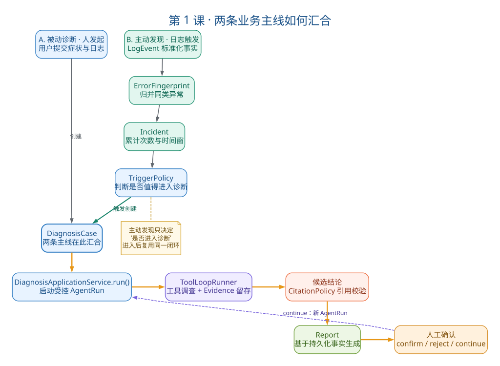
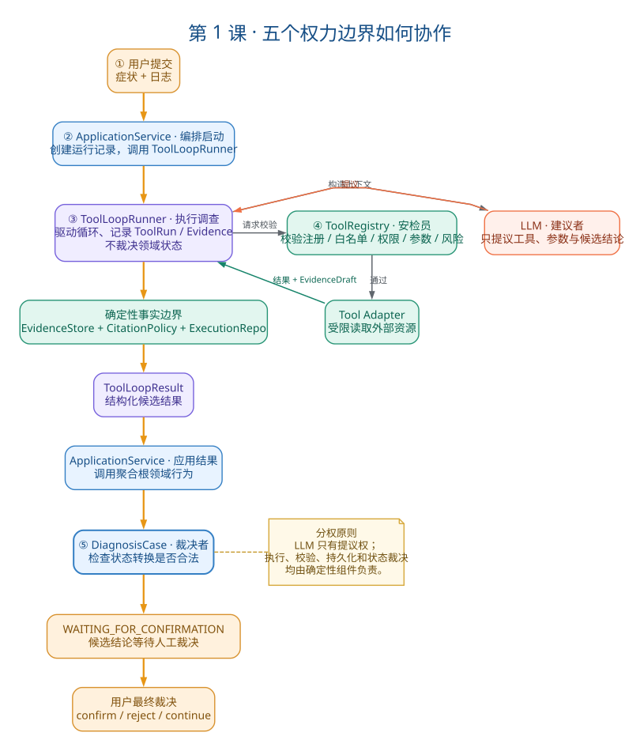

# 第1课：业务定位与系统全景

## 一、教案正文

### 1.1 业务问题：排障为什么需要这个系统？

#### 1.1.1 传统排障的真实困境

假设你是一个后端开发，凌晨两点收到告警：订单服务返回 500。你要做什么？

- 查日志：登上 ELK/Kibana，翻几百条日志，找到那条 `NullPointerException`
- 看源码：打开 IDE，定位到 `OrderService.java` 第 127 行，看 `customer.getName().trim()` 为什么炸了
- 查配置：是不是数据库连接池配置不对？Redis 超时设太短了？
- 健康检查：依赖服务还活着吗？`/actuator/health` 返回什么？
- 翻历史：这个问题以前出现过吗？Wiki 里有没有处理经验？

痛点：信息分散在 5 个以上系统/工具中，靠人肉在它们之间切换、关联、推理。

#### 1.1.2 LLM 能帮忙，但不能直接用

LLM 擅长理解非结构化日志，也擅长“看了日志后猜可能是哪行代码的问题”。但如果你直接把日志发给 ChatGPT：

| 风险 | 真实后果 |
|---|---|
| 幻觉 | 模型说“问题在 `PaymentService.java`”，但那个类根本不存在 |
| 越权 | 模型要求执行 `rm -rf /logs/*`，而你忘了限制 |
| 无限循环 | 模型在“搜索→读代码→不理解→再搜索”中反复消耗 Token |
| 伪造引用 | 模型说“根据日志 E-12345 显示……”，但那个 Evidence ID 是它编的 |
| 敏感泄漏 | 日志里的数据库密码、API Key 一并发给 OpenAI |

#### 1.1.3 项目的核心问题

1. 如何把概率性的模型推理
2. 放入有边界、可追踪、可验证、可人工接管的确定性工程系统。

关键词解读：

- **概率性**：LLM 的输出不可预测、不可完全复现
- **有边界**：工具白名单、预算上限、路径限制
- **可追踪**：每一步都有 ToolRun、Evidence ID、Trace
- **可验证**：Fake LLM 回归测试、CitationPolicy 校验
- **可人工接管**：模型只提候选结论，人做最终确认

### 1.2 一句话定位

三个关键词不要漏：

- 证据驱动（不是“模型说了算”）
- Agent 参考平台（不是“生产级 AIOps 产品”）
- 可追踪闭环（不是“给个答案就完了”）

### 1.3 两条业务主线：被动诊断 + 主动发现



> 读图顺序：先分别观察左侧的“人发起”和“日志触发”，再看它们如何汇合到同一个 `DiagnosisCase`，最后沿橙色主链理解两者共同复用的诊断闭环。虚线只表示继续调查的回流，不代表一个新的诊断实现。

#### 1.3.1 被动诊断（人发起）

1. 用户创建 Diagnosis → 启动 AgentRun → 工具调查 → Evidence
2. 候选结论 → 引用校验 → Report → 人工确认

各环节解释：

| 步骤 | 谁在干活 | 产出什么 |
|---|---|---|
| 创建 Diagnosis | 用户通过 API 提交症状 + 日志 | `DiagnosisCase(status=CREATED)` |
| 启动 AgentRun | `DiagnosisApplicationService.run()` | `AgentRun(status=RUNNING)` |
| 工具调查 | LLM 选择工具 → Registry 校验 → Adapter 执行 | `ToolRun` + `Evidence` |
| 候选结论 | LLM 输出结构化 JSON | `DiagnosisConclusion`（含 facts/root_causes） |
| 引用校验 | `CitationPolicy.validate()` | 通过/修正/拒绝 |
| Report | 从持久化事实生成 | Markdown 报告 |
| 人工确认 | 用户 confirm/reject/continue | `Confirmation` + 状态推进 |

#### 1.3.2 主动发现（日志触发）

1. 日志事件 → LogEvent → ErrorFingerprint → Incident
2. TriggerPolicy → 创建 Diagnosis → 复用被动诊断闭环

关键认知：主动发现没有重新实现 Agent。它只负责回答一个问题——“这个异常事实值不值得进入诊断？”一旦决定进入，后面的流程和被动诊断一模一样。

为什么要加这一层：同一个 `NullPointerException` 可能在一分钟内出现 100 次。如果每条日志都创建 Diagnosis：

- 模型费用 ×100
- 重复通知 ×100
- 无法区分“同一个问题的第 3 次告警”和“新问题的第 1 次告警”

所以主动发现层先用确定性的指纹、时间窗和TriggerPolicy做聚合。当前策略会为“尚未绑定Diagnosis的Incident”触发诊断；它通常是新Incident，但不应把`is_novel`误写成唯一触发条件。

#### 1.3.3 两条主线的汇合点

```
被动诊断：用户 → Diagnosis → AgentRun → ...
                  ↑
主动发现：日志 → Fingerprint → Incident → TriggerPolicy
```

汇合在 `Diagnosis` 对象。主动发现创建 Diagnosis 后，调用同一个 `DiagnosisApplicationService.run()`。

### 1.4 五个权力边界：谁说了不算什么

这是理解整个架构最重要的框架。五个角色各管一摊，谁也不能越界。



> 读图顺序：用户命令先进入应用服务；Runner 负责推动受控循环；LLM 只能提出建议；Registry 与 Adapter 决定工具能否安全执行；最终仍由 ApplicationService 调用 `DiagnosisCase` 的领域行为收敛状态。图中的编号是协作顺序，不是代码分层编号。

| 对象 | 拥有的权力 | 不拥有的权力 | 为什么这样设计 |
|---|---|---|---|
| LLM | 提议工具、参数和候选结论 | 直接执行工具、修改状态、人工确认 | 模型输出不可信，必须经过本地校验 |
| ToolLoopRunner | 驱动循环、保存 ToolRun/Evidence、返回结果 | 决定领域状态是否合法 | Runner 是“执行器”，不是“审判官” |
| ToolRegistry | 注册、白名单、参数、权限、风险校验 | 解释业务根因 | Registry 是“安检员”，只看能不能做 |
| DiagnosisApplicationService | 编排用例、事务和状态推进 | 绕过聚合根规则 | 应用层是“导演”，但不改“剧本规则” |
| DiagnosisCase | 裁决状态转换是否合法 | 调用模型和外部资源 | 聚合根是“法律”，只管规则不干具体活 |

核心表达（面试用）：

#### 1.4.1 一个具体场景帮理解

假设模型在一次调查中说：“我建议调用 `code__read` 读取 `OrderService.java` 第 120-130 行。”

| 步骤 | 谁在决策 | 发生了什么 |
|---|---|---|
| 1 | LLM 提议 | “我想读 `OrderService.java`” |
| 2 | Registry 检查 | `code__read` 是否注册？是否在 Strategy 白名单？是否有 `code:read` 权限？ |
| 3 | Runner 执行 | 参数合法 → 调用 `LocalCodeRepository` → 返回内容 + `EvidenceDraft` |
| 4 | Runner 持久化 | `EvidenceStore` 落库 → 生成正式 Evidence ID → 写 ToolRun 记录 |
| 5 | LLM 再提议 | 看到源码后输出候选结论：“根因是 `customer.trim()` 未判空” |
| 6 | CitationPolicy 校验 | 结论引用的 Evidence ID 是否存在？是否属于当前 Diagnosis？等级是否匹配？ |
| 7 | Runner 返回 | `ToolLoopResult` 交给 ApplicationService |
| 8 | ApplicationService 推进 | 调用 `DiagnosisCase.record_initial_conclusion()` |
| 9 | DiagnosisCase 裁决 | 检查状态转移是否合法 → `INVESTIGATING` → `WAITING_FOR_CONFIRMATION` |
| 10 | 用户 决策 | confirm / reject / continue_investigation |

关键观察：在这幅简化的单轮示意中，LLM 只负责提出工具调用和候选结论；一次真实 AgentRun 可能包含多轮 LLM 调用，其余执行、持久化、引用校验和状态收敛由确定性代码完成。

### 1.5 Phase 0～4 演进因果链：为什么是这个顺序？

项目的演进不是功能堆叠，每一阶段都解决了上一阶段的真实痛点。

| 阶段 | 当时最痛的问题 | 核心选择 | 为什么不提前做 |
|---|---|---|---|
| 0A | 模型和工具能否有界运行？ | 状态机 + Runner + Registry + Budget + Port | 没有受控运行，Evidence 无处挂载 |
| 0B | 结论有没有真实依据？ | Evidence 生命周期 + 脱敏 + Citation + Confirmation | 先解决可信度，再追求更多工具 |
| 0C | 能不能重复验证？ | Evaluation + Report + 极简 UI + Fake LLM Demo | 一次成功不能证明工程可用 |
| 1 | 能不能定位到具体代码？ | Java Lab 故障实验室 + 真实日志 + 受限源码工具 | 先用小型受控环境控制变量，不直接连生产 |
| 2 | 工具增多后怎么选择和复盘？ | Strategy Router + Trace + 更多只读工具（配置/健康） | 保持只读，避免写操作风险扩散 |
| 3A | 项目怎么被接手和理解？ | 关键注释 + 架构学习材料 | 可维护性是继续扩展的前提 |
| 3B | 怎么解释“准备调查什么”？ | 规则版 DiagnosisPlan | 先做可测试的轻量 Plan，不动 Runtime |
| 3C | 诊断资源属于哪个服务？ | ServiceProfile + ToolResourceContext | 从全局目录升级为服务级边界 |
| 4A | 扩展前怎么守住质量？ | 版本化评测 + 故障靶场 + 质量基线 | 没有稳定基线无法判断主动发现是否退化 |
| 4B | 怎样把日志变成稳定领域事实？ | LogEvent + Fingerprint + Incident + TriggerPolicy | 先建立确定性核心，再接外部采集 |
| 4C | 怎样形成单机主动发现闭环？ | File/Replay Source + 发现 API + 失败保留 | 先本地验证完整链路 |
| 4D | 怎样支持运营复盘？ | 相关日志补充 + 日摘要 + 反馈隔离 | 先能回顾事实，再引入企业接入 |
| 4E | 企业协议是否可替换？ | RabbitMQ + Redis + GitHub + SMTP Adapter | 最后接外部系统，缩小联调问题面 |

理解这条链的窍门：每个阶段都在解决“上一个阶段最让你不安的一点”。

比如 0A 做完了——Agent 能跑了，但你会不安：“模型说的结论一定对吗？” → 于是做 0B 的 Evidence。0B 做完了——有证据了，但你会不安：“改了代码以后还能复现吗？” → 于是做 0C 的评测。

### 1.6 技术栈全景图

| 层次 | 技术 | 为什么选它 |
|---|---|---|
| Web 框架 | FastAPI | 异步原生支持、自动 OpenAPI 文档、Pydantic 深度集成 |
| 数据校验 | Pydantic v2 | 模型参数的 Schema 校验、结论的字段合法性 |
| ORM | SQLAlchemy 2.0 Async | 异步数据库访问、Alembic 迁移 |
| 数据库 | SQLite (aiosqlite) | 单机零配置、快速原型验证 |
| 迁移 | Alembic | 版本化数据库 schema，每 Phase 可回溯 |
| HTTP 客户端 | httpx | 异步 HTTP、健康检查工具使用 |
| LLM 协议 | OpenAI-compatible Tool Calling | 供应商无关，可替换为任何兼容 API |
| 测试 | pytest + pytest-asyncio | 异步测试支持、Fake LLM 确定性回归 |
| 代码质量 | Ruff | 快速 lint + 格式化 |
| 架构图 | Graphviz (DOT) + SVG | 源文件可维护、SVG 跨客户端展示 |
| 中间件 | RabbitMQ / Redis / SMTP (可选) | 企业 Adapter，可选依赖 |

### 1.7 代码地图：七个关键文件

学习过程中不需要全部源码通读，但必须知道“发生了什么事应该去哪里找”。

| 文件 | 职责 | 关键入口 |
|---|---|---|
| `api/routes/diagnoses.py` | HTTP 路由，接收请求 | `create_diagnosis`、`run_diagnosis`、`confirm_diagnosis` |
| `application/diagnoses.py` | 用例编排 | `run()`、`_start_investigation()`、`_apply_result()` |
| `agent/runtime/tool_loop.py` | Agent 循环 | `run()`、`_execute_tool()`、`_persist_evidence()` |
| `domain/diagnosis/case.py` | 状态机 | `record_initial_conclusion()`、`_transition_to()` |
| `domain/evidence/models.py` | Evidence 领域对象 | `create()`、`hash_content()` |
| `domain/incident/models.py` | Incident 领域对象 | `build_error_fingerprint()`、`Incident.observe()` |
| `application/discovery.py` | 主动发现编排 | `process()`：聚合 → 触发 → 诊断 |

架构专题：Phase 0A 独立骨架 · Phase 0～4 演进地图 · Phase 4 主动发现

### 1.8 项目目录全景

```
application-diagnosis-platform/
├── src/app_diagnosis/
│   ├── api/            # FastAPI 路由（薄层，只做协议转换）
│   │   └── routes/     # diagnoses.py, incidents.py, services.py...
│   ├── application/    # 用例编排层
│   │   ├── diagnoses.py        # 诊断主流程
│   │   ├── discovery.py        # 主动发现流程
│   │   ├── evidence_diagnoses.py # Evidence 相关用例
│   │   └── enterprise_consumer.py # RabbitMQ 消费
│   ├── domain/         # 领域模型（核心业务规则）
│   │   ├── diagnosis/  # DiagnosisCase 聚合根、状态枚举
│   │   ├── evidence/   # Evidence 实体
│   │   ├── incident/   # Incident、Fingerprint、TriggerPolicy
│   │   └── service_profile/ # ServiceProfile
│   ├── agent/          # Agent 运行时
│   │   ├── runtime/    # ToolLoopRunner、ToolLoopContext
│   │   ├── strategies/ # Strategy 策略定义与路由器
│   │   ├── policies/   # CitationPolicy
│   │   └── schemas/    # LLM 输入/输出 Schema
│   ├── tools/          # 诊断工具实现
│   │   ├── code.py     # 源码搜索/读取
│   │   ├── log_search.py   # 日志搜索
│   │   ├── config.py   # 配置读取
│   │   ├── health.py   # 健康检查
│   │   ├── knowledge_search.py # 知识检索
│   │   └── registry.py # 工具注册与校验
│   ├── ports/          # 接口/契约定义
│   ├── adapters/       # 适配器实现
│   │   ├── code/       # 本地文件 + GitHub Snapshot
│   │   ├── persistence/ # SQLAlchemy Repository
│   │   ├── enterprise/ # RabbitMQ, Redis, SMTP
│   │   └── notifications/ # 邮件通知
│   └── bootstrap/      # 依赖装配容器
├── tests/              # 测试
├── docs/               # 文档（架构/规格/进度/验收/决策/学习）
├── scripts/            # 演示和验收脚本
└── migrations/         # Alembic 数据库迁移
```

### 1.9 面试表达模板

#### 1.9.1 30 秒版本（电梯演讲）

#### 1.9.2 常见质疑与回应

**“这不就是调个 API 加几个工具吗？”**

回应方向：

Demo 和参考实现的关键区别：Demo 只要“看起来能跑”，参考实现要回答“每个环节怎么兜底”。

具体说：工具不是模型说了算——Registry 五层校验（注册/启用/白名单/权限/Schema）；结论不是模型说了算——Evidence 必须落库才有正式 ID，CitationPolicy 校验引用合法性；状态不是模型说了算——DiagnosisCase 状态机由确定性代码推进。

全量自动化回归通过，并完成 RabbitMQ、Redis、GitHub、SMTP 的本地真实协议验收；这些结果证明工程链路可回归，不等于统计诊断准确率或生产可用。

**“为什么不用 LangChain/LangGraph？”**

回应方向：

当前核心难点是定义状态、证据、工具权限和失败语义，不是图编排规模。

自建小型 Runtime 有助于明确 Tool Calling 协议和每层边界。

如果出现复杂分支、可恢复检查点和长任务 Worker 需求时，再评估 LangGraph。

### 1.10 本课自测（5 题 + 操作题）

1. 项目解决的核心业务问题是什么？为什么不能直接把日志发给 ChatGPT？
2. 被动诊断和主动发现两条主线在哪里汇合？主动发现为什么没重新实现 Agent？
3. 五个核心角色（LLM / Runner / Registry / ApplicationService / DiagnosisCase）分别拥有什么权力、不拥有什么权力？
4. Phase 0A → 0B → 0C → 1 → 2 → 3 → 4 的演进因果链：为什么先做 Evidence 再做评测？为什么主动发现放在 Phase 4 而不是 Phase 1？
5. 如何用一句话回应“这只是调用模型加几个工具的 Demo”？

操作题：不看文档，在纸上画出两条业务主线，标注每个环节的产出对象。

## 二、学员疑问与讨论记录

### 疑问1：LLM 角色的精确理解

**初步理解**：“项目给 LLM 加了许多限制条件，让模型在限定的架子里尽量得出准确结论。”

**校准后的理解**：这种说法容易让人误解为“架子是为模型服务的”。实际设计意图是——LLM 不是“被限定的决策者”，而是“被监管的建议者”。源码证据：1.4.1 的十步链中，LLM 只在第 1 步和第 5 步参与（提议工具和提议结论），其余全部是确定性代码在执行、校验、裁决。所以正确的表述应当是“不信任大模型，因此每一步都用代码把关”。

### 疑问2：两条业务主线的关系澄清

**初步理解**：“主动和被动可以视为不同的日志来源，最根本都是根据日志内容做诊断。”

**校准**：它们确实共用同一个诊断主体流程（`discovery.py` 第 128 行调用同一个 `self._diagnoses.run()`），但主动发现比被动多了三层确定性预处理——Fingerprint 聚合（将不同行号的同类异常识别为同一条）、Incident 累加（occurrence_count 递增）、TriggerPolicy 决策（已关联诊断的不再触发）。这三层是纯代码逻辑，不依赖 LLM。关键价值在于：用确定性代码解决了“什么时候该叫 LLM 来帮忙”这个问题，而不是把判断权也交给 LLM。

### 疑问3：噪声过滤的双层机制

**延伸认识**：噪声过滤包含两层——第一层是 Fingerprint 的聚合（让系统知道“这是同一个问题”），`models.py` 的 `normalized()` 方法去掉了行号，确保同类异常被归并；第二层才是 TriggerPolicy 的阻止重复（让系统知道“这个问题已经有人在查了”）。前者不依赖 LLM，是纯字符串处理的确定性价值。

### 疑问4：Phase 4 为什么最后做

**面试角度的逻辑补充**：如果在 Phase 1 就做主动发现，会得到一个能发现大量异常、自动触发大量诊断的系统——但每个诊断的结论都不可信，等于噪声放大器而非信号提取器。因此在确认“单次诊断可信”（Phase 0-3）之后，再引入“自动决定该不该诊断”，才是先盖地基再装修的顺序。

### 疑问5：五个权力边界的协作流程

通过绘制协作流程图，明确了六个步骤中的角色切换点：

`[①用户提交] → [②ApplicationService 导演启动] → [③Runner 执行器循环] → [④ApplicationService 导演推进] → [⑤DiagnosisCase 法律裁决] → [⑥用户最终确认]`

关键认知：权力传递是单向的、每一棒谁接手有明确边界，不存在“LLM 直接改状态”或“Runner 自己裁决”的越界可能。

### 五题自测反馈摘要

| 题号 | 正确方向 | 需加强 |
|---|---|---|
| 1 | 理解了 LLM 不可直接使用 | 需补充五个具体风险（幻觉/越权/无限循环/伪造引用/敏感泄漏） |
| 2 | 理解了两线共用诊断闭环 | 汇合点在 `DiagnosisCase` 对象而非 AgentRun 流程 |
| 3 | 影视比喻很好 | — |
| 4 | 证据→评测的递进正确 | Phase 4 位置需补充“先可信再自动”的逻辑链 |
| 5 | 写了闭环完整性 | 面试场景需压缩到 30 秒内 |

## 三、自测与验收结果

- 能脱离文档画出两条业务主线，标注关键对象
- 能用自己话解释五个权力边界，并举一个具体场景说明
- 能说出 Phase 0→4 的演进因果逻辑（每个阶段为什么在那个位置）
- 能完成 30 秒项目介绍，不堆技术名词

## 四、本课结论

本课建立了项目的全局认知地图：核心命题是“把 LLM 的概率性推理约束在有边界的工程系统中”，两条业务线（被动诊断 + 主动发现）在 `DiagnosisCase` 对象汇合并共用同一个诊断主体流程，主动发现在进入诊断前有 Fingerprint 聚合 + TriggerPolicy 的双层确定性噪声过滤。架构上最关键的框架是五个权力边界的分离——LLM 只有提议权，Runner 驱动执行不裁决状态，Registry 校验不解释根因，ApplicationService 编排不绕过聚合根，DiagnosisCase 裁决不调外部资源。Phase 0→4 的演进遵循“每一阶段解决上一阶段最让你不安的问题”的因果链。
