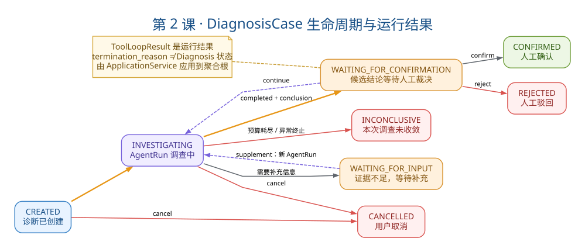
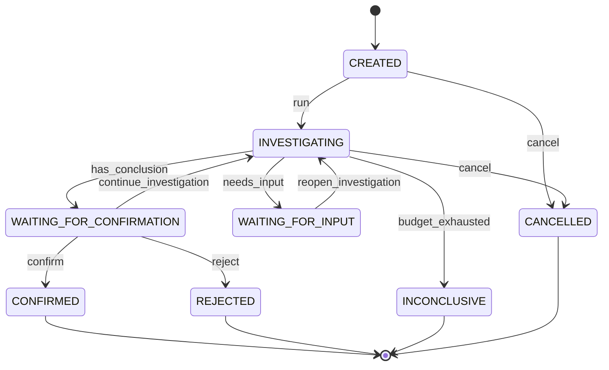

# 第2课：诊断用例与状态机

> 相关附录：
> - [第2课附录：8 步调用链代码解读](./第2课：代码解读.md) — 每一步源码 + 设计意图
> - 第3课附录：Agent Loop 代码解读 — §2.2 步骤 [6] `run()` 完整拆解

---

## 一、教案正文

### 2.1 业务场景：一次 NPE 诊断的全生命周期

用户在生产环境发现订单查询返回 500。她登录平台，粘贴一段日志，创建诊断。系统自动调查后给出候选结论，她确认根因后关闭案件。

这个过程在系统中经历了 8 个关键状态和多次对象流转。本课把这条链路从头到尾拆开。

### 2.2 主调用链：从 HTTP 到数据库的 8 步

```
[1] POST /api/v1/diagnoses/{id}/runs
 │ API Route: 校验参数，交给应用层
 ▼
[2] DiagnosisApplicationService.run(diagnosis_id)
 │ 检查 _active_tasks 防重复运行
 │ 调用 _start_investigation() 推进状态
 ▼
[3] DiagnosisCase: CREATED → INVESTIGATING
 │ 聚合根检查状态转移合法性
 │ version 自增，updated_at 更新
 │ AuditEvent 记录"谁启动了调查"
 ▼
[4] Strategy Router 选择策略
 │ 根据 ProblemType + 配置选择 Strategy
 │ 如 application_error_v1
 ▼
[5] ToolResourceResolver 解析资源
 │ 根据 ServiceProfile 获取源码/日志/配置路径
 │ 构造 ToolResourceContext
 ▼
[6] ToolLoopRunner.run(diagnosis, strategy, context, budget)
 │ LLM 选工具 → Registry 校验 → Adapter 执行
 │ 保存 ToolRun + Evidence + Plan
 │ CitationPolicy 校验候选结论
 │ 返回 ToolLoopResult
 ▼
[7] DiagnosisApplicationService._apply_result(diagnosis_id, result)
 │ 根据 result 类型调用不同 DiagnosisCase 方法
 │ record_initial_conclusion() → WAITING_FOR_CONFIRMATION
 │ mark_inconclusive() → INCONCLUSIVE
 │ wait_for_input() → WAITING_FOR_INPUT
 ▼
[8] Repository.save(DiagnosisCase, expected_version)
 │ 乐观锁版本检查
 │ 持久化状态 + 结论 + 更新时间
```

### 2.3 三类核心对象：不要混淆

这是本课最容易出错的地方。三个对象名字相似但生命周期完全不同。

| 对象 | 生命周期 | 回答的问题 | 类比 |
|---|---|---|---|
| DiagnosisCase | 跨多次 AgentRun | "这个故障案件现在处于什么阶段？" | 一个"工单" |
| AgentRun | 一次调查运行 | "这一次调查为什么停止？" | 一次"出勤记录" |
| ToolRun | 一次工具调用 | "哪个工具被调了、成没成功、用了多久？" | 一次"操作日志" |

#### 2.3.1 关键关系

```
DiagnosisCase (1) ──< AgentRun (N) ──< ToolRun (N) ──< Evidence (0..N)
```

- 一个 Diagnosis 可以有多次 AgentRun（用户补充信息后继续调查）
- 一次 AgentRun 可以有多次 ToolRun（每次工具调用）
- 一次 ToolRun 可以产生零个或多个 Evidence

#### 2.3.2 终止原因 ≠ 业务状态

`AgentTerminationReason` 回答"这一次 Run 为什么停"，常见值：

| 终止原因 | 含义 | Diagnosis 状态会变为什么 |
|---|---|---|
| completed | 模型给出了有效结论 | `WAITING_FOR_CONFIRMATION` 或 `WAITING_FOR_INPUT` |
| max_turns_exceeded | 轮次用完了 | `INCONCLUSIVE` |
| max_tool_attempts_exceeded | 工具调用次数用完了 | `INCONCLUSIVE` |
| time_budget_exceeded | 总时间超了 | `INCONCLUSIVE` |
| structure_correction_exhausted | 格式修正次数用完 | `INCONCLUSIVE` |
| citation_correction_exhausted | 引用修正次数用完 | `INCONCLUSIVE` |
| model_error | LLM 调用失败 | `INCONCLUSIVE` |
| cancelled | 用户主动取消 | `CANCELLED` |

**关键认知**：工具调用失败（如 `code__read` 超时）不一定会终止 AgentRun。模型可以选择其他工具或在已有证据上收敛。只有预算类、系统类和最终输出失败才终止。

### 2.4 状态机：DiagnosisCase 的八种状态

#### 2.4.1 状态转移图



> 读图顺序：先沿橙色主链理解一次成功调查，再观察等待补充、继续调查、取消和未收敛等分支。特别注意：`ToolLoopResult.termination_reason` 是一次运行的结束原因，最终 Diagnosis 状态仍由 `DiagnosisApplicationService` 调用聚合根领域行为决定。

状态机的 8 种状态、4 个终态与 10 条转移一次性画完。优先看 mermaid 图（GitHub/VSCode/Typora 均可渲染），ASCII 版用于纯文本环境。



阅读要点：

- **CREATED 是入口**：从 `[*]` 进入；可向右转 `cancel` 直达 CANCELLED，也可向下转 `run` 进入 INVESTIGATING。
- **INVESTIGATING 是分叉中心**：四条出边分别对应 Agent 在一轮 Run 后可能产生的四种结果（缺信息、有结论、预算耗尽、被用户取消）。
- **WAITING_FOR_INPUT ↔ INVESTIGATING**：是一个"补信息后继续查"的循环，配合文档 §2.6 的 `_active_tasks` 防并发。
- **WAITING_FOR_CONFIRMATION 是三出口**：除了 confirm/reject 两个终态，还可通过 `continue_investigation` 回到 INVESTIGATING 进一步调查。
- **四个终态**（CONFIRMED / REJECTED / INCONCLUSIVE / CANCELLED）在源码里 `frozenset()`，对应 `DiagnosisStatus` 枚举值。

#### 2.4.2 状态转移规则表

| 当前状态 | 允许转移到 | 触发动作 | 业务含义 |
|---|---|---|---|
| CREATED | INVESTIGATING | run | 开始调查 |
| CREATED | CANCELLED | cancel | 用户取消（还没开始查） |
| INVESTIGATING | WAITING_FOR_INPUT | Agent 声明缺少信息 | "还差关键材料，需要你补充" |
| INVESTIGATING | WAITING_FOR_CONFIRMATION | Agent 给出候选结论 | "结论有了，你来确认下" |
| INVESTIGATING | INCONCLUSIVE | 预算耗尽/模型失败 | "查了，但证据不够" |
| INVESTIGATING | CANCELLED | cancel | 用户取消（调查中途） |
| WAITING_FOR_INPUT | INVESTIGATING | 用户补充信息后继续 | 重新进入调查 |
| WAITING_FOR_CONFIRMATION | CONFIRMED | confirm | 人工接受（终态） |
| WAITING_FOR_CONFIRMATION | REJECTED | reject | 人工驳回（终态） |
| WAITING_FOR_CONFIRMATION | INVESTIGATING | continue_investigation | 人工要求继续查 |

#### 2.4.3 源码实现：`_ALLOWED_TRANSITIONS`

```python
# domain/diagnosis/case.py
_ALLOWED_TRANSITIONS = {
    DiagnosisStatus.CREATED: frozenset({
        DiagnosisStatus.INVESTIGATING,
        DiagnosisStatus.CANCELLED,
    }),
    DiagnosisStatus.INVESTIGATING: frozenset({
        DiagnosisStatus.WAITING_FOR_INPUT,
        DiagnosisStatus.WAITING_FOR_CONFIRMATION,
        DiagnosisStatus.INCONCLUSIVE,
        DiagnosisStatus.CANCELLED,
    }),
    DiagnosisStatus.WAITING_FOR_INPUT: frozenset({
        DiagnosisStatus.INVESTIGATING,
    }),
    DiagnosisStatus.WAITING_FOR_CONFIRMATION: frozenset({
        DiagnosisStatus.CONFIRMED,
        DiagnosisStatus.REJECTED,
        DiagnosisStatus.INVESTIGATING,
    }),
    # 终态——不允许任何转移
    DiagnosisStatus.CONFIRMED: frozenset(),
    DiagnosisStatus.REJECTED: frozenset(),
    DiagnosisStatus.INCONCLUSIVE: frozenset(),
    DiagnosisStatus.CANCELLED: frozenset(),
}
```

为什么用 `frozenset` 而不是 `set`？状态转移规则是类级别的常量（`ClassVar`），不应该在任何实例中被修改。`frozenset` 对此提供编译期保证。

#### 2.4.4 状态转移的核心方法：`_transition_to()`

```python
def _transition_to(self, target: DiagnosisStatus, *, at=None) -> None:
    if target not in self._ALLOWED_TRANSITIONS.get(self.status, frozenset()):
        raise InvalidDiagnosisStateTransition(
            f"Cannot transition from {self.status.value} to {target.value}"
        )
    self.status = target
    self.version += 1
    self.updated_at = at or datetime.now(UTC)
```

这个方法同时做了四件事（面试时逐一说明会很加分）：

1. 检查转移合法性（不合法抛异常）
2. 更新状态
3. 自增版本号（乐观锁）
4. 更新时间戳

### 2.5 三个关键设计决策

#### 2.5.1 为什么 ApplicationService 不能直接改状态字段？

反例（绝对不要这样写）：

```python
# ❌ 坏设计：应用层直接改字段
diagnosis.status = DiagnosisStatus.CONFIRMED
diagnosis.version += 1
await repo.save(diagnosis)
```

正确做法：

```python
# ✅ 好设计：通过聚合根方法
if result.has_valid_conclusion():
    diagnosis.record_initial_conclusion(result.conclusion, needs_input=False)
else:
    diagnosis.mark_inconclusive()
await repo.save(diagnosis, expected_version=diagnosis.version)
```

原因：

- 状态合法性由聚合根统一裁决，不会出现"不同 ApplicationService 写了不同的转移逻辑"
- version 自增和状态更新是原子操作（在同一个方法内）
- 业务规则可独立单测，不依赖数据库

#### 2.5.2 为什么不使用一次大事务覆盖整个 AgentRun？

AgentRun 可能持续几秒到几十秒（LLM 推理 + 多次工具调用）。如果用一个长数据库事务包住全部：

- 锁持有时间过长，阻塞其他请求
- 连接占用，连接池容易耗尽
- 中途失败回滚范围太大——已经成功的工具调用记录也丢了

当前做法：逐步持久化，失败时已发生的动作仍然可追踪。

```
创建 AgentRun → 持久化 → 工具调用 1 → 持久化 ToolRun + Evidence
→ 工具调用 2 → 持久化 → ... → 候选结论 → 持久化
```

代价是需要管理中间状态和幂等规则，但换来了可靠性和可追溯性。

#### 2.5.3 ToolLoopResult 为什么不是 DiagnosisConclusion？

`ToolLoopResult` 是 Runner 返回给 ApplicationService 的"运行摘要"，包含：

- 终止原因
- 候选结论（可选）
- 产生的 Evidence ID 列表
- 错误信息（如果失败）

`DiagnosisConclusion` 是模型输出的结构化结论，仅包含：

- 症状摘要
- 事实列表（facts）
- 根因列表（root_causes）
- 建议
- 缺失信息

分开的原因：Runner 可能因为预算耗尽、模型错误等产生结果，此时根本没有有效的 `DiagnosisConclusion`。ApplicationService 需要根据 `termination_reason` 决定下一步，而不是假设每次 Run 都有结论。

### 2.6 并发控制：当前能力与生产差距

#### 2.6.1 `_active_tasks` 做了什么

```python
# application/diagnoses.py（简化）
_active_tasks: dict[UUID, asyncio.Task] = {}

async def run(self, diagnosis_id):
    if diagnosis_id in self._active_tasks:
        raise DiagnosisAlreadyRunning(diagnosis_id)
    task = asyncio.create_task(self._do_run(diagnosis_id))
    self._active_tasks[diagnosis_id] = task
    try:
        return await task
    finally:
        self._active_tasks.pop(diagnosis_id, None)
```

能解决的：单个 Python 进程中同一 Diagnosis 的并发运行。

不能解决的：

- 多 Uvicorn Worker（每个 Worker 有自己的 `_active_tasks`）
- 多机器部署
- 进程崩溃后任务恢复

#### 2.6.2 version 乐观锁

```python
# Repository 层
async def save(self, diagnosis: DiagnosisCase, *, expected_version: int):
    result = await session.execute(
        update(DiagnosisORM)
        .where(DiagnosisORM.id == diagnosis.id)
        .where(DiagnosisORM.version == expected_version) # 乐观锁条件
        .values(status=diagnosis.status, version=diagnosis.version + 1, ...)
    )
    if result.rowcount == 0:
        raise ConcurrentModificationError(...)
```

#### 2.6.3 生产化演进方向

| 当前 | 生产化目标 |
|---|---|
| `_active_tasks` 字典 | 数据库任务租约（Worker 抢占 + 心跳 + 超时释放） |
| `version` 乐观锁 | 保留，配合分布式锁或数据库唯一约束 |
| 同步 HTTP → 直接执行 | API 只创建任务，Worker 异步消费 |

### 2.7 关键源码导航

| 文件 | 重点看的方法 | 学什么 |
|---|---|---|
| `api/routes/diagnoses.py` | `create_diagnosis`、`run_diagnosis` | API 层多薄 |
| `application/diagnoses.py` | `run()`、`_start_investigation()`、`_apply_result()` | 应用编排 |
| `domain/diagnosis/case.py` | `_transition_to()`、`record_initial_conclusion()`、`confirm()`、`reject()` | 状态机规则 |
| `domain/diagnosis/enums.py` | `DiagnosisStatus`、`ProblemType` | 状态枚举 |
| `adapters/persistence/diagnosis_repository.py` | `save()`、`get()` | 持久化与乐观锁 |

阅读顺序建议：先读 `case.py` 的 `_ALLOWED_TRANSITIONS`，理解状态规则；再读 `application/diagnoses.py` 的 `run()`，看怎么编排；最后看 Route，知道 HTTP 层多薄。

> 架构专题：Phase 0A 主调用链 · 核心掌握手册第 6 节

### 2.8 面试追问与回答方向

- **Q1**: 为什么 ApplicationService 不能直接修改状态字段？
- **Q2**: ToolLoopResult 为什么不是 DiagnosisConclusion？
- **Q3**: 为什么不使用一次大事务覆盖整个 AgentRun？
- **Q4**: 单进程并发保护部署多实例后会怎样？能解决吗？

### 2.9 常见误解澄清

| 误解 | 事实 |
|---|---|
| "状态机就是几个 enum" | 状态机包含转移规则、version 自增、时间戳更新——不只是 enum 值 |
| "INCONCLUSIVE 就是失败了" | INCONCLUSIVE 是"证据不够无法下结论"，不等于系统故障 |
| "WAITING_FOR_CONFIRMATION 就是 CONFIRMED" | 前者是"有候选结论等你判"，后者是"你已经判了接受" |
| "ToolRun 失败 Diagnosis 也应该失败" | 工具是调查尝试，一个工具失败模型可以换另一个继续查 |

### 2.10 本课自测（5 题）

1. 画出 HTTP 请求到 `DiagnosisCase` 持久化的完整调用链，标注每一步的关键方法名。
2. 分别用一句话说明 `DiagnosisCase`、`AgentRun`、`ToolRun` 三个对象的区别。
3. `INVESTIGATING` 状态可以转移到哪些状态？分别由什么动作触发？
4. `AgentTerminationReason` 为 `max_turns_exceeded` 时，`DiagnosisStatus` 应该是什么？为什么？
5. 当前并发保护机制的两层防线（`_active_tasks` + `version`）各解决什么问题？在多 Worker 部署时哪一层会失效？

---

## 二、学员疑问与讨论记录

### 疑问1：状态机设计合理性

讨论了为什么 `INCONCLUSIVE` 和 `REJECTED` 必须分开（系统能力不足 vs 结论质量有问题，审计维度不同）、当前 `WAITING_FOR_INPUT` 没有到 `CANCELLED` 的合法转移；这是当前状态机约束，代码没有表达“鼓励完成调查”这一业务理由，也可以被视为后续产品化时需要重新评估的取消能力，以及为什么没有 `RESOLVED` 状态（诊断工具的职责边界止于确认根因，Bug 修复是事件管理工具的事）。

### 疑问2：WAITING_FOR_CONFIRMATION 夜间场景 + 噪声过滤

凌晨两点自动触发诊断，开发者睡觉期间同类型错误再次出现。确认了 `TriggerPolicy` 只检查 `diagnosis_id is not None`，不关心 Diagnosis 状态——在当前同一 Incident 记录内，一旦绑定 Diagnosis，TriggerPolicy 就不会再次自动触发；新的时间窗或新的聚合键仍可能形成新的 Incident。开发者第二天看到 `occurrence_count` 累积值就知道夜间复发了几次。同时讨论了 Reject 后 `diagnosis_id` 不会解绑的设计取舍。

### 疑问3：乐观锁的深层含义

`_transition_to()` 中 `version += 1` 不只是防并发冲突。完整链路是：ApplicationService 先记 `expected_version = diagnosis.version`，聚合根方法自增后，`save()` 用旧版本号做 WHERE 条件。这同时防止了两件事：① 两个协程同时改同一条记录；② 一个协程拿着过期内存对象做决策后写入（读后写一致性问题）。

### 疑问4：单进程下的并发安全问题

`_active_tasks` 和 `version` 不是"为将来预留"——在当前 FastAPI + asyncio 单 Worker 下就已经会触发：用户快速双击"启动诊断"会触发 `_active_tasks` 冲突，诊断运行期间点取消会触发 `_apply_result` 和 `_mark_cancelled` 的 version 竞态。代码第 357 行的 CANCELLED 守卫是第一道防线，version 是第二道硬防线。

### 疑问5：Strategy Router 的策略模式

`DiagnosisStrategyRouter.select()` 是经典策略模式——根据 diagnosis 的 title/symptom/log 做正则关键词打分，唯一胜者当选、平票或零票走 fallback。使用纯规则而非 LLM 做路由的原因：便宜、稳定、可测试，延续"确定性优先于概率性"的全局哲学。正则中甚至包含中文关键词（如 `下游.*超时`）。

### 疑问6：ToolLoopRunner.run() 完整源码拆解

→ 见 [第3课附录：Agent Loop 代码解读](./第3课：代码解读.md)。核心结论：`run()` 是一个不信任 LLM 的循环引擎——入口守卫、渐进式持久化、多轮循环、工具执行→持久化→摘要回传、结构修正 1 次 + 引用修正 2 次 + 全部工具失败守卫，三层过滤全部通过才算 `COMPLETED`。

### 疑问7：一次 AgentRun 为什么需要多次 ToolRun

因为 LLM 在一次 AgentRun 内可以走多轮循环（每轮可能调多个工具）。真实场景：`health__check` → `config__read` → `log__search` → `code__read` → 结论，一次 AgentRun 内 5 个 ToolRun，覆盖完整的"排除法调查"路径。`code__read` 成功后自动进入 `finalization_mode`，强制收敛。

### 疑问8：终止原因为什么要这么多

8 个终止原因中 6 个映射到 `INCONCLUSIVE`，区分的价值不在状态机而在运维可观测性（`time_budget_exceeded`→调超时、`model_error`→查 API）、成本分析（不同原因的 Token 消耗模式不同）和测试覆盖（Fake LLM 可精确断言每种失败路径）。

### 疑问9：Bootstrap = 依赖注入

`container.py` 的 `build_diagnosis_service()` 本质是手工 IoC/DI——和 Spring 的 `@Bean` + `@Autowired` 思想相同，区别是 Spring 用反射自动装配，本项目用显式工厂函数手动接线。路由层通过 `app.state` 获取装配好的服务，不自行创建依赖。需要诚实说明：当前 ApplicationService 内部仍直接创建部分 SQLAlchemy Repository Adapter，这是单机阶段的务实实现，并非应用层完全基础设施无关。

### 五题自测反馈

| 题号 | 正确 | 需加强 |
|---|---|---|
| 1 | 调用链完整 | — |
| 2 | 三类对象关系正确 | — |
| 3 | 四个转移目标正确 | WAITING_FOR_CONFIRMATION 的触发条件：COMPLETED + conclusion 不为空 + missing_information 为空 |
| 4 | 方向对 | 精确原因：轮次用尽说明模型在预算内没产出通过全部校验的有效结论，不可信→坦诚 INCONCLUSIVE |
| 5 | 两层防线正确 | 缺第三层：多 Worker 需数据库任务租约（抢占+心跳+超时释放） |

---

## 三、自测与验收结果

- 能沿真实方法名（`run` → `_start_investigation` → `_transition_to` → `_apply_result`）讲清一次状态推进
- 能解释为什么事务不包住整个 AgentRun
- 能说出当前并发保护的两个层次及各自的生产化缺陷

---

## 四、本课结论

本课以一次 NPE 诊断的 8 步完整调用链为主线，串起了三个核心对象（DiagnosisCase/AgentRun/ToolRun）、八种诊断状态的状态机、以及贯穿始终的并发保护机制。关键认知：

1. HTTP 请求到数据库持久化之间，每一棒都有明确的对象和职责；
2. 状态转移规则是集中式的不变量，所有公开方法最终收敛到 `_transition_to()`；
3. 乐观锁不只是并发控制，更是"拿着过期对象做决策"的防御；
4. `run()` 方法是一个不信任 LLM 的完整受控循环（详见第3课附录）。

配套源码解读可随时在调用链中按步骤号索引查代码。
