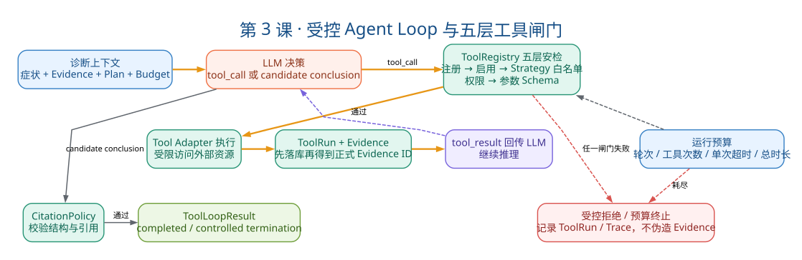

# 第3课：Agent Loop 与工具闸门

状态：已完成 ✓

本课目标：理解 LLM 如何提出调查动作，以及确定性 Runtime 如何限制、执行和记录这些动作。学完后能画出完整 Tool Call 路径、说出 Registry 五层校验。

📎 配套附录：[第3课附录：Agent Loop 代码解读](./第3课：代码解读.md) — `run()` 方法 253 行完整源码拆解

---

## 一、教案正文

### 3.1 业务场景：模型想读源码，系统说"先过安检"

回顾 NPE 案例。模型看到日志中的异常堆栈后，产生一个想法：

"我应该搜索 `OrderService` 这个类，然后读取相关代码片段。"

在普通 Demo 中，这行伪代码就够了：

```python
result = tool_registry["code__search"].execute(query="OrderService")
```

但在这个项目中，这句调用要经过 **五层确定性校验 + 三层后处理**。

本课把整个过程拆开，理解"Agent 味"和"工程味"分别在哪些环节体现。

### 3.2 Agent Loop 全景：一图看懂主循环



> 读图顺序：沿橙色主链看模型提议如何经过 Registry、Budget、Adapter 和 Evidence 持久化；紫色虚线表示工具结果再次回到模型。红色分支说明前置校验失败或预算耗尽会受控终止，并不伪造 Evidence。

```text
                        ┌─────────────────────────────────┐
                        │  ToolLoopRunner.run() 入口      │
                        │  创建 AgentRun                  │
                        │  创建 DiagnosisPlan             │
                        │  计算 allowed_tools             │
                        └──────────────┬──────────────────┘
                                       │
                                       ▼
                        ┌─────────────────────────────────┐
                        │  构造 LLM Request               │
                        │  system prompt (Strategy)       │
                        │  user message (脱敏症状+日志)    │
                        │  tool definitions (allowed)     │
                        │  evidence catalog               │
                        └──────────────┬──────────────────┘
                                       │
                          ┌────────────▼────────────┐
                          │   LLM 返回              │
                          │   tool_call 或          │
                          │   final_answer (结论)   │
                          └──────┬────────┬────────┘
                                 │        │
                         tool_call        final_answer
                                 │        │
                                 ▼        ▼
              ┌────────────────────┐  ┌───────────────────────┐
              │  Registry.resolve  │  │  Pydantic Schema 校验  │
              │  五层闸门校验      │  │  + CitationPolicy      │
              └────────┬───────────┘  └───────────┬───────────┘
                       │                          │
                  ┌────▼────┐               ┌─────▼──────┐
                  │ 通过？   │               │ 通过？      │
                  └─┬────┬──┘               └──┬────┬────┘
                    │    │                     │    │
                   是   否                    是   否
                    │    │                     │    │
                    ▼    ▼                     ▼    ▼
          ┌──────────┐ ┌──────────┐  ┌──────────┐ ┌──────────┐
          │ 执行工具  │ │记录失败   │  │保存结论   │ │有限修正   │
          │ 保存结果  │ │回传LLM   │  │返回Result │ │或受控结束 │
          └─────┬────┘ └────┬─────┘  └─────┬────┘ └────┬─────┘
                │           │              │           │
                └───────────┴──────────────┴───────────┘
                                    │
                          ┌─────────▼──────────┐
                          │  检查预算           │
                          │  轮次/工具次数/时间  │
                          └─────────┬──────────┘
                                    │
                            ┌───────▼───────┐
                            │ 继续循环？     │
                            └───┬───────┬───┘
                                │       │
                               是      否
                                │       │
                                ▼       ▼
                          回到构造请求  返回ToolLoopResult
```

### 3.3 LLM 的输入：一帧消息里有什么

理解 Agent Loop 的第一步是理解 LLM 到底"看到"了什么。第一轮请求包含：

| 消息部分 | 内容 | 谁生成的 | 信任级别 |
|---|---|---|---|
| `system prompt` | Strategy 的调查指令 + 输出 JSON Schema + 角色定义 | 系统（Strategy） | 高，由确定性代码生成 |
| `user message` | 脱敏后的症状描述 + 脱敏后的日志片段 | 系统（从 `Diagnosis` 加载） | 内容不可信（来自用户输入） |
| `evidence catalog` | 已有 Evidence 的 ID + 摘要 | 系统（从 `EvidenceStore` 加载） | ID 权威，内容仍不可信 |
| `tool definitions` | 允许使用的工具名称 + 参数 Schema | 系统（Registry 生成） | 高，由确定性代码生成 |
| `options` | `parallel_tool_calls: false` | 系统 | 高 |

关键设计：日志内容即使被放进 `user message`，也会在 Prompt 中明确标记为"不可信数据"。真正的工具权限由本地 Registry 执行，不依赖模型遵守 Prompt 中的文字说明。

### 3.4 Registry：不是工具字典，是五层安检

这是整个系统安全的核心。`ToolRegistry.resolve()` 在工具执行前做五层校验：

```text
模型提议 "code__search"
        │
        ▼
[第1层] _require_registered(name)
        工具是否存在？
        └─ 不存在 → UnknownTool 异常 → 记录 ToolRun 失败
        │
        ▼
[第2层] if name not in self._enabled
        工具是否启用？
        └─ 未启用 → DisabledTool 异常
        │
        ▼
[第3层] if name not in allowed_names
        Strategy 白名单是否允许？
        └─ 不允许 → ToolNotAllowed 异常
        │
        ▼
[第4层] if context.problem_type not in tool.supported_problem_types
        当前问题类型是否支持？
        └─ 不支持 → ToolNotAllowed
        │
        ▼
[第5层] missing = tool.required_permissions - context.permissions
        是否拥有所需权限？
        └─ 缺少 → ToolPermissionDenied
        │
        ▼
[通过] 返回 tool 实例 → 之后还有 Schema 校验 + Adapter 边界
```

#### 3.4.1 五层校验分别解决什么问题

| 层 | 检查 | 解决的问题 | 谁控制 |
|---|---|---|---|
| 1 | 注册存在 | 代码有没有实现这个工具 | 开发阶段 |
| 2 | `enabled` | 运维是否允许使用 | 配置/运维 |
| 3 | Strategy 白名单 | 当前故障类型是否应该用这个工具 | Strategy 设计 |
| 4 | `ProblemType` 匹配 | 工具是否适配当前问题域 | 工具声明 |
| 5 | 权限 | 当前运行上下文是否有权执行 | 资源上下文 |

面试重点：前两层和后三层由不同角色控制。Strategy 白名单和权限是"运行时根据诊断上下文决定"的，注册存在是"代码写了就有"。这不重复——它们是不同层次的防线。

#### 3.4.2 源码关键片段

```python
# tools/registry.py
def resolve(self, name: str, *, allowed_names: frozenset[str],
            context: ToolExecutionContext) -> DiagnosticTool:
    tool = self._require_registered(name)       # 第1层
    if name not in self._enabled:                # 第2层
        raise DisabledTool(name)
    if name not in allowed_names:                # 第3层
        raise ToolNotAllowed(name)
    if context.problem_type not in tool.supported_problem_types:  # 第4层
        raise ToolNotAllowed(name)
    missing = tool.required_permissions - context.permissions      # 第5层
    if missing:
        raise ToolPermissionDenied(name, missing)
    return tool
```

### 3.5 Tool Execution：一次工具调用的完整生命周期

```text
Registry.resolve() 通过
        │
        ▼
[1] 参数校验
    tool.parse_arguments(raw_arguments)
    → Pydantic Schema 校验
    → 失败则记录 ToolRun(status=INVALID_ARGUMENTS)
        │
        ▼
[2] 预算检查
    → 还有工具调用次数吗？
    → 单工具超时设置
    → 失败则记录 ToolRun(status=BUDGET_EXHAUSTED)
        │
        ▼
[3] 执行
    tool.execute(arguments, context)
    → Adapter 内部做路径/URL/后缀/行数/大小限制
    → 返回 ToolExecutionResult
        │
        ├── result.data          → 面向应用的结构化结果
        ├── result.model_summary → 回传 LLM 的有限摘要
        └── result.evidence_drafts → 等待持久化的证据候选
        │
        ▼
[4] 持久化
    → EvidenceCandidate → EvidenceStore.add_candidates()
    → 生成正式 Evidence ID（落库后才产生）
    → 创建 ToolRun 记录
    → evidence_ids 写入 ToolRun.result_json
        │
        ▼
[5] 回传 LLM
    → tool message: tool_call_id + model_summary + evidence_ids
    → 下一轮 LLM 可以看到本次调用的结果
```

#### 3.5.1 data vs model_summary vs evidence_drafts

面试时能区分这三个概念很加分：

| 输出 | 用途 | 大小策略 |
|---|---|---|
| `data` | 应用层结构化处理 | 完整结果 |
| `model_summary` | 回传 LLM 帮助下一步决策 | 受控截断（有字节上限） |
| `evidence_drafts` | 持久化为 Evidence 供引用 | 完整内容（脱敏后） |

为什么 `model_summary` 要截断：防止大日志/大源码片段挤爆 LLM 上下文窗口，同时保留足够信息让模型判断"要不要继续查、换什么工具"。

### 3.6 预算体系：不止是"限制 Token"

`ToolLoopRunner` 的预算不是简单的一个数字，而是定义了系统在异常情况下如何受控结束。

| 预算维度 | 默认值 | 耗尽后的行为 |
|---|---|---|
| `max_turns` | 最大轮次 | `termination_reason = max_turns_exceeded`，保留已有 Evidence，Diagnosis → `INCONCLUSIVE` |
| `max_tool_attempts` | 最大工具调用次数 | 同上 |
| `tool_timeout_seconds` | 单工具超时 | 该次 ToolRun 标记失败，模型可选择其他工具 |
| `total_timeout_seconds` | 总运行超时 | `termination_reason = time_budget_exceeded` |
| `max_tool_output_bytes` | 单工具输出上限 | 截断，记录警告 |
| `max_structure_corrections` | 格式修正次数 | `termination_reason = structure_correction_exhausted` |
| `max_citation_corrections` | 引用修正次数 | `termination_reason = citation_correction_exhausted` |

面试表达：预算不只是费用控制。它定义了"模型异常、工具卡死、无限修正时，系统如何以明确的 `termination_reason` 受控结束"。

### 3.7 当前 Plan 的准确定位

```python
# agent/runtime/tool_loop.py
plan = DiagnosisPlan.create_rule_based(
    diagnosis=diagnosis,
    agent_run_id=agent_run_id,
    strategy=strategy,
    allowed_tools=allowed_names,
)
await self._plans.add(plan)
```

当前 Plan 是什么：一个规则生成并持久化的解释性资产，告诉用户"本次诊断准备关注什么"。

当前 Plan 不是什么：

- 不是工具调度器（不控制工具执行顺序）
- 不是 Plan-and-Execute（工具失败后不重规划）
- 不是 DAG 工作流（没有步骤间依赖）

为什么不做完整的 Plan-and-Execute：

- Phase 3B 的目标是先提高可解释性，不动已经稳定的 Runtime
- 真正 Plan-and-Execute 需要步骤状态、依赖、动态重规划、恢复语义——复杂度高，收益需要评估

面试时该怎么称呼：

- ✅ "轻量诊断计划"
- ✅ "规则生成的调查说明"
- ❌ "Plan-and-Execute"
- ❌ "Planning Agent"

### 3.8 概率性 vs 确定性：Runner 内部的双层逻辑

很多人问"`ToolLoopRunner` 是确定性组件吗"——答案是：它同时包含两类逻辑。

| 类型 | 环节 | 举例 |
|---|---|---|
| 概率性 | LLM 选择工具 | 模型决定调用 `code__search` 还是 `knowledge__search` |
| 概率性 | LLM 生成参数 | 模型写 `query="OrderService"` |
| 概率性 | LLM 决定结束 | 模型判断"证据够了，可以输出结论" |
| 确定性 | 白名单过滤 | Strategy 说只能用 `code__search`，那 LLM 选 `shell__exec` 就被拦 |
| 确定性 | Schema 校验 | 参数类型、必填字段、范围检查 |
| 确定性 | 权限检查 | 没有 `code:read` 就不能读源码 |
| 确定性 | 预算检查 | 超出轮次/工具数/时间就停止 |
| 确定性 | Evidence 持久化 | 落库成功才有正式 ID |
| 确定性 | 引用校验 | `CitationPolicy` 规则不可绕过 |

面试时一句话总结：Runner 接纳模型的概率性建议，但用确定性规则限制执行。所以它不是"确定性组件"，而是"概率性提议 + 确定性裁决"的混合体。

### 3.9 关键源码导航

| 文件 | 重点看什么 | 需要理解的程度 |
|---|---|---|
| `agent/runtime/tool_loop.py` | `run()` 主循环、`_execute_tool()` 工具执行、`_finish()` 收敛 | 必须看懂循环逻辑 |
| `tools/registry.py` | `resolve()` 五层校验、`definitions()` 生成 LLM 工具 Schema | 必须理解每层的作用 |
| `tools/contracts.py` | `DiagnosticTool` 基类、`ToolExecutionResult`、`EvidenceDraft` | 知道有哪些字段 |
| `agent/runtime/models.py` | `ToolLoopContext`、`ToolLoopResult`、`Budget` | 知道怎么传递 |
| `agent/strategies/` | Strategy 定义，看一个（如 `application_error_v1`）即可 | 知道白名单 + Prompt 模板 |
| `agent/strategies/router.py` | `StrategyRouter.select()` 确定性路由 | 知道怎么选策略 |

阅读顺序建议：

1. 先看 `contracts.py`，理解 `ToolExecutionResult` 的三个输出字段
2. 再看 `registry.py` 的 `resolve()`，理解五层闸门
3. 最后看 `tool_loop.py` 的 `run()`，理解整个循环

架构专题：Phase 0A Runner 内部循环图 · Phase 2 Strategy 扩展

### 3.10 面试追问与回答方向

**Q1: Prompt 白名单和代码白名单有什么区别？**

Prompt 中说"不要调用危险工具"不构成安全边界——模型可能被 Prompt Injection 干扰。代码白名单（`Registry resolve()` 的 `allowed_names` 参数）是硬校验，不依赖模型遵守文字说明。

**Q2: ToolRun 失败为什么仍要持久化？**

失败也是事实。记录失败能帮助复盘"为什么这次诊断不成功"——是策略问题（该用但没开放）？模型问题（选了不对的工具）？还是权限问题（没配好）？不记录失败就丢失了可追溯性。

**Q3: 如何避免模型无限调用工具？**

三层防线：①轮次上限（`max_turns`）②工具调用次数上限（`max_tool_attempts`）③总时间上限（`total_timeout`）。每层耗尽都有明确的 `termination_reason`，不会无限重试。

**Q4: 为什么当前不加入 Shell 或自动修复工具？**

Shell 和自动修复是危险工具——它们可以修改系统状态。当前系统定位在"只读诊断"，写操作需要审批票据、dry-run、参数白名单、补偿机制等全套安全设施。在只读工具的安全边界未完全验证前，不加入写操作。

### 3.11 常见误解澄清

| 误解 | 事实 |
|---|---|
| "Registry 就是个工具字典" | Registry 的核心职责是执行前闸门，不只是名字到实例的映射 |
| "Plan 控制执行顺序" | 当前 Plan 是解释性说明，执行仍由 LLM 逐轮决策 |
| "关闭并行工具调用是为了简单" | 是为简化预算、顺序、错误定位和上下文一致性——并行化需要定义并发预算和部分失败语义 |
| "模型输出非法 JSON 就重试直到成功" | 有修正次数上限——超出后受控收敛，不无限调用模型 |

### 3.12 本课自测（5 题）

1. 画出一轮 Tool Call 的完整路径：从 LLM 提议工具到结果回传 LLM。
2. Registry 的五层校验分别是什么？每层由谁控制？
3. `ToolExecutionResult` 的 `data`、`model_summary`、`evidence_drafts` 三个字段分别给谁用？为什么 `model_summary` 要截断？
4. 预算耗尽后，Runner 返回的 `termination_reason` 是什么？Diagnosis 状态会变成什么？
5. "Plan 不等于 Plan-and-Execute"——具体差距在哪里？

---

## 二、学员疑问与讨论记录

**疑问1：enabled 在哪管理？与 Strategy 白名单有什么区别？**

`registry.py` 第 26 行的 `self._enabled: set[str]` 是内存开关，通过 `register(tool, enabled=True)`、`disable(name)`、`enable(name)` 管理。与 Strategy 白名单的区别：`enabled` 是全局开关（关了所有诊断都不能用），白名单是按策略开关（`application_error` 可以用 code，`network` 不行）。前者对应运维场景（紧急下线某工具），后者对应 Strategy 设计（网络异常不需要读源码工具）。

**疑问2：model_summary 截断到什么程度？**

当前没有全局统一截断。大多数工具直接 `output.model_dump_json()`，不做额外限制（如 `code.py` 第 78 行）。仅 `knowledge_search` 基于 `context.max_output_bytes` 做循环裁剪（逐条丢弃匹配结果，`knowledge_search.py` 第 106-118 行）。没有统一截断的原因是各工具输出结构不同——搜索结果可以逐条丢，源码文本不能截半行。

**疑问3：Plan 生成后 LLM 能看到吗？**

Plan 仅在 AgentRun 开始时持久化一次（`tool_loop.py` 第 102-107 行），不在循环中传给 LLM，也不在工具调度中使用。当前 Plan 就是 §3.7 定义的"规则生成的解释性资产"——给用户看的调查说明，不是工具调度器。

**疑问4：用一个具体例子标出整循环的概率性/确定性**

以一次 `code__read` 调用为例追踪完整链路：只有 LLM 选工具和 LLM 解读结果两步是概率性的，其余——预算检查、Registry 五层闸门、Schema 校验、超时控制、Evidence 持久化、ToolRun 记录、`finalization_mode` 强制收敛——全部是确定性代码。

**疑问5：为什么不允许并行工具调用？**

教案 §3.11 三个理由展开：①预算维度——3 工具并发送算 1 次还是 3 次？总时间用最长还是累加？串行则每次调用 `count+1`，时间累加；②顺序维度——串行保证消息列表顺序确定，LLM 逐步积累上下文（如先读日志→再读源码）；③错误定位——每个工具独立 try/except，独立写 ToolRun，不会因为某个工具崩溃丢失其他工具的结果。隐含第四点：上下文一致性——日志里引用的文件路径需要在上一轮作为 `code__read` 的参数，串行保证了信息传递链不被打断。

**疑问6：tool_call 和 final_answer 怎么区分的？**

不是两种消息类型，而是同一种 LLM 响应中的两个分支——`response.message.tool_calls` 有值就是工具分支，为空就是结论分支（`tool_loop.py` 第 188 行）。修正不是代码改 LLM 的输出，而是把错误信息喂回 LLM（如"E-999 不存在，可用 ID：E001, E003"），给它有限次数重新生成。

**疑问7：Strategy 白名单何时排除工具？**

`generic_application_error.py` 基类返回最大工具集合，各子类做减法——`ApplicationErrorStrategy` 去掉 `health__check`，`NetworkStrategy` 和 `ConfigurationStrategy` 去掉 `code__search/code__read`。白名单的作用不是安全防线，而是效率防线：诱导 LLM 聚焦、防止方向性错误、减少无关工具定义占用的 Token。

**疑问8：权限层和前面四层有什么区别？**

前四层是全局静态的（工具有没有代码、运维开没开、Strategy 允不允许、`ProblemType` 匹不匹配），第五层是按调用上下文动态的——当前项目所有诊断都注入全部权限，但架构预留了差异化空间（如主动发现可能只给 `log:read`）。

**疑问9：Evidence Catalog 的三个作用**

①给 LLM 一个可引用的 ID 白名单（减少编造 ID 的概率）；②只传 ID+类型+来源+可信度四列，不传完整内容（控制上下文长度）；③安全隔离——即使证据内容有 prompt injection，LLM 也看不到完整内容。

**疑问10：循环为什么双分支设计**

左侧工具分支"宽容试错"——工具失败不终止循环，LLM 可换工具重试；右侧结论分支"严格把关"——结构修正 1 次、引用修正 2 次、全工具失败守卫，过不了就 `INCONCLUSIVE`。汇合点检查预算是对两条分支的全局兜底。

### 五题自测反馈

| 题号 | 正确 | 需加强 |
|---|---|---|
| 1 | 工具调用路径完整 | 参数校验和 Registry 校验在同一步做，不是分开 |
| 2 | 五层意思对 | 第一层是"注册存在"不是"名称合法" |
| 3 | 三个字段用途正确 | `evidence_drafts` 先经 `_persist_evidence()` 落库生成正式 ID，再回传 LLM |
| 4 | 方向对 | 展开：具体哪个预算先耗尽（turns/tools/time） |
| 5 | 理解正确 | 面试用标准表述：规则生成、一次持久化、不做动态调整 |

---

## 三、自测与验收结果

- 能从 LLM 输出讲到 ToolRun、Evidence 和下一轮消息
- 能说出 Registry 五层校验的名字和各自解决的问题
- 能用"概率性提议 + 确定性裁决"概括 Runner 的双层逻辑

---

## 四、本课结论

本课拆解了Agent Loop的三个核心组件：循环机制、工具闸门，以及“概率性提议+确定性裁决”的双层逻辑。准确理解是：①LLM可能参与多轮工具选择和候选结论生成，本地代码负责执行、持久化、预算与校验；②Strategy白名单与权限都是能力边界，不能把白名单仅视为效率优化；③Evidence Catalog传递ID、类型、来源引用和可靠性，不重复传完整内容，既帮助合法引用，也控制上下文和敏感信息暴露。
