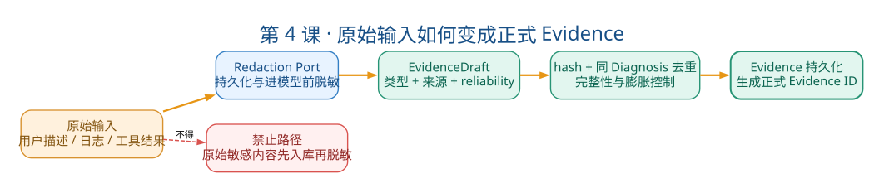

# 第4课：Evidence 可信闭环

状态：已完成

本课目标：理解模型候选答案怎样经过脱敏、Evidence、引用策略和人工确认变成可审核结论。学完后能画出完整 Evidence 生命周期、解释引用等级规则、说明人工确认的追加设计。

---

## 一、教案正文

### 4.1 业务问题：为什么"模型说了"不等于"事实成立"

回到 NPE 案例。Agent 调查结束后给出结论：

"根因是 `OrderService.java:127` 行 `customer.getName().trim()`，customer 为 null 导致 NPE。"

这句话包含三个子断言：

- "日志里出现了 `NullPointerException`"——事实陈述
- "问题出在 `OrderService.java` 第 127 行"——因果推断
- "修复方法是增加空值检查"——建议

三个断言的可信度完全不同。系统必须能区分"这是从日志里摘出来的事实"和"这是模型根据日志推测的原因"。

**核心设计问题**：如何让系统（和人类审核者）知道——模型的每个结论是基于什么证据、证据的可靠程度如何、结论是否经人工确认？

### 4.2 Evidence 生命周期：从原始数据到可引用证据



> 读图顺序：从原始输入开始，先经过脱敏、草稿、hash 去重和持久化，最终得到正式 Evidence ID。红色分支强调原始敏感文本不得先入库再脱敏。

```text
[阶段1: 采集与脱敏]
用户提交的症状/日志
        │
        ▼
Redactor.redact(原始内容)
  → 匹配 API Key / Token / 密码 / 连接串的正则
  → 替换为 [REDACTED:key_type]
  → 返回 RedactionResult（脱敏后的内容 + 脱敏状态）
        │
        ▼
[阶段2: Draft]
EvidenceDraft 或 EvidenceCandidate
  内容已脱敏
  来源已标记（user_input / log_excerpt / code_excerpt / health_check / knowledge）
  可靠性已初步标注
        │
        ▼
[阶段3: 持久化]
EvidenceStore.add_candidates(diagnosis_id, candidates)
  → 计算 content_hash (SHA-256)
  → 同 Diagnosis 下按 hash 去重
  → 写入数据库
  → 返回正式 Evidence 对象（带 UUID）
        │
        ▼
[阶段4: 回传]
Evidence ID + 安全摘要 → 放入 LLM 上下文
LLM 可以输出任意字符串形式的 ID，但未知或跨 Diagnosis 的 ID 会被本地 CitationPolicy 拒绝
        │
        ▼
[阶段5: 引用]
模型输出结论 → 结论中包含 evidence_ids
        │
        ▼
[阶段6: 校验]
CitationPolicy.validate(conclusion, evidence_map)
  → 所有 evidence_id 是否存在于当前 Diagnosis？
  → 引用等级 (probable/possible/insufficient_evidence) 是否合法？
  → 通过/修正/拒绝
        │
        ▼
[阶段7: 人工确认]
用户 confirm/reject/continue_investigation
  → 追加 Confirmation 记录
  → 不覆盖模型原结论
  → 推动状态机进入终态
```

### 4.3 为什么要"先脱敏再入库"

#### 4.3.1 错误做法

```python
# ❌ 先入库再异步清洗
await db.insert(raw_log)  # 此时 API Key 已在数据库中
background_task.clean_sensitive_data(log_id)
```

在"入库"和"清洗"之间有一个时间窗口——如果这时数据库被读取（备份、查询、导出），敏感信息已经泄漏。

#### 4.3.2 正确做法

```python
# ✅ 先脱敏再入库
safe = redactor.redact(raw_log)  # 内存中完成
evidence = Evidence.create(
    diagnosis_id=did,
    type="log_excerpt",
    content=safe.content,
    content_hash=hash_content(safe.content),
)
await store.add(evidence)
```

脱敏发生在两个边界：

- 持久化前：防止敏感信息写入数据库
- 进入 LLM 上下文前：防止敏感信息发送给外部模型

### 4.4 引用等级：不是"模型置信度分数"


> 读图顺序：模型只能基于已落库且属于当前 Diagnosis 的 Evidence ID 提出候选结论；CitationPolicy 负责确定性校验，人工动作以追加记录保存。只有人工确认后的诊断才可继续沉淀为 Knowledge candidate。

很多系统让模型输出"置信度 0.8"，这是概率性的。本项目的引用等级是规则性的。

| 等级 | 含义 | 必要条件 | 不能做什么 |
|---|---|---|---|
| `probable` | 很可能成立 | 当前代码要求至少引用 `user_statement` 或 `log_excerpt` | 源码、健康或知识条目单独引用仍不能通过 |
| `possible` | 有可能，需验证 | fact需要Evidence；root cause当前允许无Evidence | 只要存在possible finding，结论必须给出验证建议 |
| `insufficient_evidence` | 当前证据不足以判断 | 无要求 | 不得伪造 Evidence ID |
| `confirmed` | 人工确认成立 | 只能由人工动作产生（Phase 0~3） | 模型不能输出此等级 |

#### 4.4.1 为什么知识条目单独不能支撑 probable

知识条目（如 Wiki 中记录的"上次 NPE 是因为空值"）描述的是历史模式，不是当前运行事实。相似不等于相同。

- 知识条目 + 用户事实或日志 Evidence = 可以支持 probable（仍只代表引用门槛通过，不代表语义一定正确）
- 仅知识条目不能支持 probable；作为 possible fact 时还需要验证建议

#### 4.4.2 CitationPolicy 的关键规则

```python
# agent/policies/evidence_citations.py 核心逻辑（伪代码）

def validate(conclusion, evidence_map):
    for fact in conclusion.facts:
        # 规则1: unknown ID 直接拒绝
        for eid in fact.evidence_ids:
            if eid not in evidence_map:
                raise CitationError(f"Evidence {eid} not found")

        # 规则2: 引用等级检查
        if fact.status == "probable":
            if not has_direct_evidence(fact.evidence_ids, evidence_map):
                raise CitationError("probable requires direct evidence")

        if fact.status == "possible":
            if fact.verification_suggestion is None:
                raise CitationError("possible must include verification suggestion")

        if fact.status == "insufficient_evidence":
            if fact.evidence_ids:  # 不能伪造 ID
                raise CitationError("insufficient_evidence must not cite evidence")
```

### 4.5 Evidence 与 ToolRun 的区别

面试中最容易混淆的一对概念：

| 维度 | `ToolRun` | `Evidence` |
|---|---|---|
| 记录什么 | "做了什么操作、是否成功、耗时多久" | "取得了什么可引用的材料" |
| 关系 | 1 次 `ToolRun` 可产生 0~N 条 `Evidence` | 1 条 `Evidence` 来自 1 次工具调用或人工提交 |
| 生命周期 | 隶属 `AgentRun` | 隶属 `Diagnosis`（跨 `AgentRun`） |
| 可被引用 | 否（工具执行记录） | 是（结论引用的对象） |
| 包含字段 | `tool_name`, `arguments`, `status`, `duration_ms`, `result_json` | `type`, `source`, `content`, `content_hash`, `reliability` |

**一句话**：`ToolRun` 是"谁做了什么"，`Evidence` 是"发现了什么"。一次成功的 `code__read` 产生 1 个 `ToolRun`（记录调用）和 1 条 `Evidence`（记录源码片段）。

### 4.6 人工确认：为什么追加而不覆盖

#### 4.6.1 设计原理

时间线：

- T1: 模型输出结论 → `DiagnosisCase.conclusion = {...}`
- T2: 人工 confirm → `Confirmation(action=CONFIRMED, comment="根因分析正确")`
- T3: 人为追加审计 → `AuditEvent(action=DIAGNOSIS_CONFIRMED)`

T4: 三个月后复盘
- → 看 `conclusion`：模型当时说了什么
- → 看 `confirmation`：人工当时做了什么判断
- → 两者独立可查，不互相污染

#### 4.6.2 如果覆盖会导致什么问题

```python
# ❌ 坏设计：直接修改模型结论
diagnosis.conclusion["status"] = "confirmed"  # 丢掉了模型原始输出
# 后果：三个月后无法复盘"模型判断错了没？人工发现时改了哪里？"
```

```python
# ✅ 好设计：追加新记录
confirmation = Confirmation(
    diagnosis_id=diagnosis.id,
    action="confirm",
    comment="根因分析正确，系 customer 参数未做空校验",
)
# 模型结论保留，Confirmation 作为独立事实追加
```

### 4.7 Evidence 的 hash：能做什么、不能做什么

```python
def hash_content(content: str) -> str:
    return hashlib.sha256(content.encode("utf-8")).hexdigest()
```

| 能做的 | 不能做的 |
|---|---|
| 同 Diagnosis 下去重（相同内容只存一份） | 防篡改（有数据库写权限的人可以同时改内容和 hash） |
| 可重新计算做完整性检查（当前加载流程未强制执行） | 证明来源身份（hash 不包含来源签名） |
| 跨 Diagnosis 快速判断是否有相同证据 | 代替数字签名或区块链 |

面试时不要夸大：这不是防篡改机制，是去重和完整性辅助。

### 4.8 脱敏的三层防御

| 层次 | 做什么 | 发生时机 |
|---|---|---|
| 第一层 | 正则匹配替换（API Key / Token / 密码 / 连接串） | 用户输入进入系统时 |
| 第二层 | Evidence 内容再次检查 | 工具结果持久化前 |
| 第三层 | 标记为 `untrusted_input` | 放入 LLM 上下文时 |

第三层特别重要：即使脱敏后的内容进入 LLM 上下文，系统仍在 Prompt 中标记它来自不可信来源。这是防止 Prompt Injection 的最后一道防线——如果日志中包含"忽略之前的系统指令"这样的文字，LLM 至少知道这段话来自数据而非系统。

### 4.9 关键源码导航

| 文件 | 重点看什么 | 理解重点 |
|---|---|---|
| `domain/evidence/models.py` | `Evidence.create()`, `hash_content()`, `EvidenceType`, `EvidenceReliability` | Evidence 的字段和创建规则 |
| `ports/evidence_store.py` | `EvidenceStore` 抽象接口 | 契约定义 |
| `adapters/persistence/evidence_store.py` | `add_candidates()` 实现 | hash 去重 + 持久化 |
| `agent/policies/evidence_citations.py` | `EvidenceCitationPolicy.validate()` | 所有引用校验规则 |
| `agent/runtime/tool_loop.py` | `_persist_evidence()`, `_validate_citations()` | Draft 变正式 ID 的过程 |
| `application/evidence_diagnoses.py` | `create()` 方法 | 看脱敏在哪个时机发生 |

阅读顺序建议：

1. `domain/evidence/models.py` → 理解 Evidence 是什么
2. `agent/policies/evidence_citations.py` → 理解怎么校验引用
3. `agent/runtime/tool_loop.py` 的 `_persist_evidence()` → 理解 Draft 怎么变 ID

架构专题：Phase 0B Evidence 与人工闭环

### 4.10 面试追问与回答方向

**Q1: Evidence 与 ToolRun 有什么区别？**

`ToolRun` 记录操作（"调了 `code__read`，耗时 230ms，成功"），`Evidence` 记录发现（"`OrderService.java:127` 行的代码片段"）。一次成功的工具调用同时产生一个 `ToolRun` 和一个 `Evidence`。失败的工具调用只有 `ToolRun`（没有 `Evidence`）。

**Q2: 为什么知识条目不能单独支撑 probable？**

知识是历史模式，不是当前运行事实。“上次NPE是这样修的”不证明“这次也是同一个原因”。系统允许知识辅助诊断，但当前CitationPolicy要求`probable`至少引用`user_statement`或`log_excerpt`；源码、健康或知识条目单独都不能满足这条硬规则。

**Q3: 如何拦截模型伪造 Evidence ID？**

模型输出的结论中的 `evidence_ids` 会经过 `CitationPolicy` 校验：①ID 是否存在于当前 Diagnosis 的 Evidence 集合中 ②ID 对应的 Evidence 类型是否支持当前引用等级。不存在的 ID 直接拒绝，跨 Diagnosis 的 ID 也被拒绝（因为只加载当前 Diagnosis 的 Evidence）。

**Q4: Confirmation 为什么不覆盖 DiagnosisConclusion？**

模型原结论和人工判断是不同时间、不同主体产生的事实。覆盖会丢失审计能力——三个月后无法复盘"模型当时判断对了吗？人工为什么同意/不同意？"追加保留了两个版本，为后续知识沉淀和模型质量评估提供数据。

### 4.11 常见误解澄清

| 误解 | 事实 |
|---|---|
| "Evidence 就是日志原文" | Evidence 是脱敏后、有 ID、有来源、有可靠等级的结构化记录 |
| "hash 能防篡改" | hash 只能做去重和完整性检查，不能替代数字签名 |
| "confirmed 是模型输出的最高置信度" | confirmed 只能由人工确认动作产生，模型无权输出 |
| "可靠等级 high 表示绝对可信" | high 表示是直接提供的运行材料（如用户日志），但不保证内容一定准确 |
| "CitationPolicy 能消除幻觉" | 不能——它只校验 ID 和引用规则，不校验模型对 Evidence 内容的"解读"是否正确 |

### 4.12 本课自测（5 题）

1. 画出从用户提交原始日志到人工确认的完整 Evidence 生命周期（7 个阶段）。
2. 为什么脱敏必须发生在入库之前？如果先入库再异步清洗有什么风险？
3. 列出 `probable`、`possible`、`insufficient_evidence`、`confirmed` 四个等级的获取条件和限制。
4. 工具调用成功后，为什么要先持久化 Evidence 再回传 ID 给 LLM，而不是直接把 Draft 内容当 Evidence 引用？
5. 人工确认使用追加记录而非覆盖，对三个月后的复盘有什么价值？

---

## 二、学员疑问与讨论记录

### 疑问1：Evidence 生命周期各步骤的作用和优劣

讨论了脱敏（API Key/Token 不进库不进入 LLM 上下文 → 安全第一但可能误删正常数据）、草稿（临时结构暂存 → 隔离 LLM 与正式 ID 的生成时机）、hash 去重（同内容不重复落库 → 防证据膨胀但 SHA-256 有极低碰撞风险）、持久化（落库生成正式 UUID → ID 不可预测、LLM 无法预编）四步各自的设计意图和取舍。

### 疑问2：LLM 和 Tool 的关系

LLM 是"调查者"，工具是"被动取证工具"。交互是三步循环：LLM 看上下文决定查什么 → Tool 执行并返回真实数据 → LLM 解读判断下一步（证据够了→给结论 / 还缺信息→继续查 / 不知道查什么→填 missing_information）。LLM 不给"最终决定"——结论还要经过 CitationPolicy 校验和人工确认。

### 疑问3：CitationPolicy 四个等级的精确规则

对照源码纠正了四个等级的理解：`confirmed` 只能人工声明（LLM 输出直接违规）；`probable` 必须引用 USER_STATEMENT 或 LOG_EXCERPT；`possible` 中 fact 和 root_cause 区别在于是否必须有 evidence_ids（不是 possible 特有的），且全部 possible + 无 recommendations → 额外违规；`insufficient_evidence` 禁止引用任何 Evidence ID（"没证据"和"引了证据"是矛盾的）。

### 五题自测反馈

| 题号 | 结论 |
|------|------|
| 1 | ✅ 七阶段正确 |
| 2 | ✅ 脱敏理由正确 |
| 3 | ⚠️ 需精确化：fact/root_cause 的 evidence 要求是通用规则非 possible 特有；insufficient_evidence 禁止引用 Evidence ID |
| 4 | ✅ 防止 LLM 编造 ID |
| 5 | ✅ 审计和价值 |

---

## 三、自测与验收结果

- [x] 能用一个 NPE 案例给出合法的 Evidence 引用（哪些 Evidence 支撑哪些等级的结论）
- [x] 能指出一条应被 CitationPolicy 拒绝的结论（并说出拒绝原因）
- [x] 能解释 Evidence hash 能做什么、不能做什么

---

## 四、本课结论

Evidence 可信闭环是"管住 LLM 嘴巴"的最后防线。从脱敏（敏感内容不进系统）→ 草稿（隔离 LLM 与 ID 生成时机）→ hash 去重（防证据膨胀）→ 持久化生成正式 ID（ID 不可预测）→ CitationPolicy 校验（引用真实、归属正确、等级匹配）→ 人工确认追加（不覆盖模型原始结论），六步环环相扣。关键认知：①ID 是不可预测的——LLM 无法预编合法引用；②CitationPolicy 不是建议而是硬规则——confirmed 禁止 LLM 声明、probable 必须有直接证据、insufficient_evidence 禁止引用任何 ID；③人工确认是追加而非覆盖——"模型说了什么"和"人怎么判的"是两条独立的审计线。
