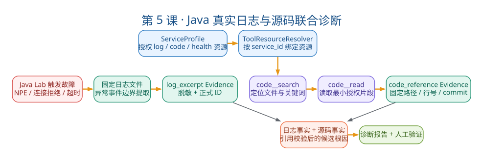

# 第5课：Java 应用联合诊断

状态：已完成

本课目标：把 Java Lab 真实故障与 Python Agent 的日志、源码、配置、健康工具串成一条 Evidence 链。学完后能讲清完整端到端链路，理解三层授权边界。

## 一、教案正文

### 5.1 业务场景：从 "500 错误" 到 "第 127 行"

这是一个完整的端到端场景：

```text
运维发现: 订单查询 API 返回 500
↓
你打开平台: 粘贴症状 + 异常堆栈
↓
系统: 创建 Diagnosis → 启动 Agent Run
↓
Agent: 我看到了 NullPointerException，让我读日志
↓  工具: log__search
Agent: 堆栈指向 OrderService.java:127，让我读代码
↓  工具: code__search → code__read
Agent: 看到了，customer.getName().trim()，没有判空
↓
Agent: 根因是 customer 为 null 时调用 trim()
Evidence: [log_excerpt#1, code_excerpt#2]
↓
你: 确认 → CONFIRMED
```

这个过程在代码层面涉及 4 个工具、3 层授权边界、1 个 Java Lab。本课逐一拆解。

### 5.2 端到端链路：11 个步骤



> 读图顺序：左侧是真实故障日志形成 `log_excerpt` Evidence；上方服务目录授权源码与健康资源；两条证据路径在候选根因处汇合。系统不是“扫描任意本地代码”，而是在 `ServiceProfile` 与 Adapter 双重边界内读取最小源码片段。

```text
[1] Postman/脚本触发 Java Lab 故障
    → Spring Boot 写入固定日志文件

[2] 用户在平台注册 ServiceProfile
    → 指定源码/日志/配置目录、健康检查目标

[3] POST /api/v1/services/{id}/diagnoses
    → 提交症状 + 日志片段
    → Redactor 脱敏
    → 创建 DiagnosisCase + user_statement Evidence + log_excerpt Evidence

[4] POST /api/v1/diagnoses/{id}/runs
    → 启动 AgentRun
    → 从 ServiceProfile 解析资源 → ToolResourceContext

[5] LLM 第1轮：log__search
    → 读取授权日志目录
    → 按关键词 + 事件边界提取片段
    → 生成 log_excerpt Evidence

[6] LLM 第2轮：code__search  "OrderService"
    → 在授权源码目录中搜索
    → 返回候选文件名列表

[7] LLM 第3轮：code__read  "OrderService.java" 行120-140
    → 在授权目录中读取最小片段
    → 生成 code_excerpt Evidence

[8] LLM 输出候选结论
    → 症状摘要 + 事实列表 + 根因 + 建议
    → evidence_ids: [log_evidence_id, code_evidence_id]

[9] CitationPolicy 校验
    → 两个 Evidence ID 都属于当前 Diagnosis
    → log + code 同时存在 → 根因可以是 probable

[10] DiagnosisCase: INVESTIGATING → WAITING_FOR_CONFIRMATION

[11] 人工确认 → CONFIRMED
     → 生成 Report（从持久化事实聚合）
```

### 5.3 Java Lab：为什么需要它

这不是一个普通的 Demo 数据，而是一个可控、可重复的小型故障实验室。

| Java Lab 提供的 | 价值 |
| --- | --- |
| 真实 Spring Boot 应用 | 日志格式、异常堆栈和运行时行为与生产环境一致 |
| 三种确定性故障 | NPE、连接拒绝（Connection Refused）、超时（Timeout） |
| 固定触发方式 | 同一 REST 端点反复触发同一故障 |
| 固定日志路径 | 平台可精确读取，不需要扫描全盘 |
| 固定源码位置 | 诊断结果可验证（知道"正确答案"） |
| 不涉及真实用户数据 | 安全、可反复实验 |

面试时一句话：Java Lab 的价值不是"能跑起来"，而是提供了一个"答案已知的可重复环境"——这让模型结论能够与真实堆栈和源码位置核对，而不是靠人为编造的一段"标准答案日志"。

### 5.4 三层授权边界：不是"能读文件就行"

只读工具不等于没有安全风险。本项目在三个层次上限制 Agent 的访问范围：

#### 第一层：ServiceProfile 显式授权

```json
{
  "name": "diagnosis-java-lab",
  "code_workspace_path": "D:/AgentStudy/diagnosis-java-lab",
  "log_directory": "D:/AgentStudy/diagnosis-java-lab/logs",
  "config_workspace_path": "D:/AgentStudy/diagnosis-java-lab/src/main/resources",
  "health_targets": ["java-lab=http://127.0.0.1:8080/actuator/health"]
}
```

关键设计：Agent 只能访问这些显式指定的路径。它不能扫描用户的整个工作区，也不能访问 `C:/Windows` 或 `/etc/passwd`。

#### 第二层：ToolResourceResolver 动态绑定

```python
async def resolve(diagnosis: DiagnosisCase) -> ToolResourceContext:
    service = await services.get(diagnosis.service_id)
    return ToolResourceContext(
        code_repository=LocalCodeRepository(service.code_workspace_path),
        log_reader=LocalLogFileReader(service.log_directory),
        config_repository=LocalConfigRepository(service.config_workspace_path),
        health_check_client=HttpHealthCheckClient(parsed_health_targets, redactor),
    )
```

关键设计：同一个 `code__read` 工具，在不同 Diagnosis 中拿到的 `LocalCodeRepository` 指向不同目录。工具契约不变，变的是注入的 Adapter。

#### 第三层：Adapter 内部限制

每个 Adapter 在执行时还有自己的边界：

| Adapter | 限制措施 |
| --- | --- |
| `LocalCodeRepository` | 根目录限定、相对路径、禁止 `..`、后缀白名单（`.java` `.xml` `.properties` `.yml`）、行号范围、输出大小 |
| `LocalLogFileReader` | 目录限定、文件名白名单、事件边界识别、前后文行数限制 |
| `LocalConfigRepository` | 目录限定、敏感关键词过滤（`password`/`secret`/`key`）、输出大小 |
| `HttpHealthCheckClient` | 目标必须预配置，当前只允许 `http` loopback地址，禁止凭据/fragment，最多5秒超时且不跟随重定向 |

### 5.5 四个诊断工具的详细拆解

#### 5.5.1 log__search：从海量日志中精准提取

输入: `keyword="NullPointerException", context_lines=5`

处理:

```text
1. 遍历授权目录下的日志文件
2. 按行搜索关键词
3. 识别事件边界（从异常类型开始，到下一个异常类型或空行结束）
4. 提取匹配事件 + 上下文行
5. 截断到 max_output_bytes
```

输出:

- `data`: 结构化匹配摘要
- `model_summary`: 截断后的日志片段
- `evidence_drafts`: `[EvidenceCandidate(type=log_excerpt, content=完整片段)]`

事件边界的重要性：如果只按关键词前后截固定行数，可能把下一个不同异常的内容混入当前 Evidence，给模型制造矛盾信号。

#### 5.5.2 code__search：在授权工作区定位文件

输入: `query="OrderService", max_results=5`

处理:

```text
1. 在 code_workspace_path 下递归搜索
2. 对授权文件名和文件内容做大小写无关的子串匹配
3. 过滤后缀白名单
4. 返回前 max_results 个匹配
```

输出:

- `data`: 带路径、行号和匹配文本的候选列表
- `model_summary`: 候选路径、行号和匹配摘要（受输出限制）
- `evidence_drafts`: `[]`（搜索本身不产生 Evidence）

为什么搜索不产生 Evidence：搜索结果只是候选，不是事实。只有 `code__read` 实际读取后才产生 Evidence。

#### 5.5.3 code__read：读取最小源码片段

输入: `file_path="src/main/java/.../OrderService.java", start_line=120, end_line=140`

处理:

```text
1. 校验 path 在 code_workspace_path 内且无 ".."
2. 校验后缀在白名单
3. 读取指定行范围
4. 截断到 max_output_bytes
```

输出:

- `data`: 行号 + 内容
- `model_summary`: 截断后的代码片段
- `evidence_drafts`: `[EvidenceCandidate(type=code_excerpt, source_reference=文件:行号)]`

#### 5.5.4 health：检查依赖服务状态

输入: `target_name="java-lab"`

处理:

```text
1. 从 ServiceProfile.health_targets 查找目标
2. 校验 URL 格式和协议
3. 发送 GET 请求（带超时）
4. 解析响应
```

输出:

- `data`: `{status: "UP"|"DOWN", details: {...}}`
- `model_summary`: 健康状态摘要
- `evidence_drafts`: `[EvidenceCandidate(type=health_check)]`

### 5.6 服务目录：从"全局工具"到"服务级工具"

#### 5.6.1 Phase 1~2 的问题

在引入 ServiceProfile 之前，工具的资源配置来自全局 Settings：

```python
# Phase 2 时代：所有诊断共用同一个源码目录
settings.code_workspace_path = "D:/AgentStudy/diagnosis-java-lab"
```

问题：如果有多个被诊断的服务（Java Lab + Go Service + Python API），全局配置无法区分。

#### 5.6.2 Phase 3C 的解决方案

`ServiceProfile` + `ToolResourceResolver` 实现了"能力绑定"：

同一个 `code__search` 工具：

- 服务 A 的 Diagnosis → `LocalCodeRepository(path=服务A源码目录)`
- 服务 B 的 Diagnosis → `LocalCodeRepository(path=服务B源码目录)`
- 没关联服务的 Diagnosis → 回退到全局默认资源

为什么不为每个服务注册不同名称的工具？因为工具契约（参数格式、返回结构）是相同的，只是 Adapter 指向的目录不同。为每个服务注册 `code__search_a`、`code__search_b` 会导致工具数量膨胀，且每次新增服务都需要改 Registry。

### 5.7 关键源码与脚本

| 文件 | 重点看什么 |
| --- | --- |
| `domain/service_profile/models.py` | `ServiceProfile` 的字段：`code_workspace_path`, `log_directory` 等 |
| `application/diagnoses.py` | `build_service_tool_resource_resolver()` 资源解析逻辑 |
| `tools/log_search.py` | `LogSearchTool`，看事件边界识别 |
| `tools/code.py` | `CodeSearchTool` + `CodeReadTool`，看路径后缀限制 |
| `tools/config.py` | `ConfigReadTool`，看敏感关键词过滤 |
| `tools/health.py` | `HealthCheckTool`，看 URL 约束 |
| `ports/code_repository.py` | `CodeRepository` 抽象接口 |
| `adapters/code/local_workspace.py` | `LocalCodeRepository` 的路径安全措施 |

架构专题：Phase 1 扩展架构 · 端到端链路图 · Phase 3C 服务上下文

### 5.8 面试追问与回答方向

**Q1: 没有全量代码 RAG，Agent 如何定位源码？**

Agent 分两步：先 `code__search`（对授权文件名和文件内容做大小写无关的子串匹配），拿到候选路径与行号；再 `code__read`（精确读取行范围）。这和"全文向量检索"是不同策略——前者依赖 LLM 对异常堆栈的理解（从类名推断文件名），后者依赖语义相似度。当前规模下关键词/文件名搜索足够，全量向量化在项目规模扩大时再评估。

**Q2: 只读工具是否仍有安全风险？**

有。读配置可能泄露密码（需要敏感关键词过滤），读源码可能泄露知识产权（需要授权目录限定），读日志可能包含个人信息（需要脱敏），健康检查可能成为 SSRF（需要 URL 预配置 + 协议限制）。风险不能只按"是否修改状态"分类。

**Q3: 为什么远程源码必须固定 commit？**

诊断时日志来自已部署版本，如果 Agent 读取的是 main 分支最新代码，引用可能与运行代码不一致。固定 commit 使 Code Evidence 可以回答"依据哪个版本的哪几行代码"，保证可追溯性。

**Q4: 为什么日志 Evidence 与 Code Evidence 需要同时存在？**

日志证明"运行时发生了什么"，代码证明"那段逻辑是怎么写的"。两者结合才能建立因果链——单有日志只能描述现象，单有代码只能展示逻辑。当前CitationPolicy没有强制“日志+源码”同时引用；这是本项目固定源码诊断案例的推荐质量标准。当前代码对probable的硬门槛是用户事实或日志Evidence。

### 5.9 常见误解澄清

| 误解 | 事实 |
| --- | --- |
| "能读文件就是能读所有文件" | `ServiceProfile` 显式授权 + Adapter 路径限定，Agent 只能读授权目录 |
| "搜索代码和搜索日志一样" | `code__search` 是文件名匹配，`log__search` 是内容搜索 + 事件边界 |
| "ServiceProfile 是自动发现的" | `ServiceProfile` 需要用户显式注册，当前不做自动扫描 |
| "源码工具读的是运行时版本" | 本地文件版本可能和运行版本不一致；远程 GitHub 通过固定 commit 解决此问题 |

### 5.10 本课自测（5 题 + 操作题）

1. 讲清从 Java Lab 故障触发到人工确认的完整 11 步链路。
2. 三层授权边界分别是什么？每层由哪个组件负责？
3. 日志读取的"事件边界"是什么？如果不做事件边界处理，会导致什么问题？
4. 同一个 `code__read` 工具如何在服务 A 和服务 B 的 Diagnosis 中指向不同目录？
5. 为什么源码 Evidence 和日志 Evidence 需要同时存在？只用日志或只用源码各有什么局限？

**操作题**：运行 `uv run python scripts/demo-phase3-service.py`，在输出中找到 log Evidence、code Evidence、ToolRun、Trace 和 Report，一一对应。

---

## 二、学员疑问与讨论记录

### 疑问1：11 步链路中前两步与后续九步是什么关系？

学员初读 11 步链路时产生困惑——为什么 [1] 要提 Postman/脚本触发故障？为什么 [3] 和 [4] 都是 API 调用却不合并？

**探索过程**：对照 `api/routes/diagnoses.py` 和 `application/diagnoses.py` 中的 `run()` 方法，发现 [1] 和 [2] 发生在诊断平台之外：一个是 Java Lab 的"制造案发现场"，一个是一次性的服务目录配置。真正的诊断通用流程从 [3] 才开始。

**关键洞察**：
- [3] `POST /services/{id}/diagnoses` 和 [4] `POST /diagnoses/{id}/runs` 是"创建资源 vs 触发动作"的分离——前者创建 `DiagnosisCase`（status=CREATED），后者调用 `run()` → `_start_investigation()` 将状态推进到 INVESTIGATING。分离的好处：同一个诊断可以反复运行、权限粒度不同、写入的是不同数据库表（diagnosis vs agent_run）
- [3] 在创建 Diagnosis 时就已经做了 Redactor 脱敏 + 生成了 `user_statement` 和 `log_excerpt` 两份初始 Evidence，这解释了为什么 [5] 的 `log__search` 不是"凭空搜"——它搜的是 ServiceProfile 授权的目录
- 一旦 ServiceProfile 注册完成，后续 9 步链路与具体被诊断的服务语言或框架完全解耦——换 Go 服务、Python 服务，第 3 到第 11 步的代码一行都不需要改

### 疑问2：内网部署是否消除只读工具的安全风险？

学员提出一个常见误区："大模型和诊断服务都在公司内网部署，敏感关键词过滤和路径限定是否多此一举？"

**探索过程**：逐条对照文档 5.4 节的三层授权边界（ServiceProfile / ToolResourceResolver / Adapter），分析每种风险在内网环境下是否真的消失。

**关键洞察**：内网不是安全银弹，它只是改变了威胁模型——从"外部攻击者"变为"内部横向越权 + 信息暴露面扩大"。四条具体论证：
1. **密码泄露**：Agent 读到 `application.yml` 中的数据库密码后，密码同时进入 Evidence（持久化到 DB）和 LLM prompt（LLM 服务日志），任何一个有平台读权限的人都能在 Evidence 里看到密码。最小权限原则被破坏
2. **源码泄露**：不等于"外部看不到就行"。其他项目组的开发、运维、客服都可能在诊断记录里看到核心计费逻辑，这违反最小权限
3. **个人信息泄露**：中国《个保法》不认"我们在内网"作为免责理由，日志中的手机号/身份证号被读入 Evidence 就是一次未授权的信息扩散
4. **内网 SSRF 反而更危险**：外网 SSRF 打不到内网服务，内网 SSRF 可以直接横向移动到 Redis、云元数据服务等

结论：三层授权边界的每一项防护在内网场景下都不能省。

### 疑问3：为什么 Java Lab 只有三种确定性故障？非确定性能诊吗？

学员注意到 Java Lab 只提供 NPE、Connection Refused、Timeout 三种故障，质疑诊断能力是否过于局限。

**探索过程**：对照 `agent/strategies/router.py` 的三条路由（Application / Network / Configuration）和四种诊断工具（log__search / code__search / code__read / health），发现三种故障恰好一对一覆盖了全部策略和工具组合——这是刻意设计，目的不是展示覆盖面，而是验证每种策略的端到端链路都能走通。

**关键洞察**：
- 确定性 vs 非确定性的本质区别不在"能不能查"，而在"答案是否可验证"。确定性故障（同一端点必复现、堆栈指向同一行代码）提供了已知标准答案，可以校准 Agent 的正确性；非确定性故障（OOM、死锁、间歇性超时）Agent 照查不误，只是没有标准答案来核对结果
- 这个区分主要是**教学价值 vs 生产价值**的取舍：Java Lab 选前者是为了可验证性，真实运维场景中后者才是主流
- 用词精准化："确定性故障"和"非确定性故障"的区分远不止答案已知/未知、平台能/不能诊这两个维度，而是一个五维的区别矩阵（触发条件、堆栈稳定性、结论可复现性、教学验证价值、生产价值）

### 疑问4：大日志文件、滚动日志、跨文件异常怎么处理？

学员在理解 `log__search` 的五步流程后，提出三个工程场景：文件 500MB 怎么办？每天轮转 `app.log.1` / `app.log.2` 怎么办？异常堆栈跨两个文件怎么办？

**探索过程**：深入阅读 `adapters/logs/local_file.py`（158 行完整实现）和 `tools/log_search.py`（89 行工具层），逐行分析这三个场景的处理方式。

**关键洞察**：
- **大文件**：通过 `max_tail_bytes`（默认 256KB，上限 1MB）只读尾部。代码逻辑是 `seek(size - max_tail_bytes)` + `read(max_tail_bytes)`，O(1) 复杂度，设计假设是"最近异常最有诊断价值"。这不是能力不足，而是限制了内存占用和 IO 时间的工程约束
- **滚动日志**：`read_latest(relative_path=...)` 只接受单个文件路径，不支持通配符/目录遍历。Agent 必须明确指定文件名。当前 Java Lab 只写一个固定日志文件所以不是问题，生产环境需要 Agent 先了解文件命名规则
- **跨文件异常**：同理，`read_latest` 是单文件操作，不存在跨文件拼接逻辑。生产场景需要 Agent 多次调用 `log__search` 分别读取

当前阶段这些是刻意的边界，而非遗漏——所有限制都有对应的设计约束（`max_tail_bytes`、`ALLOWED_SUFFIXES`、`resolve(strict=True)`、`relative_to` 路径防穿越），说明作者清楚自己在控制什么。拓展方向是在 Agent 工具层增加 `log__list` 枚举可用文件，或在 Adapter 层支持通配符+按时间排序取最近 N 个，`LogReader` 核心接口不需要变。

### 疑问5：自测五项复盘

学员完成 5.10 节自测后逐题复盘，暴露出共同的短板：**能说出名词和概念，但展不开背后的实现机制**。

**逐题诊断**：
1. **11 步链路**（4/5）：骨架正确，但缺少"前两步是外部准备、后九步是通用流程"的分层表述，步骤之间缺少因果箭头（如 [3] 创建的初始 Evidence 与 [5] log__search 的关系）
2. **三层授权边界**（3/5）：三层名称认对，但被追问"每层由哪个组件负责"时只能说出第一层（ServiceProfile），第二层 ToolResourceResolver 和第三层各 Adapter 的具体职责说不清楚
3. **事件边界**（5/5）：核心答对——从异常类型开始到下一个异常类型或空行结束。补充了"不做事件边界会把不同异常内容混入 Evidence 制造矛盾信号"
4. **ToolResourceResolver 动态绑定**（2/5）：只说了名词，未展开 core 机制——`build_service_tool_resource_resolver()` 返回的闭包在每次 `run()` 时根据 `diagnosis.service_id` 查出 ServiceProfile，动态构造指向不同 root 路径的 Adapter 实例；工具契约（参数格式、返回结构）完全不变，变的只是注入的 Adapter。这也是为什么不需要为每个服务注册不同名称工具的原因
5. **Evidence 互补**（2/5）：答了"互相"但论证不完整。标准答案应该是因果链三段论——日志显示 NPE at line 127（现象） + 代码显示 line 127 是 `customer.getName().trim()` 未判空（原因） → 构成完整因果推断。缺一个就只能描述现象或展示逻辑，无法建立关联

**自评总分**：3.2/5。骨架正确但肌肉不足，第 2、4、5 题是面试高频追问点，需要能口述展开版本而非只抛名词。

---

## 三、自测与验收结果

已验收。完成情况：

- [x] 讲清从 Java Lab 故障触发到人工确认的完整 11 步链路（需补上"前两步外部准备 vs 后九步通用流程"的分层表述）
- [x] 三层授权边界的定义和负责组件（ServiceProfile 显式授权 / ToolResourceResolver 闭包动态绑定 / Adapter 内部限制）
- [x] 日志事件边界的含义和缺失后果（混杂不同异常，给模型制造矛盾信号）
- [x] `code__search` vs `code__read` 的不同用途（候选定位 vs 精确读取并生成 Evidence）
- [x] 源码 Evidence 与日志 Evidence 互补因果链（现象+原因→完整推断）
- [ ] 操作题：运行 `demo-phase3-service.py`（待实操补做）

---

## 四、本课结论

本课以 Java Lab 确定性故障为教具，走通了从制造故障到人工确认的 11 步端到端链路。核心收获不是"怎么诊断 Java 应用"，而是理解 Agent 如何在三层授权边界内用日志+源码形成可追溯的因果证据链，以及 [3]~[11] 的通用诊断流程与外部服务语言/框架完全解耦，换 Go/Python 无需改代码。
