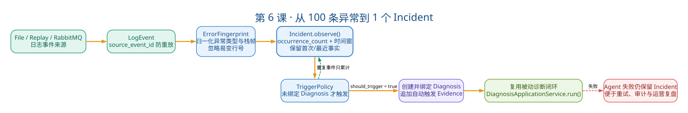

# 第6课：主动发现与 Incident

状态：已完成

本课目标：理解重复异常如何先经过确定性聚合和触发策略，再进入原有 Agent 诊断闭环。学完后能画出完整主动发现链路、解释三类去重、说出稳定指纹的设计原理。

## 一、教案正文

### 6.1 业务场景：100 条相同异常 = 1 个 Incident

场景：凌晨 3 点，订单服务开始抛 `NullPointerException`。在接下来的 1 分钟内，同一个异常出现了 100 次。

如果每条日志都创建 `Diagnosis`：

- 100 次 LLM 调用 → 费用 ×100
- 100 条诊断通知 → 运维被轰炸
- 100 个 `Diagnosis` 互不关联 → 无法判断"这是同一个问题还是 100 个不同问题"

正确做法：先识别"这 100 条日志是同一个异常"，聚合成 1 个 `Incident`，触发 1 次诊断。

### 6.2 主动发现全景：一切从日志到达开始



> 读图顺序：先看事件级防重放，再看 Fingerprint 如何把同类异常聚合进一个 Incident，最后由 TriggerPolicy 判断是否创建 Diagnosis。Agent 调查失败不会删除 Incident，因为异常事实仍需支持重试、审计与运营复盘。

```text
[外部事件源]
File Watcher / Replay Source / RabbitMQ Consumer
        │
        ▼
[第1步: 事件标准化]
DiscoveredLogEvent
  → Redaction（脱敏）
  → Normalization（规范化异常类型、消息）
  → LogEvent（领域对象）
        │
        ▼
[第2步: 指纹生成]
build_error_fingerprint(log_event)
  → 服务名 + 环境
  → 规范化异常类型（如 java.lang.NullPointerException）
  → 前 N 个业务栈帧（class#method，不含行号）
  → SHA-256 → ErrorFingerprint v1
        │
        ▼
[第3步: Incident 聚合]
Incident.observe(fingerprint, timestamp, window_duration)
  → 计算 window_key（基于时间窗）
  → 查找或创建 Incident
  → 更新 occurrence_count、last_seen_at
  → 更新 sample_message
        │
        ▼
[第4步: 触发决策]
DiagnosisTriggerPolicy.decide(aggregation)
  → source_event_id 去重？→ 跳过
  → Incident 已有 diagnosis_id？→ 跳过（已触发过）
  → 新 Incident → 触发
        │
        ▼
[第5步: 创建 Diagnosis]
ActiveDiscoveryApplicationService
  → 创建 DiagnosisCase
  → 创建初始 Evidence（sample_message）
  → 创建 AuditEvent
  → 调用原有 DiagnosisApplicationService.run()
        │
        ▼
[第6步: 复用被动诊断闭环]
AgentRun → ToolRun → Evidence → Conclusion → Confirmation
```

关键认知：步骤 1~4 完全不需要 LLM。它们是完全确定性的数据处理。LLM 只在步骤 5 创建 `Diagnosis` 之后才参与。

### 6.3 稳定指纹：为什么忽略行号

#### 6.3.1 问题

```java
// v1.0 部署版本
OrderService.java:127  customer.getName().trim()  // ← NPE 在这里

// v1.1 部署版本（上面加了一行 import）
OrderService.java:128  customer.getName().trim()  // ← 同一个 bug，行号变了
```

如果把行号放入指纹，同一根因会被拆成两个不同的 Incident。但如果完全忽略业务栈，又可能把不同根因合并。

#### 6.3.2 方案

```python
def build_error_fingerprint(service, environment, exception_type, stack_frames):
    """
    stack_frames: list of StackFrame
    StackFrame.normalized() → "com.example.OrderService#getOrder"
                              不包含行号，只包含 class#method
    """
    key_parts = [
        service,
        environment,
        exception_type.strip().lower(),
    ]
    # 取前 5 个业务栈帧（跳过框架帧如 Spring、Tomcat）
    business_frames = stack_frames[:5]
    key_parts.extend(f.normalized() for f in business_frames)

    key_string = "|".join(key_parts)
    return f"v1:{hashlib.sha256(key_string.encode()).hexdigest()[:16]}"
```

#### 6.3.3 设计取舍

| 选择 | 效果 | 风险 |
| --- | --- | --- |
| 不包含行号 | 重新编译不改变指纹 | 不同行号的同类型异常可能被合并 |
| 包含前 5 个业务栈帧 | 区分不同调用路径的同类异常 | 栈帧变化（如重构）可能拆开同一根因 |
| 包含 `algorithm_version` | 未来修改算法时能区分新旧指纹 | 需要版本迁移策略 |
| 不包含完整堆栈 | 避免因无关的框架栈帧导致指纹不稳定 | 可能忽略深层调用差异 |

面试标准回答：指纹使用 服务+环境+异常类型+前5个业务栈帧(`class#method`) 生成 `SHA-256`，加上 `algorithm_version` 前缀。忽略行号是为了容忍重新编译，保留栈帧是为了区分不同调用路径。

### 6.4 三类去重：容易混淆，必须区分

| 类型 | 去重依据 | 解决的问题 | 失败后果 |
| --- | --- | --- | --- |
| source event 去重 | `source_event_id`（外部消息 ID） | 同一条 `RabbitMQ` 消息不被重复处理 | 重复消费 |
| fingerprint 聚合 | `ErrorFingerprint` + 时间窗 | 同一故障的多次发生聚合为一个 `Incident` | 重复 Incident |
| trigger claim | `Incident.diagnosis_id` | 同一 `Incident` 只触发一次 `Diagnosis` | 重复诊断 |

#### 场景说明

时间线：

- T1: RabbitMQ 消息 `msg-001` 到达 → source event 去重（首次） → 指纹 `abc123`
- T2: RabbitMQ 消息 `msg-001` 重投（redelivery） → source event 去重（命中，跳过）
- T3: 新日志产生，RabbitMQ 消息 `msg-002` 到达 → source event 去重（首次）
  → 指纹 `abc123`（同一故障） → fingerprint 聚合（同一 Incident，更新 count）
- T4: 同一 Incident 的第三条日志 → fingerprint 聚合（更新 count）
- T5: 新 Incident（指纹 `xyz789`） → trigger claim（首次，创建 Diagnosis）
- T6: 同一个 Incident 再次触发 → trigger claim（已有 `diagnosis_id`，跳过）

### 6.5 Incident 对象：不是日志的简单集合

```python
@dataclass
class Incident:
    id: UUID
    service_id: str
    environment: str
    fingerprint: ErrorFingerprint
    window_key: str              # 时间窗标识
    occurrence_count: int        # 发生次数
    first_seen_at: datetime
    last_seen_at: datetime
    sample_message: str          # 受控样本（截断 + 脱敏）
    diagnosis_id: UUID | None    # 关联的诊断（一个 Incident 只关联一个）
    source_event_id: str | None  # 触发事件 ID（用于去重）
    status: IncidentStatus       # OPEN / DIAGNOSING / RESOLVED
```

关键设计：

- `occurrence_count` 不是 `list[LogEvent]`——不保存每一条日志，只记录"发生了多少次"
- `sample_message` 保存一条有限长度的样本，供 Diagnosis 的初始 Evidence 使用
- `diagnosis_id` 保证一个 Incident 只触发一次诊断

### 6.6 TriggerPolicy：为什么当前策略"刻意简单"

```python
class DiagnosisTriggerPolicy:
    def decide(self, aggregation: IncidentAggregation) -> TriggerDecision:
        if aggregation.duplicate_event:
            return TriggerDecision(trigger=False, reason="duplicate_source_event")

        if aggregation.incident.diagnosis_id is not None:
            return TriggerDecision(trigger=False, reason="diagnosis_already_linked")

        return TriggerDecision(trigger=True, reason="incident_without_diagnosis")
```

当前策略只有两条规则：

- 重复事件 → 不触发
- Incident 已有诊断 → 不触发

否则 → 触发

为什么不加严重度、频率阈值、静默期：

这不是"能力不足"，而是 Phase 4 的工程取舍——先让触发规则完全透明、可测试，再考虑复杂策略。模型分类不适合作为第一道触发门，因为会把成本和随机性带到每一条日志上。

未来可能的扩展方向（面试可说）：

- 严重度分级：`NullPointerException` 可能 P2，`OutOfMemoryError` 可能 P0
- 频率阈值：1 分钟内出现 N 次才触发
- 静默期：同一 Incident 确认后 24 小时内不再触发
- 服务等级：核心服务 P0，非核心服务 P3
- 时间窗口：工作时间 vs 凌晨 3 点，告警策略不同

### 6.7 失败语义：为什么 Agent 失败了也不能删除 Incident

```text
LogEvent → Incident（已持久化）
    → Diagnosis（已创建）
        → AgentRun（失败！模型超时）
```

错误做法：

```python
# ❌ 回滚一切
await delete_incident(incident_id)
await delete_diagnosis(diagnosis_id)
```

正确做法：

```python
# ✅ 保留事实，追加状态
incident.status = IncidentStatus.ERROR
incident.error_info = "Agent execution timeout"
diagnosis.status = DiagnosisStatus.INCONCLUSIVE
# LogEvent 和 Incident 仍然是已发生的业务事实
```

四种情况的语义区分：

| 情况 | Incident 状态 | Diagnosis 状态 | 运营能看到什么 |
| --- | --- | --- | --- |
| 没有异常 | 不存在 | 不存在 | — |
| 有异常但未触发（重复事件） | OPEN | 不存在 | "有异常在聚合中，尚未触发诊断" |
| 已触发但 Agent 失败 | ERROR | INCONCLUSIVE | "异常已发现，但诊断执行失败" |
| 已触发且等待确认 | DIAGNOSING | WAITING_FOR_CONFIRMATION | "诊断已完成，等待人工确认" |

这四种情况的区分对运维复盘至关重要。

### 6.8 主动发现的数据来源

| 来源 | 用途 | 使用场景 |
| --- | --- | --- |
| File Watcher | 监控本地日志文件 | 开发/测试环境，单机主动发现 |
| Replay Source | 重放历史日志 | 验收测试、回放真实场景 |
| RabbitMQ Consumer | 消费消息队列 | 企业环境，远程日志平台推送 |

三种来源最终都调用同一个 `ActiveDiscoveryApplicationService.process()`，通过 Port 抽象隔离。

### 6.9 关键源码导航

| 文件 | 重点看什么 |
| --- | --- |
| `domain/incident/models.py` | `LogEvent`, `ErrorFingerprint`, `Incident`, `build_error_fingerprint()`, `build_window_key()` |
| `domain/incident/trigger.py` | `DiagnosisTriggerPolicy.decide()` |
| `application/discovery.py` | `ActiveDiscoveryApplicationService.process()`——聚合→触发→创建Evidence→调用诊断 |
| `ports/incident_repository.py` | `IncidentRepository` 抽象接口 |
| `api/routes/incidents.py` | 主动发现 API 入口 |

#### 阅读顺序

- `domain/incident/models.py` → 理解 `build_error_fingerprint()` 为什么忽略行号
- `domain/incident/trigger.py` → 理解当前触发策略
- `application/discovery.py` → 理解完整流程和失败保留

架构专题：Phase 4 主动发现架构

### 6.10 面试追问与回答方向

**Q1: 为什么不让日志到达后直接调用 LLM？**

三条理由：①费用——同一异常可能每秒出现几十次，LLM 调用成本线性增长；②噪声——重复诊断产生重复通知和重复结论；③不可控——LLM 分类有随机性，可能这次判断为 P0、下次同样异常判断为 P3。确定性指纹+时间窗聚合先把日志变成稳定领域事实，再让 LLM 参与。

**Q2: 指纹去重与消息幂等有什么区别？**

指纹去重是"同一类异常聚合为一个 Incident"，基于业务语义（异常类型+栈帧）；消息幂等是"同一条消息不重复处理"，基于消息 ID。前者解决"异常太多"的问题，后者解决"消息重投"的问题。

**Q3: 为什么 Agent 失败不能回滚 Incident？**

Incident 是已经发生的业务事实。删除它会导致：①无法区分"没有异常"和"有异常但诊断失败"②失去后续 Replay 的基础③运维无法复盘"为什么这个异常没被处理"。正确做法是保留事实，追加失败状态。

**Q4: 如何避免同一故障在多个服务重复触发？**

当前指纹包含 `service_id`，不同服务的同一异常会产生不同指纹（也就不同 Incident）。如果希望跨服务联合诊断，需要在 Incident 之上构建"服务拓扑"和"跨服务因果推理"——这是 Phase 5 的设计方向。

### 6.11 常见误解澄清

| 误解 | 事实 |
| --- | --- |
| "主动发现 = 实时告警" | 当前是离线聚合（时间窗），不是毫秒级实时告警 |
| "Incident 保存所有日志" | Incident 只保存聚合元数据（count、时间范围、样本），不存储完整日志列表 |
| "窗口时间到了自动触发" | 窗口只用于聚合分组，触发由 `TriggerPolicy` 在每次 observe 时决策 |
| "指纹不考虑版本" | 指纹带 `algorithm_version` 前缀，允许未来算法升级时区分新旧指纹 |

### 6.12 本课自测（5 题）

1. 画出从日志事件到 Diagnosis 创建的完整主动发现链路（6 步）。
2. 稳定指纹为什么使用 `class#method` 而不使用源码行号？如果同时去掉行号和栈帧会有什么问题？
3. 区分 source event 去重、fingerprint 聚合、trigger claim 三种去重——各解决什么问题？
4. 为什么 Agent 失败后不能删除 Incident？四种不同情况的语义区别是什么？
5. 当前 TriggerPolicy 的简化策略（只有两条规则）是有意为之还是能力不足？你会在什么情况下加入频率阈值？

---

## 二、学员疑问与讨论记录

### 疑问1：指纹为什么忽略行号？去掉栈帧又会怎样？

学员追问指纹设计的核心取舍。用教材 v1.0→v1.1（加一行 import 导致行号漂移）的例子讲清：行号是"会变的身份"，带上行号会让同一个 bug 在重新编译后被拆成两个 Incident。但完全去掉栈帧又走到另一个极端——只用异常类型会把"下单流程的 NPE"和"退款流程的 NPE"这两个不同根因误合并。最终方案是中间态：`SHA-256(服务+环境+异常类型+前5个业务栈帧class#method) + algorithm_version 前缀`。

**学习增益**：建立了"稳定性 vs 区分度"的平衡思维。类比——行号是"衣服"（换了不该被认成别人），`class#method` 是"骨架"（决定你是谁）。指纹要做的是认出"同一个 bug"，而不是"同一行代码"或"同一类异常"。

### 疑问2：三类去重到底差在哪？

学员在理解 6.4 后，追问三类去重的本质区别。核心结论是它们发生在流水线的**不同位置**、防的是**不同层次的重复**：source event 去重防"同一条消息重投"（物理重复，靠 `source_event_id` + `DeduplicationStore.claim`）；fingerprint 聚合防"同一个故障多次发生"（语义重复，靠指纹+时间窗归并成一个 Incident）；trigger claim 防"同一个 Incident 重复诊断"（流程重复，靠 `diagnosis_id` 标记）。

**学习增益**：用 T1~T6 时间线串起来后，看清三个去重是"接力"关系——去重1挡消息重投、去重2挡同类重复、去重3挡重复诊断。类比"处理客户投诉"：重复收件、重复建单、重复派单。

### 疑问3：TriggerPolicy 为何刻意简单？Agent 失败为何不能删 Incident？

学员把 6.6 和 6.7 合并提问。两节合起来是同一设计哲学的两个侧面：**确定性优先**（6.6 只留两条规则，不引入 LLM 分类、严重度、频率阈值，避免把成本和随机性摊到每条日志上）+ **事实不可撤销**（6.7 中 Incident/LogEvent 是已发生的业务事实，处理失败不能抹掉，只能追加 ERROR/INCONCLUSIVE 状态）。

**学习增益**：理解了"简单是刻意的工程取舍，不是能力不足"，以及"记录发生了什么"和"记录处理结果"是两件独立的事。四种情况（无异常/未触发/失败/待确认）的 Incident×Diagnosis 状态矩阵，是区分"系统没发现"和"发现但没处理成"的关键，删除会塌缩这两者。

### 疑问4：source_event_id 是怎么生成的？

学员读"代码解读"时追问 `source_event_id` 的来源。查源码确认：**它不是平台生成的，而是外部事件源提供的唯一标识**——表示"这条日志在上游系统的身份"。File 源直接读 JSON 字段（缺省为 None），RabbitMQ 源优先用 `message.message_id`（broker 层消息唯一标识，天然挡住 at-least-once 重投），回退 payload 字段。领域对象里它是可选字段，None 表示跳过防重放只走指纹聚合。使用方式是拼成 `log-event:{service_id}:{id}` 幂等 key 走 `DeduplicationStore.claim()`（首次 True、重复 False）。

**学习增益**：澄清了一个易混点——`source_event_id` 的"生成"发生在平台之外，平台只是"消费"它做幂等。DeduplicationStore 的三种实现（内存/SQLAlchemy/Redis）是同一 Port 的可替换 Adapter，不是串联。

### 疑问5：自测五项复盘

学员完成 6.12 自测后逐题复盘，整体 4.2/5（较第 5 课的 3.2 有明显进步）。表格类题目（4 失败语义、5 TriggerPolicy）答得干净利落，说明状态机、去重这类结构性知识掌握扎实。短板仍在"口语化展开"：第 1 题 6 步链路漏了"外部事件源"入口和 `DiscoveredLogEvent→LogEvent` 的领域对象转换；第 2、3 题偏关键词式回答，面试时易被追问细节。

**学习增益**：第 5 题第二问"何时加频率阈值"经补充后形成了清晰判断标准——频率阈值本质是回答"这个异常值不值得花一次诊断成本"，必须配合严重度分级使用（OOM 阈值=1 立即触发，NPE 设阈值降噪，偶发超时直接忽略），不能全局一刀切。

---

## 三、自测与验收结果

已验收。完成情况：

- [x] 能画出从日志事件到 Diagnosis 创建的完整 6 步主动发现链路，并指出前 4 步零 LLM
- [x] 能用"稳定性 vs 区分度"平衡解释指纹为什么忽略行号、保留前 5 个业务栈帧
- [x] 能区分三类去重（source event 消息幂等 / fingerprint 语义聚合 / trigger claim 流程防重）并举例
- [x] 能解释 Agent 失败不能删 Incident 的原因，并准确列出四种情况的 Incident×Diagnosis 状态矩阵
- [x] 能说明 TriggerPolicy"刻意简单"是工程取舍，并给出频率阈值+严重度分级的演进方向

---

## 四、本课结论

本课的核心是从"被动诊断"到"主动发现"的跃迁：系统自己从海量日志中识别异常、聚合成 Incident、再触发诊断。四个关键设计决策（稳定指纹、三类去重、刻意简单的触发策略、失败不撤销的事实语义）共同回答了一个问题——如何把不可控的概率模型，接入一个必须确定、可复盘、可重试的主动发现流水线，且前 4 步完全不需要 LLM。
