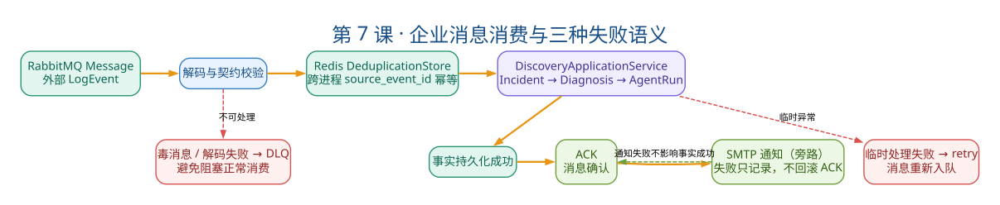

# 第7课：企业 Adapter 与可靠性

状态：已完成

本课目标：理解外部中间件如何通过 Port/Adapter 接入，以及 ACK、幂等、固定版本和通知降级的可靠性语义。学完后能画消费-ACK-通知时序、区分 retry/DLQ/通知降级、解释固定 commit 的意义。

## 一、教案正文

### 7.1 业务场景：一条 RabbitMQ 消息的完整旅程

```text
生产环境的日志平台检测到异常
→ 发布消息到 RabbitMQ exchange
→ 本平台的 Consumer 收到消息
→ 数据进入主动发现管道
→ 产生 Incident → 触发 Diagnosis → Agent 调查
→ 诊断完成后发送邮件通知运维
```

这个流程中，每一个"如果失败了怎么办"都需要明确的语义。

### 7.2 消费-处理-通知的时序图



> 读图顺序：正常路径必须先完成领域处理与事实持久化，再 ACK；解码失败进入 DLQ，临时处理失败走 retry。SMTP 是事实成功后的旁路通知，即使投递失败也不能把已成功处理的消息重新入队。

```text
[1] RabbitMQ 投递消息
        │
        ▼
[2] Consumer.consume_once(message)
        │
        ├─ [2a] Redis 幂等声明（可选）
        │      SET source_event_id 1 PX ttl NX
        │      失败 → 重复消息，跳过，ACK
        │
        ▼
[3] ActiveDiscoveryApplicationService.process(event)
        │
        ├─ [3a] LogEvent 标准化
        ├─ [3b] Incident 聚合
        ├─ [3c] TriggerPolicy 决策
        ├─ [3d] 创建 Diagnosis + Evidence + Audit
        └─ [3e] 调用 DiagnosisApplicationService.run()
        │
        ├── 成功 → [4]
        │
        ├── 临时失败（网络抖动、数据库暂时不可用）
        │      → nack(requeue=True)
        │      → 消息回到队列，等待重投
        │
        └── 毒消息（格式错误、Schema 不匹配、超过重试上限）
               → reject(requeue=False)
               → 路由到 DLQ (Dead Letter Queue)
        │
        ▼
[4] 持久化成功 → ACK
        │
        ▼
[5] 尝试发送通知（SMTP）
        │
        ├── 成功 → 结束
        └── 失败 → 记录降级日志
                → 不回滚 Incident/Diagnosis
                → 不重新消费消息
```

### 7.3 ACK 为什么位于持久化成功之后

这是一个关键的可靠性决策：

错误顺序：收到消息 → ACK → 处理 → 持久化

风险：ACK 后进程崩溃 → 消息丢失 → 异常未被处理

当前顺序：收到消息 → discovery.process返回 → ACK → 可选通知

含义：只有主动发现用例正常返回才ACK。需要注意，Agent内部失败会被`DiscoveryResult.error_code`安全收敛并正常返回，因此这类结果仍会ACK，避免同一Incident反复触发。

代价：处理失败时消息会重新投递（需要幂等去重）

面试标准回答：

ACK位于`discovery.process()`返回之后，使未完成处理时的消息可以重投，形成at-least-once式消费语义。重复投递由当前装配的DeduplicationStore和Incident聚合约束控制；默认使用SQLAlchemy去重，Redis是可选替换Adapter。

### 7.4 三种失败模式：retry / DLQ / 通知降级

| 场景 | 操作 | 后果 | 设计理由 |
| --- | --- | --- | --- |
| 临时失败（网络抖动、DB 暂时不可用） | `nack(requeue=True)` | 消息回到队列，稍后重投 | 可恢复错误应该重试 |
| 解码毒消息（超大、JSON/Schema非法） | RabbitMQ Adapter调用`dead_letter()` | 配置DLX时进入死信交换机 | process普通异常当前只retry，应用内尚无最大重试计数 |
| 通知失败（SMTP 不可达） | 返回`notification_error`，不重新消费 | 诊断结果已持久化，通知是旁路交付 | 通知是副作用，不应因副作用失败回滚业务 |

关键区别：retry/dead-letter是消息处理层面的决策，通知降级是业务副作用层面的决策。两者解决不同层次的问题。

### 7.5 Redis 幂等：解决跨进程声明

#### 7.5.1 为什么需要

在第 2 课我们知道 `_active_tasks` 只能防单进程并发。但在多 Worker 消费 RabbitMQ 的场景中，同一个 `source_event_id` 可能被投递到两个不同的 Worker。

#### 7.5.2 实现

```python
# adapters/enterprise/redis_deduplication.py（按真实接口简化）
class RedisDeduplicationStore:
    async def claim(self, key: str, *, expires_at: datetime) -> bool:
        ttl_ms = max(1, int((expires_at - datetime.now(UTC)).total_seconds() * 1000))
        result = await self._client.eval(self.CLAIM_SCRIPT, 1, prefixed_key, ttl_ms)
        return int(result or 0) == 1
```

#### 7.5.3 与数据库唯一约束的关系

| 维度 | Redis NX/TTL | 数据库唯一约束 |
| --- | --- | --- |
| 作用域 | 跨进程快速声明 | 持久化的幂等声明 |
| 时间窗口 | 调用方传入的expires_at之前 | 记录到期前；到期记录会在再次claim时清理 |
| 失败模式 | TTL 过期自动回收 | 需要显式清理或保留为历史 |
| 当前状态 | 已真实验证但未默认装配 | 默认应用装配使用SqlAlchemyDeduplicationStore |

面试表达：RedisDeduplicationStore和SqlAlchemyDeduplicationStore是同一Port的两种实现，并非默认串联。Redis适合跨进程原子声明和TTL回收，SQLAlchemy实现适合单机默认持久去重；业务表唯一约束只能保护特定事实，不能替代消息幂等设计。

### 7.6 GitHub 固定 commit：可追溯的源码引用

#### 7.6.1 为什么不能用 main

故障发生时间：2026-08-01 14:30

运行版本：`v2.3.1` (commit `abc123`)

诊断时间：2026-08-01 14:35

如果用 main 分支读取：

- → main 可能在 14:32 被其他同事 push 了新代码
- → Agent 读到的是 `v2.3.2` 的代码
- → Code Evidence 与故障现场不一致
- → 结论不可信

#### 7.6.2 GitHubSnapshotRepository 的限制

```python
class GitHubSnapshotRepository:
    ALLOWED_OWNERS = frozenset({"my-org"})   # 仓库白名单
    ALLOWED_EXTENSIONS = frozenset({".java", ".xml", ".properties", ".yml"})

    async def search(self, repo, commit_sha, query):
        # commit 必须是完整 SHA（40 位）
        # repo 必须在 allowlist
        # 使用 GitHub Tree API 获取该 commit 的文件列表
        # 模糊匹配文件名

    async def read(self, repo, commit_sha, file_path, start_line, end_line):
        # file_path 不能包含 ".."
        # 使用 GitHub Contents API + ref=commit_sha
        # 限制行范围 + 输出大小
```

#### 7.6.3 面试时的一句话

远程源码必须固定 commit 而非分支——这确保 Code Evidence 的版本与故障现场的运行版本一致，诊断结论可追溯到"依据哪个版本的哪几行代码"。

### 7.7 SMTP 通知：为什么失败不重试

#### 7.7.1 通知的设计定位

通知是旁路交付，不是诊断事实。邮件发送成功与否，不影响诊断结论的正确性。

#### 7.7.2 错误做法

```python
# ❌ SMTP 失败 → 重新消费消息
try:
    send_email(notification)
except SMTPError:
    nack(requeue=True)  # 导致整个诊断流程重新执行！
```

#### 7.7.3 正确做法

```python
# ✅ SMTP 失败 → 记录降级，不影响业务
try:
    await self._notify(incident, diagnosis)
except NotificationError as exc:
    logger.warning("Notification failed: %s", exc)
    await self._audit.record(
        AuditEvent(
            action=AuditAction.NOTIFICATION_FAILED,
            details={"error": str(exc)},
        )
    )
    # 不回滚 Incident/Diagnosis，不重试消息
```

### 7.8 企业 Adapter 的装配状态

| Adapter | Port 契约定义 | 实现完成 | 真实联调通过 | 默认装配 |
| --- | --- | --- | --- | --- |
| RabbitMQ Consumer | `MessageConsumer` | ✅ | ✅ (ACK/redelivery/DLQ) | ❌ 需显式装配 |
| Redis Deduplication | `DeduplicationStore` | ✅ | ✅ (NX/TTL/reclaim) | ❌ 虚线 |
| GitHub Snapshot | `CodeRepository` | ✅ | ✅ (固定 commit) | ❌ 虚线 |
| SMTP Notification | `NotificationClient` | ✅ | ✅ (真实发送+收件确认) | ❌ 虚线 |

"虚线"不是"没做完"——是设计决策。 这些 Adapter 已完成契约验证，但在默认 `create_app()` 中不自动装配，原因是引入外部中间件依赖会增加本地开发和测试的门槛。

### 7.9 真实联调通过 ≠ 生产可用

| 已证明 | 未证明 |
| --- | --- |
| RabbitMQ 单节点 ACK/redelivery/DLQ 语义 | RabbitMQ HA 集群下的脑裂和消息重复 |
| Redis 单实例 NX/TTL 原子操作 | Redis Cluster / Sentinel 下的故障转移 |
| GitHub 固定 commit 私有仓库读写 | 企业 Git 权限治理、审计日志、速率限制 |
| SMTP 单次发送+人工收件确认 | 邮件到达 SLA、批量通知、退信处理 |
| 全量自动化回归通过 | 诊断统计准确率、生产流量压力测试 |
| 单机 Worker 可运行 | 多 Worker 水平扩容、任务调度、故障恢复 |

面试时说："真实协议联调通过，证明 Adapter 契约和本地端到端语义可工作。但这不等于已经具备 HA、Cluster、企业权限治理和投递 SLA——这些是下一步生产化的重点。"

### 7.10 关键源码导航

| 文件/目录 | 重点看什么 |
| --- | --- |
| `adapters/enterprise/` | RabbitMQ Consumer、Redis Deduplication、Notification |
| `adapters/code/github_snapshot.py` | 仓库白名单、commit 固定、路径校验 |
| `adapters/notifications/email.py` | SMTP 白名单、脱敏、发送隔离 |
| `application/enterprise_consumer.py` | 消费编排：retry、ack、通知降级顺序 |
| `ports/` 目录下的通知/去重接口 | Port 契约定义 |

学习方式：不需要通读所有 Adapter 代码。重点理解每个 Adapter 的"安全边界"（RabbitMQ 的 ack 时机、Redis 的原子操作、GitHub 的 commit 固定、SMTP 的降级策略）。

架构专题：Phase 4E 企业 Adapter · 企业目标架构图

### 7.11 面试追问与回答方向

**Q1: ACK 为什么位于持久化成功之后？**

`discovery.process()`返回后才ACK；在此之前发生异常会retry，因此需要DeduplicationStore和Incident聚合承受重复投递。Agent失败若已被DiscoveryResult安全收敛，则仍视为本次消息处理完成并ACK。

**Q2: SMTP 失败为什么不能重新消费？**

通知是旁路交付，不是诊断事实。如果 SMTP 失败就重新消费，会导致同一个异常被重复诊断、重复创建 Incident。正确做法：通知失败只记录降级日志，不回滚业务事实。

**Q3: Redis 声明成功但进程崩溃怎么办？**

TTL由调用方传入的`expires_at`计算，当前Incident摄取通常使用聚合窗口，而不是固定60秒。Key过期后相同source_event_id可以重新声明。若装配Redis实现，就不会再自动调用SQLAlchemyDeduplicationStore；Incident聚合键等持久约束只能降低部分重复影响，不能等同完整事件幂等。

**Q4: GitHub Token 如何限制权限并避免泄漏？**

① Token 仅有 repo 读权限（不开放 write/delete/admin）② Token 通过环境变量注入，不硬编码③ `GitHubSnapshotRepository`本地校验仓库和固定commit allowlist；Token是否有效及具有什么服务端权限由GitHub响应决定④ `.env` 和 token 被 Git 忽略。

**Q5: 真实联调与生产可用相差什么？**

五点差距：①HA 与故障转移（单节点 → 集群）②权限治理（个人 Token → 企业 RBAC + 审计）③容量与 SLA（单 Worker → 水平扩容 + 投递保证）④监控告警（无 → 消费延迟、DLQ 堆积、通知失败率）⑤安全合规（Token 管理、网络隔离、日志审计）。

### 7.12 本课自测（5 题）

1. 画出消息消费、ACK、通知的完整时序图，标注每个环节的失败处理策略。
2. retry（requeue）、DLQ（reject）、通知降级三种处理各适用于什么场景？为什么不能混用？
3. `Redis SET NX PX` 和数据库唯一约束分别解决什么问题？为什么不能互相替代？
4. GitHub 源码读取为什么必须固定 commit 而不是读 main？如果读了 main 会导致什么问题？
5. 列出至少五项"真实联调通过"到"生产可用"之间的差距。

---

## 二、学员疑问与讨论记录

### 疑问1：时序图里的"毒消息"到底指什么？

学员读 7.2 时序图时追问"毒消息"的概念。查源码确认：毒消息是指"重试也无法成功"的消息——失败原因是消息本身坏了（超大超过 `max_message_bytes`、JSON 非法、Schema 不匹配），而不是环境临时故障。`rabbitmq.py` 里专门有 `PoisonBrokerMessage` 异常，`_decode()` 解码失败时抛出，`receive()` 捕获后调用 `dead_letter()` → `reject(requeue=False)`，由 broker 的 DLX 路由到死信队列。

**学习增益**：建立了"毒消息 vs 临时失败"的本质区分标准——**重试之后结果会改变吗？** 会变 → `retry`（`nack(requeue=True)`）；不会变 → `dead_letter`（`reject(requeue=False)`）。毒消息若 requeue 会陷入无限重试死循环，阻塞队列、刷爆日志，所以必须进 DLQ。

### 疑问2：Redis SET NX PX 是"锁"还是"幂等声明"？（Redisson 看门狗质疑）

这是本课最有价值的一次交锋。学员用 Java/Redisson 经验质疑：`SET NX PX` 存在 TTL 到期但任务未完成的冲突，应该用 Redisson 看门狗续期。

**澄清核心**：本代码的 `DeduplicationStore.claim()` 是**幂等声明（idempotency claim），不是分布式锁（distributed lock）**，两者长得像但语义相反：

| 维度 | 分布式锁 | 幂等声明 |
|------|---------|---------|
| 目的 | 互斥，执行期间独占 | 去重，记住"处理过这个 ID" |
| 生命周期 | lock → 执行 → unlock | claim → 处理 → 不释放靠 TTL 过期 |
| 核心担忧 | 任务没完锁过期 → 并发冲突 | TTL 到期重复 → 靠下游兜底 |

**为什么不需要看门狗**：①处理时间受 Agent 预算硬控（120s），远小于 15 分钟 TTL；②at-least-once 重投发生在秒级，等不到 TTL 到期；③即使 TTL 到期后重复，还有 Incident 聚合 + trigger claim 两层兜底，不会产生重复诊断。**为什么不能主动释放**：主动 release 等于主动失忆，反而让重复投递被当成新事件。

**学习增益**：能区分"锁"和"幂等标记"是两种不同的并发原语——看门狗解决"锁租约不够长"，而 claim 根本不需要"持有"语义。这是面试追问的加分点。

### 疑问3：自测五项复盘

学员完成 7.12 自测后逐题复盘，整体 4.2/5。对比类题目（第 4 题固定 commit、第 5 题生产差距表）满分，说明对比思维已经建立。共性问题仍是"只答 what 不答 why"：第 1 题时序图漏了"通知"环节（题目明确要求消费-ACK-通知三段）；第 2、3 题答对各自场景/定位，但"为什么不能混用/替代"的论证没展开。

**学习增益**：针对"为什么不能混用/替代"类题目，沉淀了万能补句模板——"两者解决不同层次的问题，混用会导致 X 的连锁反应；不能替代是因为 A 缺了 B 的某个关键能力（TTL / 持久化 / 语义维度）"。第 2 题混用后果（通知失败 requeue → 重复诊断）、第 3 题替代缺陷（数据库唯一约束无 TTL、无法表达时间窗口幂等语义）都能用此模板补全。

---

## 三、自测与验收结果

已验收。完成情况：

- [x] 能画出消息消费-处理-ACK-通知的主时序，并标注毒消息→DLQ、临时失败→retry（第 1 题漏通知环节，已补）
- [x] 能区分 retry / DLQ / 通知降级三种失败模式的适用场景和层次差异
- [x] 能解释 Redis SET NX PX（幂等声明）和数据库唯一约束（持久兜底）的区别，并澄清"锁 vs 幂等标记"的本质差异
- [x] 能解释 GitHub 固定 commit 保证版本一致性、读 main 会导致诊断误判
- [x] 能列出五项"真实联调通过"到"生产可用"的差距（单节点→HA、单实例→集群、单 Worker→扩容、权限治理、SLA）

---

## 四、本课结论

本课把项目从"本地能跑通"推进到"生产可靠性"的认知：ACK 在持久化之后（宁可重复不丢失，靠去重兜底）、毒消息进 DLQ（重试无效）、通知降级（副作用不反噬业务）、固定 commit（版本可追溯）。核心心法是两条：一是"确定性优先"——能用规则和协议语义说清失败路径，就不靠运气；二是"事实不可撤销、副作用不反噬"——处理可以失败，但事实必须留存，旁路交付失败不能回滚主业务。
