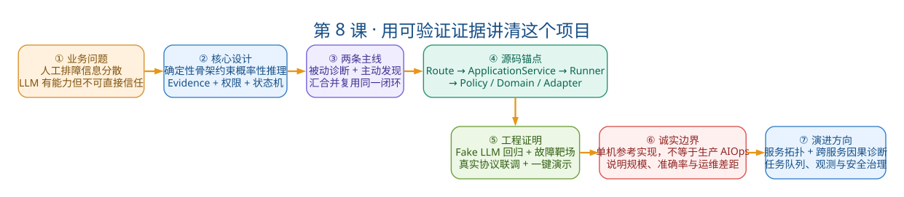

# 第8课：项目走读与面试实战

状态：已经完成

本课目标：不再引入新能力，把前 7 课收敛为可运行、可画图、可读源码、可接受追问的项目认知。学完后能脱离文档完成面试级项目讲解。

## 一、教案正文

### 8.1 两条必须脱离文档画出的链路

#### 8.1.1 被动诊断（从 HTTP 到人工确认）

```text
Route (api/routes/diagnoses.py)
  → DiagnosisApplicationService.run()
    → _start_investigation()  [CREATED → INVESTIGATING]
    → StrategyRouter.select() [选择策略]
    → ToolResourceResolver()  [解析服务资源]
    → ToolLoopRunner.run()
      → 构造 LLM Request (system + user + tools + evidence catalog)
      → LLM 选择工具 → Registry.resolve() [五层闸门]
      → Tool.execute() → EvidenceCandidate → EvidenceStore [Draft → 正式ID]
      → 结果回传 LLM
      → LLM 输出结论 → Pydantic Schema 校验
      → CitationPolicy.validate() [引用校验]
      → ToolLoopResult
    → _apply_result()
      → DiagnosisCase.record_initial_conclusion() [→ WAITING_FOR_CONFIRMATION]
      → 或 DiagnosisCase.mark_inconclusive() [→ INCONCLUSIVE]
    → Repository.save(expected_version=...) [乐观锁]
  → Trace 生成 [从 AgentRun + ToolRun + Evidence 聚合]
  → Report 生成 [从 Diagnosis + Evidence + Confirmation 聚合]
  → Confirmation [人工 confirm/reject/continue]
```

每个环节必须能说出来：

- 谁调用谁
- 产生了什么对象
- 状态发生了什么变化

#### 8.1.2 主动发现（从日志到诊断触发）

```text
RabbitMQ / File Watcher / Replay Source
  → DiscoveredLogEvent
  → Redaction + Normalization → LogEvent
  → build_error_fingerprint()
    [service + env + exception_type + 前5栈帧(class#method)]
    → ErrorFingerprint v1
  → Incident.observe(fingerprint, timestamp, window)
    → 时间窗聚合 key
    → 更新 occurrence_count / last_seen_at
  → DiagnosisTriggerPolicy.decide()
    → duplicate_event? → skip
    → diagnosis_already_linked? → skip
    → trigger!
  → ActiveDiscoveryApplicationService.process()
    → 创建 DiagnosisCase
    → 创建初始 Evidence (sample_message)
    → 创建 AuditEvent
    → 调用 DiagnosisApplicationService.run() [复用被动诊断闭环]
  → ACK [持久化成功后]
  → Notification [旁路，失败降级不重试]
```

### 8.2 十个源码锚点：最低阅读清单

不需要通读所有代码，但以下 10 个入口必须亲自看过源码：

  #   方法/位置   验证什么   所在文件
  ---   ---   ---   ---
  1   `DiagnosisApplicationService.run()`   Runner 返回结果后，应用层如何收敛状态   `application/diagnoses.py`
  2   `DiagnosisApplicationService._apply_result()`   不同 `termination_reason` 对应不同状态转移   `application/diagnoses.py`
  3   `DiagnosisCase.record_initial_conclusion()`   状态合法性校验 + version 自增   `domain/diagnosis/case.py`
  4   `ToolLoopRunner.run()`   整个主循环的结构：构造请求→模型返回→执行工具→校验结论   `agent/runtime/tool_loop.py`
  5   `ToolLoopRunner._execute_tool()`   一次工具调用的完整流程   `agent/runtime/tool_loop.py`
  6   `DiagnosticToolRegistry.resolve()`   五层闸门的具体代码   `tools/registry.py`
  7   `ToolLoopRunner._persist_evidence()`   Draft 如何变成正式 Evidence ID   `agent/runtime/tool_loop.py`
  8   `EvidenceCitationPolicy.validate()`   引用校验的所有规则   `agent/policies/evidence_citations.py`
  9   `build_error_fingerprint()`   指纹的稳定性和版本设计   `domain/incident/models.py`
  10   `ActiveDiscoveryApplicationService.process()`   聚合→触发→创建 Evidence→调用诊断   `application/discovery.py`

阅读方式：每个方法先读函数的 docstring（如果有），再读函数体前 10 行的核心逻辑，最后找到关键的调用/返回点。不必逐行分析所有分支。

### 8.3 三类证明：测试体系全景

  证明类型   用什么   能证明什么   不能证明什么
  ---   ---   ---   ---
  工程回归   `Fake LLM` + 领域/集成/API 测试（当前收集 245 项；D1 前存在 1 项时间耦合失败）   状态机、工具闸门、Evidence、Citation、API 契约的确定性链路可回归   模型诊断质量
  模型集成   少量固定案例 + 真实模型（`Connecting Refused` / `NPE` / `Timeout`）   LLM 能正确使用 Tool Calling 协议、端到端链路可用   泛化准确率、各类故障的诊断能力
  中间件语义   `RabbitMQ` / `Redis` / `GitHub` / `SMTP` 真实联调   Adapter 契约可用、消费语义正确   生产 HA、容量、安全治理

为什么 Fake LLM 不是"假测试"： Fake 的职责是稳定地产生预定 Tool Call 和结论，用来验证 Runtime、工具、Evidence、Citation 和状态机——这些是确定性的工程逻辑，不是概率性的。让真实模型承担每次提交的回归测试，费用和随机性都不可接受。

为什么真实模型仍不可缺少： Fake 无法发现 Provider 的 Tool Calling 格式差异、模型是否理解 Prompt、是否遗漏 Evidence ID、多轮上下文是否足够、真实输出延迟和费用。

### 8.4 三个真实问题复盘模板

面试时被问到"你遇到过什么坑"，用这个模板回答（现象 → 证据 → 根因 → 修复 → 验收 → 原则）：

#### 问题1：日志摘录混入后续异常

  步骤   内容
  ---   ---
  现象   固定评测案例读取日志时，一个摘录里包含两种不同异常的堆栈
  定位证据   Evidence 内容包含两种 Exception in thread 行
  根因   日志读取只围绕关键词截固定行数，没有识别异常事件的开始和结束
  修复   改进事件边界：围绕最近一次匹配异常提取有限窗口，遇到下一事件边界停止
  验收   连接拒绝和超时分别建立固定案例，验证不再混入不同异常
  沉淀原则   给模型更多日志不等于更好。上下文质量依赖事件边界——Adapter 的数据整理能力直接影响诊断质量

#### 问题2：超时案例遗漏日志 Evidence 引用

  步骤   内容
  ---   ---
  现象   真实模型找到了正确的 `InventoryClient.java`，但最终结论被 `CitationPolicy` 拒绝
  定位证据   `CitationPolicy` 日志显示根因引用只有 1 个 `code_excerpt`，缺少 `log_excerpt`
  根因   模型在修正引用时只关注最新 Code Evidence，遗漏了早期 Log Evidence
  修复   修正指令明确要求源码型诊断同时引用日志和代码 Evidence；保留已有 Evidence catalog
  验收   真实模型复测通过
  沉淀原则   模型"推理方向正确"不代表系统结果有效。端到端失败可能发生在 Evidence ID 回传、上下文保持和最终引用任一环节

#### 问题3：架构图渲染不可靠

  步骤   内容
  ---   ---
  现象   Mermaid 图在 Typora 中解析失败，图逻辑正确但无法稳定展示
  定位证据   Typora 内置 Mermaid 版本与 Unicode 字符冲突
  根因   依赖 Markdown 客户端内置渲染器，图形渲染环境不可控
  修复   统一使用 Graphviz 源文件 + SVG 成品 + Markdown 说明；建立颜色/节点/线型规范
  沉淀原则   文档也是工程交付物。源文件解决修改问题，SVG 解决跨客户端展示问题，Markdown 解决设计解释问题

### 8.5 面试表达层级



> 读图顺序：不要从技术栈开始背诵，而要从业务问题讲到核心设计，再用主流程、源码锚点和验收结果证明实现，最后主动说明当前边界与演进方向。完整回答必须形成一条可验证的证据链。

| 时长 | 覆盖内容 | 结构 |
|---|---|---|
| 30秒 | 业务问题、核心设计、验证 | “我实现了证据驱动的故障诊断Agent平台，用状态机、工具闸门和Evidence闭环约束LLM，并支持被动诊断与主动发现；自动化回归和企业Adapter真实协议联调均已完成。” |
| 3分钟 | 背景、演进、两条链路、关键约束、边界 | 排障痛点→LLM有价值但不可信→Evidence闭环→主动发现→真实边界 |
| 10分钟 | 状态机、Tool Loop、Evidence、Incident、企业Adapter | 穿插关键源码和架构图，不按技术栈罗列 |
| 追问阶段 | 事务、并发、安全、评测、生产化 | 结合核心掌握手册第25节的问题回答 |


### 8.6 当前边界与演进方向

#### 8.6.1 当前边界的准确表述

这是具备生产化设计意识的本地单机参考实现，不是完整生产平台。项目已有 RabbitMQ Consumer 与企业 Adapter，但没有独立部署、长期运行和水平扩容的生产 Worker，也没有企业认证与 `RBAC`、远程采集代理、高可用、分布式追踪和规模化真实模型质量统计。

#### 8.6.2 Phase 5 设计方向

服务拓扑与跨服务因果诊断（已设计、暂缓实施）：当一个故障涉及多个微服务时，Agent 需要理解服务间的调用关系和依赖拓扑，追踪故障的传播路径。

规格文档：服务拓扑与跨服务因果诊断 Phase 5 实施计划

#### 8.6.3 生产化优先级建议

| 优先级 | 工作 | 原因 |
|---|---|---|
| P0 | Worker生命周期（任务租约、心跳、超时恢复） | 当前单进程限制是最大瓶颈 |
| P0 | 跨进程并发一致性（租约、唯一约束、幂等） | `_active_tasks`在多Worker下失效；是否需要分布式锁应按工作流设计决定 |
| P1 | 远程日志采集Adapter | 替代本地文件读取，接入真实日志平台 |
| P1 | 规模化真实模型评测集 | 从人工confirmed结果沉淀标注数据 |
| P2 | RBAC与多租户 | 企业环境基本要求 |
| P2 | 监控告警 | 观察消费延迟、DLQ堆积和诊断成功率 |
| P3 | 自动修复 | 需要审批、dry-run、回滚和补偿 |
| P3 | 多Agent、向量库或完整Plan-and-Execute | 当前单Agent足够，出现明确问题后再评估 |

### 8.7 红线表述：面试中绝对不能说的

| ❌ 不能说的 | ✅ 应该说的 |
|---|---|
| “这是一个生产级AIOps平台” | “这是具备生产化设计意识的本地参考实现” |
| “平台能自动发现所有服务” | “ServiceProfile需要用户显式注册，不做自动扫描” |
| “支持自动修复生产故障” | “当前只提供受控只读工具，自动修复需要审批、dry-run和补偿机制” |
| “自动化测试全部通过说明准确率很高” | “测试证明工程链路可回归，不等于统计诊断准确率” |
| “接入RabbitMQ和Redis，所以是企业级” | “已通过真实协议联调验证Adapter契约，但生产HA、集群和治理仍需建设” |
| “Plan是Plan-and-Execute” | “当前是规则生成的轻量调查说明，不是完整Plan-and-Execute” |
| “Trace是模型的Chain-of-Thought” | “Trace从已持久化的AgentRun/ToolRun聚合生成，不包含模型的隐藏推理” |


### 8.8 独立应对面试的最终模拟标准

前 3 分钟：主动建立叙事

- 业务问题（排障信息分散）
- 为什么 LLM 有价值又不可信
- 三条核心链路（诊断主链路 / Evidence 闭环 / 服务上下文）
- 一条 Java Lab 真实演示
- 当前真实边界

第 4～12 分钟：架构下钻

- Route → ApplicationService → Runner → State Machine
- `Strategy`、`Registry`、`Permission`、`Adapter` 的区别
- 一个 Tool Call 的消息和数据生命周期
- `Diagnosis`、`AgentRun`、`ToolRun`、`Evidence` 的关系

第 13～20 分钟：可信与工程性

- 入库前脱敏
- `EvidenceDraft` 与正式 ID
- `CitationPolicy` 规则
- 事务、乐观锁、单进程并发限制
- Fake 与真实模型测试分工

第 21～27 分钟：质疑和边界

- 准确率尚未统计
- Plan 不是 `Plan-and-Execute`
- Trace 不是 `Chain-of-Thought`
- 服务目录不是自动发现
- 不是生产级 AIOps 或自动修复平台

第 28～35 分钟：反思和演进

- 讲一个真实失败复盘
- 说明当前最不满意的设计
- 给出生产 Worker、`RBAC`/多租户、远程采集和规模化评测集的演进顺序
- 解释为什么此时不优先做多 Agent、向量库或 Shell

### 8.9 最终掌握验收表

#### 架构掌握

- 能脱离文档画出两条纵向链路（被动诊断 + 主动发现）
- 能从 `/runs` 追踪到 `DiagnosisCase` 状态收敛
- 能说清 LLM、`Strategy`、`Runner`、`Registry` 和 `Tool` 的职责
- 能指出当前 Ports & Adapters 的真实妥协

#### Agent 掌握

- 能解释一次 Tool Call 消息怎样进入下一轮
- 能解释预算耗尽、模型错误、工具失败和引用失败怎样受控结束
- 能说明当前轻量 Plan 不等于 `Plan-and-Execute`
- 能说明 Trace 不展示隐藏思维链

#### 可信闭环掌握

- 能解释脱敏、hash 去重、Evidence ID 和引用等级
- 能说明为什么知识证据不能单独支撑 probable
- 能说明 Confirmation 为什么追加而不是覆盖
- 能根据 `ToolRun`、`Evidence` 和 Citation 定位一次失败

#### 工程掌握

- 能运行 Phase 3 Demo 并找到 `Trace`、`Report` 和 `Evidence`
- 能完整讲解一个 Tool → Port → Adapter 纵向切片
- 能说明自动测试与真实模型质量评测的区别
- 能解释 RabbitMQ ACK、retry、DLQ 与通知降级顺序
- 能说明 Redis/GitHub 已验证但未默认装配的边界

#### 面试掌握

- 30 秒版本不堆技术名词
- 3 分钟版本包含背景、演进、核心链路、验证和边界
- 不把项目夸大为生产级 AIOps 或自动修复平台
- 能讲出至少三个真实问题的"现象—根因—修复—验收"

### 8.10 最终自测（6 题）

1. 不看文档完成 3 分钟项目介绍。
2. 手画两条主链（被动诊断 + 主动发现），标注每个环节的关键对象和状态变化。
3. 用 `NPE` 案例讲到 `ToolRun`、`Evidence`、`Report` 和 `Confirmation`——用真实的方法名。
4. 随机解释 10 个源码锚点中的 6 个——说出它们在哪、做什么。
5. 回答以下追问各一道：事务设计、并发限制、Prompt Injection 防御、评测策略、生产化差距。
6. 主动说明三个当前不足并给出合理演进方案。

---

## 二、学员疑问与讨论记录

待进入本课后追加。

---

## 三、模拟面试与验收结果

尚未验收。最终标准：

- 能脱离教材完成项目介绍、代码走读、故障复盘和边界说明
- 在追问中保持表述准确，不夸大能力
- 能运行一次 Demo 并用输出证明自己的叙述
- 满足 8.9 节全部复选框

---

## 四、课程总结

待八课全部闭环后填写。


# 第 8 课 导读

## 一、先讲清楚这课的定位

前 7 课你学了：状态机、Tool Loop、Evidence 闭环、服务上下文、Java Lab、主动发现、企业 Adapter。知识已经够了。

但面试不是考你"知道多少"，而是考你**"能不能在压力下，有结构地讲出来，且不夸大、不被追问问倒"**。

所以第 8 课只做一件事：**把已有的知识，校准成"能说、能画、能防追问"的形态。**

整课有三个支柱，你记住这三个就抓住了全课：

1. **两条链路**（能脱稿画出来）
2. **三层表达**（30 秒 / 3 分钟 / 10 分钟，各说什么）
3. **一条红线**（什么话绝对不能说）

下面逐个拆。

---

## 二、支柱一：两条链路（8.1）

这是自测第 2 题，也是面试的"硬功夫"。面试官让你"画一下你的项目流程"，你不能现场翻文档。

### 链路 A：被动诊断（HTTP → 人工确认）

记住这条链路的**骨架口诀**：

```
Route → run() → 三个准备 → Runner 循环 → apply_result → 人工确认
```

展开：

```text
POST /runs
  → DiagnosisApplicationService.run()
      ① _start_investigation()   CREATED → INVESTIGATING（状态门禁+审计）
      ② StrategyRouter.select()   选策略（规则路由，确定性）
      ③ ToolResourceResolver()    解析服务资源（动态绑定目录）
      ④ ToolLoopRunner.run()      Agent 主循环
          构造请求 → LLM 选工具 → Registry 五层闸门 → 工具执行
          → Evidence 落库 → 结论 Schema 校验 → CitationPolicy 引用校验
      ⑤ _apply_result()           状态收敛
          有结论 → WAITING_FOR_CONFIRMATION
          无结论 → INCONCLUSIVE
  → 人工 confirm/reject/continue
```

**记忆技巧**：①②③ 是"准备三件套"（状态、策略、资源），④ 是"跑起来"，⑤ 是"收结果"。五个步骤，一句话：**先备料，再跑，最后收尾。**

### 链路 B：主动发现（日志 → 诊断触发）

```text
日志源（RabbitMQ / File Watcher / Replay）
  → 标准化（脱敏 + 规范化）
  → build_error_fingerprint()   稳定指纹（去行号，留栈帧）
  → Incident.observe()           时间窗聚合
  → TriggerPolicy.decide()       三点判断：重复? 已触发? 否则触发
  → 创建 Diagnosis + Evidence + Audit
  → 复用链路 A 的 run()           ★ 关键：主动发现复用被动诊断
  → ACK（持久化后）
  → 通知（旁路，失败降级）
```

**记忆技巧**：前 4 步是"确定性的预处理"（零 LLM），第 5 步才触发诊断，第 6 步**复用链路 A**。一句话：**主动发现 = 确定性聚合 + 复用被动诊断。**

> **面试关键点**：主动发现和被动诊断不是两套系统，是"前者在前面加了一段预处理，后面复用同一条 run() 链路"。这句话能体现你对架构的把握。

---

## 三、支柱二：三层表达（8.5）

面试官给的时间不同，你说的内容深度不同。这是"分场景表达"能力。

| 时长 | 说什么 | 结构 |
|------|--------|------|
| **30 秒** | 业务问题 + 核心设计 + 验证 | "我实现了证据驱动的故障诊断 Agent 平台，用状态机、工具闸门、Evidence 闭环约束 LLM，支持被动诊断与主动发现，自动化回归和企业 Adapter 真实协议联调已完成" |
| **3 分钟** | 背景 + 演进 + 两条链路 + 约束 + 边界 | 排障痛点 → LLM 有价值但不可信 → Evidence 闭环 → 主动发现 → 真实边界 |
| **10 分钟** | 状态机 / Tool Loop / Evidence / Incident / 企业 Adapter | 穿插关键源码和架构图，不按技术栈罗列 |
| **追问** | 事务、并发、安全、评测、生产化 | 结合核心掌握手册第 25 节 |

**核心心法（30 秒版里藏着）**：**不堆技术名词，先说"解决了什么业务问题"，再说"用什么设计"，最后说"怎么验证"。**

你注意 30 秒版那句话，它有三个信息块：
1. "证据驱动的故障诊断 Agent 平台" = 业务定位
2. "状态机、工具闸门、Evidence 闭环约束 LLM" = 核心设计
3. "自动化回归、真实协议联调已完成" = 验证

**这才是面试官想听的顺序，而不是"我用了 FastAPI + SQLAlchemy + Pydantic"这种技术栈罗列。**

---

## 四、支柱三：一条红线（8.7）

这是全课**最容易踩坑、也最实用**的部分。面试中一句话夸大，整个可信度就崩了。

我挑最关键的 4 条红线，你必须刻在脑子里：

| ❌ 绝对不能说 | ✅ 应该这么说 |
|--------------|--------------|
| "这是生产级 AIOps 平台" | "这是**具备生产化设计意识的本地参考实现**" |
| "平台能自动发现所有服务" | "ServiceProfile 需要用户**显式注册**，不做自动扫描" |
| "支持自动修复生产故障" | "当前只有**受控只读工具**，自动修复需要审批、dry-run、补偿" |
| "接入 RabbitMQ/Redis 就是企业级" | "已通过真实协议联调验证 Adapter 契约，但生产 HA/集群/治理仍需建设" |

**为什么这些红线这么重要？**

因为面试官大概率是资深工程师，他会**故意追问边界**来测试你是否诚实。你一旦说"生产级 AIOps"，他下一句就是"那你们的 HA 怎么做的？RBAC 呢？"，你就卡住了。

而如果你主动说"这是本地参考实现，生产化边界在 X/Y/Z"，他反而会觉得你**清醒、诚实、有工程判断力**——这比"吹得很大"值钱得多。

**一句话总结红线**：**宁可把项目说小，不能说大。诚实 + 边界意识，是面试里的加分项，不是减分项。**

---

## 五、两个重要的"证明"意识（8.3 + 8.4）

### 三类证明（8.3）：你拿什么证明项目是真的

| 证明类型 | 用什么 | 证明什么 |
|---------|--------|---------|
| 工程回归 | Fake LLM + 244 个测试 | 状态机、闸门、Evidence、Citation 的确定性链路可回归 |
| 模型集成 | 少量固定案例 + 真实模型 | LLM 能正确用 Tool Calling，端到端可用 |
| 中间件语义 | RabbitMQ/Redis/GitHub/SMTP 真实联调 | Adapter 契约可用 |

**关键认知**：Fake LLM 不是"假测试"——它稳定产生预定 Tool Call，用来测**确定性工程逻辑**（状态机、闸门、引用校验），这些不是概率性的。真实模型测的是**模型能不能理解、能不能正确调工具**。两者分工不同，缺一不可。

### 三个真实问题复盘（8.4）：被问"遇到过什么坑"时的回答模板

记住这个六步模板：**现象 → 证据 → 根因 → 修复 → 验收 → 原则**

拿教材里的"问题1"示范一遍：

> **现象**：评测案例读日志时，一个摘录混入了两种不同异常。
> **根因**：日志读取只围绕关键词截固定行数，没识别事件边界。
> **修复**：改进事件边界识别，遇到下一个事件就停。
> **沉淀原则**：给模型更多日志不等于更好——上下文质量依赖事件边界，Adapter 的数据整理能力直接影响诊断质量。

**这个模板的价值**：它把"我踩过坑"变成了"我踩过坑 + 我找到了根因 + 我沉淀了原则"，这才是面试官想听的"复盘能力"。

---

## 六、本课小结 + 你的练习任务

第 8 课的核心就三句话：

1. **两条链路能脱稿画**（备料→跑→收尾；确定性聚合→复用被动诊断）
2. **三层表达会切换**（30秒讲定位，3分钟讲演进，10分钟下钻源码）
3. **一条红线不越界**（宁说小，不说大；诚实 + 边界意识）

---

## 现在轮到你练习（这是本课唯一的验收方式）

我建议按这个顺序练，不要跳：

**任务 1**：不看文档，用你自己的话，把"被动诊断链路"讲一遍（写出来或默念都行），发给我，我帮你对照检查有没有漏环节。

**任务 2**：同样脱稿讲"主动发现链路"。

**任务 3**：写一个 30 秒的项目介绍（就是 8.5 那个 30 秒版，但用你自己的话）。

你先把任务 1 做出来，我们一步一步过。这样比我把所有内容再念一遍有效得多。

有哪里没听懂，或者想让我先示范一次"3 分钟项目介绍"怎么说，也直接说。
