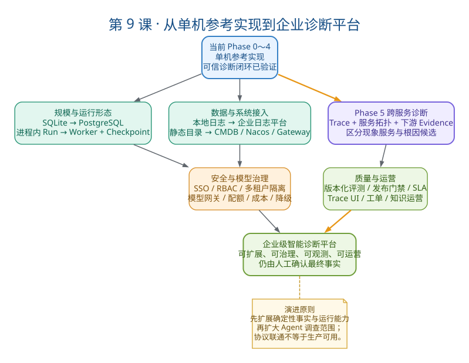
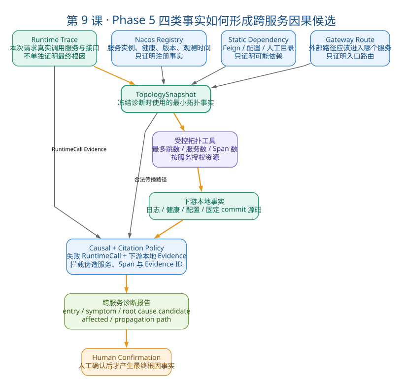

# 第9课：企业化演进与 Phase 5 跨服务诊断

> 本课定位：课程收口与未来设计课。
>
> 学习目标：在不夸大当前实现的前提下，说明 Phase 0～4 已经验证了什么、企业落地还缺什么、Phase 5 为什么选择服务拓扑与跨服务因果诊断，以及未来怎样按优先级演进。
>
> 正式规格：[服务拓扑与跨服务因果诊断 Phase 5 实施计划与验收标准](../02-specifications/服务拓扑与跨服务因果诊断Phase%205实施计划与验收标准.md)

## 一、教案正文

### 9.1 为什么需要第 9 课

前八课已经能够回答：

- 项目为什么存在；
- 一次诊断如何从请求走到人工确认；
- LLM、Runner、Registry、领域状态机如何分权；
- Evidence、CitationPolicy 和 Confirmation 如何建立可信闭环；
- Java 日志和源码如何联合诊断；
- 主动发现如何把重复日志聚合成 Incident；
- RabbitMQ、Redis、GitHub 和 SMTP Adapter 如何体现可靠性；
- 如何根据真实代码和验收结果介绍项目。

但企业架构或高级开发面试还会继续追问：

> 当前实现如果每天接收大量日志、同时诊断多个服务、需要跨服务定位根因，应该怎样演进？

本课不是承诺这些功能已经开发完成，而是训练你依据现有边界提出一条可信、渐进、能验收的演进路线。

### 9.2 当前项目的准确定位

当前项目应当表述为：

> 一个面向应用故障诊断的单机 Agent 参考平台。它已经验证日志主动发现、受控工具调用、Evidence 引用、人工确认、服务级资源授权以及企业协议 Adapter，但还不是大规模生产 AIOps 产品。

#### 9.2.1 已经实现并可以证明的能力

| 能力 | 可验证事实 |
| --- | --- |
| 被动诊断闭环 | Diagnosis → AgentRun → Evidence → Report → Confirmation |
| 主动发现闭环 | LogEvent → Fingerprint → Incident → TriggerPolicy → Diagnosis |
| 受控 Agent Runtime | 工具白名单、权限、参数 Schema、预算、超时和结构化结果 |
| 可信结论 | 脱敏、正式 Evidence ID、CitationPolicy、人工确认 |
| 日志与源码联合诊断 | Java Lab 固定故障、日志边界提取、受限源码工具 |
| 服务级资源边界 | ServiceProfile + ToolResourceContext / Resolver |
| 工程回归 | Fake LLM、固定评测、验收脚本和真实模型少量复验 |
| 企业协议验证 | RabbitMQ、Redis、固定 commit GitHub、SMTP 真实联调 |

#### 9.2.2 尚未达到生产级的部分

- SQLite 与单机进程无法支撑大规模并发和高可用；
- AgentRun 缺少分布式 Worker、持久化 Checkpoint 和完整恢复能力；
- 服务目录主要是本地维护，不是企业 CMDB 的完整镜像；
- 日志、指标和 Trace 尚未接入统一可观测平台；
- 没有完整多租户、SSO、RBAC 和数据隔离；
- 没有统计意义上的诊断准确率、召回率与长期评测集；
- 没有完整 SLA、灾备、容量规划、模型网关和成本治理；
- 当前主要定位单服务事实，尚不能可靠重建跨服务故障传播链。

关键表达：

> “协议已经真实联通”只能证明 Adapter 契约和端到端路径成立，不能证明容量、高可用、安全和长期运营已经达到生产要求。

### 9.3 从本地版本到企业版本的演进地图



> 读图顺序：从当前 Phase 0～4 基线出发，同时观察运行规模、数据接入和 Phase 5 跨服务诊断三类扩展；之后再补齐安全治理与质量运营。企业版不是简单替换数据库或增加中间件，而是让已有可信闭环能够在更大范围内可靠运行。

#### 9.3.1 企业化的五个问题域

| 问题域 | 当前实现 | 企业演进 |
| --- | --- | --- |
| 运行规模 | FastAPI 进程内运行 | API 与 Worker 分离、任务队列、Checkpoint、幂等与租约 |
| 数据存储 | SQLite + 本地文件 | PostgreSQL、对象存储、冷热分层与生命周期管理 |
| 数据接入 | 本地日志、Replay、RabbitMQ | Kafka/日志平台、OpenTelemetry、告警平台、发布事件 |
| 权限安全 | 工具白名单、路径和服务授权 | SSO、RBAC、租户隔离、密钥系统、审计合规 |
| 模型治理 | 单供应商兼容接口、预算 | 模型网关、路由、配额、缓存、成本、熔断与降级 |
| 质量运营 | 固定案例与本地报告 | 版本化评测、发布门禁、趋势、工单和知识运营 |

#### 9.3.2 推荐的企业目标分层

```text
数据接入层
日志 / 指标 / Trace / Gateway / Nacos / CMDB / 发布事件
        ↓
事件与拓扑层
LogEvent / Incident / ServiceTopology / TopologySnapshot
        ↓
诊断编排层
API / Queue / Agent Worker / Strategy / Plan / Tool Registry
        ↓
可信治理层
Evidence / Citation / Causal Policy / RBAC / Audit / Confirmation
        ↓
知识与评测层
Knowledge Candidate / Dataset / Evaluation / Release Gate
        ↓
运营交付层
Report / Trace UI / Notification / Ticket / SLA
```

这里的核心不是组件名称，而是职责隔离：接入层不做根因判断，拓扑层不直接宣布因果，模型不拥有最终裁决权。

### 9.4 为什么 Phase 5 是服务拓扑与跨服务因果诊断

Phase 0～4 能够围绕一个 ServiceProfile 调查日志、源码、配置和健康状态，但真实微服务故障经常表现为：

```text
用户请求 Gateway
  → order-service 返回 500（现象服务）
  → inventory-service 调用超时（根因候选服务）
  → inventory 数据库连接池耗尽（底层本地事实）
```

如果只分析 `order-service`，系统可能把下游异常包装处误判成根因。Phase 5 要解决的是：

- 外部请求从哪个入口服务进入；
- 本次请求实际经过哪些服务和接口；
- 哪个服务只是暴露故障现象；
- 哪个下游服务拥有更强的根因 Evidence；
- 故障影响了哪些上游或旁路服务。

Phase 5 的质变是：

> 将诊断对象从“一个服务的异常”升级为“一次跨服务故障传播链”。

### 9.5 四类事实为什么必须分开



> 读图顺序：Gateway、Nacos、静态依赖和 Trace 分别提供不同强度的事实，它们先被冻结为本次诊断使用的 TopologySnapshot；Agent 只能在预算和授权范围内调查下游。本次失败 RuntimeCall 必须结合下游日志、健康、配置或源码 Evidence，才能形成较强的根因候选。

| 事实 | 来源 | 能证明 | 不能证明 |
| --- | --- | --- | --- |
| 路由事实 | Gateway Route | 外部路径应进入哪个服务 | 内部调用真实发生 |
| 注册事实 | Nacos | 服务实例存在、健康、版本 | 谁调用了该实例 |
| 静态依赖 | Feign、配置、人工目录 | 某服务可能依赖下游 | 本次请求执行了调用 |
| 运行调用 | Trace Span | 本次真实调用关系和结果 | 被调用方一定是根因 |

必须能够脱口而出的判断：

```text
配置上可能调用
≠ 服务注册存在
≠ 本次请求真实调用
≠ 已证明的故障因果关系
```

### 9.6 Phase 5 如何复用现有框架

Phase 5 不重新实现 Agent，而是在既有闭环上增加拓扑事实和跨服务约束。

| 当前组件 | Phase 5 中的职责 |
| --- | --- |
| `ServiceProfile` | 继续表示逻辑服务身份 |
| `ToolResourceContext` | 扩展为按服务、环境和跳数授权下游资源 |
| `DiagnosisApplicationService` | 继续编排调查和状态收敛 |
| `ToolLoopRunner` | 保持循环语义，只增加拓扑工具与预算维度 |
| `DiagnosticToolRegistry` | 校验拓扑工具、权限、风险与参数 |
| `EvidenceStore` | 保存路由、注册、依赖、RuntimeCall 和下游事实 |
| `CitationPolicy` | 扩展跨服务引用与因果可信度规则 |
| `AgentRun / ToolRun / Trace` | 记录每次拓扑扩展和下游调查 |
| `Confirmation` | 人工确认最终根因服务与传播路径 |
| GitHub Snapshot Adapter | 按服务运行版本读取固定 commit 源码 |

建议新增 `domain/topology`，而不是把所有信息塞入 `ServiceProfile`：

```python
# 设计示意，不代表当前已经实现
class ServiceInstance: ...
class ServiceEndpoint: ...
class ServiceDependency: ...
class RuntimeCall: ...
class TopologySnapshot: ...
```

原因：逻辑服务身份、实例状态、静态依赖和一次运行调用具有不同生命周期，混成一个大对象会导致语义和持久化边界失控。

### 9.7 Phase 5 的受控调查规则

企业拓扑可能包含数百或数千个服务，绝不能把完整拓扑直接交给模型遍历。至少需要：

1. 从 Diagnosis 的入口或现象服务开始；
2. 默认只展开一跳下游；
3. 只有失败 RuntimeCall、异常日志或健康异常才能支持继续展开；
4. 最大跳数、服务数、Span 数和总时间都计入预算；
5. 静态依赖只支持“可能相关”，不能单独支撑 `probable`；
6. Nacos 实例存在只证明注册事实；
7. 根因候选至少引用 RuntimeCall 和根因服务本地事实；
8. 所有下游日志、源码和配置仍需按服务授权；
9. 源码必须绑定故障发生版本对应的固定 commit；
10. 跨服务 `confirmed` 仍然只能由人工产生。

这体现了项目一贯设计：扩展 Agent 的观察范围，同时扩展确定性边界，而不是只给模型更多工具。

### 9.8 Phase 5A～5D 实施顺序

| 阶段 | 解决的问题 | 核心产物 | 完成门槛 |
| --- | --- | --- | --- |
| 5A 拓扑领域 | 如何表达服务、实例、接口与依赖 | Domain、Port、SQLite、查询 API | 依赖方向、来源、时间和环境可验证 |
| 5B Gateway/Nacos | 入口和实例事实从哪里来 | Route/Registry Port + Fake/真实 Adapter | 不把注册关系误作调用关系 |
| 5C Runtime Trace | 本次请求真实调用了谁 | RuntimeCall、Trace Replay/Adapter、Evidence | 能重建 gateway→order→inventory |
| 5D 跨服务调查 | Agent 如何受控逐跳定位 | topology/trace 工具、预算、Causal Policy、报告 | 根因候选引用运行调用和下游事实 |

为什么不能一开始就接 Nacos、Gateway 和 OpenTelemetry：

- 没有 5A 领域语义，外部数据只能堆成 DTO；
- 没有 Fake/Replay，真实环境故障难以稳定回归；
- 没有 RuntimeCall Evidence，接通 Trace 也无法进入可信结论；
- 同时联调多个基础设施会掩盖真正的领域问题。

### 9.9 Phase 5 Lite：个人电脑上的正确验证方式

针对 16GB 个人电脑，建议先验证：

```text
Gateway（可选固定路由）
    ↓
order-service
    ↓ HTTP
inventory-service
    ↓
模拟连接池超时
```

Lite 只需要：

- 两个服务和一个固定依赖；
- SQLite 拓扑；
- JSON Trace Replay；
- 一跳下游调查；
- 下游日志 Evidence；
- 跨服务诊断报告。

暂时不需要：

- 完整 ELK、Prometheus、Grafana；
- 大规模 OpenTelemetry Collector 集群；
- Kubernetes、Service Mesh 或完整 CMDB；
- 多跳递归调查；
- 多 Agent 协作。

Lite 的价值是验证领域语义和因果引用门槛，而不是模拟企业基础设施规模。

### 9.10 企业版本的关键难题与解决方向

#### 9.10.1 海量事件与背压

问题：不能每条日志都调用模型。

方向：日志平台/Kafka → 规则与 Fingerprint 聚合 → Incident → TriggerPolicy → 有限 Diagnosis；分区、批量、速率限制和优先级控制位于模型之前。

#### 9.10.2 分布式 AgentRun 恢复

问题：Worker 执行中崩溃或重启。

方向：持久化 Run/Step Checkpoint、任务租约、幂等工具调用、可重放状态和明确的不可重试错误；不能仅依赖内存 `_active_tasks`。

#### 9.10.3 跨服务因果误判

问题：Trace 中后发生的错误不一定是根因。

方向：区分时间相关、调用相关和因果候选；失败 RuntimeCall 必须结合下游本地事实，由 Causal/Citation Policy 限制可信等级。

#### 9.10.4 多租户与数据隔离

问题：日志、源码、配置和模型上下文可能跨租户泄漏。

方向：租户身份贯穿 Diagnosis、Evidence、ToolContext 和 Repository；默认拒绝、最小授权、租户密钥、审计和数据生命周期策略。

#### 9.10.5 模型成本与不可用

问题：高峰费用和供应商故障。

方向：模型网关、任务分类路由、缓存、Token 预算、并发配额、熔断；模型不可用时仍保留 Incident、Evidence 和规则化报告，允许稍后重试或人工接管。

#### 9.10.6 诊断质量如何量化

问题：“模型看起来挺准”不能作为发布标准。

方向：版本化故障数据集，衡量工具选择、Evidence 引用完整率、根因候选 Top-K、人工确认率、误触发率、平均调查耗时和单次成本；以回归门禁控制发布。

### 9.11 面试表达：怎样谈未来而不夸大

推荐回答结构：

1. 先说明当前完成边界；
2. 指出企业落地的首要瓶颈；
3. 给出保持现有架构不被推翻的演进方案；
4. 说明分阶段顺序和验收标准；
5. 主动说明当前尚未实现。

示例：

> 当前项目验证的是单机环境下的可信诊断闭环，并完成了部分企业协议 Adapter 的真实联调。下一步最有价值的方向不是继续增加无关工具，而是做服务拓扑与跨服务因果诊断。我会先在领域层区分 Gateway 路由、Nacos 注册、静态依赖和 Runtime Trace，再将本次真实调用与下游日志或源码转换为 Evidence。Agent 只能在授权拓扑和跳数预算内调查，最终根因仍由人工确认。该 Phase 5 已形成 5A～5D 规格，但目前没有把它描述成已经生产落地。

### 9.12 高频架构追问

#### Q1：为什么 Nacos 不能直接生成服务调用拓扑？

Nacos 证明服务和实例存在，不证明调用方向，也不证明本次请求发生过调用。真实运行调用必须依赖 Trace；静态依赖可以补充“可能调用”，但二者语义必须分离。

#### Q2：为什么有 Trace 还不能直接判断根因？

Trace 证明调用链、耗时和错误结果，但被调用服务可能只是继续传播上游错误。根因候选还要结合该服务的日志、配置、健康或源码事实。

#### Q3：如何避免 Agent 遍历整个拓扑？

从入口或现象服务开始，默认一跳；将跳数、服务数、Span 数、工具次数和总时间纳入预算。没有失败 RuntimeCall 或本地异常 Evidence 时，不允许继续展开。

#### Q4：AgentRun 中途崩溃怎么办？

当前单机版主要记录 AgentRun/ToolRun，企业版需要 Step Checkpoint、任务租约和幂等工具调用。恢复时从最后一个已提交步骤继续，而不是重新执行所有外部调用。

#### Q5：如何确保读取的是故障发生时的源码？

Nacos/发布元数据或 Trace Resource 中取得服务版本，将版本映射到固定 Git commit；Code Evidence 保存仓库、commit、路径和行号，禁止读取浮动 `main` 作为历史事实。

#### Q6：如果模型不可用，系统是不是完全失效？

不会。主动发现、Incident 聚合、Evidence 留存、规则判断和审计仍由确定性代码完成，可以生成基础事实报告、排队等待或交给人工；只是概率性根因推理暂时降级。

### 9.13 关键源码与设计文档导航

本课不是要求新增代码，而是从现有锚点理解未来扩展位置：

| 关注点 | 当前源码/文档 | Phase 5 扩展 |
| --- | --- | --- |
| 服务身份 | `domain/service_profile` | 保留逻辑服务身份 |
| 服务资源授权 | `ToolResourceContext` / Resolver | 增加下游服务、环境和跳数授权 |
| Agent 调查 | `agent/runtime/tool_loop.py` | 增加拓扑工具和预算，不重写循环 |
| Evidence | `domain/evidence` / EvidenceStore | 增加 runtime_call、topology 等来源 |
| 引用规则 | `agent/policies/citation.py` | 增加 Causal/Citation 跨服务门槛 |
| 主动发现 | `application/discovery.py` | Incident 关联影响服务与拓扑快照 |
| 正式规划 | [Phase 5 实施计划](../02-specifications/服务拓扑与跨服务因果诊断Phase%205实施计划与验收标准.md) | 5A～5D 与 Lite 验收 |

### 9.14 本课自测（8 题）

1. 当前项目已经验证了什么？为什么仍不能称为生产级 AIOps？
2. 企业落地至少需要补齐哪五个问题域？
3. Phase 5 为什么不是“接入 Nacos”这么简单？
4. Gateway、Nacos、静态依赖和 Trace 分别能证明什么？
5. 跨服务 `probable` 根因候选最低需要哪些证据？
6. Phase 5 为什么按 5A→5B→5C→5D 实施？
7. 如何在 16GB 电脑上验证 Phase 5 Lite？
8. 请用 90 秒说明当前边界、Phase 5 方向、实施顺序和验收标准。

操作题：脱离文档画出 `gateway → order → inventory` 故障链，分别标注入口服务、现象服务、根因候选服务、RuntimeCall Evidence、下游日志 Evidence 和人工确认点。

## 二、学员疑问与讨论记录

> 学习过程中补充。所有疑问闭环后，再更新本节和最终验收结果。

## 三、自测与验收标准

完成本课需要同时满足：

- 能准确区分当前已实现、真实协议联调、设计完成和未来规划；
- 能画出本地版本到企业版本的演进分层；
- 能解释四类拓扑/调用事实的证据强度；
- 能说明 Phase 5 如何复用现有 Runner、Evidence、Citation 和 Confirmation；
- 能解释 5A～5D 为什么按该顺序实施；
- 能给出个人电脑可执行的 Phase 5 Lite 范围；
- 能回答至少 6 个企业化高频追问；
- 能在 90 秒内完成不夸大的项目演进表达。

## 四、本课结论

第 9 课不是为项目贴上“企业级”标签，而是建立从已验证能力到企业落地的推理链。当前 Phase 0～4 已经形成可信的单机诊断闭环；企业化需要进一步解决运行规模、数据接入、安全治理、模型治理和质量运营。Phase 5 选择服务拓扑与跨服务因果诊断，是因为真实微服务故障的现象点和根因点经常不在同一个服务。其核心不是接入更多基础设施，而是分离 Gateway 路由、Nacos 注册、静态依赖和 Runtime Trace 四类事实，在拓扑授权和调查预算内获取下游本地 Evidence，再由确定性因果/引用策略和人工确认完成可信收敛。
